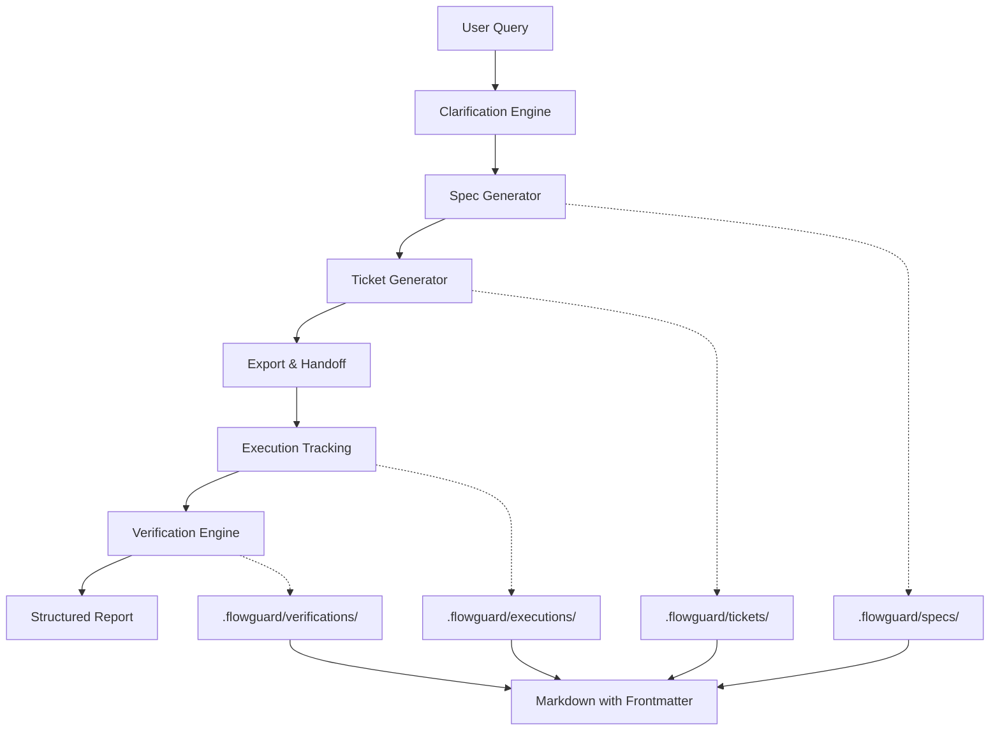
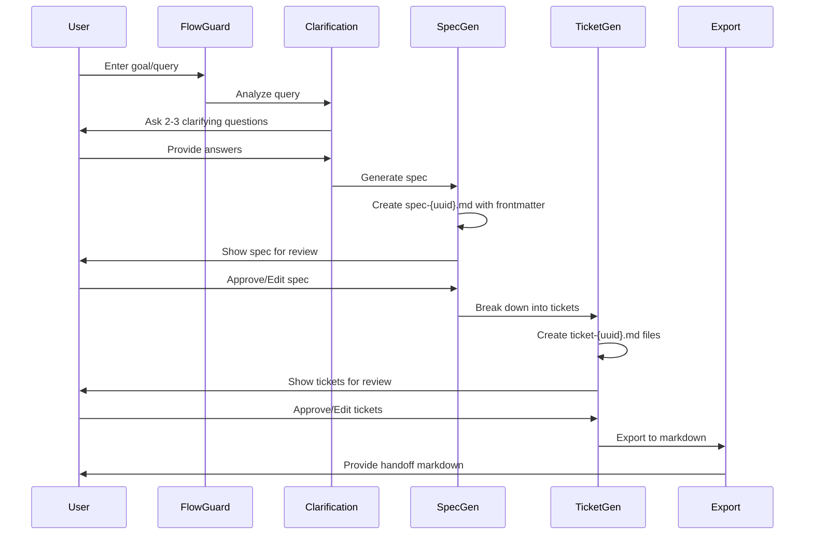
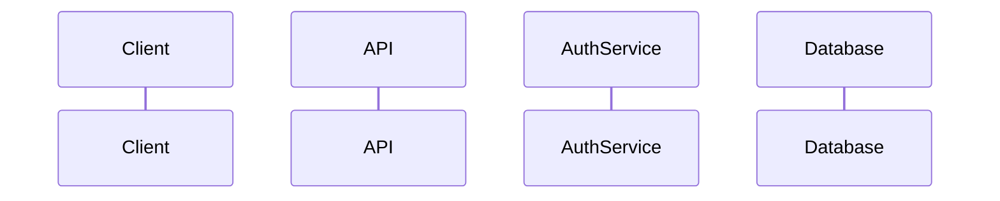
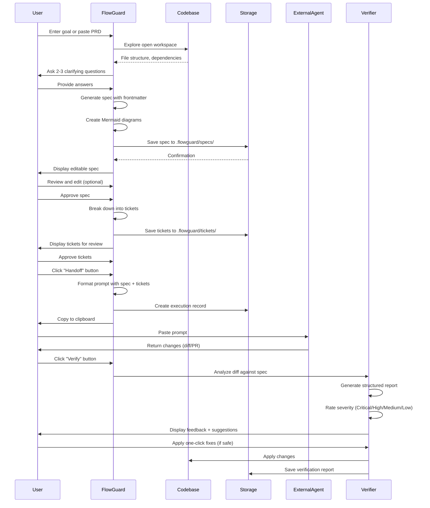
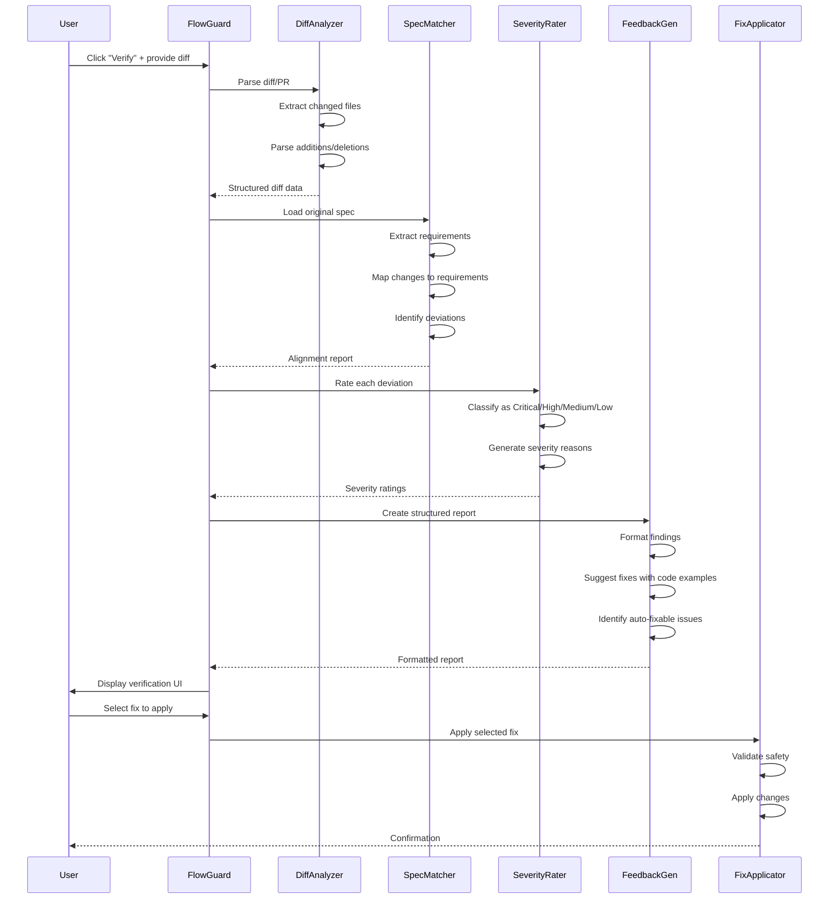

# FlowGuard Complete Specification

# FlowGuard: AI-First Development Planning & Verification Layer

## Epic Overview

**FlowGuard** is an open-source VS Code extension that serves as the ultimate planning, orchestration, and verification layer for AI-first development teams. It completely eliminates intent drift by transforming natural-language goals into living, git-trackable specifications before any code is written, enabling clean handoffs to external coding agents, and automatically verifying changes against original intent.

### Core Value Proposition

- **Zero Intent Drift**: Every change is traceable back to the original specification
- **Agent-Agnostic**: Works with Cursor, Claude Projects, Windsurf, Cline, Aider, or any coding agent
- **Git-Native**: All artifacts stored as human-readable Markdown + YAML frontmatter in `.flowguard/` folder
- **Verification-First**: Automatic diff analysis with severity-rated feedback
- **Template-Driven**: Customizable prompt templates for different agents and workflows
- **Local-First**: All data stored locally, no cloud dependency, works offline

---

## System Architecture



---

## Planning Workflow: Best-Aligned Pattern

FlowGuard adopts Best's proven planning workflow pattern:



### Workflow Stages

**Stage 1: Query & Clarification**
- Input: User's natural language goal or existing PRD
- Output: Enriched context for spec generation
- Process: Analyze query, scan codebase, generate max 2-3 targeted questions

**Stage 2: Spec Generation**
- Input: Enriched context from Stage 1
- Output: Spec files in `.flowguard/specs/` with frontmatter + markdown
- Focus: "What to build and why" - requirements, architecture, rationale

**Stage 3: Ticket Breakdown**
- Input: Approved spec(s)
- Output: Ticket files in `.flowguard/tickets/` with frontmatter + markdown
- Focus: "How to implement" - granular implementation tasks with acceptance criteria

**Stage 4: Export & Handoff**
- Input: Approved specs and tickets
- Output: Markdown file ready for external agent + execution record
- Process: Bundle spec + tickets, format for target agent, create execution tracking

---

## Artifact Structure

FlowGuard uses a structured artifact format inspired by Best's patterns:

```
.flowguard/
├── epic.json                          # Epic metadata only
├── specs/
│   └── spec-{uuid}.md               # Spec with YAML frontmatter
├── tickets/
│   └── ticket-{uuid}.md             # Ticket with YAML frontmatter
├── executions/
│   └── execution-{uuid}.md          # Handoff tracking record
└── verifications/
    └── verification-{uuid}.md        # Verification reports
```

---

## Reference System

FlowGuard adopts Best's reference system for cross-linking artifacts:

| Reference Type | Format | Example |
|----------------|--------|---------|
| **Epic** | `epic:{epicId}` | `epic:550e8400-e29b-41d4-a716-446655440000` |
| **Spec** | `spec:{epicId}/{specId}` | `spec:550e8400/spec-a1b2c3d4` |
| **Ticket** | `ticket:{epicId}/{ticketId}` | `ticket:550e8400/ticket-c3d4e5f6` |
| **Execution** | `execution:{epicId}/{executionId}` | `execution:550e8400/execution-e5f6a7b8` |
| **Verification** | `verification:{epicId}/{verificationId}` | `verification:550e8400/verification-f6a7b8c9` |
| **File** | `file:{relativePath}` | `file:src/auth/authService.ts` |

---

## Artifact Specifications

### 1. Epic Metadata (epic.json)

**Purpose**: Lightweight container for Epic-level metadata.

```json
{
  "id": "epic-550e8400-e29b-41d4-a716-446655440000",
  "title": "Add User Authentication System",
  "status": "in_progress",
  "createdAt": "2024-01-15T10:30:00Z",
  "updatedAt": "2024-01-16T14:22:00Z",
  "metadata": {
    "author": "John Doe",
    "tags": ["authentication", "security", "backend"],
    "priority": "high",
    "complexity": "moderate"
  },
  "specs": [
    "spec-a1b2c3d4-e5f6-7890-abcd-ef1234567890"
  ],
  "tickets": [
    "ticket-c3d4e5f6-a7b8-9012-cdef-123456789012"
  ],
  "executions": [
    "execution-e5f6a7b8-c9d0-1234-ef12-345678901234"
  ]
}
```

### 2. Spec Format (specs/spec-{uuid}.md)

**Purpose**: High-level "what to build and why" document with requirements, architecture, and rationale.

```markdown
---
id: spec-a1b2c3d4-e5f6-7890-abcd-ef1234567890
epic_id: epic-550e8400-e29b-41d4-a716-446655440000
title: User Authentication System - Technical Specification
status: approved
created_at: 2024-01-15T10:30:00Z
updated_at: 2024-01-16T14:22:00Z
author: John Doe
tags:
  - authentication
  - security
  - jwt
---

# User Authentication System - Technical Specification

## Overview

Implement a secure JWT-based authentication system for the application.

## Architecture



## Technical Requirements

### 1. User Registration

**Endpoint**: `POST /api/auth/register`

### 2. User Login

**Endpoint**: `POST /api/auth/login`

## File Changes

| File | Purpose |
|------|---------|
| `file:src/auth/authService.ts` | Core authentication logic |
| `file:src/auth/authController.ts` | HTTP request handlers |

## Edge Cases

1. **Duplicate Email Registration**: Return `409 Conflict`
2. **Expired Token**: Return `401 Unauthorized`

## Non-Functional Requirements

- Passwords hashed with bcrypt (salt rounds = 10)
- JWT tokens expire after 24 hours

## References

- Related Tickets: `ticket:epic-550e8400/ticket-c3d4e5f6`
```

### 3. Ticket Format (tickets/ticket-{uuid}.md)

**Purpose**: Granular implementation task with "how to implement" details.

```markdown
---
id: ticket-c3d4e5f6-a7b8-9012-cdef-123456789012
epic_id: epic-550e8400-e29b-41d4-a716-446655440000
spec_id: spec-a1b2c3d4-e5f6-7890-abcd-ef1234567890
title: Implement User Registration Endpoint
status: in_progress
priority: high
assignee: Jane Smith
estimated_effort: 4 hours
created_at: 2024-01-15T11:00:00Z
updated_at: 2024-01-16T09:15:00Z
tags:
  - backend
  - authentication
  - api
---

# Implement User Registration Endpoint

## Description

Create the `/api/auth/register` endpoint for new user registration.

**Parent Spec**: `spec:epic-550e8400/spec-a1b2c3d4`

## Acceptance Criteria

- [ ] Endpoint accepts POST requests at `/api/auth/register`
- [ ] Validates email format and uniqueness
- [ ] Hashes password with bcrypt (salt rounds = 10)
- [ ] Returns 201 with user object
- [ ] Returns 409 for duplicate email
- [ ] Includes unit tests with 90%+ coverage

## Implementation Steps

### 1. Create User Model (`file:src/models/User.ts`)

```typescript
interface User {
  id: string;
  email: string;
  password: string;
}
```

### 2. Create Auth Service (`file:src/auth/authService.ts`)

## Files to Create/Modify

### New Files
- `file:src/models/User.ts`
- `file:src/auth/authService.ts`

### Modified Files
- `file:src/server.ts` - Mount auth routes

## Testing Checklist

- [ ] Unit tests pass with 90%+ coverage
- [ ] Integration tests pass
```

### 4. Execution Format (executions/execution-{uuid}.md)

**Purpose**: Track handoff attempts to external agents.

```markdown
---
id: execution-e5f6a7b8-c9d0-1234-ef12-345678901234
epic_id: epic-550e8400-e29b-41d4-a716-446655440000
title: Handoff - User Registration Implementation
status: completed
agent: cursor
created_at: 2024-01-16T10:00:00Z
completed_at: 2024-01-16T14:30:00Z
tickets:
  - ticket-c3d4e5f6-a7b8-9012-cdef-123456789012
specs:
  - spec-a1b2c3d4-e5f6-7890-abcd-ef1234567890
---

# Execution: User Registration Implementation

## Handoff Details

**Agent**: Cursor
**Handoff Time**: 2024-01-16 10:00:00 UTC
**Completion Time**: 2024-01-16 14:30:00 UTC
**Duration**: 4.5 hours

## Handoff Prompt

```markdown
# Task: Implement User Registration Endpoint
...
```

## Results

### Files Changed

**Created**:
- `file:src/models/User.ts` (+45 lines)
- `file:src/auth/authService.ts` (+120 lines)

### Total Changes: +548 additions, 0 deletions

## Verification

**Verification ID**: `verification:epic-550e8400/verification-f6a7b8c9`
**Status**: ✅ Passed with minor warnings
**Issues Found**: 2 medium, 1 low

---

**Status**: ✅ Completed
```

### 5. Verification Format (verifications/verification-{uuid}.md)

**Purpose**: Structured verification report comparing implementation against spec.

```markdown
---
id: verification-f6a7b8c9-d0e1-2345-f123-456789012345
epic_id: epic-550e8400-e29b-41d4-a716-446655440000
execution_id: execution-e5f6a7b8-c9d0-1234-ef12-345678901234
spec_id: spec-a1b2c3d4-e5f6-7890-abcd-ef1234567890
status: passed_with_warnings
created_at: 2024-01-16T14:35:00Z
summary:
  total_issues: 3
  critical: 0
  high: 0
  medium: 2
  low: 1
  auto_fixable: 1
---

# Verification Report: User Registration Implementation

## Summary

**Overall Status**: ✅ Passed with Warnings

| Metric | Value |
|--------|-------|
| **Total Issues** | 3 |
| **Critical** | 0 |
| **High** | 0 |
| **Medium** | 2 |
| **Low** | 1 |
| **Auto-fixable** | 1 |

## Spec Alignment

**Spec**: `spec:epic-550e8400/spec-a1b2c3d4`

### ✅ Requirements Met (8/10)

1. ✅ Endpoint accepts POST at `/api/auth/register`
2. ✅ Email validation implemented
3. ✅ Password hashing with bcrypt

### ⚠️ Requirements Partially Met (2/10)

9. ⚠️ Unit tests coverage is 94% (target: 90%+) - **PASS**
10. ⚠️ Integration test missing rate limiting test - **MEDIUM**

## Issues Found

### Medium Severity Issues

#### 1. Missing Rate Limiting Test

**File**: `file:src/auth/__tests__/authController.test.ts`
**Severity**: Medium
**Category**: Missing Test Coverage

**Description**:
The spec requires rate limiting, but integration tests don't verify this behavior.

**Suggested Fix**:
Add a new test case that makes 6 consecutive registration attempts and verifies `429 Too Many Requests`.

---

#### 2. Inconsistent Error Response Format

**File**: `file:src/auth/authController.ts`
**Severity**: Medium
**Category**: Spec Deviation

**Description**:
Error responses use different format than specified.

**Current**:
```json
{ "error": "Invalid email format" }
```

**Required**:
```json
{
  "success": false,
  "error": {
    "code": "VALIDATION_ERROR",
    "message": "Invalid email format"
  }
}
```

**Auto-fixable**: Yes

---

### Low Severity Issues

#### 3. Missing JSDoc Comments

**File**: `file:src/auth/authService.ts`
**Severity**: Low
**Category**: Documentation

**Auto-fixable**: No

---

## Recommendations

### Immediate Actions (Before Merge)

1. **Fix Issue #2** (Medium) - Update error response format
   - Auto-fixable: Yes
   - Estimated effort: 10 minutes

### Follow-up Actions

2. **Fix Issue #1** (Medium) - Add rate limiting test
3. **Fix Issue #3** (Low) - Add JSDoc comments

---

## Approval

**Status**: ✅ Approved with Conditions

**Conditions**:
- Fix Issue #2 (error response format) before merge

**Verified By**: FlowGuard Verification Engine

---

## Related Artifacts

- **Spec**: `spec:epic-550e8400/spec-a1b2c3d4`
- **Ticket**: `ticket:epic-550e8400/ticket-c3d4e5f6`
- **Execution**: `execution:epic-550e8400/execution-e5f6a7b8`
```

---

## Phase Breakdown

### Phase 1: Foundation & Core Infrastructure (Week 1-2)

**Objective**: Set up the VS Code extension scaffold, core data models, and storage layer with new artifact structure.

**Deliverables**:
- Extension activation and basic sidebar UI
- `.flowguard/` folder structure and file management
- New data models (Epic, Spec, Ticket, Execution, Verification)
- Frontmatter parser/serializer
- Configuration system for user preferences
- Reference resolver (`spec:`, `ticket:`, `file:`, `execution:`)
- Migration tool (old Epic JSON → new structure)

**Key Files**:
- `file:src/extension.ts` - Extension entry point
- `file:src/core/models/Epic.ts` - Epic metadata model
- `file:src/core/models/Spec.ts` - Spec with frontmatter
- `file:src/core/models/Ticket.ts` - Ticket with frontmatter
- `file:src/core/models/Execution.ts` - Execution tracking
- `file:src/core/models/Verification.ts` - Verification report
- `file:src/core/storage/ArtifactStorage.ts` - File-based storage
- `file:src/core/references/ReferenceResolver.ts` - Reference system
- `file:src/ui/sidebar/` - Sidebar webview components
- `file:package.json` - Extension manifest

---

### Phase 2: Planning Engine (Week 3-4)

**Objective**: Build the core planning engine that explores codebases and generates specs and tickets.

**Deliverables**:
- Clarification engine (max 2-3 questions)
- Spec generator (frontmatter + markdown, "what/why" focus)
- Ticket breakdown engine ("how/when" focus)
- Workflow orchestrator (Query → Spec → Tickets)
- Mermaid diagram generator
- Template system for customizable generation styles

**Key Files**:
- `file:src/planning/ClarificationEngine.ts` - Question generation
- `file:src/planning/SpecGenerator.ts` - Spec creation with frontmatter
- `file:src/planning/TicketGenerator.ts` - Ticket breakdown
- `file:src/planning/WorkflowOrchestrator.ts` - Workflow management
- `file:src/planning/DiagramGenerator.ts` - Mermaid diagrams
- `file:src/templates/` - Prompt templates

---

### Phase 3: Handoff System (Week 5)

**Objective**: Create the one-click handoff mechanism with agent-agnostic prompt formatting and execution tracking.

**Deliverables**:
- Handoff prompt generator with context bundling
- Agent-specific template library (Cursor, Claude, Windsurf, Cline, Aider)
- Execution tracker for handoff reproducibility
- Clipboard integration with formatting preservation
- Template editor UI for customization

**Key Files**:
- `file:src/handoff/MarkdownExporter.ts` - Export specs + tickets to markdown
- `file:src/handoff/AgentTemplates.ts` - Agent-specific templates
- `file:src/handoff/ExecutionTracker.ts` - Track handoff attempts
- `file:src/ui/templateEditor/` - Template editor UI

**Template Variables**:
- `{{epic_overview}}` - Epic summary
- `{{spec_content}}` - Spec with frontmatter
- `{{tickets}}` - Ticket breakdown
- `{{diagrams}}` - Mermaid diagrams
- `{{codebase_context}}` - Relevant file snippets
- `{{acceptance_criteria}}` - Ticket acceptance criteria
- `{{nfr}}` - Non-functional requirements

---

### Phase 4: Verification Engine (Week 6-7)

**Objective**: Build the automatic verification system that analyzes diffs against specifications with structured reporting.

**Deliverables**:
- Diff parser and analyzer
- Spec-to-code matcher with semantic understanding
- Severity rating system (Critical / High / Medium / Low)
- Structured verification report generator
- One-click fix applicator (for safe changes)
- Rollback suggestions

**Key Files**:
- `file:src/verification/VerificationEngine.ts` - Verification orchestration
- `file:src/verification/DiffAnalyzer.ts` - Diff parsing
- `file:src/verification/SpecAlignmentChecker.ts` - Spec alignment
- `file:src/verification/IssueCategorizer.ts` - Severity classification
- `file:src/verification/FixSuggestionGenerator.ts` - Fix suggestions

**Severity Levels**:
- **Critical**: Changes that directly contradict the spec or break core functionality
- **High**: Missing required features or incorrect implementations
- **Medium**: Suboptimal implementations or minor deviations
- **Low**: Style issues or non-critical improvements

---

### Phase 5: UI/UX Polish & Epic Mode (Week 8-9)

**Objective**: Create a polished, modern sidebar UI with artifact management and Epic Mode for massive refactors.

**Deliverables**:
- Complete sidebar UI with Specs/Tickets/Executions sections
- Spec editor with metadata panel (frontmatter editing)
- Ticket editor with acceptance criteria checklist
- Interactive diagram viewer
- Artifact diff viewer
- Progress tracking and status indicators
- Dark/light theme support

**Key Files**:
- `file:src/ui/sidebar/components/` - React/Svelte components
- `file:src/ui/editors/SpecEditor.ts` - Spec metadata/content editor
- `file:src/ui/editors/TicketEditor.ts` - Ticket editor
- `file:src/ui/views/ExecutionView.ts` - Execution tracking view
- `file:src/ui/views/VerificationView.ts` - Verification report view
- `file:src/ui/diagramViewer/` - Interactive diagram display
- `file:src/ui/diffViewer/` - Diff visualization
- `file:webview/` - Webview HTML/CSS/JS

---

### Phase 6: Testing, Documentation & Release (Week 10)

**Objective**: Comprehensive testing, documentation, and preparation for public release.

**Deliverables**:
- Unit tests (>80% coverage)
- Integration tests for core workflows
- End-to-end tests
- User documentation and tutorials
- Developer documentation for contributors
- CI/CD pipeline setup
- MIT license and contribution guidelines
- VS Code Marketplace listing

**Key Files**:
- `file:tests/` - Test suites
- `file:docs/` - Documentation
- `file:README.md` - Project overview
- `file:CONTRIBUTING.md` - Contribution guide
- `file:LICENSE` - MIT license
- `file:.github/workflows/` - CI/CD

---

## Technical Plan: File-by-File Implementation

```
flowguard/
├── .vscode/
│   ├── launch.json              # Debug configuration
│   └── tasks.json               # Build tasks
├── .github/
│   └── workflows/
│       ├── ci.yml               # Continuous integration
│       └── release.yml          # Release automation
├── src/
│   ├── extension.ts             # Extension entry point
│   ├── core/
│   │   ├── models/
│   │   │   ├── Epic.ts         # Epic metadata model
│   │   │   ├── Spec.ts         # Spec with frontmatter
│   │   │   ├── Ticket.ts       # Ticket with frontmatter
│   │   │   ├── Execution.ts    # Execution tracking
│   │   │   └── Verification.ts # Verification report
│   │   ├── config/
│   │   │   └── settings.ts     # User settings management
│   │   ├── storage/
│   │   │   ├── ArtifactStorage.ts    # File-based storage
│   │   │   ├── FileSystem.ts         # File system utilities
│   │   │   └── GitIntegration.ts    # Git tracking helpers
│   │   └── references/
│   │       └── ReferenceResolver.ts  # Reference system
│   ├── planning/
│   │   ├── ClarificationEngine.ts   # Question generation
│   │   ├── SpecGenerator.ts         # Spec creation
│   │   ├── TicketGenerator.ts       # Ticket breakdown
│   │   ├── WorkflowOrchestrator.ts   # Workflow management
│   │   ├── DiagramGenerator.ts      # Mermaid diagrams
│   │   └── CodebaseExplorer.ts      # Workspace analysis
│   ├── handoff/
│   │   ├── MarkdownExporter.ts      # Export specs + tickets
│   │   ├── AgentTemplates.ts        # Agent-specific templates
│   │   └── ExecutionTracker.ts      # Handoff tracking
│   ├── verification/
│   │   ├── VerificationEngine.ts    # Verification orchestration
│   │   ├── DiffAnalyzer.ts          # Diff parsing
│   │   ├── SpecAlignmentChecker.ts  # Spec alignment
│   │   ├── IssueCategorizer.ts      # Severity classification
│   │   ├── FixApplicator.ts        # Auto-fix application
│   │   └── FeedbackGenerator.ts     # Report creation
│   ├── ui/
│   │   ├── sidebar/
│   │   │   ├── SidebarProvider.ts   # Webview provider
│   │   │   └── components/          # Sidebar components
│   │   ├── editors/
│   │   │   ├── SpecEditor.ts        # Spec metadata/content editor
│   │   │   └── TicketEditor.ts      # Ticket editor
│   │   ├── views/
│   │   │   ├── ExecutionView.ts     # Execution tracking view
│   │   │   └── VerificationView.ts  # Verification report view
│   │   ├── diagramViewer/
│   │   │   └── DiagramViewer.ts     # Interactive diagrams
│   │   └── diffViewer/
│   │       └── DiffViewer.ts         # Diff visualization
│   ├── commands/
│   │   ├── createEpic.ts            # Create new epic
│   │   ├── generateSpec.ts           # Generate spec from query
│   │   ├── generateTickets.ts        # Break down spec into tickets
│   │   ├── generateHandoff.ts        # Generate handoff prompt
│   │   ├── verifyChanges.ts         # Verify diff
│   │   └── editArtifact.ts           # Edit spec/ticket
│   └── utils/
│       ├── logger.ts                # Logging utilities
│       ├── parser.ts                # AST parsing
│       ├── frontmatter.ts           # YAML frontmatter parser
│       └── llm.ts                   # LLM integration
├── webview/
│   ├── index.html                   # Webview HTML
│   ├── styles.css                   # Webview styles
│   └── main.js                      # Webview scripts
├── templates/
│   ├── cursor.template              # Cursor agent template
│   ├── claude.template              # Claude Projects template
│   ├── windsurf.template            # Windsurf template
│   ├── cline.template               # Cline template
│   └── aider.template               # Aider template
├── tests/
│   ├── unit/                        # Unit tests
│   ├── integration/                 # Integration tests
│   └── e2e/                         # End-to-end tests
├── docs/
│   ├── user-guide.md                # User documentation
│   ├── developer-guide.md           # Developer documentation
│   └── api-reference.md             # API documentation
├── package.json                      # Extension manifest
├── tsconfig.json                     # TypeScript configuration
├── webpack.config.js                 # Webpack bundling
├── README.md                         # Project overview
├── CONTRIBUTING.md                   # Contribution guidelines
├── LICENSE                           # MIT license
└── CHANGELOG.md                      # Version history
```

---

## User Flow: End-to-End Experience



---

## Verification Flow: Detailed Process



---

## UI/UX Design: Sidebar Wireframes

### Main Sidebar View

```wireframe
<!DOCTYPE html>
<html>
<head>
<style>
body {
  font-family: -apple-system, BlinkMacSystemFont, 'Segoe UI', sans-serif;
  margin: 0;
  padding: 16px;
  background: #1e1e1e;
  color: #cccccc;
}
.header {
  margin-bottom: 20px;
  padding-bottom: 12px;
  border-bottom: 1px solid #3e3e3e;
}
.header h2 {
  margin: 0 0 8px 0;
  color: #ffffff;
  font-size: 18px;
}
.status {
  display: inline-block;
  padding: 4px 8px;
  background: #0e639c;
  color: #ffffff;
  border-radius: 3px;
  font-size: 12px;
}
.section {
  margin-bottom: 24px;
}
.section-title {
  font-size: 14px;
  font-weight: 600;
  margin-bottom: 8px;
  color: #ffffff;
}
.artifact-list {
  list-style: none;
  padding: 0;
  margin: 0;
}
.artifact-item {
  padding: 8px;
  margin-bottom: 4px;
  background: #2d2d30;
  border-radius: 4px;
  cursor: pointer;
}
.artifact-item:hover {
  background: #37373d;
}
.artifact-title {
  font-size: 13px;
  margin-bottom: 4px;
}
.artifact-meta {
  font-size: 11px;
  color: #858585;
}
.badge {
  display: inline-block;
  padding: 2px 6px;
  border-radius: 3px;
  font-size: 10px;
  margin-right: 4px;
}
.badge-approved {
  background: #388a34;
  color: #ffffff;
}
.badge-in-progress {
  background: #c5a332;
  color: #000000;
}
.badge-todo {
  background: #3794ff;
  color: #ffffff;
}
.badge-completed {
  background: #388a34;
  color: #ffffff;
}
.button {
  display: block;
  width: 100%;
  padding: 10px;
  margin-bottom: 8px;
  background: #0e639c;
  color: #ffffff;
  border: none;
  border-radius: 4px;
  cursor: pointer;
  font-size: 13px;
}
.button:hover {
  background: #1177bb;
}
.button-secondary {
  background: #2d2d30;
}
.button-secondary:hover {
  background: #37373d;
}
</style>
</head>
<body>
  <div class="header">
    <h2>⚡ FlowGuard</h2>
    <span class="status">Epic: User Authentication</span>
  </div>

  <div class="section">
    <button class="button" data-element-id="new-spec-btn">+ New Spec</button>
    <button class="button button-secondary" data-element-id="new-ticket-btn">+ New Ticket</button>
  </div>

  <div class="section">
    <div class="section-title">Specs (2)</div>
    <ul class="artifact-list">
      <li class="artifact-item" data-element-id="spec-1">
        <div class="artifact-title">
          <span class="badge badge-approved">Approved</span>
          User Authentication System
        </div>
        <div class="artifact-meta">spec-a1b2c3d4 • Updated 2h ago</div>
      </li>
      <li class="artifact-item" data-element-id="spec-2">
        <div class="artifact-title">
          <span class="badge badge-in-progress">Draft</span>
          Password Reset Flow
        </div>
        <div class="artifact-meta">spec-b2c3d4e5 • Updated 1d ago</div>
      </li>
    </ul>
  </div>

  <div class="section">
    <div class="section-title">Tickets (4)</div>
    <ul class="artifact-list">
      <li class="artifact-item" data-element-id="ticket-1">
        <div class="artifact-title">
          <span class="badge badge-in-progress">In Progress</span>
          Registration Endpoint
        </div>
        <div class="artifact-meta">ticket-c3d4e5f6 • Jane Smith</div>
      </li>
      <li class="artifact-item" data-element-id="ticket-2">
        <div class="artifact-title">
          <span class="badge badge-todo">Todo</span>
          Login Endpoint
        </div>
        <div class="artifact-meta">ticket-d4e5f6a7 • Unassigned</div>
      </li>
    </ul>
  </div>

  <div class="section">
    <div class="section-title">Executions (1)</div>
    <ul class="artifact-list">
      <li class="artifact-item" data-element-id="execution-1">
        <div class="artifact-title">
          <span class="badge badge-completed">Completed</span>
          Registration Implementation
        </div>
        <div class="artifact-meta">execution-e5f6a7b8 • Cursor • 4.5h</div>
      </li>
    </ul>
  </div>

  <div class="section">
    <button class="button" data-element-id="handoff-btn">📋 Generate Handoff</button>
    <button class="button button-secondary" data-element-id="verify-btn">✓ Verify Changes</button>
  </div>
</body>
</html>
```

### Spec Editor View

```wireframe
<!DOCTYPE html>
<html>
<head>
<style>
body {
  font-family: -apple-system, BlinkMacSystemFont, 'Segoe UI', sans-serif;
  margin: 0;
  padding: 0;
  background: #1e1e1e;
  color: #cccccc;
}
.toolbar {
  background: #2d2d30;
  padding: 12px 16px;
  border-bottom: 1px solid #3e3e42;
  display: flex;
  justify-content: space-between;
  align-items: center;
}
.toolbar-left {
  display: flex;
  gap: 8px;
}
.toolbar-right {
  display: flex;
  gap: 8px;
}
.btn {
  padding: 6px 12px;
  background: #0e639c;
  color: #ffffff;
  border: none;
  border-radius: 4px;
  cursor: pointer;
  font-size: 12px;
}
.btn:hover {
  background: #1177bb;
}
.btn-secondary {
  background: #3e3e42;
}
.btn-secondary:hover {
  background: #4e4e52;
}
.editor-container {
  display: flex;
  height: calc(100vh - 49px);
}
.metadata-panel {
  width: 300px;
  background: #252526;
  border-right: 1px solid #3e3e42;
  padding: 16px;
  overflow-y: auto;
}
.metadata-field {
  margin-bottom: 16px;
}
.metadata-label {
  font-size: 11px;
  color: #858585;
  margin-bottom: 4px;
  text-transform: uppercase;
}
.metadata-value {
  font-size: 13px;
  padding: 6px 8px;
  background: #3c3c3c;
  border-radius: 3px;
}
.metadata-input {
  width: 100%;
  padding: 6px 8px;
  background: #3c3c3c;
  border: 1px solid #3e3e42;
  border-radius: 3px;
  color: #cccccc;
  font-size: 13px;
}
.editor-main {
  flex: 1;
  padding: 24px;
  overflow-y: auto;
}
.editor-main h1 {
  margin-top: 0;
  color: #ffffff;
}
.editor-main h2 {
  color: #ffffff;
  margin-top: 32px;
}
.status-badge {
  display: inline-block;
  padding: 4px 8px;
  border-radius: 3px;
  font-size: 11px;
  font-weight: 600;
}
.status-approved {
  background: #388a34;
  color: #ffffff;
}
.status-draft {
  background: #c5a332;
  color: #000000;
}
</style>
</head>
<body>
  <div class="toolbar">
    <div class="toolbar-left">
      <button class="btn" data-element-id="save-btn">💾 Save</button>
      <button class="btn btn-secondary" data-element-id="preview-btn">👁 Preview</button>
      <button class="btn btn-secondary" data-element-id="diagram-btn">📊 Add Diagram</button>
    </div>
    <div class="toolbar-right">
      <button class="btn btn-secondary" data-element-id="export-btn">📤 Export</button>
      <button class="btn" data-element-id="approve-btn">✓ Approve</button>
    </div>
  </div>

  <div class="editor-container">
    <div class="metadata-panel">
      <div class="metadata-field">
        <div class="metadata-label">Spec ID</div>
        <div class="metadata-value">spec-a1b2c3d4</div>
      </div>

      <div class="metadata-field">
        <div class="metadata-label">Status</div>
        <div class="metadata-value">
          <span class="status-badge status-approved">Approved</span>
        </div>
      </div>

      <div class="metadata-field">
        <div class="metadata-label">Title</div>
        <input type="text" class="metadata-input" value="User Authentication System" data-element-id="title-input">
      </div>

      <div class="metadata-field">
        <div class="metadata-label">Author</div>
        <div class="metadata-value">John Doe</div>
      </div>

      <div class="metadata-field">
        <div class="metadata-label">Tags</div>
        <input type="text" class="metadata-input" value="authentication, security, jwt" data-element-id="tags-input">
      </div>

      <div class="metadata-field">
        <div class="metadata-label">Related Tickets</div>
        <div class="metadata-value" style="font-size: 11px; line-height: 1.6;">
          ticket-c3d4e5f6<br>
          ticket-d4e5f6a7
        </div>
      </div>
    </div>

    <div class="editor-main">
      <h1>User Authentication System - Technical Specification</h1>

      <h2>Overview</h2>
      <p>Implement a secure JWT-based authentication system for the application.</p>

      <h2>Architecture</h2>
      <pre>
sequenceDiagram
    participant Client
    participant API
    participant AuthService
    participant Database
      </pre>

      <h2>Technical Requirements</h2>
      <p><em>[Spec content continues...]</em></p>
    </div>
  </div>
</body>
</html>
```

### Handoff Prompt View

```wireframe
<!DOCTYPE html>
<html>
<head>
<style>
body {
  font-family: -apple-system, BlinkMacSystemFont, 'Segoe UI', sans-serif;
  margin: 0;
  padding: 16px;
  background: #1e1e1e;
  color: #cccccc;
}
.header {
  margin-bottom: 20px;
  padding-bottom: 12px;
  border-bottom: 1px solid #3e3e3e;
}
.title {
  font-size: 18px;
  font-weight: 600;
  margin-bottom: 12px;
}
.agent-selector {
  display: flex;
  gap: 8px;
  margin-bottom: 16px;
}
.agent-btn {
  padding: 6px 12px;
  border-radius: 4px;
  border: 1px solid #3e3e3e;
  background: #252526;
  color: #cccccc;
  cursor: pointer;
  font-size: 12px;
}
.agent-btn.active {
  border-color: #4ec9b0;
  background: #0e639c;
  color: white;
}
.prompt-preview {
  background: #252526;
  border: 1px solid #3e3e3e;
  border-radius: 6px;
  padding: 16px;
  margin-bottom: 16px;
  max-height: 400px;
  overflow-y: auto;
  font-family: 'Courier New', monospace;
  font-size: 12px;
  line-height: 1.6;
}
.actions {
  display: flex;
  gap: 8px;
}
.btn {
  padding: 8px 16px;
  border-radius: 4px;
  border: none;
  cursor: pointer;
  font-size: 13px;
  font-weight: 500;
}
.btn-primary {
  background: #0e639c;
  color: white;
}
.btn-secondary {
  background: #3e3e3e;
  color: #cccccc;
}
</style>
</head>
<body>
  <div class="header">
    <div class="title">Generate Handoff Prompt</div>
  </div>

  <div class="agent-selector">
    <button class="agent-btn active" data-element-id="agent-cursor">Cursor</button>
    <button class="agent-btn" data-element-id="agent-claude">Claude Projects</button>
    <button class="agent-btn" data-element-id="agent-windsurf">Windsurf</button>
    <button class="agent-btn" data-element-id="agent-cline">Cline</button>
    <button class="agent-btn" data-element-id="agent-aider">Aider</button>
  </div>

  <div class="prompt-preview" data-element-id="prompt-preview">
# Task: Implement User Registration Endpoint

## Context

This is a Node.js/Express application with PostgreSQL database.

## Spec

### Overview

```markdown
---
id: spec-a1b2c3d4
title: User Authentication System
---
Implement a secure JWT-based authentication system...
```

## Ticket

### Implement User Registration Endpoint

```markdown
---
id: ticket-c3d4e5f6
title: Implement User Registration Endpoint
---

## Acceptance Criteria

- [ ] Endpoint accepts POST requests at `/api/auth/register`
- [ ] Validates email format and uniqueness
- [ ] Hashes password with bcrypt (salt rounds = 10)
...
```

## Implementation Steps

1. Create User Model
2. Create Auth Service
3. Create Auth Controller
4. Create Auth Routes
5. Update Server
6. Write Tests
  </div>

  <div class="actions">
    <button class="btn btn-primary" data-element-id="btn-copy">📋 Copy to Clipboard</button>
    <button class="btn btn-secondary" data-element-id="btn-save-execution">💾 Save Execution</button>
  </div>
</body>
</html>
```

### Verification Results View

```wireframe
<!DOCTYPE html>
<html>
<head>
<style>
body {
  font-family: -apple-system, BlinkMacSystemFont, 'Segoe UI', sans-serif;
  margin: 0;
  padding: 16px;
  background: #1e1e1e;
  color: #cccccc;
}
.header {
  margin-bottom: 20px;
  padding-bottom: 12px;
  border-bottom: 1px solid #3e3e3e;
}
.title {
  font-size: 18px;
  font-weight: 600;
  margin-bottom: 8px;
}
.summary {
  display: flex;
  gap: 16px;
  margin-bottom: 20px;
}
.summary-item {
  background: #252526;
  border: 1px solid #3e3e3e;
  border-radius: 6px;
  padding: 12px;
  flex: 1;
  text-align: center;
}
.summary-count {
  font-size: 24px;
  font-weight: 600;
  margin-bottom: 4px;
}
.summary-label {
  font-size: 11px;
  color: #858585;
  text-transform: uppercase;
}
.critical { color: #f48771; }
.high { color: #fbbc04; }
.medium { color: #4ec9b0; }
.low { color: #858585; }
.issue-list {
  margin-bottom: 20px;
}
.issue-item {
  background: #252526;
  border-left: 4px solid;
  border-radius: 4px;
  padding: 12px;
  margin-bottom: 12px;
}
.issue-item.critical { border-left-color: #f48771; }
.issue-item.high { border-left-color: #fbbc04; }
.issue-header {
  display: flex;
  justify-content: space-between;
  align-items: center;
  margin-bottom: 8px;
}
.issue-title {
  font-size: 14px;
  font-weight: 500;
}
.severity-badge {
  padding: 2px 8px;
  border-radius: 3px;
  font-size: 11px;
  font-weight: 600;
}
.severity-critical { background: #f48771; color: black; }
.severity-high { background: #fbbc04; color: black; }
.issue-file {
  font-size: 12px;
  color: #4ec9b0;
  margin-bottom: 8px;
  font-family: 'Courier New', monospace;
}
.issue-desc {
  font-size: 13px;
  line-height: 1.5;
  margin-bottom: 8px;
}
.issue-actions {
  display: flex;
  gap: 8px;
}
.btn-small {
  padding: 4px 10px;
  border-radius: 3px;
  border: none;
  cursor: pointer;
  font-size: 11px;
}
.btn-fix { background: #0e639c; color: white; }
.btn-ignore { background: #3e3e3e; color: #cccccc; }
.auto-fixable {
  display: inline-block;
  padding: 2px 6px;
  background: #388a34;
  color: white;
  border-radius: 3px;
  font-size: 10px;
  margin-left: 8px;
}
</style>
</head>
<body>
  <div class="header">
    <div class="title">Verification Results</div>
  </div>

  <div class="summary">
    <div class="summary-item">
      <div class="summary-count critical">0</div>
      <div class="summary-label">Critical</div>
    </div>
    <div class="summary-item">
      <div class="summary-count high">0</div>
      <div class="summary-label">High</div>
    </div>
    <div class="summary-item">
      <div class="summary-count medium">2</div>
      <div class="summary-label">Medium</div>
    </div>
    <div class="summary-item">
      <div class="summary-count low">1</div>
      <div class="summary-label">Low</div>
    </div>
  </div>

  <div class="issue-list">
    <div class="issue-item medium">
      <div class="issue-header">
        <div class="issue-title">Missing Rate Limiting Test</div>
        <span class="severity-badge severity-medium">MEDIUM</span>
      </div>
      <div class="issue-file">src/auth/__tests__/authController.test.ts</div>
      <div class="issue-desc">
        The spec requires rate limiting, but integration tests don't verify this behavior.
      </div>
      <div class="issue-actions">
        <button class="btn-small btn-ignore" data-element-id="ignore-1">Ignore</button>
        <button class="btn-small" style="background: #fbbc04; color: black;" data-element-id="create-ticket-1">Create Ticket</button>
      </div>
    </div>

    <div class="issue-item medium">
      <div class="issue-header">
        <div class="issue-title">Inconsistent Error Response Format</div>
        <span class="severity-badge severity-medium">MEDIUM</span>
        <span class="auto-fixable">AUTO-FIXABLE</span>
      </div>
      <div class="issue-file">src/auth/authController.ts</div>
      <div class="issue-desc">
        Error responses use different format than specified in the spec.
      </div>
      <div class="issue-actions">
        <button class="btn-small btn-fix" data-element-id="fix-2">Apply Auto-Fix</button>
        <button class="btn-small btn-ignore" data-element-id="ignore-2">Ignore</button>
      </div>
    </div>
  </div>
</body>
</html>
```

---

## Core Implementation Details

### 1. Extension Activation (`file:src/extension.ts`)

**Responsibilities**:
- Register commands (Create Spec, Generate Tickets, Generate Handoff, Verify Changes, Edit Artifact)
- Initialize sidebar webview provider
- Set up configuration watchers
- Initialize storage layer

**Key APIs**:
- `vscode.window.registerWebviewViewProvider()`
- `vscode.commands.registerCommand()`
- `vscode.workspace.onDidChangeConfiguration()`

---

### 2. Frontmatter Parser (`file:src/utils/frontmatter.ts`)

**Responsibilities**:
- Parse YAML frontmatter from markdown files
- Serialize objects to YAML frontmatter
- Validate frontmatter schema

**Output**:
```typescript
interface FrontmatterResult<T> {
  metadata: T;
  content: string;
}

function parseFrontmatter<T>(markdown: string): FrontmatterResult<T>;
function stringifyFrontmatter<T>(metadata: T, content: string): string;
```

---

### 3. Reference Resolver (`file:src/core/references/ReferenceResolver.ts`)

**Responsibilities**:
- Parse and resolve `spec:`, `ticket:`, `file:`, `execution:` references
- Convert references to clickable links in VS Code
- Validate reference existence

**Key Methods**:
```typescript
class ReferenceResolver {
  resolveReference(ref: string): vscode.Uri | null;
  parseReference(ref: string): ReferenceType;
  getAllReferences(content: string): string[];
}
```

---

### 4. Spec Generator (`file:src/planning/SpecGenerator.ts`)

**Responsibilities**:
- Generate spec with YAML frontmatter + markdown content
- Include architecture diagrams (Mermaid)
- Define requirements, edge cases, NFRs
- Save to `.flowguard/specs/spec-{uuid}.md`

**Template Structure**:
```markdown
---
id: spec-{uuid}
epic_id: epic-{uuid}
title: {title}
status: draft|approved
author: {author}
tags: []
---

# {title}

## Overview
{overview}

## Architecture
{mermaid_diagram}

## Technical Requirements
{requirements}

## File Changes
{file_changes}

## Edge Cases
{edge_cases}

## Non-Functional Requirements
{nfr}
```

---

### 5. Ticket Generator (`file:src/planning/TicketGenerator.ts`)

**Responsibilities**:
- Break down approved spec into granular tickets
- Create ticket with frontmatter + markdown
- Include acceptance criteria, implementation steps, file changes
- Save to `.flowguard/tickets/ticket-{uuid}.md`

**Template Structure**:
```markdown
---
id: ticket-{uuid}
epic_id: epic-{uuid}
spec_id: spec-{uuid}
title: {title}
status: todo|in_progress|done
priority: high|medium|low
assignee: {assignee}
estimated_effort: {hours}
---

# {title}

## Description
{description}

## Parent Spec
spec:{epic_id}/{spec_id}

## Acceptance Criteria
- [ ] criterion 1
- [ ] criterion 2

## Implementation Steps
1. step 1
2. step 2

## Files to Create/Modify
{file_changes}

## Testing Checklist
- [ ] test 1
```

---

### 6. Handoff Generator (`file:src/handoff/MarkdownExporter.ts`)

**Responsibilities**:
- Bundle spec + tickets into single markdown
- Format for target agent (Cursor, Claude, etc.)
- Include relevant code snippets
- Create execution record in `.flowguard/executions/`

**Cursor Template**:
```markdown
# Task: {ticket_title}

## Context
{codebase_context}

## Specification

### Spec: {spec_title}
{frontmatter}
{content}

## Implementation Task

### Ticket: {ticket_title}
{frontmatter}
{content}

## Acceptance Criteria
{acceptance_criteria}

## Implementation Instructions
{implementation_steps}

## Files to Create/Modify
{file_changes}

## Verification Criteria
{verification_criteria}

Please implement the above and provide a git diff.
```

---

### 7. Verification Engine (`file:src/verification/VerificationEngine.ts`)

**Responsibilities**:
- Parse diff and extract changed files
- Load original spec and tickets
- Match changes to requirements
- Generate structured verification report

**Key Methods**:
```typescript
class VerificationEngine {
  async verify(
    diff: string,
    specId: string,
    ticketIds: string[]
  ): Promise<VerificationReport>;

  private async analyzeDiff(diff: string): Promise<DiffAnalysis>;
  private async matchToSpec(
    changes: DiffAnalysis,
    spec: Spec
  ): Promise<AlignmentResult>;
  private categorizeIssues(alignment: AlignmentResult): Issue[];
}
```

---

### 8. Diff Analyzer (`file:src/verification/DiffAnalyzer.ts`)

**Responsibilities**:
- Parse Git diffs or PR content
- Extract changed files and line ranges
- Identify additions, deletions, modifications
- Build structured diff representation

**Output**:
```typescript
interface DiffAnalysis {
  files: ChangedFile[];
  additions: number;
  deletions: number;
  summary: string;
}

interface ChangedFile {
  path: string;
  changes: Change[];
  type: 'added' | 'modified' | 'deleted';
}
```

---

### 9. Issue Categorizer (`file:src/verification/IssueCategorizer.ts`)

**Responsibilities**:
- Classify each deviation by severity
- Provide reasoning for each rating
- Suggest remediation actions
- Mark auto-fixable issues

**Severity Criteria**:

| Severity | Criteria | Example |
|----------|----------|---------|
| **Critical** | Directly contradicts spec, breaks core functionality | Implemented REST instead of GraphQL |
| **High** | Missing required feature, incorrect implementation | Forgot authentication middleware |
| **Medium** | Suboptimal implementation, minor deviation | Wrong response format, inefficient algorithm |
| **Low** | Style issues, non-critical improvements | Missing JSDoc, inconsistent naming |

---

### 10. Fix Applicator (`file:src/verification/FixApplicator.ts`)

**Responsibilities**:
- Apply safe, automated fixes
- Validate changes before application
- Create backup/undo points
- Report application results

**Safety Checks**:
- Only apply fixes for Low/Medium severity issues
- Require user confirmation for High severity
- Never auto-apply Critical fixes
- Run linter/formatter after application

---

## Migration Strategy

### 6.1 Backward Compatibility

**Approach**: Support both old and new formats during transition

```typescript
function detectArtifactVersion(path: string): 'v1' | 'v2' {
  if (path.endsWith('.json')) return 'v1';
  if (path.endsWith('.md')) return 'v2';
  throw new Error('Unknown format');
}

async function loadEpic(epicId: string): Promise<Epic> {
  const version = detectArtifactVersion(epicPath);

  if (version === 'v1') {
    const oldEpic = await loadV1Epic(epicId);
    const newEpic = migrateV1ToV2(oldEpic);
    await saveV2Epic(newEpic);
    return newEpic;
  }

  return loadV2Epic(epicId);
}
```

### 6.2 Migration Tool

**Command**: `FlowGuard: Migrate to New Format`

**Process**:
1. Scan `.flowguard/` for old Epic JSON files
2. For each Epic:
   - Extract metadata → `epic.json`
   - Extract overview/phases → `specs/spec-{uuid}.md`
   - Extract technical plan → `tickets/ticket-{uuid}.md`
   - Create execution records if handoffs exist
3. Backup old files to `.flowguard/.backup/`
4. Show migration report

---

## Edge Cases & Considerations

### 1. Large Codebases
- **Challenge**: Scanning 10,000+ files takes too long
- **Solution**: Implement incremental scanning with caching, allow user to specify relevant directories

### 2. Multi-Language Projects
- **Challenge**: Different languages require different parsers
- **Solution**: Use Tree-sitter for universal parsing, fallback to regex for unsupported languages

### 3. Ambiguous Diffs
- **Challenge**: Diff doesn't clearly map to spec requirements
- **Solution**: Use LLM-powered semantic matching, allow manual mapping in UI

### 4. Conflicting Changes
- **Challenge**: Multiple developers working on same epic
- **Solution**: Git-based conflict resolution, merge strategies for `.flowguard/` artifacts

### 5. Template Customization
- **Challenge**: Users want highly customized prompts
- **Solution**: Full template editor with variable substitution, preview mode, version control

### 6. Offline Mode
- **Challenge**: LLM APIs require internet connection
- **Solution**: Cache previous generations, allow local LLM integration (Ollama, LM Studio)

### 7. Security & Privacy
- **Challenge**: Sensitive code in handoff prompts
- **Solution**: Redaction rules, allow users to mark files as sensitive, local-only mode

### 8. Performance
- **Challenge**: Large specs slow down UI
- **Solution**: Lazy loading, pagination, virtual scrolling for long lists

---

## Non-Functional Requirements

### Performance
- Extension activation: < 500ms
- Codebase scan (1000 files): < 5 seconds
- Spec generation: < 10 seconds
- Verification analysis: < 3 seconds
- UI responsiveness: 60 FPS

### Scalability
- Support projects with 100,000+ files
- Handle epics with 50+ specs and 200+ tickets
- Store 1000+ verification results

### Reliability
- Auto-save artifacts every 30 seconds
- Graceful degradation if LLM API fails
- Rollback mechanism for failed operations
- Comprehensive error logging

### Security
- No sensitive data sent to LLM without user consent
- Secure storage of API keys (VS Code SecretStorage)
- Sanitize user inputs to prevent injection attacks
- Audit log for all artifact modifications

### Usability
- Onboarding tutorial for first-time users
- Keyboard shortcuts for common actions
- Accessible UI (WCAG 2.1 AA compliance)
- Comprehensive documentation

### Maintainability
- Modular architecture with clear separation of concerns
- 80%+ test coverage
- TypeScript strict mode enabled
- Comprehensive inline documentation
- Contribution guidelines for open-source contributors

### Compatibility
- VS Code version: 1.80.0+
- Node.js: 18.0.0+
- Supported languages: TypeScript, JavaScript, Python, Java, Go, Rust, C++
- OS: Windows, macOS, Linux

---

## Technology Stack

### Core
- **Language**: TypeScript 5.0+
- **Runtime**: Node.js 18+
- **Framework**: VS Code Extension API

### UI
- **Webview**: React 18 or Svelte 4
- **Styling**: CSS Modules or Tailwind CSS
- **Icons**: Codicons (VS Code icon library)

### Parsing & Analysis
- **AST Parsing**: TypeScript Compiler API, Tree-sitter
- **Diff Parsing**: `diff` npm package
- **Markdown**: `js-yaml` for frontmatter, `marked` or `remark`
- **YAML Parsing**: `js-yaml` for frontmatter serialization

### LLM Integration
- **APIs**: OpenAI, Anthropic, local models (Ollama)
- **Embeddings**: OpenAI Embeddings API for semantic matching

### Storage
- **File System**: VS Code Workspace FS API
- **Git**: `simple-git` npm package
- **Configuration**: VS Code Settings API

### Testing
- **Unit Tests**: Jest
- **Integration Tests**: VS Code Extension Test Runner
- **E2E Tests**: Playwright

### Build & Tooling
- **Bundler**: Webpack or esbuild
- **Linter**: ESLint
- **Formatter**: Prettier
- **CI/CD**: GitHub Actions

---

## Success Metrics

### Adoption
- 10,000+ installs in first 3 months
- 4.5+ star rating on VS Code Marketplace
- 100+ GitHub stars

### Usage
- Average 5+ specs created per user per month
- 80%+ of users complete handoff flow
- 70%+ of users use verification feature

### Quality
- < 5% bug report rate
- < 1 day average issue resolution time
- 90%+ user satisfaction score

### Community
- 50+ contributors in first year
- 20+ community-contributed templates
- Active Discord/Slack community

---

## Release Plan

### Alpha (Week 1-4)
- Core planning engine with spec/ticket generation
- Basic sidebar UI
- Manual handoff (copy/paste)
- Internal testing with 5-10 users

### Beta (Week 5-8)
- Full handoff system with templates
- Execution tracking
- Verification engine with structured reports
- Template editor
- Migration tool
- Public beta with 100+ users

### v1.0 (Week 9-10)
- Epic Mode
- Polish and bug fixes
- Comprehensive documentation
- Public release on VS Code Marketplace

### v1.1+ (Post-launch)
- Plugin system for extensibility
- Advanced verification (security scanning, performance analysis)
- Team collaboration features
- Integration with project management tools (Jira, Linear)

---

## Open Questions

1. **LLM Provider**: Should we support multiple LLM providers out of the box, or start with one (e.g., OpenAI)?
2. **Pricing Model**: Free and open-source, or freemium with premium features?
3. **Telemetry**: Should we collect anonymous usage data to improve the extension?
4. **Multi-Workspace**: Should FlowGuard support multi-root workspaces from day one?
5. **Collaboration**: Should we build real-time collaboration features (like Google Docs) for specs?

---

## Next Steps

1. **Review & Refine**: Review this spec, identify gaps, and refine requirements
2. **Create Tickets**: Break down phases into actionable tickets
3. **Set Up Repository**: Initialize Git repo with MIT license, README, and contribution guidelines
4. **Scaffold Extension**: Create VS Code extension scaffold with TypeScript
5. **Begin Phase 1**: Start implementing foundation and core infrastructure with new artifact structure

---

## Appendix: Example Handoff Prompt

**For Cursor Agent**:

```markdown
# Task: Implement User Registration Endpoint

## Context

You are working on a Node.js/Express backend application. The codebase uses TypeScript, PostgreSQL for the database, and follows a service-controller-route pattern.

**Project Structure**:
- `file:src/` - Source files
- `file:src/server.ts` - Main server entry point
- `file:src/config/` - Configuration
- `file:src/models/` - Data models
- `file:src/controllers/` - HTTP controllers
- `file:src/services/` - Business logic

## Specification

### Spec: User Authentication System

```yaml
---
id: spec-a1b2c3d4
epic_id: epic-550e8400
title: User Authentication System
status: approved
author: John Doe
tags: [authentication, security, jwt]
---
```

Implement a secure JWT-based authentication system for the application.

**Goals**:
- Secure user authentication with industry-standard practices
- Stateless session management using JWT tokens
- Password hashing with bcrypt
- Rate limiting to prevent brute force attacks

**Non-Goals**:
- OAuth/SSO integration (deferred to Phase 2)

## Implementation Task

### Ticket: Implement User Registration Endpoint

```yaml
---
id: ticket-c3d4e5f6
spec_id: spec-a1b2c3d4
title: Implement User Registration Endpoint
status: in_progress
priority: high
assignee: Jane Smith
estimated_effort: 4 hours
---
```

## Acceptance Criteria

- [ ] Endpoint accepts POST requests at `/api/auth/register`
- [ ] Validates email format and uniqueness
- [ ] Validates password strength (8+ chars, uppercase, lowercase, number, special char)
- [ ] Hashes password with bcrypt (salt rounds = 10)
- [ ] Stores user in database with hashed password
- [ ] Returns 201 with user object (excluding password)
- [ ] Returns 400 for validation errors with clear messages
- [ ] Returns 409 for duplicate email
- [ ] Includes unit tests with 90%+ coverage

## Implementation Steps

1. Create User Model (`file:src/models/User.ts`)
2. Create Auth Service (`file:src/auth/authService.ts`)
3. Create Auth Controller (`file:src/controllers/authController.ts`)
4. Create Auth Routes (`file:src/routes/authRoutes.ts`)
5. Update Server (`file:src/server.ts`)
6. Write Tests

## Files to Create/Modify

### New Files
- `file:src/models/User.ts`
- `file:src/auth/authService.ts`
- `file:src/controllers/authController.ts`
- `file:src/routes/authRoutes.ts`
- `file:src/auth/__tests__/authService.test.ts`
- `file:src/controllers/__tests__/authController.test.ts`

### Modified Files
- `file:src/server.ts` - Mount auth routes

## Verification Criteria

- All tests pass with 90%+ coverage
- Code follows existing patterns in the codebase
- No security vulnerabilities introduced
- API returns correct status codes and error messages

Please implement the above and provide a git diff of your changes.
```
