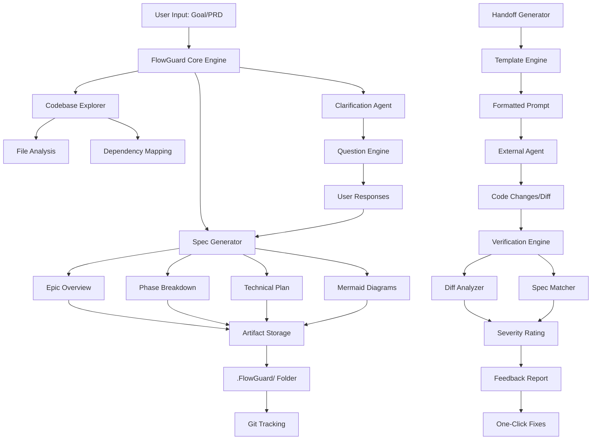
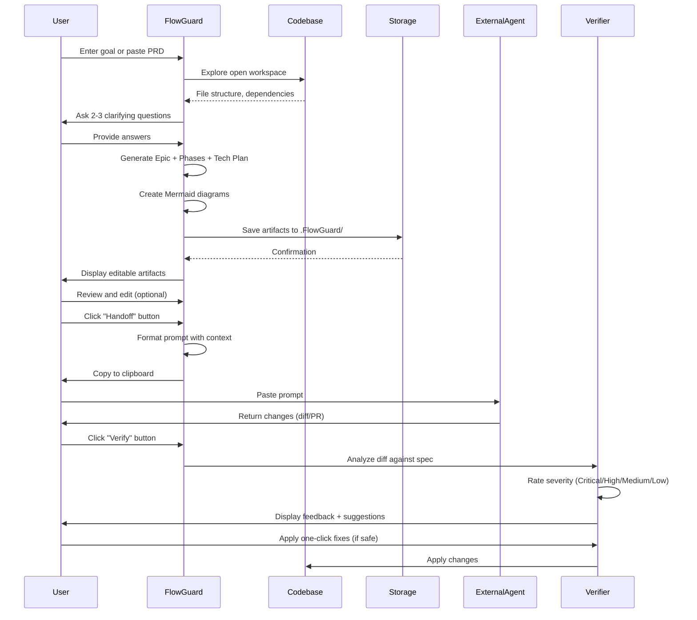
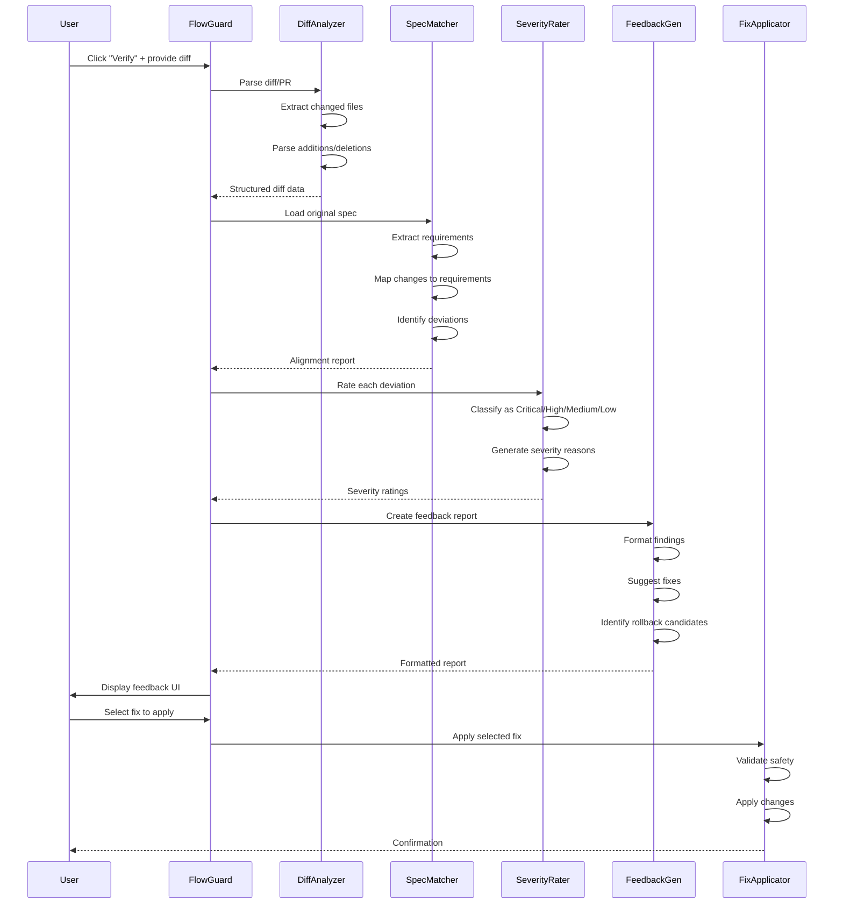

# FlowGuard VS Code Extension - Complete Epic Specification

# FlowGuard: AI-First Development Planning & Verification Layer

## Epic Overview

**FlowGuard** is an open-source VS Code extension that serves as the ultimate planning, orchestration, and verification layer for AI-first development teams. It completely eliminates intent drift by transforming natural-language goals into living, git-trackable specifications before any code is written, enabling clean handoffs to external coding agents, and automatically verifying changes against original intent.

### Core Value Proposition

- **Zero Intent Drift**: Every change is traceable back to the original specification
- **Agent-Agnostic**: Works with Cursor, Claude Projects, Windsurf, Cline, Aider, or any coding agent
- **Git-Native**: All artifacts stored as human-readable Markdown + JSON in `.FlowGuard/` folder
- **Verification-First**: Automatic diff analysis with severity-rated feedback
- **Template-Driven**: Customizable prompt templates for different agents and workflows

---

## System Architecture



---

## User Flow: End-to-End Experience



---

## Phase Breakdown

### Phase 1: Foundation & Core Infrastructure (Week 1-2)

**Objective**: Set up the VS Code extension scaffold, core data models, and storage layer.

**Deliverables**:
- Extension activation and basic sidebar UI
- `.FlowGuard/` folder structure and file management
- Core data models (Epic, Phase, TechnicalPlan, Artifact)
- Configuration system for user preferences
- Basic command palette integration

**Key Files**:
- `file:src/extension.ts` - Extension entry point
- `file:src/core/models/` - Data models
- `file:src/storage/artifactManager.ts` - Storage layer
- `file:src/ui/sidebar/` - Sidebar webview components
- `file:package.json` - Extension manifest

---

### Phase 2: Planning Engine (Week 3-4)

**Objective**: Build the core planning engine that explores codebases and generates specifications.

**Deliverables**:
- Codebase explorer with file analysis and dependency mapping
- Clarification question engine (max 2-3 questions)
- Spec generator (Epic → Phases → Technical Plan)
- Mermaid diagram generator (architecture, sequence, flow)
- Template system for customizable generation styles

**Key Files**:
- `file:src/planning/codebaseExplorer.ts` - Workspace analysis
- `file:src/planning/clarificationEngine.ts` - Question generation
- `file:src/planning/specGenerator.ts` - Spec creation logic
- `file:src/planning/diagramGenerator.ts` - Mermaid diagram creation
- `file:src/templates/` - Prompt templates

**Technical Details**:
- Use VS Code's workspace API for file exploration
- Implement AST parsing for dependency analysis (TypeScript, JavaScript, Python, etc.)
- LLM integration for intelligent question generation
- Template engine with variable substitution

---

### Phase 3: Handoff System (Week 5)

**Objective**: Create the one-click handoff mechanism with agent-agnostic prompt formatting.

**Deliverables**:
- Handoff prompt generator with context bundling
- Agent-specific template library (Cursor, Claude, Windsurf, Cline, Aider)
- Clipboard integration with formatting preservation
- Template editor UI for customization
- Multi-agent planning support

**Key Files**:
- `file:src/handoff/promptGenerator.ts` - Prompt formatting
- `file:src/handoff/agentTemplates.ts` - Agent-specific templates
- `file:src/handoff/contextBundler.ts` - Context aggregation
- `file:src/ui/templateEditor/` - Template editor UI

**Template Variables**:
- `{{epic_overview}}` - Epic summary
- `{{phases}}` - Phase breakdown
- `{{technical_plan}}` - Detailed implementation plan
- `{{diagrams}}` - Mermaid diagrams
- `{{codebase_context}}` - Relevant file snippets
- `{{edge_cases}}` - Edge cases and considerations
- `{{nfr}}` - Non-functional requirements

---

### Phase 4: Verification Engine (Week 6-7)

**Objective**: Build the automatic verification system that analyzes diffs against specifications.

**Deliverables**:
- Diff parser and analyzer
- Spec-to-code matcher with semantic understanding
- Severity rating system (Critical / High / Medium / Low)
- Feedback report generator
- One-click fix applicator (for safe changes)
- Rollback suggestions

**Key Files**:
- `file:src/verification/diffAnalyzer.ts` - Diff parsing
- `file:src/verification/specMatcher.ts` - Spec alignment checking
- `file:src/verification/severityRater.ts` - Issue classification
- `file:src/verification/feedbackGenerator.ts` - Report creation
- `file:src/verification/fixApplicator.ts` - Auto-fix application

**Severity Levels**:
- **Critical**: Changes that directly contradict the spec or break core functionality
- **High**: Missing required features or incorrect implementations
- **Medium**: Suboptimal implementations or minor deviations
- **Low**: Style issues or non-critical improvements

---

### Phase 5: UI/UX Polish & Epic Mode (Week 8-9)

**Objective**: Create a polished, modern sidebar UI and implement Epic Mode for massive refactors.

**Deliverables**:
- Complete sidebar UI with React/Svelte components
- Epic Mode for large-scale refactoring projects
- Interactive diagram viewer
- Artifact diff viewer
- Progress tracking and status indicators
- Dark/light theme support

**Key Files**:
- `file:src/ui/sidebar/components/` - React/Svelte components
- `file:src/ui/epicMode/` - Epic Mode UI
- `file:src/ui/diagramViewer/` - Interactive diagram display
- `file:src/ui/diffViewer/` - Diff visualization
- `file:webview/` - Webview HTML/CSS/JS

---

### Phase 6: Testing, Documentation & Release (Week 10)

**Objective**: Comprehensive testing, documentation, and preparation for public release.

**Deliverables**:
- Unit tests (>80% coverage)
- Integration tests for core workflows
- End-to-end tests
- User documentation and tutorials
- Developer documentation for contributors
- CI/CD pipeline setup
- MIT license and contribution guidelines
- VS Code Marketplace listing

**Key Files**:
- `file:tests/` - Test suites
- `file:docs/` - Documentation
- `file:README.md` - Project overview
- `file:CONTRIBUTING.md` - Contribution guide
- `file:LICENSE` - MIT license
- `file:.github/workflows/` - CI/CD

---

## Technical Plan: File-by-File Implementation

### Extension Structure

```
flowguard/
├── .vscode/
│   ├── launch.json              # Debug configuration
│   └── tasks.json               # Build tasks
├── .github/
│   └── workflows/
│       ├── ci.yml               # Continuous integration
│       └── release.yml          # Release automation
├── src/
│   ├── extension.ts             # Extension entry point
│   ├── core/
│   │   ├── models/
│   │   │   ├── Epic.ts          # Epic data model
│   │   │   ├── Phase.ts         # Phase data model
│   │   │   ├── TechnicalPlan.ts # Technical plan model
│   │   │   └── Artifact.ts      # Generic artifact model
│   │   └── config/
│   │       └── settings.ts      # User settings management
│   ├── storage/
│   │   ├── artifactManager.ts   # CRUD for .FlowGuard/ artifacts
│   │   ├── fileSystem.ts        # File system utilities
│   │   └── gitIntegration.ts    # Git tracking helpers
│   ├── planning/
│   │   ├── codebaseExplorer.ts  # Workspace analysis
│   │   ├── clarificationEngine.ts # Question generation
│   │   ├── specGenerator.ts     # Spec creation
│   │   ├── diagramGenerator.ts  # Mermaid diagram creation
│   │   └── templateEngine.ts    # Template processing
│   ├── handoff/
│   │   ├── promptGenerator.ts   # Prompt formatting
│   │   ├── agentTemplates.ts    # Agent-specific templates
│   │   └── contextBundler.ts    # Context aggregation
│   ├── verification/
│   │   ├── diffAnalyzer.ts      # Diff parsing
│   │   ├── specMatcher.ts       # Spec alignment
│   │   ├── severityRater.ts     # Issue classification
│   │   ├── feedbackGenerator.ts # Report creation
│   │   └── fixApplicator.ts     # Auto-fix application
│   ├── ui/
│   │   ├── sidebar/
│   │   │   ├── SidebarProvider.ts # Webview provider
│   │   │   └── components/      # UI components
│   │   ├── epicMode/
│   │   │   └── EpicModePanel.ts # Epic Mode UI
│   │   ├── templateEditor/
│   │   │   └── TemplateEditor.ts # Template customization
│   │   └── diagramViewer/
│   │       └── DiagramViewer.ts # Interactive diagrams
│   ├── commands/
│   │   ├── createEpic.ts        # Create new epic
│   │   ├── generateHandoff.ts   # Generate handoff prompt
│   │   ├── verifyChanges.ts     # Verify diff
│   │   └── editTemplate.ts      # Edit templates
│   └── utils/
│       ├── logger.ts            # Logging utilities
│       ├── parser.ts            # AST parsing
│       └── llm.ts               # LLM integration
├── webview/
│   ├── index.html               # Webview HTML
│   ├── styles.css               # Webview styles
│   └── main.js                  # Webview scripts
├── templates/
│   ├── cursor.template          # Cursor agent template
│   ├── claude.template          # Claude Projects template
│   ├── windsurf.template        # Windsurf template
│   ├── cline.template           # Cline template
│   └── aider.template           # Aider template
├── tests/
│   ├── unit/                    # Unit tests
│   ├── integration/             # Integration tests
│   └── e2e/                     # End-to-end tests
├── docs/
│   ├── user-guide.md            # User documentation
│   ├── developer-guide.md       # Developer documentation
│   └── api-reference.md         # API documentation
├── package.json                 # Extension manifest
├── tsconfig.json                # TypeScript configuration
├── webpack.config.js            # Webpack bundling
├── README.md                    # Project overview
├── CONTRIBUTING.md              # Contribution guidelines
├── LICENSE                      # MIT license
└── CHANGELOG.md                 # Version history
```

### .FlowGuard/ Artifact Structure

```
.FlowGuard/
├── config.json                  # FlowGuard configuration
├── epics/
│   └── {epic-id}/
│       ├── epic.json            # Epic metadata
│       ├── overview.md          # Epic overview
│       ├── phases/
│       │   ├── phase-1.md       # Phase 1 details
│       │   ├── phase-2.md       # Phase 2 details
│       │   └── ...
│       ├── technical-plan.md    # Detailed technical plan
│       ├── diagrams/
│       │   ├── architecture.mmd # Architecture diagram
│       │   ├── sequence.mmd     # Sequence diagram
│       │   └── flow.mmd         # Flow diagram
│       ├── handoffs/
│       │   ├── handoff-1.md     # Handoff prompt 1
│       │   └── ...
│       └── verifications/
│           ├── verification-1.json # Verification result 1
│           └── ...
└── templates/
    ├── custom-epic.template     # Custom epic template
    └── custom-verification.template # Custom verification template
```

---

## Verification Flow: Detailed Process



---

## Core Implementation Details

### 1. Extension Activation (`file:src/extension.ts`)

**Responsibilities**:
- Register commands (Create Epic, Generate Handoff, Verify Changes, Edit Template)
- Initialize sidebar webview provider
- Set up configuration watchers
- Initialize storage layer

**Key APIs**:
- `vscode.window.registerWebviewViewProvider()`
- `vscode.commands.registerCommand()`
- `vscode.workspace.onDidChangeConfiguration()`

---

### 2. Codebase Explorer (`file:src/planning/codebaseExplorer.ts`)

**Responsibilities**:
- Scan workspace for relevant files
- Build dependency graph
- Extract key symbols (classes, functions, interfaces)
- Identify architectural patterns

**Key APIs**:
- `vscode.workspace.findFiles()`
- `vscode.workspace.fs.readFile()`
- TypeScript Compiler API for AST parsing
- Tree-sitter for multi-language parsing

**Output**:
```typescript
interface CodebaseContext {
  files: FileInfo[];
  dependencies: DependencyGraph;
  symbols: SymbolMap;
  patterns: ArchitecturalPattern[];
}
```

---

### 3. Clarification Engine (`file:src/planning/clarificationEngine.ts`)

**Responsibilities**:
- Analyze user goal for ambiguities
- Generate max 2-3 targeted questions
- Process user responses
- Enrich spec generation context

**Question Types**:
- Scope clarification: "Should this include X feature?"
- Technical choice: "Which database: SQL or NoSQL?"
- Priority: "Is performance or simplicity more important?"

**LLM Integration**:
- Use OpenAI/Anthropic API for question generation
- Prompt engineering for concise, relevant questions

---

### 4. Spec Generator (`file:src/planning/specGenerator.ts`)

**Responsibilities**:
- Generate Epic overview
- Break down into phases (for large projects)
- Create detailed technical plan
- Generate file-by-file change descriptions
- Include edge cases and NFRs

**Template Structure**:
```markdown
# Epic: {title}

## Overview
{overview}

## Phases
{phases}

## Technical Plan
{technical_plan}

## Architecture
{architecture_diagram}

## Edge Cases
{edge_cases}

## Non-Functional Requirements
{nfr}
```

---

### 5. Handoff Prompt Generator (`file:src/handoff/promptGenerator.ts`)

**Responsibilities**:
- Bundle spec + context into single prompt
- Format for target agent (Cursor, Claude, etc.)
- Include relevant code snippets
- Add verification instructions

**Agent-Specific Templates**:

**Cursor Template**:
```
# Task: {epic_title}

## Context
{codebase_context}

## Specification
{epic_overview}
{technical_plan}

## Implementation Instructions
{phases}

## Verification Criteria
{verification_criteria}

Please implement the above changes and provide a diff.
```

**Claude Projects Template**:
```
<task>
<title>{epic_title}</title>
<context>{codebase_context}</context>
<specification>
{epic_overview}
{technical_plan}
</specification>
<instructions>{phases}</instructions>
</task>
```

---

### 6. Diff Analyzer (`file:src/verification/diffAnalyzer.ts`)

**Responsibilities**:
- Parse Git diffs or PR content
- Extract changed files and line ranges
- Identify additions, deletions, modifications
- Build structured diff representation

**Input Formats**:
- Git diff output
- GitHub PR API response
- GitLab MR API response
- Manual paste of diff

**Output**:
```typescript
interface DiffAnalysis {
  files: ChangedFile[];
  additions: number;
  deletions: number;
  summary: string;
}

interface ChangedFile {
  path: string;
  changes: Change[];
  type: 'added' | 'modified' | 'deleted';
}
```

---

### 7. Spec Matcher (`file:src/verification/specMatcher.ts`)

**Responsibilities**:
- Load original spec requirements
- Map code changes to spec items
- Identify missing implementations
- Detect contradictions

**Matching Algorithm**:
1. Extract requirements from spec (using LLM or regex)
2. For each changed file, identify related requirements
3. Check if changes satisfy requirements
4. Flag deviations and missing items

**LLM-Powered Semantic Matching**:
- Use embeddings to match code changes to spec sections
- Semantic similarity scoring
- Context-aware deviation detection

---

### 8. Severity Rater (`file:src/verification/severityRater.ts`)

**Responsibilities**:
- Classify each deviation by severity
- Provide reasoning for each rating
- Suggest remediation actions

**Severity Criteria**:

| Severity | Criteria | Example |
|----------|----------|---------|
| **Critical** | Directly contradicts spec, breaks core functionality | Implemented REST API instead of specified GraphQL |
| **High** | Missing required feature, incorrect implementation | Forgot to add authentication middleware |
| **Medium** | Suboptimal implementation, minor deviation | Used `var` instead of `const`, inefficient algorithm |
| **Low** | Style issues, non-critical improvements | Missing JSDoc comments, inconsistent naming |

---

### 9. Feedback Generator (`file:src/verification/feedbackGenerator.ts`)

**Responsibilities**:
- Format verification results into readable report
- Suggest specific fixes for each issue
- Identify safe auto-fix candidates
- Provide rollback recommendations

**Report Format**:
```markdown
# Verification Report

## Summary
- Total Changes: 15 files
- Critical Issues: 1
- High Issues: 3
- Medium Issues: 5
- Low Issues: 2

## Critical Issues

### 1. API Implementation Mismatch
**File**: `file:src/api/server.ts`
**Issue**: Implemented REST API instead of GraphQL as specified
**Severity**: Critical
**Recommendation**: Rollback and implement GraphQL using Apollo Server
**Auto-Fix**: Not available

## High Issues

### 1. Missing Authentication
**File**: `file:src/middleware/auth.ts`
**Issue**: Authentication middleware not implemented
**Severity**: High
**Recommendation**: Add JWT-based authentication
**Auto-Fix**: Available (click to apply)

...
```

---

### 10. Fix Applicator (`file:src/verification/fixApplicator.ts`)

**Responsibilities**:
- Apply safe, automated fixes
- Validate changes before application
- Create backup/undo points
- Report application results

**Safety Checks**:
- Only apply fixes for Low/Medium severity issues
- Require user confirmation for High severity
- Never auto-apply Critical fixes
- Run linter/formatter after application

---

## UI/UX Design: Sidebar Wireframes

### Main Sidebar View

```wireframe
<!DOCTYPE html>
<html>
<head>
<style>
body {
  font-family: -apple-system, BlinkMacSystemFont, 'Segoe UI', sans-serif;
  margin: 0;
  padding: 16px;
  background: #1e1e1e;
  color: #cccccc;
}
.header {
  display: flex;
  align-items: center;
  justify-content: space-between;
  margin-bottom: 20px;
  padding-bottom: 12px;
  border-bottom: 1px solid #3e3e3e;
}
.logo {
  font-size: 18px;
  font-weight: 600;
  color: #4ec9b0;
}
.btn-new {
  background: #0e639c;
  color: white;
  border: none;
  padding: 6px 12px;
  border-radius: 4px;
  cursor: pointer;
  font-size: 13px;
}
.section {
  margin-bottom: 24px;
}
.section-title {
  font-size: 11px;
  text-transform: uppercase;
  color: #858585;
  margin-bottom: 8px;
  font-weight: 600;
}
.epic-card {
  background: #252526;
  border: 1px solid #3e3e3e;
  border-radius: 6px;
  padding: 12px;
  margin-bottom: 8px;
  cursor: pointer;
}
.epic-card:hover {
  border-color: #4ec9b0;
}
.epic-title {
  font-size: 14px;
  font-weight: 500;
  margin-bottom: 4px;
}
.epic-meta {
  font-size: 12px;
  color: #858585;
}
.status-badge {
  display: inline-block;
  padding: 2px 8px;
  border-radius: 3px;
  font-size: 11px;
  margin-left: 8px;
}
.status-planning {
  background: #1a73e8;
  color: white;
}
.status-ready {
  background: #34a853;
  color: white;
}
.status-verifying {
  background: #fbbc04;
  color: black;
}
.empty-state {
  text-align: center;
  padding: 40px 20px;
  color: #858585;
}
</style>
</head>
<body>
  <div class="header">
    <div class="logo">⚡ FlowGuard</div>
    <button class="btn-new" data-element-id="btn-create-epic">+ New Epic</button>
  </div>
  
  <div class="section">
    <div class="section-title">Active Epics</div>
    <div class="epic-card" data-element-id="epic-card-1">
      <div class="epic-title">User Authentication System</div>
      <div class="epic-meta">
        3 phases · 12 files
        <span class="status-badge status-planning">Planning</span>
      </div>
    </div>
    <div class="epic-card" data-element-id="epic-card-2">
      <div class="epic-title">Payment Integration</div>
      <div class="epic-meta">
        5 phases · 8 files
        <span class="status-badge status-ready">Ready for Handoff</span>
      </div>
    </div>
  </div>
  
  <div class="section">
    <div class="section-title">Recent Verifications</div>
    <div class="epic-card" data-element-id="verification-card-1">
      <div class="epic-title">API Refactor - Verification</div>
      <div class="epic-meta">
        2 Critical · 5 High · 3 Medium
        <span class="status-badge status-verifying">Needs Review</span>
      </div>
    </div>
  </div>
</body>
</html>
```

### Epic Detail View

```wireframe
<!DOCTYPE html>
<html>
<head>
<style>
body {
  font-family: -apple-system, BlinkMacSystemFont, 'Segoe UI', sans-serif;
  margin: 0;
  padding: 16px;
  background: #1e1e1e;
  color: #cccccc;
}
.header {
  margin-bottom: 20px;
  padding-bottom: 12px;
  border-bottom: 1px solid #3e3e3e;
}
.back-btn {
  background: none;
  border: none;
  color: #4ec9b0;
  cursor: pointer;
  font-size: 13px;
  padding: 4px 0;
  margin-bottom: 8px;
}
.epic-title {
  font-size: 20px;
  font-weight: 600;
  margin-bottom: 8px;
}
.epic-meta {
  font-size: 13px;
  color: #858585;
}
.tabs {
  display: flex;
  gap: 16px;
  margin-bottom: 16px;
  border-bottom: 1px solid #3e3e3e;
}
.tab {
  padding: 8px 12px;
  cursor: pointer;
  border-bottom: 2px solid transparent;
  font-size: 13px;
}
.tab.active {
  border-bottom-color: #4ec9b0;
  color: #4ec9b0;
}
.content {
  margin-bottom: 20px;
}
.phase-item {
  background: #252526;
  border: 1px solid #3e3e3e;
  border-radius: 6px;
  padding: 12px;
  margin-bottom: 8px;
}
.phase-header {
  display: flex;
  justify-content: space-between;
  align-items: center;
  margin-bottom: 8px;
}
.phase-title {
  font-size: 14px;
  font-weight: 500;
}
.phase-status {
  font-size: 11px;
  color: #858585;
}
.phase-desc {
  font-size: 13px;
  color: #cccccc;
  line-height: 1.5;
}
.actions {
  display: flex;
  gap: 8px;
  margin-top: 20px;
}
.btn {
  padding: 8px 16px;
  border-radius: 4px;
  border: none;
  cursor: pointer;
  font-size: 13px;
  font-weight: 500;
}
.btn-primary {
  background: #0e639c;
  color: white;
}
.btn-secondary {
  background: #3e3e3e;
  color: #cccccc;
}
</style>
</head>
<body>
  <div class="header">
    <button class="back-btn" data-element-id="btn-back">← Back to Epics</button>
    <div class="epic-title">User Authentication System</div>
    <div class="epic-meta">Created 2 days ago · Last updated 1 hour ago</div>
  </div>
  
  <div class="tabs">
    <div class="tab active" data-element-id="tab-overview">Overview</div>
    <div class="tab" data-element-id="tab-phases">Phases</div>
    <div class="tab" data-element-id="tab-technical">Technical Plan</div>
    <div class="tab" data-element-id="tab-diagrams">Diagrams</div>
  </div>
  
  <div class="content">
    <div class="phase-item">
      <div class="phase-header">
        <div class="phase-title">Phase 1: Database Schema</div>
        <div class="phase-status">✓ Complete</div>
      </div>
      <div class="phase-desc">
        Design and implement user table with email, password hash, and metadata fields.
      </div>
    </div>
    
    <div class="phase-item">
      <div class="phase-header">
        <div class="phase-title">Phase 2: JWT Authentication</div>
        <div class="phase-status">In Progress</div>
      </div>
      <div class="phase-desc">
        Implement JWT token generation, validation, and refresh logic.
      </div>
    </div>
    
    <div class="phase-item">
      <div class="phase-header">
        <div class="phase-title">Phase 3: API Endpoints</div>
        <div class="phase-status">Pending</div>
      </div>
      <div class="phase-desc">
        Create /login, /register, /logout, and /refresh endpoints.
      </div>
    </div>
  </div>
  
  <div class="actions">
    <button class="btn btn-primary" data-element-id="btn-handoff">📋 Generate Handoff</button>
    <button class="btn btn-secondary" data-element-id="btn-edit">✏️ Edit Spec</button>
    <button class="btn btn-secondary" data-element-id="btn-verify">✓ Verify Changes</button>
  </div>
</body>
</html>
```

### Handoff Prompt View

```wireframe
<!DOCTYPE html>
<html>
<head>
<style>
body {
  font-family: -apple-system, BlinkMacSystemFont, 'Segoe UI', sans-serif;
  margin: 0;
  padding: 16px;
  background: #1e1e1e;
  color: #cccccc;
}
.header {
  margin-bottom: 20px;
  padding-bottom: 12px;
  border-bottom: 1px solid #3e3e3e;
}
.title {
  font-size: 18px;
  font-weight: 600;
  margin-bottom: 12px;
}
.agent-selector {
  display: flex;
  gap: 8px;
  margin-bottom: 16px;
}
.agent-btn {
  padding: 6px 12px;
  border-radius: 4px;
  border: 1px solid #3e3e3e;
  background: #252526;
  color: #cccccc;
  cursor: pointer;
  font-size: 12px;
}
.agent-btn.active {
  border-color: #4ec9b0;
  background: #0e639c;
  color: white;
}
.prompt-preview {
  background: #252526;
  border: 1px solid #3e3e3e;
  border-radius: 6px;
  padding: 16px;
  margin-bottom: 16px;
  max-height: 400px;
  overflow-y: auto;
  font-family: 'Courier New', monospace;
  font-size: 12px;
  line-height: 1.6;
}
.actions {
  display: flex;
  gap: 8px;
}
.btn {
  padding: 8px 16px;
  border-radius: 4px;
  border: none;
  cursor: pointer;
  font-size: 13px;
  font-weight: 500;
}
.btn-primary {
  background: #0e639c;
  color: white;
}
.btn-secondary {
  background: #3e3e3e;
  color: #cccccc;
}
.copy-status {
  display: inline-block;
  margin-left: 8px;
  color: #34a853;
  font-size: 12px;
}
</style>
</head>
<body>
  <div class="header">
    <div class="title">Generate Handoff Prompt</div>
  </div>
  
  <div class="agent-selector">
    <button class="agent-btn active" data-element-id="agent-cursor">Cursor</button>
    <button class="agent-btn" data-element-id="agent-claude">Claude Projects</button>
    <button class="agent-btn" data-element-id="agent-windsurf">Windsurf</button>
    <button class="agent-btn" data-element-id="agent-cline">Cline</button>
    <button class="agent-btn" data-element-id="agent-aider">Aider</button>
  </div>
  
  <div class="prompt-preview" data-element-id="prompt-preview">
# Task: User Authentication System

## Context
This is a Node.js/Express application with PostgreSQL database.
Current structure:
- src/api/ - API routes
- src/models/ - Database models
- src/middleware/ - Express middleware

## Specification

### Epic Overview
Implement a complete user authentication system with JWT tokens...

### Phase 1: Database Schema
Design and implement user table with:
- id (UUID, primary key)
- email (unique, indexed)
- password_hash (bcrypt)
- created_at, updated_at

### Phase 2: JWT Authentication
Implement token generation and validation...

## Implementation Instructions
1. Create migration file for users table
2. Implement User model with bcrypt hashing
3. Create JWT utility functions
4. Implement authentication middleware
5. Create API endpoints

## Verification Criteria
- All tests pass
- Password hashing uses bcrypt with salt rounds >= 10
- JWT tokens expire after 1 hour
- Refresh tokens expire after 7 days
  </div>
  
  <div class="actions">
    <button class="btn btn-primary" data-element-id="btn-copy">📋 Copy to Clipboard</button>
    <button class="btn btn-secondary" data-element-id="btn-edit-template">✏️ Edit Template</button>
    <button class="btn btn-secondary" data-element-id="btn-save">💾 Save Prompt</button>
  </div>
</body>
</html>
```

### Verification Results View

```wireframe
<!DOCTYPE html>
<html>
<head>
<style>
body {
  font-family: -apple-system, BlinkMacSystemFont, 'Segoe UI', sans-serif;
  margin: 0;
  padding: 16px;
  background: #1e1e1e;
  color: #cccccc;
}
.header {
  margin-bottom: 20px;
  padding-bottom: 12px;
  border-bottom: 1px solid #3e3e3e;
}
.title {
  font-size: 18px;
  font-weight: 600;
  margin-bottom: 8px;
}
.summary {
  display: flex;
  gap: 16px;
  margin-bottom: 20px;
}
.summary-item {
  background: #252526;
  border: 1px solid #3e3e3e;
  border-radius: 6px;
  padding: 12px;
  flex: 1;
  text-align: center;
}
.summary-count {
  font-size: 24px;
  font-weight: 600;
  margin-bottom: 4px;
}
.summary-label {
  font-size: 11px;
  color: #858585;
  text-transform: uppercase;
}
.critical { color: #f48771; }
.high { color: #fbbc04; }
.medium { color: #4ec9b0; }
.low { color: #858585; }
.issue-list {
  margin-bottom: 20px;
}
.issue-item {
  background: #252526;
  border-left: 4px solid;
  border-radius: 4px;
  padding: 12px;
  margin-bottom: 12px;
}
.issue-item.critical { border-left-color: #f48771; }
.issue-item.high { border-left-color: #fbbc04; }
.issue-header {
  display: flex;
  justify-content: space-between;
  align-items: center;
  margin-bottom: 8px;
}
.issue-title {
  font-size: 14px;
  font-weight: 500;
}
.severity-badge {
  padding: 2px 8px;
  border-radius: 3px;
  font-size: 11px;
  font-weight: 600;
}
.severity-critical {
  background: #f48771;
  color: black;
}
.severity-high {
  background: #fbbc04;
  color: black;
}
.issue-file {
  font-size: 12px;
  color: #4ec9b0;
  margin-bottom: 8px;
  font-family: 'Courier New', monospace;
}
.issue-desc {
  font-size: 13px;
  line-height: 1.5;
  margin-bottom: 8px;
}
.issue-actions {
  display: flex;
  gap: 8px;
}
.btn-small {
  padding: 4px 10px;
  border-radius: 3px;
  border: none;
  cursor: pointer;
  font-size: 11px;
}
.btn-fix {
  background: #0e639c;
  color: white;
}
.btn-ignore {
  background: #3e3e3e;
  color: #cccccc;
}
</style>
</head>
<body>
  <div class="header">
    <div class="title">Verification Results</div>
  </div>
  
  <div class="summary">
    <div class="summary-item">
      <div class="summary-count critical">2</div>
      <div class="summary-label">Critical</div>
    </div>
    <div class="summary-item">
      <div class="summary-count high">5</div>
      <div class="summary-label">High</div>
    </div>
    <div class="summary-item">
      <div class="summary-count medium">3</div>
      <div class="summary-label">Medium</div>
    </div>
    <div class="summary-item">
      <div class="summary-count low">1</div>
      <div class="summary-label">Low</div>
    </div>
  </div>
  
  <div class="issue-list">
    <div class="issue-item critical">
      <div class="issue-header">
        <div class="issue-title">Password Hashing Not Implemented</div>
        <span class="severity-badge severity-critical">CRITICAL</span>
      </div>
      <div class="issue-file">src/models/User.ts</div>
      <div class="issue-desc">
        Spec requires bcrypt password hashing with salt rounds >= 10, but passwords are stored in plain text.
        This is a critical security vulnerability.
      </div>
      <div class="issue-actions">
        <button class="btn-small btn-ignore" data-element-id="ignore-1">Ignore</button>
        <button class="btn-small" style="background: #f48771; color: black;" data-element-id="rollback-1">Suggest Rollback</button>
      </div>
    </div>
    
    <div class="issue-item high">
      <div class="issue-header">
        <div class="issue-title">Missing JWT Expiration</div>
        <span class="severity-badge severity-high">HIGH</span>
      </div>
      <div class="issue-file">src/utils/jwt.ts</div>
      <div class="issue-desc">
        JWT tokens should expire after 1 hour per spec, but no expiration is set.
      </div>
      <div class="issue-actions">
        <button class="btn-small btn-fix" data-element-id="fix-2">Apply Auto-Fix</button>
        <button class="btn-small btn-ignore" data-element-id="ignore-2">Ignore</button>
      </div>
    </div>
  </div>
</body>
</html>
```

---

## Edge Cases & Considerations

### 1. Large Codebases
- **Challenge**: Scanning 10,000+ files takes too long
- **Solution**: Implement incremental scanning with caching, allow user to specify relevant directories

### 2. Multi-Language Projects
- **Challenge**: Different languages require different parsers
- **Solution**: Use Tree-sitter for universal parsing, fallback to regex for unsupported languages

### 3. Ambiguous Diffs
- **Challenge**: Diff doesn't clearly map to spec requirements
- **Solution**: Use LLM-powered semantic matching, allow manual mapping in UI

### 4. Conflicting Changes
- **Challenge**: Multiple developers working on same epic
- **Solution**: Git-based conflict resolution, merge strategies for `.FlowGuard/` artifacts

### 5. Template Customization
- **Challenge**: Users want highly customized prompts
- **Solution**: Full template editor with variable substitution, preview mode, version control

### 6. Offline Mode
- **Challenge**: LLM APIs require internet connection
- **Solution**: Cache previous generations, allow local LLM integration (Ollama, LM Studio)

### 7. Security & Privacy
- **Challenge**: Sensitive code in handoff prompts
- **Solution**: Redaction rules, allow users to mark files as sensitive, local-only mode

### 8. Performance
- **Challenge**: Large specs slow down UI
- **Solution**: Lazy loading, pagination, virtual scrolling for long lists

---

## Non-Functional Requirements

### Performance
- Extension activation: < 500ms
- Codebase scan (1000 files): < 5 seconds
- Spec generation: < 10 seconds
- Verification analysis: < 3 seconds
- UI responsiveness: 60 FPS

### Scalability
- Support projects with 100,000+ files
- Handle epics with 50+ phases
- Store 1000+ verification results

### Reliability
- Auto-save artifacts every 30 seconds
- Graceful degradation if LLM API fails
- Rollback mechanism for failed operations
- Comprehensive error logging

### Security
- No sensitive data sent to LLM without user consent
- Secure storage of API keys (VS Code SecretStorage)
- Sanitize user inputs to prevent injection attacks
- Audit log for all artifact modifications

### Usability
- Onboarding tutorial for first-time users
- Keyboard shortcuts for common actions
- Accessible UI (WCAG 2.1 AA compliance)
- Comprehensive documentation

### Maintainability
- Modular architecture with clear separation of concerns
- 80%+ test coverage
- TypeScript strict mode enabled
- Comprehensive inline documentation
- Contribution guidelines for open-source contributors

### Compatibility
- VS Code version: 1.80.0+
- Node.js: 18.0.0+
- Supported languages: TypeScript, JavaScript, Python, Java, Go, Rust, C++
- OS: Windows, macOS, Linux

---

## Technology Stack

### Core
- **Language**: TypeScript 5.0+
- **Runtime**: Node.js 18+
- **Framework**: VS Code Extension API

### UI
- **Webview**: React 18 or Svelte 4
- **Styling**: CSS Modules or Tailwind CSS
- **Icons**: Codicons (VS Code icon library)

### Parsing & Analysis
- **AST Parsing**: TypeScript Compiler API, Tree-sitter
- **Diff Parsing**: `diff` npm package
- **Markdown**: `marked` or `remark`

### LLM Integration
- **APIs**: OpenAI, Anthropic, local models (Ollama)
- **Embeddings**: OpenAI Embeddings API for semantic matching

### Storage
- **File System**: VS Code Workspace FS API
- **Git**: `simple-git` npm package
- **Configuration**: VS Code Settings API

### Testing
- **Unit Tests**: Jest
- **Integration Tests**: VS Code Extension Test Runner
- **E2E Tests**: Playwright

### Build & Tooling
- **Bundler**: Webpack or esbuild
- **Linter**: ESLint
- **Formatter**: Prettier
- **CI/CD**: GitHub Actions

---

## Success Metrics

### Adoption
- 10,000+ installs in first 3 months
- 4.5+ star rating on VS Code Marketplace
- 100+ GitHub stars

### Usage
- Average 5+ epics created per user per month
- 80%+ of users complete handoff flow
- 70%+ of users use verification feature

### Quality
- < 5% bug report rate
- < 1 day average issue resolution time
- 90%+ user satisfaction score

### Community
- 50+ contributors in first year
- 20+ community-contributed templates
- Active Discord/Slack community

---

## Release Plan

### Alpha (Week 1-4)
- Core planning engine
- Basic sidebar UI
- Manual handoff (copy/paste)
- Internal testing with 5-10 users

### Beta (Week 5-8)
- Full handoff system with templates
- Verification engine
- Template editor
- Public beta with 100+ users

### v1.0 (Week 9-10)
- Epic Mode
- Polish and bug fixes
- Comprehensive documentation
- Public release on VS Code Marketplace

### v1.1+ (Post-launch)
- Plugin system for extensibility
- Advanced verification (security scanning, performance analysis)
- Team collaboration features
- Integration with project management tools (Jira, Linear)

---

## Open Questions

1. **LLM Provider**: Should we support multiple LLM providers out of the box, or start with one (e.g., OpenAI)?
2. **Pricing Model**: Free and open-source, or freemium with premium features?
3. **Telemetry**: Should we collect anonymous usage data to improve the extension?
4. **Multi-Workspace**: Should FlowGuard support multi-root workspaces from day one?
5. **Collaboration**: Should we build real-time collaboration features (like Google Docs) for specs?

---

## Next Steps

1. **Review & Refine**: Review this spec, identify gaps, and refine requirements
2. **Create Tickets**: Break down phases into actionable tickets
3. **Set Up Repository**: Initialize Git repo with MIT license, README, and contribution guidelines
4. **Scaffold Extension**: Create VS Code extension scaffold with TypeScript
5. **Begin Phase 1**: Start implementing foundation and core infrastructure

---

## Appendix: Example Handoff Prompt

**For Cursor Agent**:

```markdown
# Task: Implement FlowGuard Phase 1 - Foundation & Core Infrastructure

## Context
This is a new VS Code extension project. We're building FlowGuard, a planning and verification layer for AI-first development.

## Project Structure
flowguard/
├── src/
│   ├── extension.ts
│   ├── core/
│   ├── storage/
│   └── ui/
├── package.json
└── tsconfig.json

## Specification

### Phase 1 Objectives
1. Set up VS Code extension scaffold
2. Implement `.FlowGuard/` folder structure
3. Create core data models (Epic, Phase, TechnicalPlan)
4. Build basic sidebar UI
5. Register commands in command palette

### Detailed Requirements

#### 1. Extension Entry Point (`src/extension.ts`)
- Export `activate()` and `deactivate()` functions
- Register commands: `flowguard.createEpic`, `flowguard.openSidebar`
- Initialize sidebar webview provider
- Set up configuration watchers

#### 2. Data Models (`src/core/models/`)
Create TypeScript interfaces:
- `Epic`: id, title, overview, phases[], createdAt, updatedAt
- `Phase`: id, title, description, status, deliverables[]
- `TechnicalPlan`: id, epicId, fileChanges[], diagrams[]

#### 3. Storage Layer (`src/storage/artifactManager.ts`)
- `createEpic(epic: Epic): Promise<void>` - Save to `.FlowGuard/epics/{id}/`
- `loadEpic(id: string): Promise<Epic>` - Load from file system
- `updateEpic(epic: Epic): Promise<void>` - Update existing epic
- `deleteEpic(id: string): Promise<void>` - Remove epic

#### 4. Sidebar UI (`src/ui/sidebar/SidebarProvider.ts`)
- Implement `WebviewViewProvider`
- Render list of epics
- Handle "New Epic" button click
- Display epic cards with title, status, metadata

#### 5. Package Manifest (`package.json`)
- Extension metadata (name, version, description)
- Activation events: `onCommand:flowguard.createEpic`
- Contributes: commands, views, configuration
- Dependencies: VS Code API types

## Implementation Instructions
1. Run `yo code` to scaffold extension
2. Implement data models with TypeScript interfaces
3. Create storage layer with file system operations
4. Build sidebar webview with HTML/CSS/JS
5. Register commands and views in package.json
6. Test extension in Extension Development Host

## Verification Criteria
- Extension activates without errors
- Sidebar displays correctly
- "New Epic" command creates `.FlowGuard/` folder
- Epic data persists across VS Code restarts
- All TypeScript compiles without errors

## Files to Create
- `src/extension.ts`
- `src/core/models/Epic.ts`
- `src/core/models/Phase.ts`
- `src/core/models/TechnicalPlan.ts`
- `src/storage/artifactManager.ts`
- `src/ui/sidebar/SidebarProvider.ts`
- `webview/index.html`
- `package.json`
- `tsconfig.json`

Please implement the above and provide a diff of all changes.
```