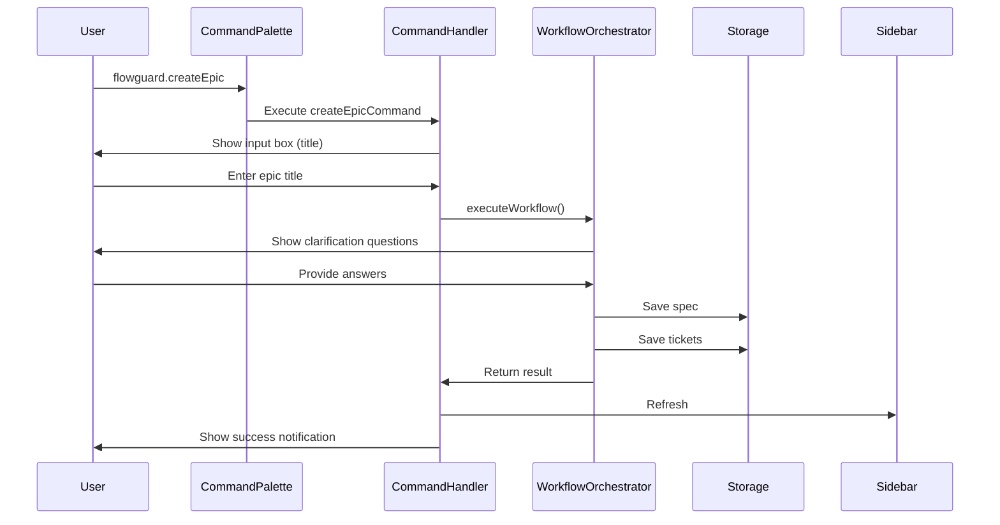

I have created the following plan after thorough exploration and analysis of the codebase. Follow the below plan verbatim. Trust the files and references. Do not re-verify what's written in the plan. Explore only when absolutely necessary. First implement all the proposed file changes and then I'll review all the changes together at the end.

## Observations

The extension currently has basic commands registered inline in `file:src/extension.ts` (lines 129-172). Key workflow commands are missing: `flowguard.createEpic`, `flowguard.generateHandoff`, and `flowguard.verifyChanges`. The codebase has robust components (`WorkflowOrchestrator`, `VerificationEngine`, `MarkdownExporter`, `ExecutionTracker`) ready for integration. No dedicated command handlers directory exists, and keyboard shortcuts are minimal (only 2 defined). Editor context menus are absent.

## Approach

Create a dedicated command layer in `file:src/commands/` with individual handler files for each major command group. Register all missing commands in `file:package.json` with comprehensive keyboard shortcuts and context menus. Refactor existing inline command registrations to use the new handlers. Integrate commands with existing workflow components (`WorkflowOrchestrator`, `VerificationEngine`, `MarkdownExporter`). Add context-aware command palette suggestions using `when` clauses to show relevant commands based on file type and editor state.

## Implementation Steps

### 1. Create Command Handler Directory Structure

Create `file:src/commands/` directory with the following files:
- `index.ts` - Central command registration and exports
- `epicCommands.ts` - Epic creation and initialization
- `specCommands.ts` - Spec creation and management
- `ticketCommands.ts` - Ticket creation and management
- `handoffCommands.ts` - Handoff generation and execution tracking
- `verificationCommands.ts` - Verification and diff analysis
- `navigationCommands.ts` - Quick navigation and refresh
- `types.ts` - Shared command types and interfaces

### 2. Implement Epic Commands (`file:src/commands/epicCommands.ts`)

Create command handlers for epic management:

**`flowguard.createEpic`**
- Show input box for epic title and overview
- Use `WorkflowOrchestrator` to execute the full planning workflow
- Display progress notification with phases (clarification → spec → tickets)
- Handle clarification questions via quick pick UI
- Show success message with created artifacts count
- Open sidebar view to display new epic

**`flowguard.initializeEpic`** (refactor existing)
- Prompt for workspace selection if multiple folders
- Create `.flowguard/` directory structure
- Initialize `epic.json` with metadata
- Show welcome notification with next steps

### 3. Implement Spec Commands (`file:src/commands/specCommands.ts`)

Refactor existing spec commands and add new ones:

**`flowguard.createSpec`** (refactor from `SidebarProvider`)
- Move logic from `SidebarProvider.createSpec()` to dedicated handler
- Add optional parameter for pre-filled title/tags
- Support creation from command palette or sidebar
- Open spec editor after creation

**`flowguard.openSpec`**
- Quick pick list of all specs with status badges
- Filter by status (Draft, Approved, etc.)
- Open selected spec in custom editor

**`flowguard.approveSpec`**
- Context-aware command (only available in spec editor)
- Update spec status to 'approved'
- Trigger sidebar refresh
- Show confirmation notification

### 4. Implement Ticket Commands (`file:src/commands/ticketCommands.ts`)

Refactor existing ticket commands and add new ones:

**`flowguard.createTicket`** (refactor from `SidebarProvider`)
- Move logic from `SidebarProvider.createTicket()` to dedicated handler
- Show spec picker if no spec selected
- Support creation with pre-filled spec reference
- Open ticket editor after creation

**`flowguard.openTicket`**
- Quick pick list of all tickets with priority/status badges
- Filter by spec, status, or priority
- Open selected ticket in custom editor

**`flowguard.assignTicket`**
- Context-aware command (only in ticket editor)
- Show input box for assignee name
- Update ticket metadata
- Refresh sidebar

### 5. Implement Handoff Commands (`file:src/commands/handoffCommands.ts`)

Create new handoff generation commands:

**`flowguard.generateHandoff`**
- Show multi-select quick pick for specs and tickets
- Show agent type picker (Cursor, Claude, Windsurf, Cline, Aider, Custom)
- Ask if codebase context should be included
- Use `MarkdownExporter.exportHandoff()` to generate markdown
- Use `ExecutionTracker.createExecution()` to track handoff
- Show preview panel with generated markdown
- Provide "Copy to Clipboard" and "Save to File" actions
- Display execution ID and metadata (word count, reading time)

**`flowguard.copyHandoffToClipboard`**
- Context-aware command (only in handoff preview)
- Copy markdown to clipboard using VS Code clipboard API
- Show success notification

**`flowguard.previewHandoff`**
- Show preview of handoff template before generation
- Allow template customization
- Support variable substitution preview

### 6. Implement Verification Commands (`file:src/commands/verificationCommands.ts`)

Create new verification commands:

**`flowguard.verifyChanges`**
- Show input options: Git diff, GitHub PR URL, GitLab MR URL, Manual paste
- For Git diff: use `GitHelper` to get uncommitted changes or diff between branches
- For PR/MR: show input box for URL and use appropriate adapter
- For manual: show text input box
- Select specs to verify against (multi-select quick pick)
- Use `VerificationEngine.verifyChanges()` to analyze
- Show verification results in `VerificationView`
- Display summary notification with issue counts

**`flowguard.verifyCurrentFile`**
- Context-aware command (only in editor with file open)
- Get diff for current file only
- Auto-select related specs based on file path
- Run verification and show results

**`flowguard.verifyCommit`**
- Show input box for commit hash
- Use `GitHelper` to get commit diff
- Run verification against all specs
- Show results in verification view

### 7. Implement Navigation Commands (`file:src/commands/navigationCommands.ts`)

Refactor and enhance navigation:

**`flowguard.refreshSidebar`** (refactor existing)
- Move logic from inline registration
- Refresh all sidebar sections (specs, tickets, executions)
- Show progress notification for large epics

**`flowguard.showVerification`** (refactor existing)
- Move logic from inline registration
- Add parameter validation
- Focus verification view

**`flowguard.showExecution`** (refactor existing)
- Move logic from inline registration
- Add parameter validation
- Focus execution view

**`flowguard.goToSpec`**
- Quick navigation to spec from ticket editor
- Parse spec reference from ticket content
- Open spec in split editor

**`flowguard.goToTicket`**
- Quick navigation to ticket from spec editor
- Show list of related tickets
- Open selected ticket in split editor

### 8. Update `file:package.json` - Commands Section

Add missing commands to the `contributes.commands` array:

```json
{
  "command": "flowguard.createEpic",
  "title": "FlowGuard: Create Epic",
  "icon": "$(project)"
},
{
  "command": "flowguard.generateHandoff",
  "title": "FlowGuard: Generate Handoff",
  "icon": "$(export)"
},
{
  "command": "flowguard.verifyChanges",
  "title": "FlowGuard: Verify Changes",
  "icon": "$(check-all)"
},
{
  "command": "flowguard.verifyCurrentFile",
  "title": "FlowGuard: Verify Current File",
  "icon": "$(check)"
},
{
  "command": "flowguard.verifyCommit",
  "title": "FlowGuard: Verify Commit"
},
{
  "command": "flowguard.openSpec",
  "title": "FlowGuard: Open Spec"
},
{
  "command": "flowguard.openTicket",
  "title": "FlowGuard: Open Ticket"
},
{
  "command": "flowguard.approveSpec",
  "title": "FlowGuard: Approve Spec",
  "icon": "$(pass)"
},
{
  "command": "flowguard.assignTicket",
  "title": "FlowGuard: Assign Ticket"
},
{
  "command": "flowguard.copyHandoffToClipboard",
  "title": "FlowGuard: Copy Handoff to Clipboard",
  "icon": "$(clippy)"
},
{
  "command": "flowguard.previewHandoff",
  "title": "FlowGuard: Preview Handoff"
},
{
  "command": "flowguard.goToSpec",
  "title": "FlowGuard: Go to Spec"
},
{
  "command": "flowguard.goToTicket",
  "title": "FlowGuard: Go to Ticket"
}
```

### 9. Update `file:package.json` - Keyboard Shortcuts

Add comprehensive keybindings to the `contributes.keybindings` array:

```json
{
  "command": "flowguard.createEpic",
  "key": "ctrl+shift+e",
  "mac": "cmd+shift+e"
},
{
  "command": "flowguard.createSpec",
  "key": "ctrl+shift+s",
  "mac": "cmd+shift+s"
},
{
  "command": "flowguard.createTicket",
  "key": "ctrl+shift+t",
  "mac": "cmd+shift+t"
},
{
  "command": "flowguard.generateHandoff",
  "key": "ctrl+shift+h",
  "mac": "cmd+shift+h"
},
{
  "command": "flowguard.verifyChanges",
  "key": "ctrl+shift+v",
  "mac": "cmd+shift+v"
},
{
  "command": "flowguard.verifyCurrentFile",
  "key": "ctrl+alt+v",
  "mac": "cmd+alt+v",
  "when": "editorTextFocus"
},
{
  "command": "flowguard.openSpec",
  "key": "ctrl+alt+s",
  "mac": "cmd+alt+s"
},
{
  "command": "flowguard.openTicket",
  "key": "ctrl+alt+t",
  "mac": "cmd+alt+t"
},
{
  "command": "flowguard.refreshSidebar",
  "key": "ctrl+shift+r",
  "mac": "cmd+shift+r"
},
{
  "command": "flowguard.approveSpec",
  "key": "ctrl+shift+a",
  "mac": "cmd+shift+a",
  "when": "resourceFilename =~ /spec-.*\\.md$/"
},
{
  "command": "flowguard.goToSpec",
  "key": "ctrl+shift+g s",
  "mac": "cmd+shift+g s",
  "when": "resourceFilename =~ /ticket-.*\\.md$/"
},
{
  "command": "flowguard.goToTicket",
  "key": "ctrl+shift+g t",
  "mac": "cmd+shift+g t",
  "when": "resourceFilename =~ /spec-.*\\.md$/"
}
```

### 10. Update `file:package.json` - Editor Context Menus

Add context menus to the `contributes.menus` section:

```json
"editor/context": [
  {
    "command": "flowguard.verifyCurrentFile",
    "when": "editorTextFocus",
    "group": "flowguard@1"
  },
  {
    "command": "flowguard.approveSpec",
    "when": "resourceFilename =~ /spec-.*\\.md$/",
    "group": "flowguard@2"
  },
  {
    "command": "flowguard.goToSpec",
    "when": "resourceFilename =~ /ticket-.*\\.md$/",
    "group": "flowguard@3"
  },
  {
    "command": "flowguard.goToTicket",
    "when": "resourceFilename =~ /spec-.*\\.md$/",
    "group": "flowguard@3"
  }
],
"explorer/context": [
  {
    "command": "flowguard.verifyChanges",
    "when": "explorerResourceIsFolder && resourcePath =~ /\\.flowguard/",
    "group": "flowguard@1"
  }
],
"commandPalette": [
  {
    "command": "flowguard.approveSpec",
    "when": "resourceFilename =~ /spec-.*\\.md$/"
  },
  {
    "command": "flowguard.assignTicket",
    "when": "resourceFilename =~ /ticket-.*\\.md$/"
  },
  {
    "command": "flowguard.goToSpec",
    "when": "resourceFilename =~ /ticket-.*\\.md$/"
  },
  {
    "command": "flowguard.goToTicket",
    "when": "resourceFilename =~ /spec-.*\\.md$/"
  },
  {
    "command": "flowguard.verifyCurrentFile",
    "when": "editorTextFocus"
  }
]
```

### 11. Create Command Types (`file:src/commands/types.ts`)

Define shared types for command handlers:

```typescript
export interface CommandContext {
  storage: ArtifactStorage;
  epicMetadataManager: EpicMetadataManager;
  workflowOrchestrator: WorkflowOrchestrator;
  verificationEngine: VerificationEngine;
  markdownExporter: MarkdownExporter;
  executionTracker: ExecutionTracker;
  sidebarProvider: SidebarProvider;
  verificationViewProvider: VerificationViewProvider;
  executionViewProvider: ExecutionViewProvider;
}

export interface CommandResult {
  success: boolean;
  message?: string;
  data?: any;
}

export interface ProgressReporter {
  report(message: string, increment?: number): void;
}
```

### 12. Create Command Registry (`file:src/commands/index.ts`)

Create central command registration:

```typescript
export function registerCommands(
  context: vscode.ExtensionContext,
  commandContext: CommandContext
): void {
  // Register all command handlers
  const commands = [
    // Epic commands
    { id: 'flowguard.createEpic', handler: createEpicCommand },
    { id: 'flowguard.initializeEpic', handler: initializeEpicCommand },
    
    // Spec commands
    { id: 'flowguard.createSpec', handler: createSpecCommand },
    { id: 'flowguard.openSpec', handler: openSpecCommand },
    { id: 'flowguard.approveSpec', handler: approveSpecCommand },
    
    // Ticket commands
    { id: 'flowguard.createTicket', handler: createTicketCommand },
    { id: 'flowguard.openTicket', handler: openTicketCommand },
    { id: 'flowguard.assignTicket', handler: assignTicketCommand },
    
    // Handoff commands
    { id: 'flowguard.generateHandoff', handler: generateHandoffCommand },
    { id: 'flowguard.copyHandoffToClipboard', handler: copyHandoffCommand },
    { id: 'flowguard.previewHandoff', handler: previewHandoffCommand },
    
    // Verification commands
    { id: 'flowguard.verifyChanges', handler: verifyChangesCommand },
    { id: 'flowguard.verifyCurrentFile', handler: verifyCurrentFileCommand },
    { id: 'flowguard.verifyCommit', handler: verifyCommitCommand },
    
    // Navigation commands
    { id: 'flowguard.refreshSidebar', handler: refreshSidebarCommand },
    { id: 'flowguard.showVerification', handler: showVerificationCommand },
    { id: 'flowguard.showExecution', handler: showExecutionCommand },
    { id: 'flowguard.goToSpec', handler: goToSpecCommand },
    { id: 'flowguard.goToTicket', handler: goToTicketCommand },
    
    // Existing commands
    { id: 'flowguard.applyAutoFix', handler: applyAutoFixCommand },
    { id: 'flowguard.ignoreIssue', handler: ignoreIssueCommand },
  ];

  commands.forEach(({ id, handler }) => {
    context.subscriptions.push(
      vscode.commands.registerCommand(id, (...args) => handler(commandContext, ...args))
    );
  });
}
```

### 13. Refactor `file:src/extension.ts`

Update the activation function to use the new command registry:

- Import `registerCommands` from `file:src/commands/index.ts`
- Create `CommandContext` object with all required dependencies
- Replace inline command registrations (lines 129-172) with single call to `registerCommands(context, commandContext)`
- Remove command handler logic from `extension.ts`
- Keep only initialization and provider setup

### 14. Add Command Utilities

Create helper utilities in command files:

**Progress Notifications**
- Use `vscode.window.withProgress()` for long-running operations
- Show cancellable progress for workflow execution
- Display phase-based progress (clarification, spec generation, ticket generation)

**Error Handling**
- Wrap all command handlers in try-catch blocks
- Show user-friendly error messages via `vscode.window.showErrorMessage()`
- Log detailed errors to output channel
- Provide actionable error messages with suggestions

**Input Validation**
- Validate epic initialization before running commands
- Check for required dependencies (specs for tickets, etc.)
- Show informative messages when prerequisites are missing

**Quick Pick Enhancements**
- Add icons to quick pick items using Codicons
- Show metadata in descriptions (status, priority, dates)
- Support multi-select where appropriate
- Add "Create New" option at the top of lists

### 15. Integration Testing Points

Ensure commands integrate properly with existing components:

**WorkflowOrchestrator Integration**
- Test `createEpic` command with clarification flow
- Verify progress reporting during workflow phases
- Confirm artifact creation and storage

**VerificationEngine Integration**
- Test all diff input formats (Git, GitHub, GitLab, manual)
- Verify spec matching and severity rating
- Confirm verification results display in view

**MarkdownExporter + ExecutionTracker Integration**
- Test handoff generation for all agent types
- Verify execution tracking and status updates
- Confirm clipboard copy functionality

**Sidebar Refresh**
- Ensure sidebar updates after command execution
- Verify artifact counts and status badges
- Test navigation from sidebar to editors

## Command Flow Diagram

