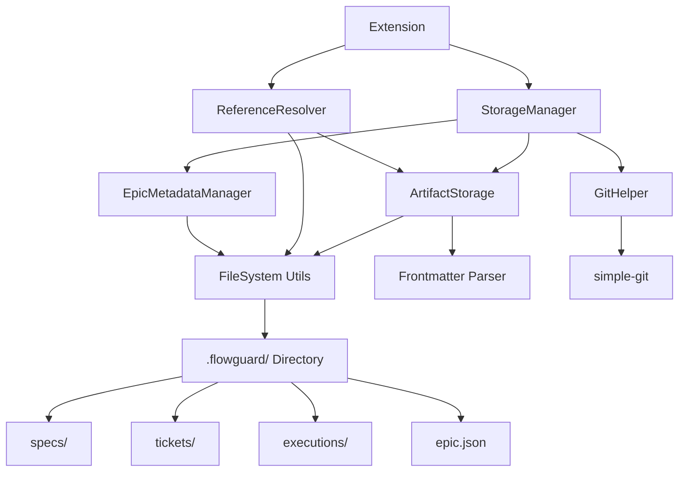

I have created the following plan after thorough exploration and analysis of the codebase. Follow the below plan verbatim. Trust the files and references. Do not re-verify what's written in the plan. Explore only when absolutely necessary. First implement all the proposed file changes and then I'll review all the changes together at the end.

## Observations

The foundation phase has established core TypeScript models (Epic, Spec, Ticket, Execution) with frontmatter parsing using `gray-matter`. Models separate metadata (frontmatter) from markdown content. Directory structure exists (`src/storage/`, `src/core/`) but no storage layer, reference resolution, or Git integration is implemented. The `simple-git` dependency needs to be added for version control operations.

## Approach

Implement a local-first storage system centered around the `.flowguard/` directory structure with separate subdirectories for each artifact type. Build a reference resolver to handle cross-artifact linking using URI-style references. Integrate Git operations for version control tracking. Create an `epic.json` metadata file to maintain epic-level configuration and artifact registry. This approach ensures file-based persistence, easy version control, and human-readable artifact storage.

## Implementation Steps

### 1. Add Dependencies

Update `file:package.json` to include:
- `simple-git` (^3.19.0) for Git operations
- Ensure `@types/node` includes file system types

Run `npm install simple-git` after updating package.json.

### 2. Create Storage Infrastructure

#### 2.1 Directory Structure Constants

Create `file:src/core/storage/constants.ts`:
- Define `.flowguard/` as root directory constant
- Define subdirectory paths: `specs/`, `tickets/`, `executions/`, `verifications/`
- Define file naming patterns: `spec-{uuid}.md`, `ticket-{uuid}.md`, `execution-{uuid}.md`
- Define `epic.json` filename constant

#### 2.2 Base Storage Interface

Create `file:src/core/storage/types.ts`:
- Define `StorageResult<T>` type for success/error handling
- Define `ArtifactMetadata` interface with id, path, createdAt, updatedAt
- Define `StorageOptions` interface for read/write configuration
- Define error types: `StorageError`, `NotFoundError`, `ValidationError`

#### 2.3 File System Utilities

Create `file:src/core/storage/fileSystem.ts`:
- Implement `ensureDirectory(path: string): Promise<void>` to create directories recursively
- Implement `fileExists(path: string): Promise<boolean>` to check file existence
- Implement `readFile(path: string): Promise<string>` with error handling
- Implement `writeFile(path: string, content: string): Promise<void>` with atomic writes
- Implement `deleteFile(path: string): Promise<void>` with existence check
- Implement `listFiles(directory: string, pattern?: RegExp): Promise<string[]>` for directory scanning
- Use Node.js `fs/promises` API for all operations

### 3. Implement ArtifactStorage Class

Create `file:src/core/storage/ArtifactStorage.ts`:

#### 3.1 Core Structure
- Class with constructor accepting `workspaceRoot: string`
- Private property `flowguardRoot` computed as `${workspaceRoot}/.flowguard`
- Method `initialize(): Promise<void>` to create `.flowguard/` directory structure

#### 3.2 Spec Operations
- `saveSpec(spec: Spec): Promise<void>` - serialize frontmatter + content, write to `specs/spec-{id}.md`
- `loadSpec(id: string): Promise<Spec>` - read file, parse frontmatter, validate, return Spec object
- `listSpecs(epicId?: string): Promise<Spec[]>` - scan specs directory, optionally filter by epicId
- `deleteSpec(id: string): Promise<void>` - remove spec file

#### 3.3 Ticket Operations
- `saveTicket(ticket: Ticket): Promise<void>` - serialize to `tickets/ticket-{id}.md`
- `loadTicket(id: string): Promise<Ticket>` - read and parse ticket file
- `listTickets(epicId?: string, specId?: string): Promise<Ticket[]>` - scan with optional filters
- `deleteTicket(id: string): Promise<void>` - remove ticket file

#### 3.4 Execution Operations
- `saveExecution(execution: Execution): Promise<void>` - serialize to `executions/execution-{id}.md`
- `loadExecution(id: string): Promise<Execution>` - read and parse execution file
- `listExecutions(epicId?: string): Promise<Execution[]>` - scan executions directory
- `deleteExecution(id: string): Promise<void>` - remove execution file

#### 3.5 Helper Methods
- `getArtifactPath(type: 'spec' | 'ticket' | 'execution', id: string): string` - construct file path
- `serializeArtifact<T>(artifact: T, content: string): string` - use frontmatter serializer
- `deserializeArtifact<T>(markdown: string, type: string): T` - use frontmatter parser with validation

### 4. Build Reference Resolution System

Create `file:src/core/references/ReferenceResolver.ts`:

#### 4.1 Reference Types
- Define `Reference` interface with `type: 'spec' | 'ticket' | 'file' | 'execution'`, `id: string`, `label?: string`
- Define `ResolvedReference` interface extending Reference with `path: string`, `exists: boolean`, `title?: string`

#### 4.2 Reference Parsing
- `parseReference(ref: string): Reference | null` - parse formats:
  - `spec:uuid` or `spec:uuid#section`
  - `ticket:uuid`
  - `file:relative/path/to/file.ts`
  - `execution:uuid`
- Use regex patterns to extract type, id, and optional fragments

#### 4.3 Reference Resolution
- `resolveReference(ref: Reference, storage: ArtifactStorage): Promise<ResolvedReference>` - resolve reference to actual artifact
  - For `spec:` - load spec, get title, check existence
  - For `ticket:` - load ticket, get title, check existence
  - For `file:` - resolve relative to workspace root, check file existence
  - For `execution:` - load execution, check existence
- `resolveReferences(content: string, storage: ArtifactStorage): Promise<Map<string, ResolvedReference>>` - find all references in markdown content

#### 4.4 Reference Extraction
- `extractReferences(content: string): Reference[]` - scan markdown for all reference patterns
- Use regex to find all `spec:`, `ticket:`, `file:`, `execution:` references
- Return array of parsed Reference objects

#### 4.5 Reference Validation
- `validateReferences(content: string, storage: ArtifactStorage): Promise<{ valid: Reference[], invalid: Reference[] }>` - check if all references resolve
- Useful for detecting broken links before saving

### 5. Git Integration Helpers

Create `file:src/core/git/GitHelper.ts`:

#### 5.1 Git Client Setup
- Class with constructor accepting `workspaceRoot: string`
- Initialize `simple-git` instance with workspace root
- Method `isGitRepository(): Promise<boolean>` to check if workspace is a Git repo

#### 5.2 Git Operations
- `initRepository(): Promise<void>` - initialize Git repo if not exists
- `stageFiles(paths: string[]): Promise<void>` - stage specific files using `git.add()`
- `commit(message: string): Promise<void>` - commit staged changes
- `getCurrentBranch(): Promise<string>` - get current branch name
- `getStatus(): Promise<StatusResult>` - get working directory status
- `getDiff(filePath?: string): Promise<string>` - get diff for file or entire repo

#### 5.3 FlowGuard-Specific Operations
- `stageFlowGuardArtifact(artifactPath: string): Promise<void>` - stage artifact file relative to `.flowguard/`
- `commitArtifact(type: string, id: string, action: 'create' | 'update' | 'delete'): Promise<void>` - commit with standardized message format: `flowguard: {action} {type} {id}`
- `getArtifactHistory(artifactPath: string): Promise<LogResult>` - get commit history for specific artifact

#### 5.4 Error Handling
- Wrap all Git operations in try-catch
- Return meaningful errors for non-Git repositories
- Handle merge conflicts and detached HEAD states gracefully

### 6. Epic Metadata Management

Create `file:src/core/storage/EpicMetadataManager.ts`:

#### 6.1 Epic.json Structure
Define JSON schema:
```typescript
{
  epicId: string;
  title: string;
  version: string;
  createdAt: string;
  updatedAt: string;
  artifacts: {
    specs: string[];      // Array of spec IDs
    tickets: string[];    // Array of ticket IDs
    executions: string[]; // Array of execution IDs
  };
  settings: {
    defaultAgent?: AgentType;
    autoCommit?: boolean;
    templatePreferences?: Record<string, any>;
  };
}
```

#### 6.2 Metadata Operations
- `loadEpicMetadata(): Promise<EpicMetadata>` - read and parse `epic.json`
- `saveEpicMetadata(metadata: EpicMetadata): Promise<void>` - write `epic.json` with formatting
- `updateEpicMetadata(updates: Partial<EpicMetadata>): Promise<void>` - merge updates with existing metadata
- `registerArtifact(type: 'spec' | 'ticket' | 'execution', id: string): Promise<void>` - add artifact ID to registry
- `unregisterArtifact(type: 'spec' | 'ticket' | 'execution', id: string): Promise<void>` - remove artifact ID from registry

#### 6.3 Initialization
- `initializeEpic(epic: Epic): Promise<void>` - create initial `epic.json` from Epic object
- Set version to "1.0.0"
- Initialize empty artifact arrays
- Set default settings

#### 6.4 Validation
- `validateMetadata(metadata: unknown): EpicMetadata` - validate JSON structure
- Check required fields exist
- Validate artifact ID formats (UUID v4)
- Ensure timestamps are valid ISO 8601 strings

### 7. Integration Layer

Create `file:src/core/storage/index.ts`:

#### 7.1 Unified Storage Manager
- Export `StorageManager` class that combines:
  - `ArtifactStorage` instance
  - `EpicMetadataManager` instance
  - `GitHelper` instance
- Constructor accepts `workspaceRoot: string`

#### 7.2 High-Level Operations
- `createSpec(spec: Spec, autoCommit: boolean = true): Promise<void>` - save spec, register in epic.json, optionally commit
- `createTicket(ticket: Ticket, autoCommit: boolean = true): Promise<void>` - save ticket, register, optionally commit
- `createExecution(execution: Execution, autoCommit: boolean = true): Promise<void>` - save execution, register, optionally commit
- `updateSpec(spec: Spec, autoCommit: boolean = true): Promise<void>` - update spec file, update epic.json timestamp, optionally commit
- `deleteSpec(id: string, autoCommit: boolean = true): Promise<void>` - delete spec, unregister, optionally commit

#### 7.3 Batch Operations
- `loadAllArtifacts(epicId: string): Promise<{ specs: Spec[], tickets: Ticket[], executions: Execution[] }>` - load all artifacts for an epic
- `exportEpic(epicId: string, outputPath: string): Promise<void>` - bundle all artifacts into single directory

### 8. Error Handling & Logging

Create `file:src/core/storage/errors.ts`:

#### 8.1 Custom Error Classes
- `StorageError` - base class for storage errors
- `NotFoundError extends StorageError` - artifact not found
- `ValidationError extends StorageError` - invalid artifact data
- `GitError extends StorageError` - Git operation failed
- `FileSystemError extends StorageError` - file system operation failed

#### 8.2 Error Context
- Include artifact type, ID, and operation in error messages
- Add stack traces for debugging
- Log errors using existing `file:src/utils/logger.ts`

### 9. Testing Considerations

While testing is a subsequent phase, structure code for testability:
- Use dependency injection for file system operations
- Make Git operations mockable
- Separate pure functions from I/O operations
- Add JSDoc comments for all public methods

## Architecture Diagram



## File Structure

```
src/
├── core/
│   ├── storage/
│   │   ├── constants.ts          # Directory and file naming constants
│   │   ├── types.ts               # Storage interfaces and types
│   │   ├── fileSystem.ts          # Low-level file operations
│   │   ├── ArtifactStorage.ts     # CRUD for specs/tickets/executions
│   │   ├── EpicMetadataManager.ts # epic.json management
│   │   ├── errors.ts              # Custom error classes
│   │   └── index.ts               # StorageManager unified API
│   ├── references/
│   │   ├── ReferenceResolver.ts   # Reference parsing and resolution
│   │   └── index.ts               # Exports
│   └── git/
│       ├── GitHelper.ts           # Git integration using simple-git
│       └── index.ts               # Exports
```

## Key Design Decisions

1. **Atomic Writes**: Use temporary files and rename operations to ensure data integrity
2. **Lazy Loading**: Load artifacts on-demand rather than caching entire epic in memory
3. **Reference Format**: URI-style references (`type:id`) for consistency and parseability
4. **Git Integration**: Optional auto-commit with standardized commit messages for traceability
5. **Epic.json Registry**: Central artifact registry for quick lookups without scanning directories
6. **Error Propagation**: Use custom error classes with context for better debugging