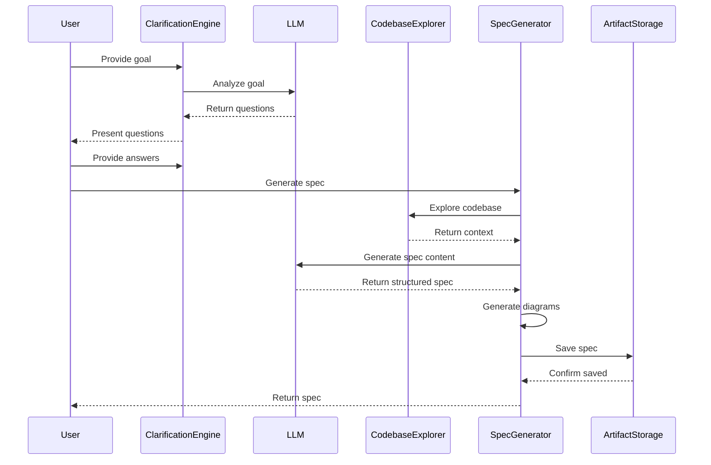

I have created the following plan after thorough exploration and analysis of the codebase. Follow the below plan verbatim. Trust the files and references. Do not re-verify what's written in the plan. Explore only when absolutely necessary. First implement all the proposed file changes and then I'll review all the changes together at the end.

## Observations

The codebase has a solid foundation with core models (`Epic`, `Spec`, `Ticket`, `Execution`, `Verification`), storage layer (`ArtifactStorage`), and reference resolution system. The `src/planning/` directory exists but is empty. No LLM integration exists yet—dependencies need to be added for OpenAI, Anthropic, and code analysis tools (TypeScript Compiler API is built-in, but Tree-sitter needs installation). The project uses strict TypeScript with frontmatter-based markdown storage.

## Approach

The implementation follows a bottom-up approach: first establish LLM provider infrastructure with a unified interface supporting multiple providers (OpenAI, Anthropic, local models), then build codebase analysis capabilities using TypeScript Compiler API and Tree-sitter for multi-language support. Finally, implement the planning workflow components (`ClarificationEngine`, `CodebaseExplorer`, `SpecGenerator`) that orchestrate LLM calls and codebase analysis to generate structured specs with Mermaid diagrams. This layered approach ensures each component can be tested independently.

## Implementation Steps

### 1. Install Required Dependencies

Add the following packages to `file:package.json`:

**Dependencies:**
- `openai` (^4.0.0) - OpenAI API client
- `@anthropic-ai/sdk` (^0.20.0) - Anthropic Claude API client
- `tree-sitter` (^0.21.0) - Multi-language parser
- `tree-sitter-typescript` (^0.21.0) - TypeScript grammar for Tree-sitter
- `tree-sitter-javascript` (^0.21.0) - JavaScript grammar
- `tree-sitter-python` (^0.21.0) - Python grammar (optional, for multi-language support)

**Dev Dependencies:**
- `@types/tree-sitter` (^0.21.0)

Run `npm install` after updating package.json.

---

### 2. Create LLM Provider Abstraction Layer

**File: `file:src/llm/types.ts`**

Define core types and interfaces:
- `LLMProvider` interface with methods: `generateText(prompt, options)`, `generateStructured(prompt, schema, options)`, `streamText(prompt, options)`
- `LLMMessage` type with `role` ('system' | 'user' | 'assistant') and `content`
- `LLMOptions` interface with `temperature`, `maxTokens`, `stopSequences`, `model`
- `LLMResponse` interface with `text`, `usage` (tokens), `finishReason`
- `LLMProviderConfig` interface with `apiKey`, `baseUrl`, `model`, `timeout`

**File: `file:src/llm/BaseProvider.ts`**

Create abstract base class implementing common functionality:
- Abstract `BaseProvider` class implementing `LLMProvider`
- Protected `config: LLMProviderConfig` property
- Protected `validateConfig()` method to check API key presence
- Protected `handleError(error)` method for unified error handling
- Protected `retryWithBackoff(fn, maxRetries)` method for retry logic (exponential backoff: 1s, 2s, 4s)
- Abstract methods: `generateText()`, `generateStructured()`, `streamText()`

**File: `file:src/llm/providers/OpenAIProvider.ts`**

Implement OpenAI provider:
- Import `OpenAI` from `openai` package
- Extend `BaseProvider` class
- Initialize OpenAI client in constructor with API key from config
- Implement `generateText()`: convert messages to OpenAI format, call `client.chat.completions.create()`, return formatted response
- Implement `generateStructured()`: use `response_format: { type: "json_object" }`, parse JSON response, validate against schema
- Implement `streamText()`: use `client.chat.completions.create({ stream: true })`, yield chunks as async generator
- Default model: `gpt-4-turbo-preview`
- Handle rate limits (429) and API errors with retry logic

**File: `file:src/llm/providers/AnthropicProvider.ts`**

Implement Anthropic provider:
- Import `Anthropic` from `@anthropic-ai/sdk` package
- Extend `BaseProvider` class
- Initialize Anthropic client in constructor with API key from config
- Implement `generateText()`: convert messages (extract system message separately), call `client.messages.create()`, return formatted response
- Implement `generateStructured()`: use prompt engineering to request JSON format, parse response, validate against schema
- Implement `streamText()`: use `client.messages.stream()`, yield text deltas as async generator
- Default model: `claude-3-5-sonnet-20241022`
- Handle Anthropic-specific errors (overloaded, invalid request)

**File: `file:src/llm/providers/LocalLLMProvider.ts`**

Implement local LLM provider (OpenAI-compatible API):
- Extend `BaseProvider` class
- Use OpenAI client with custom `baseUrl` (e.g., `http://localhost:1234/v1` for LM Studio)
- Implement same methods as `OpenAIProvider` but with local endpoint
- Support models like `llama-3`, `mistral`, `codellama`
- Add connection check in constructor to verify local server availability
- Provide helpful error messages if local server is unreachable

**File: `file:src/llm/ProviderFactory.ts`**

Create factory for provider instantiation:
- `createProvider(type: 'openai' | 'anthropic' | 'local', config: LLMProviderConfig): LLMProvider`
- Read configuration from VS Code settings or environment variables
- Validate API keys before creating provider
- Throw descriptive errors if configuration is missing
- Cache provider instances to avoid recreating clients

**File: `file:src/llm/index.ts`**

Export all LLM types and providers:
- Export all types from `types.ts`
- Export `BaseProvider`
- Export all provider implementations
- Export `createProvider` factory function

---

### 3. Create Configuration Management for LLM Settings

**File: `file:src/llm/config.ts`**

Implement configuration loader:
- `getLLMConfig(): LLMProviderConfig` function
- Read from VS Code workspace configuration: `vscode.workspace.getConfiguration('flowguard.llm')`
- Support settings: `provider` ('openai' | 'anthropic' | 'local'), `apiKey`, `model`, `baseUrl` (for local), `temperature`, `maxTokens`
- Fall back to environment variables: `OPENAI_API_KEY`, `ANTHROPIC_API_KEY`, `FLOWGUARD_LLM_PROVIDER`
- Validate configuration completeness
- Return default config if none specified (OpenAI with gpt-4-turbo-preview)

**Update `file:package.json`:**

Add configuration contribution point:
```json
"contributes": {
  "configuration": {
    "title": "FlowGuard",
    "properties": {
      "flowguard.llm.provider": {
        "type": "string",
        "enum": ["openai", "anthropic", "local"],
        "default": "openai",
        "description": "LLM provider to use"
      },
      "flowguard.llm.model": {
        "type": "string",
        "description": "Model name (e.g., gpt-4-turbo-preview, claude-3-5-sonnet-20241022)"
      },
      "flowguard.llm.temperature": {
        "type": "number",
        "default": 0.7,
        "minimum": 0,
        "maximum": 2,
        "description": "Temperature for LLM generation"
      },
      "flowguard.llm.baseUrl": {
        "type": "string",
        "description": "Base URL for local LLM provider"
      }
    }
  }
}
```

Store API keys securely using VS Code's `SecretStorage` API (accessed via `context.secrets`).

---

### 4. Implement ClarificationEngine

**File: `file:src/planning/ClarificationEngine.ts`**

Create clarification question generator:
- `ClarificationEngine` class with constructor accepting `LLMProvider`
- `analyzeGoal(userGoal: string): Promise<string[]>` method
  - Construct system prompt: "You are a technical analyst helping to clarify software development requirements. Generate 2-3 targeted questions to understand the user's goal better. Focus on: scope, technical constraints, success criteria, and integration points."
  - Construct user prompt with the goal: `Analyze this development goal and generate clarifying questions: ${userGoal}`
  - Call `provider.generateStructured()` with JSON schema: `{ questions: string[] }`
  - Parse response and extract questions array
  - Validate: ensure 2-3 questions, each is a complete sentence
  - Return questions array
- `parseResponses(questions: string[], responses: string[]): ClarificationContext` method
  - Combine questions and responses into structured context
  - Return object with `goal`, `clarifications` (question-answer pairs), `extractedRequirements`
- `ClarificationContext` interface with `goal: string`, `clarifications: Array<{question: string, answer: string}>`, `extractedRequirements: string[]`

**Error Handling:**
- Catch LLM errors and provide fallback generic questions
- Validate response structure before returning
- Log errors using `file:src/utils/logger.ts`

---

### 5. Implement CodebaseExplorer

**File: `file:src/planning/codebase/types.ts`**

Define codebase analysis types:
- `CodeSymbol` interface: `name`, `kind` ('class' | 'function' | 'interface' | 'variable' | 'type'), `filePath`, `line`, `documentation`, `signature`
- `FileSummary` interface: `path`, `language`, `symbols: CodeSymbol[]`, `imports: string[]`, `exports: string[]`, `loc: number`
- `DependencyGraph` interface: `nodes: DependencyNode[]`, `edges: DependencyEdge[]`
- `DependencyNode` interface: `id`, `type` ('file' | 'module' | 'symbol'), `label`, `metadata`
- `DependencyEdge` interface: `from`, `to`, `type` ('imports' | 'calls' | 'extends' | 'implements')`
- `CodebaseContext` interface: `files: FileSummary[]`, `symbols: CodeSymbol[]`, `dependencies: DependencyGraph`, `statistics: CodebaseStats`
- `CodebaseStats` interface: `totalFiles`, `totalLines`, `languageBreakdown: Record<string, number>`, `topSymbols: CodeSymbol[]`

**File: `file:src/planning/codebase/FileScanner.ts`**

Implement workspace file scanner:
- `FileScanner` class with constructor accepting `workspaceRoot: string`
- `scanWorkspace(options?: ScanOptions): Promise<string[]>` method
  - Use `vscode.workspace.findFiles()` to discover files
  - Default include patterns: `**/*.{ts,tsx,js,jsx,py,java,go,rs}`
  - Default exclude patterns: `**/node_modules/**`, `**/dist/**`, `**/out/**`, `**/.git/**`, `**/.flowguard/**`
  - Support custom include/exclude patterns via options
  - Return array of absolute file paths
- `ScanOptions` interface: `include?: string[]`, `exclude?: string[]`, `maxFiles?: number`
- Add progress reporting using `vscode.window.withProgress()`

**File: `file:src/planning/codebase/TypeScriptAnalyzer.ts`**

Implement TypeScript/JavaScript analysis using TS Compiler API:
- `TypeScriptAnalyzer` class
- `analyzeFile(filePath: string): Promise<FileSummary>` method
  - Read file content using `file:src/core/storage/fileSystem.ts`
  - Create TypeScript `SourceFile` using `ts.createSourceFile()`
  - Walk AST using `ts.forEachChild()` to extract:
    - Classes: name, methods, properties, decorators
    - Functions: name, parameters, return type
    - Interfaces: name, properties, extends
    - Type aliases: name, definition
    - Variables: name, type, const/let/var
  - Extract imports using `ts.SyntaxKind.ImportDeclaration`
  - Extract exports using `ts.SyntaxKind.ExportDeclaration`
  - Count lines of code (exclude comments and blank lines)
  - Return `FileSummary` with all extracted data
- `extractDocumentation(node: ts.Node): string` helper
  - Extract JSDoc comments using `ts.getJSDocCommentsAndTags()`
  - Format as markdown
- Handle TypeScript-specific features: generics, decorators, namespaces

**File: `file:src/planning/codebase/TreeSitterAnalyzer.ts`**

Implement multi-language analysis using Tree-sitter:
- `TreeSitterAnalyzer` class
- Initialize Tree-sitter parsers in constructor:
  - TypeScript: `Parser.Language.load('tree-sitter-typescript/typescript')`
  - JavaScript: `Parser.Language.load('tree-sitter-javascript')`
  - Python: `Parser.Language.load('tree-sitter-python')`
- `analyzeFile(filePath: string, language: string): Promise<FileSummary>` method
  - Read file content
  - Select parser based on language
  - Parse file: `parser.parse(content)`
  - Query AST for symbols using Tree-sitter queries:
    - Functions: `(function_declaration name: (identifier) @name)`
    - Classes: `(class_declaration name: (identifier) @name)`
    - Imports: `(import_statement) @import`
  - Extract symbol names, positions, and basic metadata
  - Return `FileSummary`
- Support fallback to regex-based extraction if Tree-sitter fails
- Language detection based on file extension

**File: `file:src/planning/codebase/DependencyGraphBuilder.ts`**

Build dependency graph from file summaries:
- `DependencyGraphBuilder` class
- `buildGraph(files: FileSummary[]): DependencyGraph` method
  - Create nodes for each file
  - Create nodes for each exported symbol
  - Create edges for imports (file → file)
  - Create edges for symbol usage (symbol → symbol)
  - Detect circular dependencies
  - Calculate dependency depth for each node
  - Return `DependencyGraph`
- `detectCircularDependencies(graph: DependencyGraph): string[][]` method
  - Use depth-first search to find cycles
  - Return array of circular dependency chains
- `getTopLevelModules(graph: DependencyGraph): DependencyNode[]` method
  - Find nodes with no incoming edges (entry points)

**File: `file:src/planning/codebase/CodebaseExplorer.ts`**

Main orchestrator for codebase analysis:
- `CodebaseExplorer` class with constructor accepting `workspaceRoot: string`
- Initialize `FileScanner`, `TypeScriptAnalyzer`, `TreeSitterAnalyzer`, `DependencyGraphBuilder`
- `explore(options?: ExploreOptions): Promise<CodebaseContext>` method
  - Scan workspace for files using `FileScanner`
  - Analyze each file:
    - Use `TypeScriptAnalyzer` for .ts/.tsx/.js/.jsx files
    - Use `TreeSitterAnalyzer` for other languages
  - Build dependency graph using `DependencyGraphBuilder`
  - Calculate statistics: total files, total LOC, language breakdown
  - Identify top symbols (most referenced, most complex)
  - Return `CodebaseContext`
- `ExploreOptions` interface: `include?: string[]`, `exclude?: string[]`, `maxFiles?: number`, `includeTests?: boolean`
- Add caching mechanism to avoid re-analyzing unchanged files (use file mtime)
- Progress reporting: "Analyzing codebase... (X/Y files)"

**File: `file:src/planning/codebase/index.ts`**

Export all codebase analysis components:
- Export all types from `types.ts`
- Export `CodebaseExplorer` as main entry point
- Export individual analyzers for advanced usage

---

### 6. Implement Mermaid Diagram Generation

**File: `file:src/planning/diagrams/MermaidGenerator.ts`**

Create Mermaid diagram generation utilities:
- `MermaidGenerator` class
- `generateArchitectureDiagram(components: Component[], relationships: Relationship[]): string` method
  - Generate `graph TD` Mermaid syntax
  - Create nodes for each component: `A[Component Name]`
  - Create edges for relationships: `A --> B`
  - Support styling: `classDef` for different component types
  - Return Mermaid string
- `generateSequenceDiagram(interactions: Interaction[]): string` method
  - Generate `sequenceDiagram` Mermaid syntax
  - Define participants
  - Add interactions: `A->>B: Message`
  - Support notes, loops, alternatives
  - Return Mermaid string
- `generateFlowDiagram(steps: FlowStep[]): string` method
  - Generate `flowchart TD` Mermaid syntax
  - Create nodes for each step
  - Support decision nodes (diamond shape)
  - Add conditional branches
  - Return Mermaid string
- `generateClassDiagram(classes: ClassInfo[]): string` method
  - Generate `classDiagram` Mermaid syntax
  - Define classes with properties and methods
  - Add relationships: inheritance, composition, association
  - Return Mermaid string
- Helper types: `Component`, `Relationship`, `Interaction`, `FlowStep`, `ClassInfo`

**File: `file:src/planning/diagrams/DiagramExtractor.ts`**

Extract diagram data from codebase context:
- `DiagramExtractor` class
- `extractArchitectureDiagram(context: CodebaseContext): { components: Component[], relationships: Relationship[] }` method
  - Identify major components from top-level modules
  - Extract relationships from dependency graph
  - Group related files into logical components
  - Return structured data for diagram generation
- `extractSequenceDiagram(context: CodebaseContext, entryPoint: string): Interaction[]` method
  - Trace function calls from entry point
  - Build interaction sequence
  - Limit depth to avoid overwhelming diagrams (max 5 levels)
  - Return interaction sequence
- `extractClassDiagram(context: CodebaseContext, namespace?: string): ClassInfo[]` method
  - Extract class definitions from symbols
  - Include properties, methods, relationships
  - Filter by namespace if provided
  - Return class information

**File: `file:src/planning/diagrams/index.ts`**

Export diagram generation components:
- Export `MermaidGenerator`
- Export `DiagramExtractor`
- Export helper types

---

### 7. Implement SpecGenerator

**File: `file:src/planning/SpecGenerator.ts`**

Create specification document generator:
- `SpecGenerator` class with constructor accepting `LLMProvider`, `CodebaseExplorer`
- `generateSpec(input: SpecGenerationInput): Promise<Spec>` method
  - Extract codebase context using `CodebaseExplorer.explore()`
  - Generate architecture diagram using `DiagramExtractor` and `MermaidGenerator`
  - Construct LLM prompt with:
    - System message: "You are a technical architect creating detailed software specifications. Generate comprehensive specs with clear requirements, architecture decisions, and implementation guidance."
    - User goal and clarifications from `ClarificationEngine`
    - Codebase context summary (file structure, key symbols, dependencies)
    - Request structured output: Overview, Architecture, Requirements, NFRs, Technical Plan
  - Call `provider.generateText()` with prompt
  - Parse LLM response into structured sections
  - Generate additional diagrams if needed (sequence, flow)
  - Create `Spec` object with:
    - `id`: generated UUID
    - `epicId`: from input
    - `title`: extracted from LLM response or user goal
    - `status`: 'draft'
    - `author`: from VS Code user settings or Git config
    - `tags`: extracted from content or provided in input
    - `content`: formatted markdown with sections
    - `createdAt`, `updatedAt`: current timestamp
  - Save spec using `ArtifactStorage.saveSpec()`
  - Return created `Spec`
- `SpecGenerationInput` interface: `epicId: string`, `goal: string`, `clarifications?: ClarificationContext`, `tags?: string[]`, `includeCodebaseContext?: boolean`

**Markdown Content Structure:**
```markdown
## Overview
[LLM-generated overview of the feature/change]

## Architecture
[Architecture diagram in Mermaid]
[Architecture decisions and rationale]

## Requirements
### Functional Requirements
- [Requirement 1]
- [Requirement 2]

### Non-Functional Requirements
- **Performance**: [Criteria]
- **Security**: [Criteria]
- **Reliability**: [Criteria]

## Technical Plan
### Files to Change
- `file:path/to/file.ts` - [Description]

### Dependencies
- [Dependency 1]: [Purpose]

### Edge Cases
- [Edge case 1]: [Handling approach]

## Testing Strategy
- **Unit Tests**: [Approach]
- **Integration Tests**: [Approach]
- **E2E Tests**: [Approach]
```

**Error Handling:**
- Validate LLM response structure
- Provide fallback sections if LLM fails
- Log generation errors
- Allow partial spec creation if some sections fail

**File: `file:src/planning/SpecGenerator.test.ts`** (optional, for future testing phase)

Add unit tests:
- Mock LLM provider responses
- Test spec generation with various inputs
- Validate markdown structure
- Test error handling

---

### 8. Create Planning Module Entry Point

**File: `file:src/planning/index.ts`**

Export all planning components:
- Export `ClarificationEngine`
- Export `CodebaseExplorer` and codebase types
- Export `SpecGenerator`
- Export diagram generation utilities
- Export all planning-related types

---

### 9. Update Extension Activation

**Update `file:src/extension.ts`:**

Initialize planning components on activation:
- Import `ArtifactStorage`, `createProvider`, `SpecGenerator`, `ClarificationEngine`, `CodebaseExplorer`
- In `activate()` function:
  - Get workspace root: `vscode.workspace.workspaceFolders?.[0]?.uri.fsPath`
  - Initialize `ArtifactStorage` with workspace root
  - Call `storage.initialize()`
  - Create LLM provider using `createProvider()` with config from `getLLMConfig()`
  - Initialize `ClarificationEngine` with provider
  - Initialize `CodebaseExplorer` with workspace root
  - Initialize `SpecGenerator` with provider and explorer
  - Store instances in extension context for later use
- Add error handling for missing workspace or configuration
- Log initialization status

**Example:**
```typescript
export function activate(context: vscode.ExtensionContext): void {
  const workspaceRoot = vscode.workspace.workspaceFolders?.[0]?.uri.fsPath;
  if (!workspaceRoot) {
    vscode.window.showErrorMessage('FlowGuard requires an open workspace');
    return;
  }

  const storage = new ArtifactStorage(workspaceRoot);
  await storage.initialize();

  const llmConfig = getLLMConfig();
  const provider = createProvider(llmConfig.provider, llmConfig);

  const clarificationEngine = new ClarificationEngine(provider);
  const codebaseExplorer = new CodebaseExplorer(workspaceRoot);
  const specGenerator = new SpecGenerator(provider, codebaseExplorer);

  // Store in context for command handlers
  context.workspaceState.update('storage', storage);
  context.workspaceState.update('specGenerator', specGenerator);
  context.workspaceState.update('clarificationEngine', clarificationEngine);
}
```

---

### 10. Add Logging and Error Handling

**Update `file:src/utils/logger.ts`:**

Enhance logging for planning operations:
- Add `logLLMRequest(provider: string, prompt: string)` function
- Add `logLLMResponse(provider: string, response: string, tokens: number)` function
- Add `logCodebaseAnalysis(filesAnalyzed: number, duration: number)` function
- Add `logSpecGeneration(specId: string, duration: number)` function
- Support log levels: DEBUG, INFO, WARN, ERROR
- Write logs to output channel: `vscode.window.createOutputChannel('FlowGuard')`

**Error Handling Strategy:**
- Wrap all LLM calls in try-catch blocks
- Provide user-friendly error messages for common failures:
  - Missing API key: "Please configure your LLM API key in settings"
  - Rate limit: "Rate limit exceeded. Please try again in a moment"
  - Network error: "Failed to connect to LLM provider. Check your internet connection"
- Log detailed errors to output channel for debugging
- Allow graceful degradation (e.g., skip diagram generation if it fails)

---

### 11. Documentation

**Create `file:src/planning/README.md`:**

Document the planning module:
- Overview of planning workflow (Query → Clarification → Spec)
- Architecture diagram showing component relationships
- Usage examples for each component
- Configuration guide for LLM providers
- Troubleshooting common issues
- API reference for public methods

**Update `file:README.md`:**

Add section on planning features:
- How to configure LLM providers
- How to generate specs from user goals
- Supported languages for codebase analysis
- Diagram generation capabilities

---

## Architecture Diagram



---

## Testing Checklist

After implementation, verify:
- [ ] LLM providers can be instantiated with valid API keys
- [ ] ClarificationEngine generates 2-3 relevant questions
- [ ] CodebaseExplorer scans workspace and extracts symbols
- [ ] TypeScript files are analyzed correctly with TS Compiler API
- [ ] Dependency graph is built from file summaries
- [ ] Mermaid diagrams are generated in valid syntax
- [ ] SpecGenerator creates specs with all required sections
- [ ] Specs are saved to `.flowguard/specs/` directory
- [ ] Error handling works for missing API keys, network failures
- [ ] Configuration can be loaded from VS Code settings
- [ ] Logging outputs to FlowGuard output channel