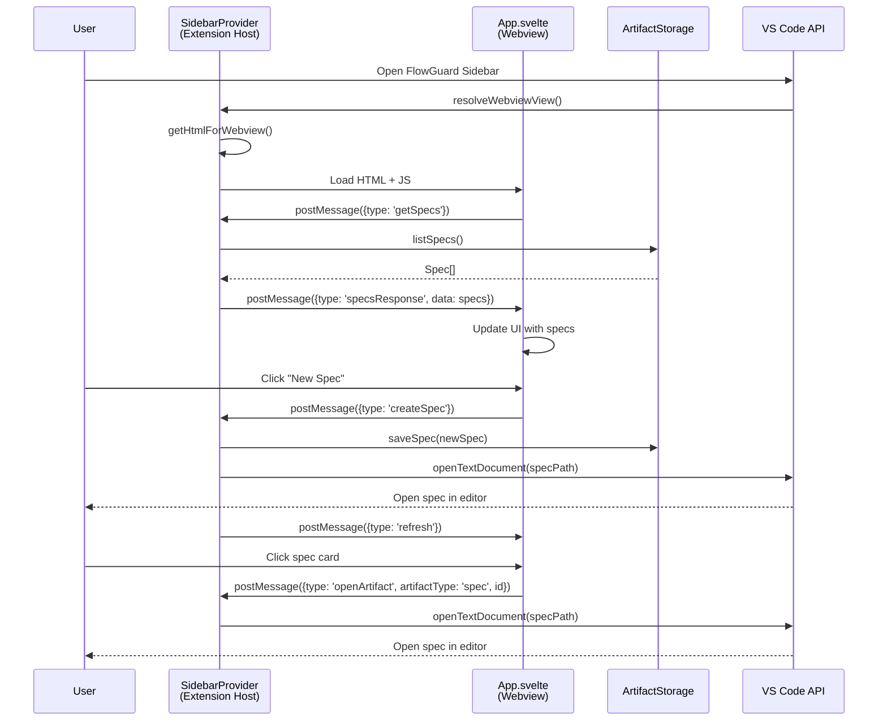

I have created the following plan after thorough exploration and analysis of the codebase. Follow the below plan verbatim. Trust the files and references. Do not re-verify what's written in the plan. Explore only when absolutely necessary. First implement all the proposed file changes and then I'll review all the changes together at the end.

## Observations

The codebase has a solid foundation with core models (`Spec`, `Ticket`, `Execution`), storage layer (`ArtifactStorage`), and planning/verification engines already implemented. The `src/ui/` directory is empty (only `.gitkeep`), indicating no UI components exist yet. The current webpack configuration only builds the extension code, not webview assets. The extension uses VS Code APIs for configuration, progress notifications, and clipboard operations, providing good patterns to follow.

## Approach

We'll build a Svelte-based sidebar webview using VS Code's `WebviewViewProvider` API. Svelte is chosen for its small bundle size, compile-time optimization, and minimal boilerplate—ideal for extension performance. The architecture will use message passing between the extension host (TypeScript) and webview (Svelte) for data synchronization. We'll create a separate webpack configuration for the webview bundle, implement proper Content Security Policy, and integrate with the existing `ArtifactStorage` API to fetch and display specs, tickets, and executions with status badges and metadata.

## Implementation Steps

### 1. Install Dependencies and Configure Build System

**Install Svelte and webview dependencies:**
- Add to `package.json` dependencies: `svelte@^4.0.0`
- Add to devDependencies: `svelte-loader@^3.1.0`, `svelte-preprocess@^5.0.0`, `css-loader@^6.0.0`, `style-loader@^3.0.0`, `html-webpack-plugin@^5.0.0`
- Run `npm install` to install packages

**Create webview webpack configuration:**
- Create `file:webpack.webview.config.js` in project root
- Configure entry point as `src/ui/sidebar/webview/main.ts`
- Set output to `out/webview/sidebar.js`
- Add Svelte loader rules for `.svelte` files
- Add CSS loader for styling
- Configure `HtmlWebpackPlugin` to generate `sidebar.html` with proper CSP meta tags
- Set target to `web` (not `node` like extension config)
- Enable source maps for debugging

**Update main webpack config:**
- Modify `file:webpack.config.js` to exclude `src/ui/` from extension build
- Keep existing configuration for extension code

**Update package.json scripts:**
- Modify `compile` script to run both webpack configs: `webpack --config webpack.config.js --mode production && webpack --config webpack.webview.config.js --mode production`
- Modify `watch` script similarly for development mode
- Update `package` script to build both bundles before packaging

### 2. Register Sidebar View in package.json

**Add view container contribution:**
- In `package.json` under `contributes`, add `viewsContainers` section
- Define `activitybar` container with ID `flowguard-sidebar`
- Set title to "FlowGuard", icon path to `resources/flowguard-icon.svg` (create placeholder icon)

**Add view contribution:**
- Under `contributes.views`, add `flowguard-sidebar` array
- Register view with ID `flowguard.sidebarView`, name "FlowGuard", type `webview`, contextualTitle "FlowGuard Manager"

**Add view welcome content (optional):**
- Under `contributes.viewsWelcome`, add welcome message for when no epic is initialized
- Include "Initialize Epic" button that triggers a command

### 3. Create SidebarProvider (Extension Host)

**Create provider class:**
- Create `file:src/ui/sidebar/SidebarProvider.ts`
- Implement `vscode.WebviewViewProvider` interface
- Add constructor accepting `extensionUri: vscode.Uri`, `storage: ArtifactStorage`, `epicMetadataManager: EpicMetadataManager`
- Store references to dependencies

**Implement resolveWebviewView method:**
- Set webview options: `enableScripts: true`, `localResourceRoots: [extensionUri]`
- Generate HTML content using `getHtmlForWebview()` private method
- Set up message listener using `webview.onDidReceiveMessage()`
- Handle incoming messages: `getSpecs`, `getTickets`, `getExecutions`, `openArtifact`, `createSpec`, `createTicket`
- Send responses back to webview using `webview.postMessage()`

**Implement getHtmlForWebview method:**
- Load compiled webview bundle from `out/webview/sidebar.js`
- Generate nonce for CSP using `crypto.randomBytes(16).toString('base64')`
- Create HTML template with strict CSP: `default-src 'none'; style-src ${webview.cspSource} 'unsafe-inline'; script-src 'nonce-${nonce}'; img-src ${webview.cspSource} https:;`
- Convert local resource URIs using `webview.asWebviewUri()`
- Include VS Code Codicons CSS from webview toolkit
- Inject script tag with nonce attribute

**Implement data fetching methods:**
- Create `async getSpecsData()` that calls `storage.listSpecs()` and formats for webview
- Create `async getTicketsData()` that calls `storage.listTickets()` and formats for webview
- Create `async getExecutionsData()` that calls `storage.listExecutions()` and formats for webview
- Add error handling and logging for all methods

**Implement artifact opening:**
- Create `openArtifact(type, id)` method
- Use `vscode.workspace.openTextDocument()` to open artifact file
- Use `vscode.window.showTextDocument()` to display in editor
- Handle errors gracefully with user notifications

### 4. Create Webview UI Structure (Svelte)

**Create main Svelte app:**
- Create `file:src/ui/sidebar/webview/App.svelte`
- Define component structure with three main sections: Specs, Tickets, Executions
- Use Svelte stores for state management (`specs`, `tickets`, `executions`, `loading`, `error`)
- Implement collapsible sections using details/summary elements or custom toggle logic
- Add empty state messages when no artifacts exist

**Create VS Code API bridge:**
- Create `file:src/ui/sidebar/webview/vscode.ts`
- Acquire VS Code API using `acquireVsCodeApi()` and export singleton
- Create typed message sender functions: `getSpecs()`, `getTickets()`, `getExecutions()`, `openArtifact(type, id)`, `createSpec()`, `createTicket()`
- Create message listener setup function that dispatches to Svelte stores

**Create entry point:**
- Create `file:src/ui/sidebar/webview/main.ts`
- Import and mount `App.svelte` to document body
- Set up message listener for responses from extension
- Initialize data loading on mount

### 5. Create Artifact List Components

**Create SpecList component:**
- Create `file:src/ui/sidebar/webview/components/SpecList.svelte`
- Accept `specs` prop (array of Spec objects)
- Render list with each spec showing: title, status badge, author, last updated timestamp
- Use status-specific colors: draft (gray), in_review (yellow), approved (green), archived (gray)
- Add click handler to call `openArtifact('spec', spec.id)`
- Show related tickets count if available

**Create TicketList component:**
- Create `file:src/ui/sidebar/webview/components/TicketList.svelte`
- Accept `tickets` prop (array of Ticket objects)
- Render list with: title, status badge, priority indicator, assignee, estimated effort
- Use status colors: todo (gray), in_progress (blue), in_review (yellow), done (green), blocked (red)
- Add priority icons: low (↓), medium (→), high (↑), critical (‼)
- Add click handler to open ticket
- Group by status or spec (configurable)

**Create ExecutionList component:**
- Create `file:src/ui/sidebar/webview/components/ExecutionList.svelte`
- Accept `executions` prop (array of Execution objects)
- Render list with: agent type icon, status badge, started timestamp, duration (if completed)
- Use status colors: pending (gray), in_progress (blue), completed (green), failed (red)
- Show agent type badges: Cursor, Claude, Windsurf, Cline, Aider
- Add click handler to open execution details
- Display files changed count if available

### 6. Create Action Buttons and Header

**Create section headers:**
- Create `file:src/ui/sidebar/webview/components/SectionHeader.svelte`
- Accept props: `title`, `count`, `onAdd` callback
- Render title with count badge (e.g., "Specs (5)")
- Add "+" button that triggers `onAdd` callback
- Include collapse/expand icon
- Style with VS Code theme variables

**Implement create actions:**
- In `App.svelte`, add handlers for "New Spec" and "New Ticket" buttons
- Send message to extension host via `vscode.postMessage({ type: 'createSpec' })` or `createTicket`
- Extension host should create new artifact with default template and open in editor
- Refresh artifact list after creation

**Add refresh functionality:**
- Add refresh button in sidebar header
- Trigger re-fetch of all artifacts
- Show loading spinner during refresh
- Handle errors with user-friendly messages

### 7. Implement Metadata Display

**Create ArtifactCard component:**
- Create `file:src/ui/sidebar/webview/components/ArtifactCard.svelte`
- Accept props: `artifact` (Spec | Ticket | Execution), `type`
- Display metadata in compact card format:
  - Title (truncated if too long)
  - Status badge
  - ID (shortened, e.g., first 8 chars)
  - Author/assignee
  - Timestamps (relative format: "2 hours ago")
  - Related artifacts count (specs → tickets, tickets → spec)
- Add hover effect for interactivity
- Use VS Code Codicons for icons

**Create StatusBadge component:**
- Create `file:src/ui/sidebar/webview/components/StatusBadge.svelte`
- Accept props: `status`, `type` (spec | ticket | execution)
- Render badge with appropriate color and icon
- Use CSS variables for VS Code theme integration
- Support custom status text formatting

**Create RelatedArtifacts component:**
- Create `file:src/ui/sidebar/webview/components/RelatedArtifacts.svelte`
- Accept props: `artifactId`, `type`, `relatedIds`
- Display clickable links to related artifacts
- Show count and type (e.g., "3 tickets")
- Clicking opens related artifact

### 8. Style with VS Code Theme Integration

**Create global styles:**
- Create `file:src/ui/sidebar/webview/styles/global.css`
- Use VS Code CSS variables: `--vscode-foreground`, `--vscode-background`, `--vscode-button-background`, etc.
- Define layout styles: flexbox for sections, grid for artifact lists
- Add responsive spacing and typography
- Include focus styles for accessibility

**Create component-specific styles:**
- In each `.svelte` component, add `<style>` block
- Use scoped styles to avoid conflicts
- Implement hover states, active states, disabled states
- Add smooth transitions for collapsible sections
- Use Codicons for consistent iconography

**Add status color mappings:**
- Define CSS custom properties for each status type
- Map to VS Code semantic colors where possible
- Provide fallbacks for light/dark themes
- Create utility classes for common patterns

### 9. Integrate SidebarProvider in Extension

**Register provider in extension.ts:**
- Import `SidebarProvider` from `file:src/ui/sidebar/SidebarProvider.ts`
- In `activate()` function, after initializing `storage`:
  - Create `EpicMetadataManager` instance
  - Create `SidebarProvider` instance with `context.extensionUri`, `storage`, `epicMetadataManager`
  - Register provider using `vscode.window.registerWebviewViewProvider('flowguard.sidebarView', sidebarProvider)`
  - Add to `context.subscriptions`

**Handle epic initialization:**
- Check if epic.json exists using `epicMetadataManager.loadEpicMetadata()`
- If not found, show welcome view or prompt to initialize epic
- Store epic metadata in extension context for access by provider

**Add command handlers:**
- Register `flowguard.createSpec` command that creates new spec with template
- Register `flowguard.createTicket` command that creates new ticket with template
- Register `flowguard.refreshSidebar` command that triggers sidebar refresh
- Implement handlers that interact with `ArtifactStorage` and refresh webview

### 10. Implement Message Passing Protocol

**Define message types:**
- Create `file:src/ui/sidebar/types.ts` with message type definitions
- Define request types: `GetSpecsRequest`, `GetTicketsRequest`, `GetExecutionsRequest`, `OpenArtifactRequest`, `CreateSpecRequest`, `CreateTicketRequest`
- Define response types: `SpecsResponse`, `TicketsResponse`, `ExecutionsResponse`, `ErrorResponse`
- Use discriminated unions for type safety

**Implement request handlers in SidebarProvider:**
- In `onDidReceiveMessage` handler, use switch statement on `message.type`
- For `getSpecs`: fetch specs, send `SpecsResponse`
- For `getTickets`: fetch tickets, send `TicketsResponse`
- For `getExecutions`: fetch executions, send `ExecutionsResponse`
- For `openArtifact`: open artifact in editor, send confirmation
- For `createSpec`/`createTicket`: create artifact, open in editor, send refresh signal
- Add error handling for each case

**Implement response handlers in webview:**
- In `file:src/ui/sidebar/webview/vscode.ts`, set up message listener
- Dispatch responses to appropriate Svelte stores
- Update loading states
- Handle errors with user notifications

### 11. Add Navigation and Interaction

**Implement artifact opening:**
- In webview, when artifact card is clicked, send `openArtifact` message
- In extension, use `vscode.workspace.openTextDocument(artifactPath)` to load file
- Use `vscode.window.showTextDocument(doc, { preview: false })` to open in editor
- Handle file not found errors gracefully

**Add context menu support:**
- In `package.json`, add `view/item/context` menu contributions
- Define menu items: "Open", "Delete", "Duplicate", "Copy ID"
- Implement command handlers for each action
- Pass artifact context through menu item arguments

**Implement keyboard navigation:**
- Add keyboard event listeners in Svelte components
- Support arrow keys for navigation between artifacts
- Support Enter key to open selected artifact
- Support Escape to collapse sections
- Ensure focus management for accessibility

### 12. Add Loading and Error States

**Create LoadingSpinner component:**
- Create `file:src/ui/sidebar/webview/components/LoadingSpinner.svelte`
- Use CSS animation for spinner
- Accept optional `message` prop for loading text
- Style with VS Code theme colors

**Create ErrorMessage component:**
- Create `file:src/ui/sidebar/webview/components/ErrorMessage.svelte`
- Accept props: `error` (string or Error object), `onRetry` callback
- Display error icon and message
- Include "Retry" button if `onRetry` provided
- Style with VS Code error colors

**Implement state management:**
- In `App.svelte`, add `loading` and `error` stores
- Show `LoadingSpinner` when fetching data
- Show `ErrorMessage` when fetch fails
- Show empty state when no artifacts exist
- Handle partial failures (e.g., some specs load, some fail)

### 13. Testing and Refinement

**Manual testing checklist:**
- Test sidebar opens and displays correctly
- Test artifact lists populate with correct data
- Test status badges show correct colors
- Test clicking artifacts opens them in editor
- Test "New Spec" and "New Ticket" buttons create artifacts
- Test refresh functionality updates data
- Test error handling when storage fails
- Test empty states when no artifacts exist
- Test theme switching (light/dark mode)
- Test with large numbers of artifacts (performance)

**Performance optimization:**
- Implement virtual scrolling if artifact lists are large (>100 items)
- Debounce refresh operations
- Cache artifact data in webview to reduce message passing
- Use Svelte's reactive statements efficiently
- Minimize DOM updates with keyed each blocks

**Accessibility improvements:**
- Add ARIA labels to interactive elements
- Ensure keyboard navigation works throughout
- Add focus indicators for all focusable elements
- Test with screen reader
- Ensure color contrast meets WCAG standards

## Architecture Diagram



## File Structure

```
src/ui/
├── sidebar/
│   ├── SidebarProvider.ts          # WebviewViewProvider implementation
│   ├── types.ts                     # Message protocol types
│   └── webview/
│       ├── main.ts                  # Webview entry point
│       ├── vscode.ts                # VS Code API bridge
│       ├── App.svelte               # Main Svelte component
│       ├── components/
│       │   ├── SpecList.svelte
│       │   ├── TicketList.svelte
│       │   ├── ExecutionList.svelte
│       │   ├── ArtifactCard.svelte
│       │   ├── StatusBadge.svelte
│       │   ├── SectionHeader.svelte
│       │   ├── RelatedArtifacts.svelte
│       │   ├── LoadingSpinner.svelte
│       │   └── ErrorMessage.svelte
│       └── styles/
│           └── global.css
```