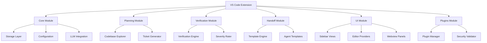
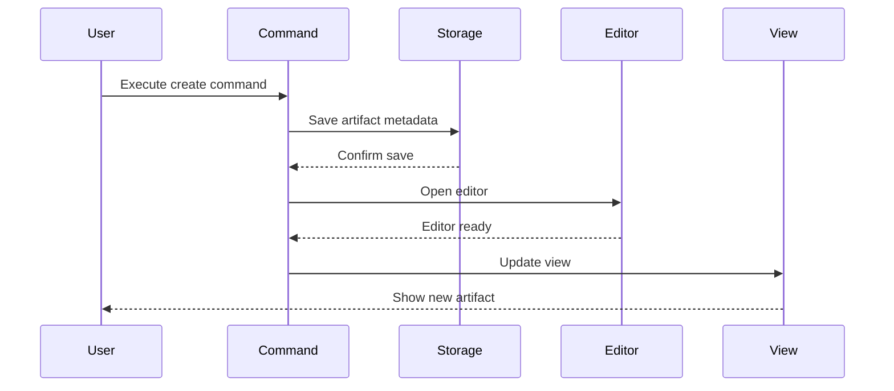
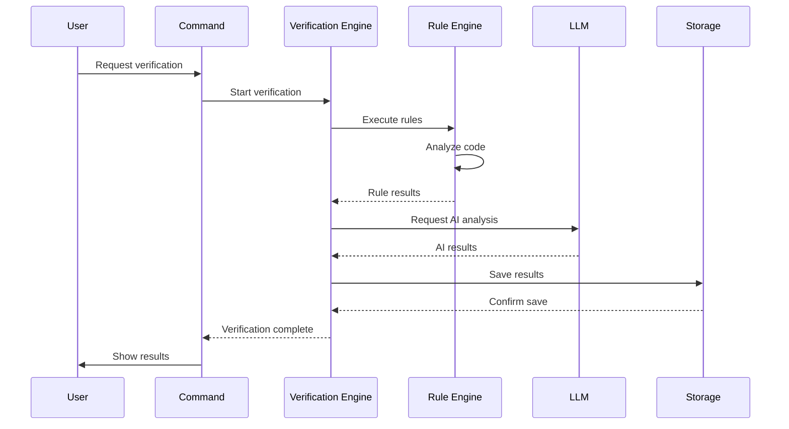
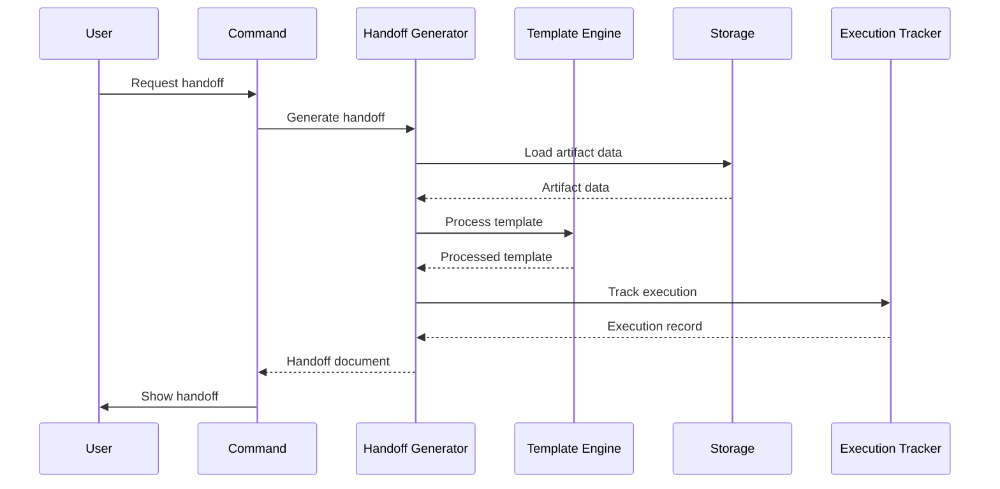

# System Architecture

This reference document provides a comprehensive overview of FlowGuard's system architecture, including module breakdown, data flow, and key components.

## High-Level Architecture

FlowGuard follows a modular architecture designed for extensibility and maintainability. The system is divided into several core modules that work together to provide a complete development workflow management solution.



## Module Breakdown

### Core Module
The core module provides foundational services used by all other modules.

#### Key Components
- **Storage Layer**: Manages persistence of artifacts and metadata
- **Configuration System**: Handles user preferences and settings
- **LLM Integration**: Abstracts communication with language models
- **Logging System**: Provides consistent logging across the application
- **Event System**: Enables communication between components

#### Dependencies
- VS Code Extension API
- File system access
- Secret storage for API keys

### Planning Module
The planning module handles the creation and management of development artifacts.

#### Key Components
- **Codebase Explorer**: Analyzes project structure and dependencies
- **Ticket Generator**: Creates implementation tickets from specifications
- **Artifact Parsers**: Parse and validate specification and ticket files
- **Reference Resolver**: Handles cross-referencing between artifacts

#### Dependencies
- Core Storage Layer
- LLM Integration
- File system watchers

### Verification Module
The verification module analyzes code changes for issues and best practices.

#### Key Components
- **Verification Engine**: Coordinates verification processes
- **Severity Rater**: Assigns severity levels to identified issues
- **Adapter System**: Supports multiple input formats (Git diff, GitHub PR, etc.)
- **Rule Engine**: Executes verification rules

#### Dependencies
- Core LLM Integration
- Planning Module (for context)
- External verification tools

### Handoff Module
The handoff module generates structured documents for AI assistants.

#### Key Components
- **Template Engine**: Processes templates with artifact data
- **Agent Templates**: Predefined templates for different AI assistants
- **Handoff Generator**: Creates handoff documents
- **Execution Tracker**: Tracks handoff executions

#### Dependencies
- Core Storage Layer
- Planning Module (for artifact data)
- Template files

### UI Module
The UI module provides the visual interface within VS Code.

#### Key Components
- **Sidebar Providers**: Views in the VS Code sidebar
- **Editor Providers**: Custom editors for specifications and tickets
- **Webview Panels**: Rich UI components for complex interactions
- **View Models**: Data structures for UI components

#### Dependencies
- VS Code Webview API
- Core Storage Layer
- All other modules for data

### Plugins Module
The plugins module enables extensibility through third-party extensions.

#### Key Components
- **Plugin Manager**: Loads and manages plugins
- **Security Validator**: Validates plugin safety
- **API Surface**: Exposes extension points to plugins
- **Plugin Registry**: Tracks available plugins

#### Dependencies
- VS Code Extension API
- Core Event System
- Node.js module system

## Data Flow

### Artifact Creation Flow



### Verification Flow



### Handoff Generation Flow



## Storage Layer Architecture

The storage layer provides a unified interface for persisting data.

### Artifact Storage
Manages specifications, tickets, and related metadata.

```typescript
class ArtifactStorage {
  // Save an artifact
  async saveArtifact(artifact: Artifact): Promise<void>
  
  // Load an artifact
  async loadArtifact(id: string): Promise<Artifact>
  
  // List artifacts
  async listArtifacts(filter?: ArtifactFilter): Promise<Artifact[]>
  
  // Delete an artifact
  async deleteArtifact(id: string): Promise<void>
}
```

### Epic Metadata Storage
Manages epic-level metadata and relationships.

```typescript
class EpicMetadataManager {
  // Save epic metadata
  async saveEpic(epic: Epic): Promise<void>
  
  // Load epic metadata
  async loadEpic(id: string): Promise<Epic>
  
  // Update epic status
  async updateEpicStatus(id: string, status: EpicStatus): Promise<void>
}
```

### Execution Storage
Tracks agent handoff executions.

```typescript
class ExecutionTracker {
  // Record execution
  async recordExecution(execution: ExecutionRecord): Promise<void>
  
  // Get execution
  async getExecution(id: string): Promise<ExecutionRecord>
  
  // List executions
  async listExecutions(filter?: ExecutionFilter): Promise<ExecutionRecord[]>
}
```

## LLM Provider Abstraction

FlowGuard abstracts LLM providers to support multiple services.

### Base Provider Interface

```typescript
abstract class BaseProvider {
  // Generate text completion
  abstract generateCompletion(prompt: string, options?: CompletionOptions): Promise<string>
  
  // Generate chat completion
  abstract generateChat(messages: ChatMessage[], options?: ChatOptions): Promise<string>
  
  // Stream completion
  abstract streamCompletion(prompt: string, options?: StreamOptions): AsyncIterable<string>
  
  // Validate configuration
  abstract validateConfig(config: any): boolean
}
```

### Provider Factory

```typescript
class ProviderFactory {
  // Create provider instance
  static createProvider(type: string, config: any): BaseProvider {
    switch (type) {
      case 'openai':
        return new OpenAIProvider(config);
      case 'anthropic':
        return new AnthropicProvider(config);
      case 'local':
        return new LocalLLMProvider(config);
      default:
        throw new Error(`Unsupported provider: ${type}`);
    }
  }
}
```

## Plugin Architecture

The plugin system allows extending FlowGuard's functionality.

### Plugin Lifecycle


### Plugin Manager

```typescript
class PluginManager {
  // Load plugins from directory
  async loadPlugins(directory: string): Promise<void>
  
  // Activate a plugin
  async activatePlugin(pluginId: string): Promise<void>
  
  // Deactivate a plugin
  async deactivatePlugin(pluginId: string): Promise<void>
  
  // Get registered verification rules
  getVerificationRules(): VerificationRule[]
  
  // Get registered agent templates
  getAgentTemplates(): AgentTemplate[]
}
```

## Security Architecture

FlowGuard implements several security measures to protect user data.

### API Key Storage
API keys are stored using VS Code's SecretStorage API, which encrypts data at rest.

### Plugin Security
Plugins are validated before loading to prevent malicious code execution.

### Data Privacy
Code analysis is performed locally by default, with optional cloud-based processing.

## Performance Considerations

### Caching Strategy
- Artifact metadata caching
- Codebase analysis caching
- Template compilation caching

### Concurrency Model
- Asynchronous I/O operations
- Worker threads for CPU-intensive tasks
- Connection pooling for external services

### Memory Management
- Efficient data structures
- Garbage collection optimization
- Memory leak prevention

## Extensibility Points

### Extension Points
1. **Verification Rules**: Add custom code analysis rules
2. **Agent Templates**: Support new AI assistants
3. **UI Components**: Add custom views and editors
4. **Commands**: Add new CLI commands
5. **Event Handlers**: Respond to system events

### Integration APIs
1. **Storage API**: Access artifact data
2. **Configuration API**: Read/write settings
3. **Event API**: Subscribe to system events
4. **Logging API**: Consistent logging interface

## Next Steps

For detailed information about specific components, see:

- [Plugin Development Guide](../advanced/plugin-development.md)
- [LLM Integration Guide](../advanced/llm-integration.md)
- [Custom Verification Rules Guide](../advanced/custom-verification-rules.md)
- [Extending UI Guide](../advanced/extending-ui.md)