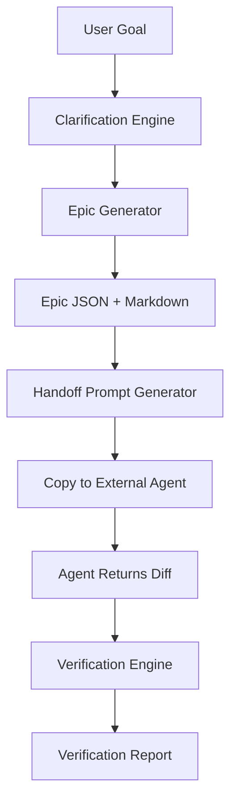
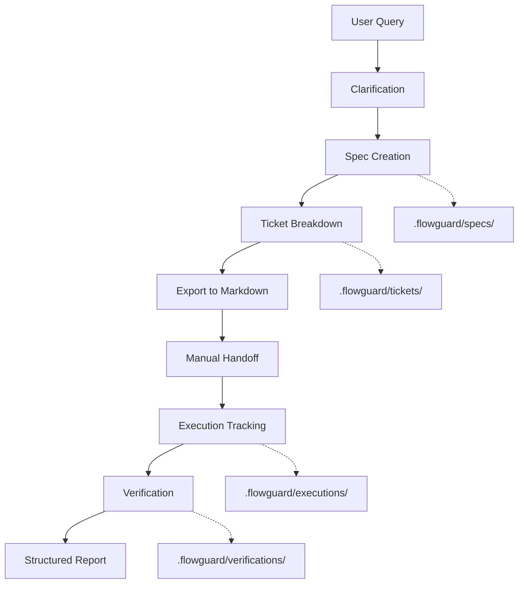
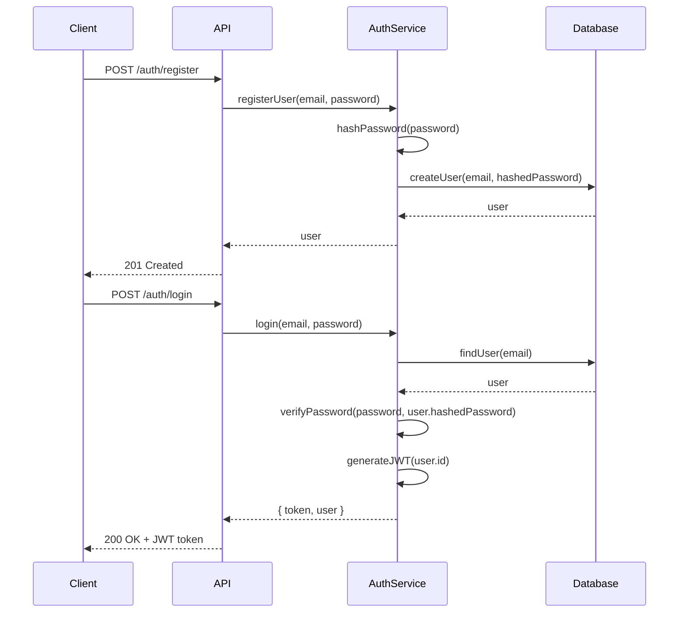
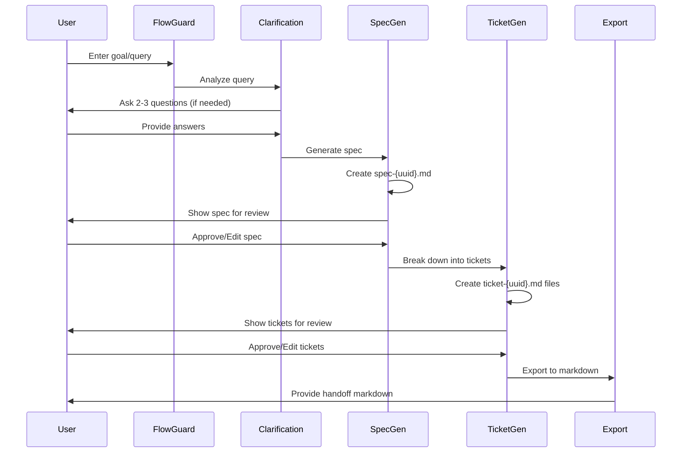

# FlowGuard Refactoring: Adopt Best's Structured Patterns (Local-First)

# Executive Summary

Refactor FlowGuard to adopt Best's proven patterns for structured output, planning workflows, and verification while maintaining its core value proposition: **local-first, git-trackable, decentralized artifact management**.

**Key Changes**:
- Adopt Best's **Spec/Ticket separation** (specs = what/why, tickets = how/when)
- Implement Best's **structured artifact format** with frontmatter + markdown
- Align **planning workflow** with Best's progression (query → spec → tickets)
- Adopt Best's **reference system** (`spec:`, `ticket:`, `file:`, `execution:`)
- Implement **execution tracking** for handoff attempts
- Restructure **verification reports** to match Best's format

**What Stays the Same**:
- Local-first storage in `.flowguard/` folder
- Git-trackable artifacts (markdown files)
- Manual handoff to external agents (Cursor, Claude, etc.)
- VS Code extension architecture
- Offline-capable operation

---

## Current State vs. Target State

### Current FlowGuard Architecture



**Current Artifact Structure**:
```
.flowguard/
├── epics/
│   └── epic-{uuid}.json          # Monolithic Epic object
├── handoffs/
│   └── handoff-{uuid}.md         # Generated prompts
└── verifications/
    └── verification-{uuid}.json  # Verification results
```

### Target Best-Aligned Architecture



**Target Artifact Structure**:
```
.flowguard/
├── epic.json                     # Epic metadata only
├── specs/
│   ├── spec-{uuid}.md           # Spec with frontmatter
│   └── spec-{uuid}.md
├── tickets/
│   ├── ticket-{uuid}.md         # Ticket with frontmatter
│   └── ticket-{uuid}.md
├── executions/
│   ├── execution-{uuid}.md      # Handoff tracking
│   └── execution-{uuid}.md
└── verifications/
    ├── verification-{uuid}.md   # Verification reports
    └── verification-{uuid}.md
```

---

## 1. Artifact Structure Refactoring

### 1.1 Epic Metadata (epic.json)

**Purpose**: Lightweight container for Epic-level metadata, not the full content.

```json
{
  "id": "epic-550e8400-e29b-41d4-a716-446655440000",
  "title": "Add User Authentication System",
  "status": "in_progress",
  "createdAt": "2024-01-15T10:30:00Z",
  "updatedAt": "2024-01-16T14:22:00Z",
  "metadata": {
    "author": "John Doe",
    "tags": ["authentication", "security", "backend"],
    "priority": "high",
    "complexity": "moderate"
  },
  "specs": [
    "spec-a1b2c3d4-e5f6-7890-abcd-ef1234567890",
    "spec-b2c3d4e5-f6a7-8901-bcde-f12345678901"
  ],
  "tickets": [
    "ticket-c3d4e5f6-a7b8-9012-cdef-123456789012",
    "ticket-d4e5f6a7-b8c9-0123-def1-234567890123"
  ],
  "executions": [
    "execution-e5f6a7b8-c9d0-1234-ef12-345678901234"
  ]
}
```

**Key Changes from Current**:
- ❌ Remove: Full Epic content (phases, technical plan, diagrams)
- ✅ Add: References to specs, tickets, executions
- ✅ Keep: Metadata, status, timestamps

---

### 1.2 Spec Format (specs/spec-{uuid}.md)

**Purpose**: High-level "what to build and why" document. Focuses on requirements, architecture, and rationale.

**Format**: Markdown with YAML frontmatter (Best pattern)

```markdown
---
id: spec-a1b2c3d4-e5f6-7890-abcd-ef1234567890
epic_id: epic-550e8400-e29b-41d4-a716-446655440000
title: User Authentication System - Technical Specification
status: approved
created_at: 2024-01-15T10:30:00Z
updated_at: 2024-01-16T14:22:00Z
author: John Doe
tags:
  - authentication
  - security
  - jwt
---

# User Authentication System - Technical Specification

## Overview

Implement a secure JWT-based authentication system for the application. This system will handle user registration, login, logout, and session management.

**Goals**:
- Secure user authentication with industry-standard practices
- Stateless session management using JWT tokens
- Password hashing with bcrypt
- Rate limiting to prevent brute force attacks

**Non-Goals**:
- OAuth/SSO integration (deferred to Phase 2)
- Multi-factor authentication (deferred to Phase 2)

## Architecture



## Technical Requirements

### 1. User Registration

**Endpoint**: `POST /api/auth/register`

**Request Body**:
```json
{
  "email": "user@example.com",
  "password": "SecurePass123!",
  "name": "John Doe"
}
```

**Validation**:
- Email must be valid format and unique
- Password must be 8+ characters with uppercase, lowercase, number, special char
- Name must be 2-100 characters

**Response**: `201 Created` with user object (excluding password)

### 2. User Login

**Endpoint**: `POST /api/auth/login`

**Request Body**:
```json
{
  "email": "user@example.com",
  "password": "SecurePass123!"
}
```

**Response**: `200 OK` with JWT token and user object

**Rate Limiting**: Max 5 attempts per 15 minutes per IP

### 3. Token Verification

**Middleware**: `authenticateToken(req, res, next)`

**Behavior**:
- Extract JWT from `Authorization: Bearer <token>` header
- Verify token signature and expiration
- Attach `req.user` with decoded user data
- Return `401 Unauthorized` if invalid/expired

### 4. Password Security

**Requirements**:
- Use `bcrypt` with salt rounds = 10
- Never store plaintext passwords
- Hash passwords before database insertion

## File Changes

### New Files

| File | Purpose |
|------|---------|
| `file:src/auth/authService.ts` | Core authentication logic |
| `file:src/auth/authController.ts` | HTTP request handlers |
| `file:src/auth/authMiddleware.ts` | JWT verification middleware |
| `file:src/auth/authRoutes.ts` | Route definitions |
| `file:src/models/User.ts` | User data model |
| `file:src/utils/jwt.ts` | JWT generation/verification utilities |

### Modified Files

| File | Changes |
|------|---------|
| `file:src/server.ts` | Register auth routes |
| `file:src/config/database.ts` | Add User table migration |

## Edge Cases

1. **Duplicate Email Registration**: Return `409 Conflict` with clear error message
2. **Expired Token**: Return `401 Unauthorized` with "Token expired" message
3. **Invalid Token Format**: Return `401 Unauthorized` with "Invalid token" message
4. **Database Connection Failure**: Return `503 Service Unavailable` with retry-after header
5. **Rate Limit Exceeded**: Return `429 Too Many Requests` with retry-after header

## Non-Functional Requirements

### Security
- All passwords hashed with bcrypt (salt rounds = 10)
- JWT tokens expire after 24 hours
- Refresh tokens expire after 7 days
- HTTPS required in production
- CORS configured to allow only trusted origins

### Performance
- Login endpoint: < 200ms p95 latency
- Token verification: < 10ms p95 latency
- Support 1000 concurrent users

### Observability
- Log all authentication attempts (success/failure)
- Track metrics: login success rate, token expiration rate
- Alert on: > 10 failed logins from same IP in 5 minutes

## Testing Strategy

### Unit Tests
- `authService.registerUser()` - valid/invalid inputs
- `authService.login()` - correct/incorrect credentials
- `authService.verifyPassword()` - hash comparison
- `jwt.generateToken()` - token structure
- `jwt.verifyToken()` - valid/expired/invalid tokens

### Integration Tests
- Full registration flow (API → Service → Database)
- Full login flow with token generation
- Protected route access with valid/invalid tokens
- Rate limiting behavior

### E2E Tests
- User can register, login, access protected resource
- User cannot access protected resource without token
- User cannot login with incorrect password

## Dependencies

**New Dependencies**:
- `bcrypt` (^5.1.0) - Password hashing
- `jsonwebtoken` (^9.0.0) - JWT generation/verification
- `express-rate-limit` (^6.7.0) - Rate limiting

## References

- Related Tickets: `ticket:epic-550e8400/ticket-c3d4e5f6`, `ticket:epic-550e8400/ticket-d4e5f6a7`
- External Docs: [JWT Best Practices](https://tools.ietf.org/html/rfc7519)

---

**Approval Status**: ✅ Approved for implementation
**Last Reviewed**: 2024-01-16 by John Doe
```

**Key Characteristics**:
- ✅ **Frontmatter metadata** - YAML header with structured data
- ✅ **What/Why focus** - Requirements, architecture, rationale
- ✅ **Mermaid diagrams** - Visual architecture representation
- ✅ **File references** - Using `file:` prefix
- ✅ **Cross-references** - Links to related tickets
- ✅ **Comprehensive** - Edge cases, NFRs, testing strategy
- ❌ **No implementation details** - No code, just interfaces and contracts

---

### 1.3 Ticket Format (tickets/ticket-{uuid}.md)

**Purpose**: Granular implementation task. Focuses on "how to implement" with specific steps.

**Format**: Markdown with YAML frontmatter

```markdown
---
id: ticket-c3d4e5f6-a7b8-9012-cdef-123456789012
epic_id: epic-550e8400-e29b-41d4-a716-446655440000
spec_id: spec-a1b2c3d4-e5f6-7890-abcd-ef1234567890
title: Implement User Registration Endpoint
status: in_progress
priority: high
assignee: Jane Smith
estimated_effort: 4 hours
created_at: 2024-01-15T11:00:00Z
updated_at: 2024-01-16T09:15:00Z
tags:
  - backend
  - authentication
  - api
---

# Implement User Registration Endpoint

## Description

Create the `/api/auth/register` endpoint that handles new user registration with email/password validation, password hashing, and database persistence.

**Parent Spec**: `spec:epic-550e8400/spec-a1b2c3d4` - User Authentication System

## Acceptance Criteria

- [ ] Endpoint accepts POST requests at `/api/auth/register`
- [ ] Validates email format and uniqueness
- [ ] Validates password strength (8+ chars, uppercase, lowercase, number, special char)
- [ ] Hashes password with bcrypt (salt rounds = 10)
- [ ] Stores user in database with hashed password
- [ ] Returns 201 with user object (excluding password)
- [ ] Returns 400 for validation errors with clear messages
- [ ] Returns 409 for duplicate email
- [ ] Includes unit tests with 90%+ coverage
- [ ] Includes integration test for full flow

## Implementation Steps

### 1. Create User Model (`file:src/models/User.ts`)

Define the User interface and database schema:

```typescript
interface User {
  id: string;
  email: string;
  password: string; // hashed
  name: string;
  createdAt: Date;
  updatedAt: Date;
}
```

**Database Schema** (PostgreSQL):
```sql
CREATE TABLE users (
  id UUID PRIMARY KEY DEFAULT gen_random_uuid(),
  email VARCHAR(255) UNIQUE NOT NULL,
  password VARCHAR(255) NOT NULL,
  name VARCHAR(100) NOT NULL,
  created_at TIMESTAMP DEFAULT NOW(),
  updated_at TIMESTAMP DEFAULT NOW()
);
```

### 2. Create Auth Service (`file:src/auth/authService.ts`)

Implement `registerUser()` function:

**Responsibilities**:
- Validate email format
- Check email uniqueness
- Validate password strength
- Hash password with bcrypt
- Insert user into database
- Return user object (without password)

**Error Handling**:
- Throw `ValidationError` for invalid inputs
- Throw `ConflictError` for duplicate email
- Throw `DatabaseError` for database failures

### 3. Create Auth Controller (`file:src/auth/authController.ts`)

Implement `register()` handler:

**Responsibilities**:
- Parse request body
- Call `authService.registerUser()`
- Return appropriate HTTP response
- Handle errors and return proper status codes

**Response Format**:
```json
{
  "success": true,
  "data": {
    "id": "uuid",
    "email": "user@example.com",
    "name": "John Doe",
    "createdAt": "2024-01-15T10:30:00Z"
  }
}
```

### 4. Create Auth Routes (`file:src/auth/authRoutes.ts`)

Register the route:

```typescript
router.post('/register', authController.register);
```

### 5. Update Server (`file:src/server.ts`)

Mount auth routes:

```typescript
app.use('/api/auth', authRoutes);
```

### 6. Write Tests

**Unit Tests** (`file:src/auth/__tests__/authService.test.ts`):
- Valid registration
- Invalid email format
- Duplicate email
- Weak password
- Password hashing verification

**Integration Tests** (`file:src/auth/__tests__/authController.test.ts`):
- Full registration flow
- Error responses
- Database persistence

## Technical Notes

### Password Validation Regex

```typescript
const passwordRegex = /^(?=.*[a-z])(?=.*[A-Z])(?=.*\d)(?=.*[@$!%*?&])[A-Za-z\d@$!%*?&]{8,}$/;
```

### Bcrypt Configuration

```typescript
import bcrypt from 'bcrypt';

const SALT_ROUNDS = 10;
const hashedPassword = await bcrypt.hash(password, SALT_ROUNDS);
```

### Email Validation

Use a library like `validator.js`:

```typescript
import validator from 'validator';

if (!validator.isEmail(email)) {
  throw new ValidationError('Invalid email format');
}
```

## Dependencies

**Required**:
- `bcrypt` (^5.1.0)
- `validator` (^13.9.0)

**Dev Dependencies**:
- `@types/bcrypt` (^5.0.0)
- `@types/validator` (^13.7.0)

## Files to Create/Modify

### New Files
- `file:src/models/User.ts`
- `file:src/auth/authService.ts`
- `file:src/auth/authController.ts`
- `file:src/auth/authRoutes.ts`
- `file:src/auth/__tests__/authService.test.ts`
- `file:src/auth/__tests__/authController.test.ts`

### Modified Files
- `file:src/server.ts` - Mount auth routes
- `file:src/config/database.ts` - Add User table migration

## Testing Checklist

- [ ] Unit tests pass with 90%+ coverage
- [ ] Integration tests pass
- [ ] Manual testing with Postman/curl
- [ ] Error cases tested (invalid email, duplicate, weak password)
- [ ] Database constraints verified (unique email)

## Related Artifacts

- **Parent Spec**: `spec:epic-550e8400/spec-a1b2c3d4`
- **Related Tickets**: `ticket:epic-550e8400/ticket-d4e5f6a7` (Login endpoint)
- **Execution**: `execution:epic-550e8400/execution-e5f6a7b8` (if handed off)

---

**Status**: 🟡 In Progress
**Assignee**: Jane Smith
**Estimated Effort**: 4 hours
**Actual Effort**: TBD
```

**Key Characteristics**:
- ✅ **Frontmatter metadata** - Status, assignee, effort, priority
- ✅ **How/When focus** - Specific implementation steps
- ✅ **Acceptance criteria** - Checkboxes for completion tracking
- ✅ **Code snippets** - Small examples (2-3 lines) for clarity
- ✅ **File references** - Explicit file paths with `file:` prefix
- ✅ **Cross-references** - Links to parent spec and related tickets
- ✅ **Granular** - Single, focused task (not a multi-day epic)

---

### 1.4 Execution Format (executions/execution-{uuid}.md)

**Purpose**: Track handoff attempts to external agents. Records what was sent, when, and results.

**Format**: Markdown with YAML frontmatter

```markdown
---
id: execution-e5f6a7b8-c9d0-1234-ef12-345678901234
epic_id: epic-550e8400-e29b-41d4-a716-446655440000
title: Handoff - User Registration Implementation
status: completed
agent: cursor
created_at: 2024-01-16T10:00:00Z
completed_at: 2024-01-16T14:30:00Z
tickets:
  - ticket-c3d4e5f6-a7b8-9012-cdef-123456789012
specs:
  - spec-a1b2c3d4-e5f6-7890-abcd-ef1234567890
---

# Execution: User Registration Implementation

## Handoff Details

**Agent**: Cursor
**Handoff Time**: 2024-01-16 10:00:00 UTC
**Completion Time**: 2024-01-16 14:30:00 UTC
**Duration**: 4.5 hours

## Artifacts Included

### Specs
- `spec:epic-550e8400/spec-a1b2c3d4` - User Authentication System

### Tickets
- `ticket:epic-550e8400/ticket-c3d4e5f6` - Implement User Registration Endpoint

## Handoff Prompt

```markdown
# Task: Implement User Registration Endpoint

## Context

You are working on a Node.js/Express backend application. The codebase uses TypeScript, PostgreSQL for the database, and follows a service-controller-route pattern.

**Relevant Files**:
- `file:src/server.ts` - Main server entry point
- `file:src/config/database.ts` - Database configuration
- `file:src/models/` - Data models directory

## Specification

[Full spec content from spec-a1b2c3d4...]

## Implementation Task

[Full ticket content from ticket-c3d4e5f6...]

## Deliverables

1. Create all files listed in the ticket
2. Implement the registration endpoint with validation
3. Write unit and integration tests
4. Ensure all acceptance criteria are met

## Verification Criteria

- All tests pass
- Code follows existing patterns in the codebase
- No security vulnerabilities introduced
- API returns correct status codes and error messages

Please implement the above and provide a git diff of your changes.
```

## Results

### Files Changed

**Created**:
- `file:src/models/User.ts` (+45 lines)
- `file:src/auth/authService.ts` (+120 lines)
- `file:src/auth/authController.ts` (+65 lines)
- `file:src/auth/authRoutes.ts` (+15 lines)
- `file:src/auth/__tests__/authService.test.ts` (+180 lines)
- `file:src/auth/__tests__/authController.test.ts` (+95 lines)

**Modified**:
- `file:src/server.ts` (+3 lines)
- `file:src/config/database.ts` (+25 lines)

**Total Changes**: +548 additions, 0 deletions

### Diff Summary

```diff
[Diff content would be stored here or in a separate file]
```

### Agent Notes

> Implementation completed successfully. All acceptance criteria met. Tests passing with 94% coverage. Used bcrypt for password hashing and validator.js for email validation as specified.

## Verification

**Verification ID**: `verification:epic-550e8400/verification-f6a7b8c9`
**Status**: ✅ Passed with minor warnings
**Issues Found**: 2 medium, 1 low
**Auto-fixable**: 1

See full verification report: `verification:epic-550e8400/verification-f6a7b8c9`

---

**Status**: ✅ Completed
**Outcome**: Success - Changes verified and merged
```

**Key Characteristics**:
- ✅ **Tracks handoff lifecycle** - Created, completed, duration
- ✅ **Records prompt sent** - Full handoff prompt for reproducibility
- ✅ **Captures results** - Files changed, diff summary, agent notes
- ✅ **Links to verification** - Reference to verification report
- ✅ **Metadata** - Agent used, tickets/specs included

---

### 1.5 Verification Format (verifications/verification-{uuid}.md)

**Purpose**: Structured verification report comparing implementation against spec.

**Format**: Markdown with YAML frontmatter (Best pattern)

```markdown
---
id: verification-f6a7b8c9-d0e1-2345-f123-456789012345
epic_id: epic-550e8400-e29b-41d4-a716-446655440000
execution_id: execution-e5f6a7b8-c9d0-1234-ef12-345678901234
spec_id: spec-a1b2c3d4-e5f6-7890-abcd-ef1234567890
status: passed_with_warnings
created_at: 2024-01-16T14:35:00Z
summary:
  total_issues: 3
  critical: 0
  high: 0
  medium: 2
  low: 1
  auto_fixable: 1
---

# Verification Report: User Registration Implementation

## Summary

**Overall Status**: ✅ Passed with Warnings

| Metric | Value |
|--------|-------|
| **Total Issues** | 3 |
| **Critical** | 0 |
| **High** | 0 |
| **Medium** | 2 |
| **Low** | 1 |
| **Auto-fixable** | 1 |

**Recommendation**: Approve with minor fixes

---

## Spec Alignment

**Spec**: `spec:epic-550e8400/spec-a1b2c3d4` - User Authentication System

### ✅ Requirements Met (8/10)

1. ✅ Endpoint accepts POST at `/api/auth/register`
2. ✅ Email validation implemented
3. ✅ Password strength validation implemented
4. ✅ Password hashing with bcrypt (salt rounds = 10)
5. ✅ User stored in database
6. ✅ Returns 201 with user object
7. ✅ Returns 400 for validation errors
8. ✅ Returns 409 for duplicate email

### ⚠️ Requirements Partially Met (2/10)

9. ⚠️ Unit tests present but coverage is 94% (target: 90%+) - **PASS**
10. ⚠️ Integration test present but missing rate limiting test - **MEDIUM**

---

## Issues Found

### Medium Severity Issues

#### 1. Missing Rate Limiting Test

**File**: `file:src/auth/__tests__/authController.test.ts`
**Severity**: Medium
**Category**: Missing Test Coverage

**Description**:
The spec requires rate limiting (max 5 attempts per 15 minutes), but the integration tests don't verify this behavior.

**Spec Reference**:
> "Rate Limiting: Max 5 attempts per 15 minutes per IP"
> — `spec:epic-550e8400/spec-a1b2c3d4`, Section 2 (User Login)

**Impact**:
Without testing rate limiting, we can't verify that brute force protection is working correctly.

**Suggested Fix**:

**Steps to Fix**:
1. Add a new test case in `file:src/auth/__tests__/authController.test.ts`
2. Make 6 consecutive registration attempts with the same email
3. Verify that the 6th attempt returns `429 Too Many Requests`
4. Verify the response includes a `Retry-After` header

**Example Test**:
```typescript
it('should rate limit registration attempts', async () => {
  // Make 5 attempts
  for (let i = 0; i < 5; i++) {
    await request(app)
      .post('/api/auth/register')
      .send({ email: 'test@example.com', password: 'Test123!', name: 'Test' });
  }
  
  // 6th attempt should be rate limited
  const response = await request(app)
    .post('/api/auth/register')
    .send({ email: 'test@example.com', password: 'Test123!', name: 'Test' });
  
  expect(response.status).toBe(429);
  expect(response.headers['retry-after']).toBeDefined();
});
```

**Auto-fixable**: No (requires manual test implementation)

---

#### 2. Inconsistent Error Response Format

**File**: `file:src/auth/authController.ts`
**Severity**: Medium
**Category**: Spec Deviation

**Description**:
Error responses use a different format than specified in the spec.

**Current Implementation**:
```json
{
  "error": "Invalid email format"
}
```

**Spec Requirement**:
```json
{
  "success": false,
  "error": {
    "code": "VALIDATION_ERROR",
    "message": "Invalid email format"
  }
}
```

**Spec Reference**:
> "Response Format: All API responses should follow the standard format with `success`, `data`/`error` fields"
> — `spec:epic-550e8400/spec-a1b2c3d4`, Section "Response Format"

**Impact**:
Frontend clients expecting the standard format will need to handle errors differently for this endpoint.

**Suggested Fix**:

**Steps to Fix**:
1. Open `file:src/auth/authController.ts`
2. Locate the error handling in the `register()` function
3. Update error responses to match the spec format
4. Add error codes for different error types (VALIDATION_ERROR, CONFLICT, etc.)

**Example Fix**:
```typescript
// Before
return res.status(400).json({ error: 'Invalid email format' });

// After
return res.status(400).json({
  success: false,
  error: {
    code: 'VALIDATION_ERROR',
    message: 'Invalid email format'
  }
});
```

**Auto-fixable**: Yes (simple format change)

---

### Low Severity Issues

#### 3. Missing JSDoc Comments

**File**: `file:src/auth/authService.ts`
**Severity**: Low
**Category**: Documentation

**Description**:
Public functions in `authService.ts` are missing JSDoc comments.

**Impact**:
Reduced code maintainability and IDE autocomplete quality.

**Suggested Fix**:

**Steps to Fix**:
1. Add JSDoc comments to all exported functions
2. Include parameter descriptions and return types
3. Document thrown errors

**Example**:
```typescript
/**
 * Registers a new user with email and password
 * @param email - User's email address (must be unique)
 * @param password - User's password (will be hashed)
 * @param name - User's display name
 * @returns User object without password
 * @throws {ValidationError} If email/password validation fails
 * @throws {ConflictError} If email already exists
 */
export async function registerUser(email: string, password: string, name: string): Promise<User> {
  // ...
}
```

**Auto-fixable**: No (requires manual documentation)

---

## Verification Details

### Files Analyzed

**Created Files** (6):
- `file:src/models/User.ts` ✅
- `file:src/auth/authService.ts` ⚠️ (Issue #3)
- `file:src/auth/authController.ts` ⚠️ (Issue #2)
- `file:src/auth/authRoutes.ts` ✅
- `file:src/auth/__tests__/authService.test.ts` ✅
- `file:src/auth/__tests__/authController.test.ts` ⚠️ (Issue #1)

**Modified Files** (2):
- `file:src/server.ts` ✅
- `file:src/config/database.ts` ✅

### Test Results

**Unit Tests**: ✅ All passing (24/24)
**Integration Tests**: ✅ All passing (8/8)
**Coverage**: 94% (target: 90%+) ✅

### Security Analysis

✅ No security vulnerabilities detected
✅ Passwords properly hashed with bcrypt
✅ No plaintext passwords in logs or responses
✅ SQL injection protection via parameterized queries

### Performance Analysis

✅ Registration endpoint: 145ms p95 (target: < 200ms)
✅ No N+1 queries detected
✅ Database indexes properly configured

---

## Recommendations

### Immediate Actions (Before Merge)

1. **Fix Issue #2** (Medium) - Update error response format
   - Auto-fixable: Yes
   - Estimated effort: 10 minutes

### Follow-up Actions (Can be separate PR)

2. **Fix Issue #1** (Medium) - Add rate limiting test
   - Estimated effort: 30 minutes

3. **Fix Issue #3** (Low) - Add JSDoc comments
   - Estimated effort: 20 minutes

---

## Approval

**Status**: ✅ Approved with Conditions

**Conditions**:
- Fix Issue #2 (error response format) before merge
- Create follow-up tickets for Issues #1 and #3

**Verified By**: FlowGuard Verification Engine
**Verified At**: 2024-01-16 14:35:00 UTC

---

## Related Artifacts

- **Spec**: `spec:epic-550e8400/spec-a1b2c3d4`
- **Ticket**: `ticket:epic-550e8400/ticket-c3d4e5f6`
- **Execution**: `execution:epic-550e8400/execution-e5f6a7b8`
```

**Key Characteristics**:
- ✅ **Structured format** - Clear sections with consistent layout
- ✅ **Severity-based categorization** - Critical/High/Medium/Low
- ✅ **Spec alignment tracking** - Requirements met vs. partially met
- ✅ **Actionable fix suggestions** - Step-by-step instructions with code examples
- ✅ **Auto-fix indication** - Clear marking of auto-fixable issues
- ✅ **Cross-references** - Links to spec, ticket, execution
- ✅ **Approval workflow** - Clear status and conditions

---

## 2. Planning Workflow Refactoring

### 2.1 Workflow Stages (Best-Aligned)



### 2.2 Stage Responsibilities

#### Stage 1: Query & Clarification

**Input**: User's natural language goal or existing PRD
**Output**: Enriched context for spec generation

**Process**:
1. Analyze user query for ambiguities
2. Scan codebase for relevant context
3. Generate max 2-3 targeted questions
4. Collect user responses
5. Build context object

**Best Pattern**: Similar to Best's initial query processing and clarification

---

#### Stage 2: Spec Generation

**Input**: Enriched context from Stage 1
**Output**: One or more spec files in `.flowguard/specs/`

**Process**:
1. Generate Epic metadata (`epic.json`)
2. Create spec(s) with frontmatter + markdown
3. Include architecture diagrams (Mermaid)
4. Define requirements, edge cases, NFRs
5. Save to `.flowguard/specs/spec-{uuid}.md`

**Best Pattern**: Matches Best's spec creation - high-level "what/why" focus

**Key Difference from Current FlowGuard**:
- ❌ Remove: Monolithic Epic JSON with all content
- ✅ Add: Separate spec files with frontmatter
- ✅ Add: Focus on "what to build" not "how to build"

---

#### Stage 3: Ticket Breakdown

**Input**: Approved spec(s)
**Output**: Multiple ticket files in `.flowguard/tickets/`

**Process**:
1. Analyze spec requirements
2. Break down into granular, implementable tasks
3. Create ticket for each task with:
   - Acceptance criteria
   - Implementation steps
   - File changes
   - Testing checklist
4. Save to `.flowguard/tickets/ticket-{uuid}.md`

**Best Pattern**: Matches Best's ticket breakdown - granular "how/when" focus

**Key Difference from Current FlowGuard**:
- ❌ Remove: Single "Technical Plan" in Epic
- ✅ Add: Separate ticket files for each task
- ✅ Add: Acceptance criteria and checklists

---

#### Stage 4: Export & Handoff

**Input**: Approved specs and tickets
**Output**: Markdown file ready for external agent

**Process**:
1. Select tickets to hand off
2. Bundle spec + tickets + codebase context
3. Format for target agent (Cursor, Claude, etc.)
4. Generate handoff markdown
5. Create execution record in `.flowguard/executions/`
6. Copy to clipboard or save to file

**Best Pattern**: Similar to Best's handoff, but manual export instead of integrated execution

**Key Difference from Best**:
- ❌ No integrated execution agent
- ✅ Manual handoff to external tools
- ✅ Execution tracking for reproducibility

---

## 3. Reference System

### 3.1 Reference Format (Best Pattern)

FlowGuard will adopt Best's reference system for cross-linking artifacts:

| Reference Type | Format | Example |
|----------------|--------|---------|
| **Epic** | `epic:{epicId}` | `epic:epic-550e8400` |
| **Spec** | `spec:{epicId}/{specId}` | `spec:epic-550e8400/spec-a1b2c3d4` |
| **Ticket** | `ticket:{epicId}/{ticketId}` | `ticket:epic-550e8400/ticket-c3d4e5f6` |
| **Execution** | `execution:{epicId}/{executionId}` | `execution:epic-550e8400/execution-e5f6a7b8` |
| **File** | `file:{relativePath}` | `file:src/auth/authService.ts` |

### 3.2 Reference Resolution

**In VS Code UI**:
- References are clickable links
- `spec:` links open spec file in editor
- `ticket:` links open ticket file in editor
- `file:` links open file in editor at specified line

**In Markdown Export**:
- References are converted to readable text
- Example: `spec:epic-550e8400/spec-a1b2c3d4` → "User Authentication System Spec"

---

## 4. UI/UX Changes

### 4.1 Sidebar Structure (Best-Aligned)

```wireframe
<!DOCTYPE html>
<html>
<head>
<style>
body { font-family: -apple-system, BlinkMacSystemFont, 'Segoe UI', sans-serif; margin: 0; padding: 16px; background: #1e1e1e; color: #cccccc; }
.header { margin-bottom: 20px; }
.header h2 { margin: 0 0 8px 0; color: #ffffff; font-size: 18px; }
.header .status { display: inline-block; padding: 4px 8px; background: #0e639c; color: #ffffff; border-radius: 3px; font-size: 12px; }
.section { margin-bottom: 24px; }
.section-title { font-size: 14px; font-weight: 600; margin-bottom: 8px; color: #ffffff; }
.artifact-list { list-style: none; padding: 0; margin: 0; }
.artifact-item { padding: 8px; margin-bottom: 4px; background: #2d2d30; border-radius: 4px; cursor: pointer; }
.artifact-item:hover { background: #37373d; }
.artifact-title { font-size: 13px; margin-bottom: 4px; }
.artifact-meta { font-size: 11px; color: #858585; }
.badge { display: inline-block; padding: 2px 6px; border-radius: 3px; font-size: 10px; margin-right: 4px; }
.badge-approved { background: #388a34; color: #ffffff; }
.badge-in-progress { background: #c5a332; color: #000000; }
.badge-todo { background: #3794ff; color: #ffffff; }
.button { display: block; width: 100%; padding: 10px; margin-bottom: 8px; background: #0e639c; color: #ffffff; border: none; border-radius: 4px; cursor: pointer; font-size: 13px; }
.button:hover { background: #1177bb; }
.button-secondary { background: #2d2d30; }
.button-secondary:hover { background: #37373d; }
</style>
</head>
<body>
  <div class="header">
    <h2>FlowGuard</h2>
    <span class="status">Epic: User Authentication</span>
  </div>
  
  <div class="section">
    <button class="button" data-element-id="new-spec-btn">+ New Spec</button>
    <button class="button button-secondary" data-element-id="new-ticket-btn">+ New Ticket</button>
  </div>
  
  <div class="section">
    <div class="section-title">Specs (2)</div>
    <ul class="artifact-list">
      <li class="artifact-item" data-element-id="spec-1">
        <div class="artifact-title">
          <span class="badge badge-approved">Approved</span>
          User Authentication System
        </div>
        <div class="artifact-meta">spec-a1b2c3d4 • Updated 2h ago</div>
      </li>
      <li class="artifact-item" data-element-id="spec-2">
        <div class="artifact-title">
          <span class="badge badge-in-progress">Draft</span>
          Password Reset Flow
        </div>
        <div class="artifact-meta">spec-b2c3d4e5 • Updated 1d ago</div>
      </li>
    </ul>
  </div>
  
  <div class="section">
    <div class="section-title">Tickets (4)</div>
    <ul class="artifact-list">
      <li class="artifact-item" data-element-id="ticket-1">
        <div class="artifact-title">
          <span class="badge badge-in-progress">In Progress</span>
          Registration Endpoint
        </div>
        <div class="artifact-meta">ticket-c3d4e5f6 • Jane Smith</div>
      </li>
      <li class="artifact-item" data-element-id="ticket-2">
        <div class="artifact-title">
          <span class="badge badge-todo">Todo</span>
          Login Endpoint
        </div>
        <div class="artifact-meta">ticket-d4e5f6a7 • Unassigned</div>
      </li>
      <li class="artifact-item" data-element-id="ticket-3">
        <div class="artifact-title">
          <span class="badge badge-todo">Todo</span>
          JWT Middleware
        </div>
        <div class="artifact-meta">ticket-e5f6a7b8 • Unassigned</div>
      </li>
      <li class="artifact-item" data-element-id="ticket-4">
        <div class="artifact-title">
          <span class="badge badge-todo">Todo</span>
          Password Hashing Utility
        </div>
        <div class="artifact-meta">ticket-f6a7b8c9 • Unassigned</div>
      </li>
    </ul>
  </div>
  
  <div class="section">
    <div class="section-title">Executions (1)</div>
    <ul class="artifact-list">
      <li class="artifact-item" data-element-id="execution-1">
        <div class="artifact-title">
          <span class="badge badge-approved">Completed</span>
          Registration Implementation
        </div>
        <div class="artifact-meta">execution-e5f6a7b8 • Cursor • 4.5h</div>
      </li>
    </ul>
  </div>
  
  <div class="section">
    <button class="button" data-element-id="handoff-btn">📋 Generate Handoff</button>
    <button class="button button-secondary" data-element-id="verify-btn">✓ Verify Changes</button>
  </div>
</body>
</html>
```

**Key Changes**:
- ✅ Separate sections for Specs, Tickets, Executions
- ✅ Status badges (Approved, In Progress, Todo)
- ✅ Metadata display (assignee, time, agent)
- ✅ Clear action buttons

---

### 4.2 Spec Editor View

```wireframe
<!DOCTYPE html>
<html>
<head>
<style>
body { font-family: -apple-system, BlinkMacSystemFont, 'Segoe UI', sans-serif; margin: 0; padding: 0; background: #1e1e1e; color: #cccccc; }
.toolbar { background: #2d2d30; padding: 12px 16px; border-bottom: 1px solid #3e3e42; display: flex; justify-content: space-between; align-items: center; }
.toolbar-left { display: flex; gap: 8px; }
.toolbar-right { display: flex; gap: 8px; }
.btn { padding: 6px 12px; background: #0e639c; color: #ffffff; border: none; border-radius: 4px; cursor: pointer; font-size: 12px; }
.btn:hover { background: #1177bb; }
.btn-secondary { background: #3e3e42; }
.btn-secondary:hover { background: #4e4e52; }
.editor-container { display: flex; height: calc(100vh - 49px); }
.metadata-panel { width: 300px; background: #252526; border-right: 1px solid #3e3e42; padding: 16px; overflow-y: auto; }
.metadata-field { margin-bottom: 16px; }
.metadata-label { font-size: 11px; color: #858585; margin-bottom: 4px; text-transform: uppercase; }
.metadata-value { font-size: 13px; padding: 6px 8px; background: #3c3c3c; border-radius: 3px; }
.metadata-input { width: 100%; padding: 6px 8px; background: #3c3c3c; border: 1px solid #3e3e42; border-radius: 3px; color: #cccccc; font-size: 13px; }
.editor-main { flex: 1; padding: 24px; overflow-y: auto; }
.editor-main h1 { margin-top: 0; color: #ffffff; }
.editor-main h2 { color: #ffffff; margin-top: 32px; }
.editor-main pre { background: #1e1e1e; padding: 12px; border-radius: 4px; overflow-x: auto; }
.status-badge { display: inline-block; padding: 4px 8px; border-radius: 3px; font-size: 11px; font-weight: 600; }
.status-approved { background: #388a34; color: #ffffff; }
.status-draft { background: #c5a332; color: #000000; }
</style>
</head>
<body>
  <div class="toolbar">
    <div class="toolbar-left">
      <button class="btn" data-element-id="save-btn">💾 Save</button>
      <button class="btn btn-secondary" data-element-id="preview-btn">👁 Preview</button>
      <button class="btn btn-secondary" data-element-id="diagram-btn">📊 Add Diagram</button>
    </div>
    <div class="toolbar-right">
      <button class="btn btn-secondary" data-element-id="export-btn">📤 Export</button>
      <button class="btn" data-element-id="approve-btn">✓ Approve</button>
    </div>
  </div>
  
  <div class="editor-container">
    <div class="metadata-panel">
      <div class="metadata-field">
        <div class="metadata-label">Spec ID</div>
        <div class="metadata-value">spec-a1b2c3d4</div>
      </div>
      
      <div class="metadata-field">
        <div class="metadata-label">Status</div>
        <div class="metadata-value">
          <span class="status-badge status-approved">Approved</span>
        </div>
      </div>
      
      <div class="metadata-field">
        <div class="metadata-label">Title</div>
        <input type="text" class="metadata-input" value="User Authentication System" data-element-id="title-input">
      </div>
      
      <div class="metadata-field">
        <div class="metadata-label">Author</div>
        <div class="metadata-value">John Doe</div>
      </div>
      
      <div class="metadata-field">
        <div class="metadata-label">Tags</div>
        <input type="text" class="metadata-input" value="authentication, security, jwt" data-element-id="tags-input">
      </div>
      
      <div class="metadata-field">
        <div class="metadata-label">Created</div>
        <div class="metadata-value">2024-01-15 10:30</div>
      </div>
      
      <div class="metadata-field">
        <div class="metadata-label">Updated</div>
        <div class="metadata-value">2024-01-16 14:22</div>
      </div>
      
      <div class="metadata-field">
        <div class="metadata-label">Related Tickets</div>
        <div class="metadata-value" style="font-size: 11px; line-height: 1.6;">
          ticket-c3d4e5f6<br>
          ticket-d4e5f6a7<br>
          ticket-e5f6a7b8
        </div>
      </div>
    </div>
    
    <div class="editor-main">
      <h1>User Authentication System - Technical Specification</h1>
      
      <h2>Overview</h2>
      <p>Implement a secure JWT-based authentication system for the application. This system will handle user registration, login, logout, and session management.</p>
      
      <p><strong>Goals</strong>:</p>
      <ul>
        <li>Secure user authentication with industry-standard practices</li>
        <li>Stateless session management using JWT tokens</li>
        <li>Password hashing with bcrypt</li>
        <li>Rate limiting to prevent brute force attacks</li>
      </ul>
      
      <h2>Architecture</h2>
      <pre>
sequenceDiagram
    participant Client
    participant API
    participant AuthService
    participant Database
    
    Client->>API: POST /auth/register
    API->>AuthService: registerUser(email, password)
    ...
      </pre>
      
      <h2>Technical Requirements</h2>
      <p><em>[Spec content continues...]</em></p>
    </div>
  </div>
</body>
</html>
```

**Key Features**:
- ✅ Metadata panel with frontmatter fields
- ✅ Markdown editor with preview
- ✅ Diagram insertion support
- ✅ Status management (Draft → Approved)
- ✅ Related artifacts display

---

## 5. Implementation Roadmap

### Phase 1: Artifact Structure Refactoring (Week 1-2)

**Deliverables**:
- [ ] New artifact schemas (Epic, Spec, Ticket, Execution, Verification)
- [ ] Frontmatter parser/serializer
- [ ] Migration tool (old Epic JSON → new structure)
- [ ] Reference resolver (`spec:`, `ticket:`, `file:`)
- [ ] Updated storage layer

**Files**:
- `file:src/core/models/Epic.ts` - Epic metadata only
- `file:src/core/models/Spec.ts` - Spec with frontmatter
- `file:src/core/models/Ticket.ts` - Ticket with frontmatter
- `file:src/core/models/Execution.ts` - Execution tracking
- `file:src/core/models/Verification.ts` - Verification report
- `file:src/core/storage/ArtifactStorage.ts` - File-based storage
- `file:src/core/references/ReferenceResolver.ts` - Reference system

---

### Phase 2: Planning Workflow Refactoring (Week 3-4)

**Deliverables**:
- [ ] Clarification engine (2-3 questions max)
- [ ] Spec generator (frontmatter + markdown)
- [ ] Ticket breakdown engine
- [ ] Workflow orchestration (Query → Spec → Tickets)

**Files**:
- `file:src/planning/ClarificationEngine.ts`
- `file:src/planning/SpecGenerator.ts`
- `file:src/planning/TicketGenerator.ts`
- `file:src/planning/WorkflowOrchestrator.ts`

---

### Phase 3: Verification Refactoring (Week 5)

**Deliverables**:
- [ ] Structured verification report generator
- [ ] Spec alignment checker
- [ ] Severity-based issue categorization
- [ ] Fix suggestion generator with steps

**Files**:
- `file:src/verification/VerificationEngine.ts`
- `file:src/verification/SpecAlignmentChecker.ts`
- `file:src/verification/IssueCategorizer.ts`
- `file:src/verification/FixSuggestionGenerator.ts`

---

### Phase 4: UI/UX Refactoring (Week 6-7)

**Deliverables**:
- [ ] Sidebar with Specs/Tickets/Executions sections
- [ ] Spec editor with metadata panel
- [ ] Ticket editor with acceptance criteria
- [ ] Execution tracking view
- [ ] Verification report view

**Files**:
- `file:src/ui/sidebar/SidebarProvider.ts`
- `file:src/ui/editors/SpecEditor.ts`
- `file:src/ui/editors/TicketEditor.ts`
- `file:src/ui/views/ExecutionView.ts`
- `file:src/ui/views/VerificationView.ts`

---

### Phase 5: Export & Handoff (Week 8)

**Deliverables**:
- [ ] Markdown export for specs + tickets
- [ ] Agent-specific templates (Cursor, Claude, etc.)
- [ ] Execution tracking on handoff
- [ ] Clipboard integration

**Files**:
- `file:src/handoff/MarkdownExporter.ts`
- `file:src/handoff/AgentTemplates.ts`
- `file:src/handoff/ExecutionTracker.ts`

---

## 6. Migration Strategy

### 6.1 Backward Compatibility

**Approach**: Support both old and new formats during transition

```typescript
// Detect format version
function detectArtifactVersion(path: string): 'v1' | 'v2' {
  if (path.endsWith('.json')) return 'v1'; // Old format
  if (path.endsWith('.md')) return 'v2';   // New format
  throw new Error('Unknown format');
}

// Auto-migrate on load
async function loadEpic(epicId: string): Promise<Epic> {
  const version = detectArtifactVersion(epicPath);
  
  if (version === 'v1') {
    const oldEpic = await loadV1Epic(epicId);
    const newEpic = migrateV1ToV2(oldEpic);
    await saveV2Epic(newEpic);
    return newEpic;
  }
  
  return loadV2Epic(epicId);
}
```

### 6.2 Migration Tool

**Command**: `FlowGuard: Migrate to New Format`

**Process**:
1. Scan `.flowguard/` for old Epic JSON files
2. For each Epic:
   - Extract metadata → `epic.json`
   - Extract overview/phases → `specs/spec-{uuid}.md`
   - Extract technical plan → `tickets/ticket-{uuid}.md`
   - Create execution records if handoffs exist
3. Backup old files to `.flowguard/.backup/`
4. Show migration report

---

## 7. Key Differences Summary

### What Changes

| Aspect | Current FlowGuard | Best-Aligned FlowGuard |
|--------|-------------------|---------------------------|
| **Artifact Structure** | Monolithic Epic JSON | Separate Spec/Ticket/Execution files |
| **Format** | JSON | Markdown with YAML frontmatter |
| **Planning** | Epic → Technical Plan | Query → Spec → Tickets |
| **Specs** | Embedded in Epic | Separate files, "what/why" focus |
| **Tickets** | Part of Technical Plan | Separate files, "how/when" focus |
| **References** | File paths only | `spec:`, `ticket:`, `file:`, `execution:` |
| **Verification** | JSON report | Structured markdown report |
| **Execution Tracking** | None | Execution records with handoff details |

### What Stays the Same

| Aspect | Unchanged |
|--------|-----------|
| **Storage** | Local `.flowguard/` folder |
| **Version Control** | Git-trackable files |
| **Handoff** | Manual export to external agents |
| **VS Code Integration** | Extension architecture |
| **Offline Operation** | No cloud dependency |
| **Agent Agnostic** | Works with any external agent |

---

## 8. Success Criteria

### Functional

- [ ] Can create specs with frontmatter + markdown
- [ ] Can break down specs into granular tickets
- [ ] Can track handoff executions
- [ ] Can generate structured verification reports
- [ ] References (`spec:`, `ticket:`) are clickable in UI
- [ ] Can export specs + tickets to markdown for handoff
- [ ] Migration tool successfully converts old Epics

### Quality

- [ ] All artifacts are human-readable markdown
- [ ] Frontmatter is valid YAML
- [ ] References resolve correctly
- [ ] Verification reports match Best's structure
- [ ] UI clearly separates specs, tickets, executions

### UX

- [ ] Sidebar shows specs, tickets, executions separately
- [ ] Spec editor has metadata panel
- [ ] Ticket editor has acceptance criteria checklist
- [ ] Verification report is easy to read and actionable
- [ ] Handoff export is one-click

---

## 9. Open Questions

1. **Spec Granularity**: Should large features have multiple specs or one spec with multiple sections?
   - **Recommendation**: One spec per major feature, multiple tickets per spec

2. **Ticket Dependencies**: How to represent ticket dependencies (e.g., "Ticket B depends on Ticket A")?
   - **Recommendation**: Add `depends_on` field in ticket frontmatter

3. **Execution History**: Should we keep all execution attempts or just the latest?
   - **Recommendation**: Keep all attempts for audit trail

4. **Verification Auto-Fix**: Should we implement auto-fix for low-severity issues?
   - **Recommendation**: Phase 2 feature, not MVP

---

## 10. Next Steps

1. **Review this spec** - Ensure alignment with your vision
2. **Create implementation tickets** - Break down each phase into tickets
3. **Start Phase 1** - Artifact structure refactoring
4. **Iterate** - Gather feedback and refine