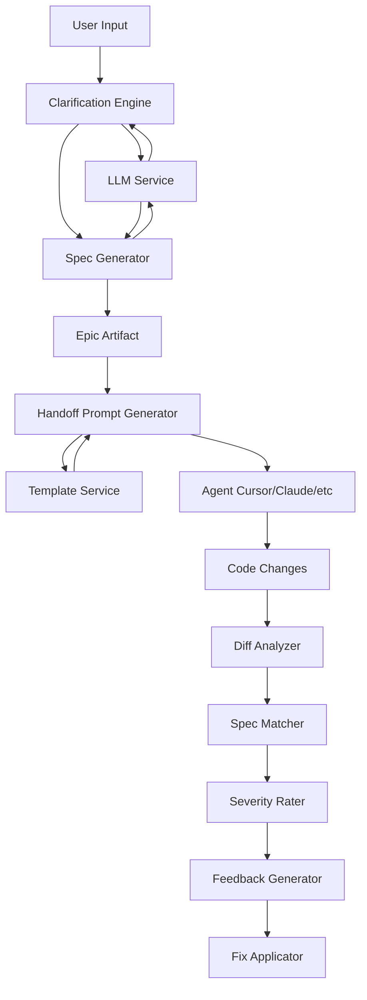

# Refactoring Analysis: Agent-Centric Architecture Pivot

# Refactoring Analysis: Agent-Centric Architecture Pivot

## Executive Summary

This analysis examines the impact of pivoting FlowGuard from a **utility-based LLM architecture** to an **agent-centric, template-driven architecture**. Since FlowGuard is currently in the specification phase with no existing codebase, this is technically a **design evolution** rather than a code refactoring. However, the analysis follows refactoring principles to ensure we understand the full scope of changes needed.

**Key Finding**: This pivot represents a fundamental architectural shift that will affect ~70% of the planned system design, particularly the core planning engine, verification system, and handoff mechanism.

---

## 1. Current State Architecture

### Current Design Philosophy (Utility-Based)

The existing spec treats LLMs as **utility services** that components call when needed:



**Key Characteristics**:
- **Component-Driven**: Components (ClarificationEngine, SpecGenerator, DiffAnalyzer) contain the business logic
- **LLM as Utility**: LLM providers (OpenAI, Anthropic, Local) are simple API wrappers
- **Linear Pipelines**: Verification follows a fixed pipeline (DiffAnalyzer → SpecMatcher → SeverityRater → FeedbackGen → FixApplicator)
- **Simple Templates**: Handlebars templates for formatting prompts per agent type
- **No Agent Concept**: No notion of specialized agents with different capabilities

### Current Component Inventory

| Component | Responsibility | LLM Usage |
|-----------|---------------|-----------|
| `ClarificationEngine` | Generate 2-3 targeted questions | Calls LLM to generate questions |
| `SpecGenerator` | Create Epic overview, phases, technical plan | Calls LLM to generate spec content |
| `HandoffPromptGenerator` | Format spec into agent-specific prompt | Uses Handlebars templates |
| `DiffAnalyzer` | Parse git diffs, extract changes | No LLM usage |
| `SpecMatcher` | Map code changes to spec requirements | Calls LLM for semantic matching |
| `SeverityRater` | Rate deviation severity | Calls LLM to classify severity |
| `FeedbackGenerator` | Create feedback report | Calls LLM to format findings |
| `FixApplicator` | Apply suggested fixes | No LLM usage |

### Current Data Flow

1. **Planning Flow**: User Goal → Clarification → Spec Generation → Epic Artifact
2. **Handoff Flow**: Epic Artifact → Template Selection → Prompt Generation → Copy to Agent
3. **Verification Flow**: Code Diff → Analysis → Matching → Rating → Feedback → Fix Suggestion

---

## 2. Dependency Map

### Who Calls What (Current Design)

**Core Dependencies**:
- `ClarificationEngine` → `LLMService.generateText()`
- `SpecGenerator` → `LLMService.generateText()`
- `SpecMatcher` → `LLMService.generateEmbedding()` (for semantic matching)
- `SeverityRater` → `LLMService.generateText()`
- `FeedbackGenerator` → `LLMService.generateText()`
- `HandoffPromptGenerator` → `TemplateService.render()` (Handlebars)

**Storage Dependencies**:
- All components → `StorageManager` (for reading/writing Epic artifacts)
- `ArtifactVersionControl` → `GitService` (for version tracking)

**UI Dependencies**:
- `SidebarProvider` → All core components (for displaying data)
- `WebviewProvider` → `VerificationResult`, `HandoffPrompt` (for rendering)

### Shared State & Side Effects

**Shared State**:
- **Epic Artifacts**: Stored in `.FlowGuard/epics/{epicId}/` directory
- **Configuration**: VS Code settings (`flowguard.*`)
- **API Keys**: VS Code SecretStorage
- **LLM Cache**: In-memory cache of LLM responses

**Side Effects**:
- **File System Writes**: Epic artifacts, verification results
- **Git Commits**: Automatic commits when artifacts change
- **LLM API Calls**: External API calls with rate limits and costs
- **VS Code UI Updates**: Sidebar, webviews, notifications

### API Boundaries

**Public Interfaces** (exposed to users/plugins):
- `FlowGuardPlugin` interface for extensibility
- `VerificationRule` interface for custom verification
- `PromptTemplate` interface for custom templates
- VS Code commands (`flowguard.createEpic`, `flowguard.verify`, etc.)

**Internal Interfaces**:
- `LLMProvider` interface (OpenAI, Anthropic, Local implementations)
- `StorageManager` interface (file system operations)
- Component interfaces (ClarificationEngine, SpecGenerator, etc.)

---

## 3. Risk Hotspots

### Critical Areas Requiring Careful Handling

#### 1. **Agent Orchestration & Coordination** 🔴 HIGH RISK

**Current State**: No orchestration - components call LLM directly

**New Requirement**: Multiple specialized agents need to coordinate
- Planning Agent creates specs
- Verification Critic Agent validates code
- Fix Generation Agent creates patches
- Code Generation Agent (external: Cursor, Claude, etc.)

**Risk**: 
- How do agents communicate? Do they share context?
- What if agents disagree (e.g., Planning Agent says "implement X", Verification Critic says "X violates spec")?
- Who orchestrates agent selection? User? System? Another agent?

**Why It's Risky**:
- No clear orchestration pattern in current design
- Agent coordination is complex (state management, error handling, fallbacks)
- Could lead to race conditions or conflicting actions

---

#### 2. **Prompt Template System Complexity** 🟡 MEDIUM RISK

**Current State**: Simple Handlebars templates per agent type

**New Requirement**: Sophisticated template system with:
- Template library (pre-built templates)
- Custom user templates
- Context-aware templates (adapt to project type, language, framework)
- Template variables and runtime substitution

**Risk**:
- Context-aware templates require deep codebase analysis (expensive)
- Template versioning and compatibility (what if template format changes?)
- Template security (user-created templates could inject malicious prompts)

**Why It's Risky**:
- Context-awareness requires significant intelligence (which framework? which patterns?)
- Template management adds complexity (storage, versioning, validation)
- User-created templates are untrusted input

---

#### 3. **Living Spec Engine Performance** 🟡 MEDIUM RISK

**Current State**: Verification is manual (user triggers it)

**New Requirement**: Continuous validation that code matches spec
- Watch file system for changes
- Automatically validate changes against spec
- Alert user when drift detected

**Risk**:
- Continuous validation could be CPU/memory intensive
- Large codebases (100k+ files) could overwhelm the system
- False positives could annoy users (alert fatigue)

**Why It's Risky**:
- File watching at scale is challenging
- LLM calls for every change could be expensive (cost, latency)
- Need smart debouncing/batching to avoid overwhelming the system

---

#### 4. **Verification Critic Agent - Automated Fix Generation** 🔴 HIGH RISK

**Current State**: Verification identifies issues, suggests fixes (manual application)

**New Requirement**: Agent automatically generates fixes
- Not just identify issues, but create patches
- Apply fixes automatically (with user approval)

**Risk**:
- Automated code changes are dangerous (could break working code)
- Fix quality depends on agent intelligence (could introduce bugs)
- Rollback mechanism needed (what if fix makes things worse?)

**Why It's Risky**:
- Automated code modification is high-stakes
- Agent could misunderstand context and generate wrong fix
- Need robust testing/validation before applying fixes

---

#### 5. **Backward Compatibility** 🟢 LOW RISK (for now)

**Current State**: No existing artifacts (greenfield project)

**Future Risk**: Once v1.0 ships, existing epics need to work with new agent system

**Mitigation**: Design artifact format to be forward-compatible from day one

---

## 4. Test Coverage Assessment

### Current State

**No existing code** = No tests yet

### Required Test Coverage for New Architecture

Given the complexity of the agent-centric architecture, comprehensive testing is critical:

#### Unit Tests (60% of test suite)
- **Agent Behavior**: Each agent's decision-making logic
- **Template System**: Template parsing, variable substitution, context-awareness
- **Living Spec Engine**: Drift detection, validation logic
- **Fix Generation**: Patch creation, safety validation

#### Integration Tests (30% of test suite)
- **Agent Coordination**: Multi-agent workflows (Planning → Verification → Fix)
- **Template + Agent**: Templates correctly invoke agents with right context
- **Living Spec + Verification**: Continuous validation triggers verification agent
- **End-to-End Flows**: Epic creation → Handoff → Verification → Fix

#### E2E Tests (10% of test suite)
- **Complete User Journeys**: Create epic → Generate handoff → Verify changes → Apply fix
- **Multi-Agent Scenarios**: Planning agent creates spec, verification critic validates, fix agent repairs
- **Performance Tests**: Large codebase (10k+ files), continuous validation

### Testing Challenges

1. **Agent Non-Determinism**: LLM-based agents are non-deterministic (same input ≠ same output)
   - **Solution**: Use mocking for unit tests, acceptance criteria for integration tests
   
2. **Agent Coordination Complexity**: Multi-agent workflows have many paths
   - **Solution**: State machine testing, property-based testing
   
3. **Template Context-Awareness**: Hard to test "does template adapt correctly?"
   - **Solution**: Fixture-based testing with known project types

---

## 5. Change Surface Area

### Components Affected by Agent-Centric Pivot

| Component | Impact Level | Reason |
|-----------|-------------|--------|
| **Planning Engine** | 🔴 **Complete Redesign** | Replace ClarificationEngine + SpecGenerator with Planning Agent |
| **Verification System** | 🔴 **Complete Redesign** | Replace pipeline with Verification Critic Agent |
| **Handoff System** | 🟡 **Major Changes** | Integrate Prompt Template System |
| **Storage Layer** | 🟡 **Major Changes** | Add Living Spec Engine support (continuous validation) |
| **LLM Integration** | 🟡 **Major Changes** | Evolve from utility to agent abstraction |
| **Plugin System** | 🟢 **Minor Changes** | Extend to support agent plugins |
| **UI Components** | 🟢 **Minor Changes** | Display agent status, template selection |
| **Configuration** | 🟢 **Minor Changes** | Add agent settings, template preferences |

### Estimated Scope

- **70% of core system** requires redesign or major changes
- **30% of system** (UI, config, storage) requires minor changes
- **New components** needed: Agent Orchestrator, Template Manager, Living Spec Engine

---

## 6. Key Observations

### What Works Well in Current Design

✅ **Plugin Architecture**: Already designed for extensibility - can be extended to support agent plugins

✅ **LLM Provider Abstraction**: Clean abstraction over OpenAI/Anthropic/Local - can be evolved to agent abstraction

✅ **Storage Layer**: Git-based artifact storage is solid - just needs Living Spec Engine hooks

✅ **Error Handling**: Comprehensive error handling strategy - applies to agents too

### What Needs Fundamental Change

❌ **Component-Driven Logic**: Components contain business logic - needs to move to agents

❌ **Linear Pipelines**: Verification pipeline is rigid - needs agent-based orchestration

❌ **Simple Templates**: Handlebars templates are too basic - need sophisticated template system

❌ **Manual Verification**: User-triggered verification - needs continuous validation

### Architectural Tensions

⚠️ **Simplicity vs. Intelligence**: Agent-centric architecture is more complex but more intelligent

⚠️ **Control vs. Automation**: Automated fix generation is powerful but risky

⚠️ **Performance vs. Continuous Validation**: Living Spec Engine could be resource-intensive

---

## 7. Questions for Validation

Before proceeding to the Approach document, I need to validate these findings:

### Agent Orchestration

1. **Agent Selection**: Should the system automatically select which agent to use, or should users choose?
   - Example: User creates epic → System automatically uses Planning Agent, or user selects "Use GPT-4 Planning Agent"?

2. **Agent Communication**: Should agents share context with each other?
   - Example: Verification Critic Agent sees Planning Agent's original spec, or works independently?

3. **Agent Fallback**: If an agent fails, what happens?
   - Example: Planning Agent fails → Fall back to simpler template-based generation? Retry with different agent?

### Template System

4. **Context Detection**: How does the system detect project context (framework, language, patterns)?
   - Example: Scan `package.json` for React? Parse imports? Ask user?

5. **Template Customization**: How much control do users have over templates?
   - Example: Full template editor? Just variable overrides? Pre-built templates only?

### Living Spec Engine

6. **Validation Frequency**: How often should the system validate code against spec?
   - Example: On every file save? Every 5 minutes? On git commit?

7. **Validation Scope**: Should it validate the entire codebase or just changed files?
   - Example: User changes one file → Validate just that file, or re-validate entire epic?

### Verification Critic Agent

8. **Fix Application**: Should fixes be applied automatically or require user approval?
   - Example: Agent generates fix → Auto-apply? Show preview first? Require explicit approval?

9. **Fix Confidence**: Should the agent indicate confidence level in fixes?
   - Example: "High confidence fix (90%)" vs "Low confidence fix (40%)" - different UX?

---

## 8. Next Steps

Once these questions are answered, I will create the **Refactoring Approach** document that defines:

1. **Key Decisions**: Agent orchestration strategy, template system design, Living Spec Engine architecture
2. **Target State**: What the agent-centric architecture looks like
3. **Component Architecture**: Core interfaces for agents, templates, orchestration
4. **Invariants**: What must NOT change (artifact format, VS Code API usage, etc.)
5. **Test Strategy**: How to test non-deterministic agents

---

## Appendix: Current vs. New Architecture Comparison

### Current Architecture (Utility-Based)

```
User Input
    ↓
[Clarification Engine] ──calls──> [LLM Service]
    ↓
[Spec Generator] ──calls──> [LLM Service]
    ↓
Epic Artifact
    ↓
[Handoff Prompt Generator] ──uses──> [Template Service]
    ↓
External Agent (Cursor/Claude)
    ↓
Code Changes
    ↓
[Diff Analyzer] → [Spec Matcher] → [Severity Rater] → [Feedback Gen]
                      ↓                ↓                  ↓
                  [LLM Service]    [LLM Service]     [LLM Service]
```

### New Architecture (Agent-Centric)

```
User Input
    ↓
[Agent Orchestrator]
    ↓
[Planning Agent] ──uses──> [Prompt Template System]
    ↓                            ↓
Epic Artifact              [Context Analyzer]
    ↓
[Handoff Generator] ──uses──> [Prompt Template System]
    ↓
External Agent (Cursor/Claude)
    ↓
Code Changes
    ↓
[Living Spec Engine] ──detects drift──> [Verification Critic Agent]
                                              ↓
                                    [Fix Generation Agent]
                                              ↓
                                        Automated Fixes
```

**Key Differences**:
- **Orchestration Layer**: New architecture has explicit orchestrator
- **Agents as First-Class**: Agents have specialized capabilities, not just LLM wrappers
- **Template System**: Sophisticated, context-aware templates
- **Continuous Validation**: Living Spec Engine watches for drift
- **Automated Fixes**: Verification Critic Agent generates fixes, not just identifies issues