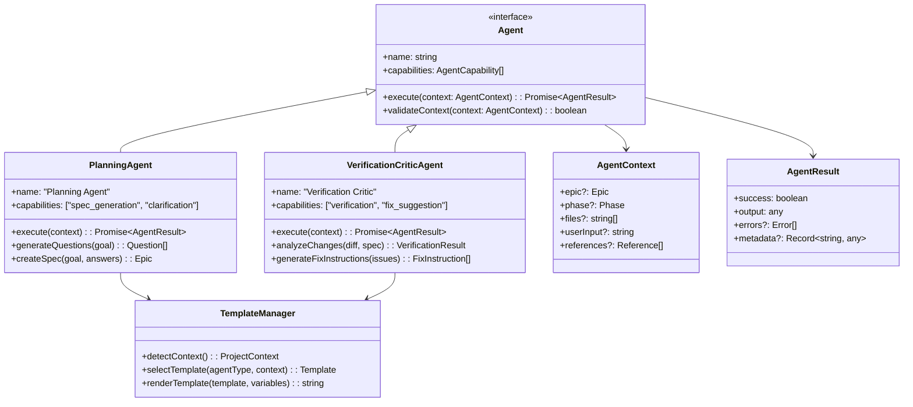
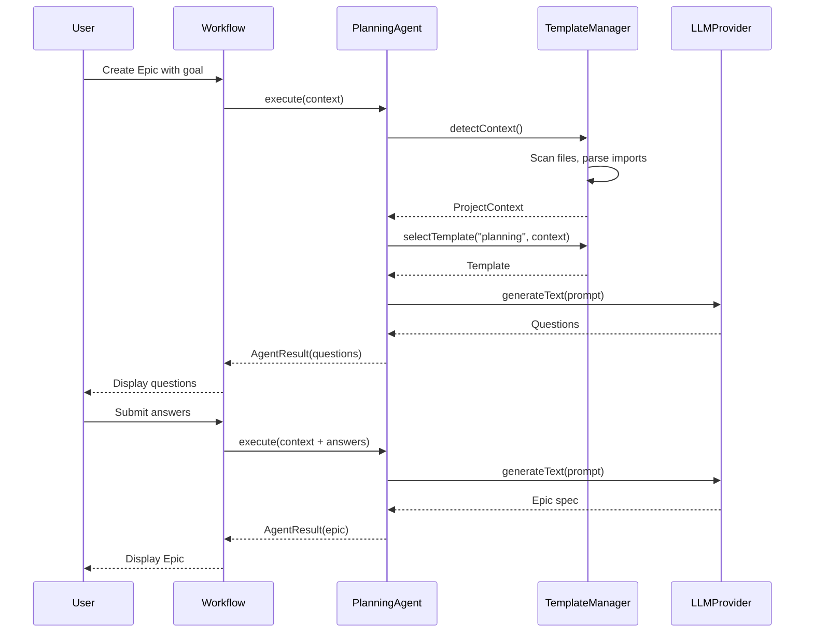
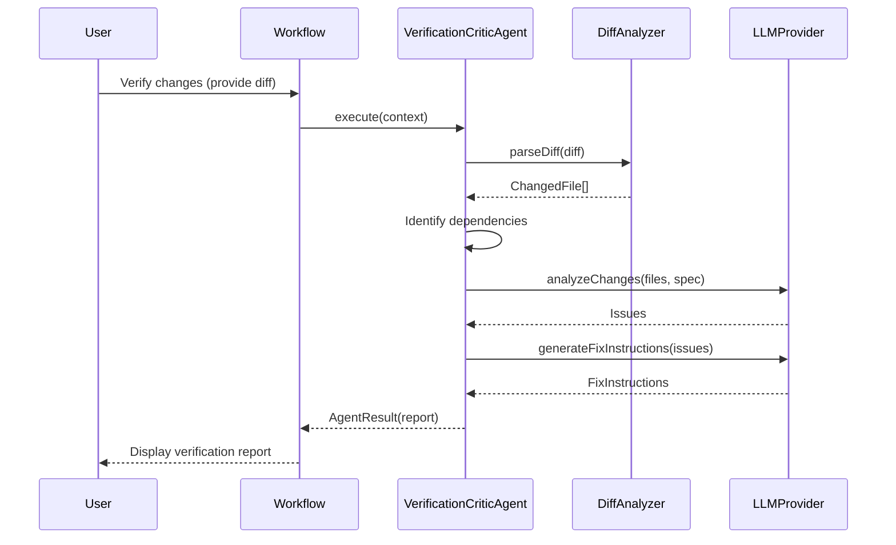

# Refactoring Approach: Agent-Centric Architecture

# Refactoring Approach: Agent-Centric Architecture

## Executive Summary

This document defines the technical approach for evolving FlowGuard from a **utility-based LLM architecture** to an **agent-centric, template-driven architecture**. Based on collaborative decision-making, we've chosen a **pragmatic, workflow-based approach** that prioritizes simplicity and intelligence over complex orchestration.

**Key Principles**:
- ✅ **Workflow-Based**: No complex agent orchestration - agents work within defined workflows
- ✅ **Context-Aware**: Follow industry patterns (Cursor/Windsurf) for context management
- ✅ **Template-Driven**: Pre-built, curated templates with automatic context detection
- ✅ **On-Demand Validation**: Manual trigger with smart scope (changed files + dependencies)
- ✅ **Intelligence First**: Smarter agents with specialized capabilities

---

## 1. Key Decisions

### 1.1 Architecture Decisions

#### Decision: Agent-Centric vs. Component-Driven

**Decision Made**: Pivot to **Agent-Centric Architecture** where agents are first-class citizens with specialized capabilities.

**Rationale**:
- **Current Problem**: Components (ClarificationEngine, SpecGenerator) contain business logic and call LLM as a utility. This limits intelligence and makes the system rigid.
- **Solution**: Agents encapsulate both logic and LLM capabilities, making them more intelligent and adaptable.
- **Example**: Instead of `SpecGenerator.generate()` calling `LLMService.generateText()`, we have `PlanningAgent.createSpec()` that understands planning deeply.

**Trade-offs**:
- ✅ **Gain**: More intelligent system, easier to add new agent types, better separation of concerns
- ❌ **Give Up**: Simpler component model, more code to write initially
- **Impact**: ~70% of core system needs redesign

---

#### Decision: No Agent Orchestration - Workflow-Based

**Decision Made**: **No complex agent orchestration**. Agents work within defined workflows, not orchestrated by a central system.

**Rationale**:
- **Complexity Avoidance**: Agent orchestration (deciding which agent to use, coordinating multiple agents) adds significant complexity
- **User Control**: Workflows give users explicit control over what happens when
- **Simplicity**: Each workflow step uses a specific agent - no dynamic agent selection

**Trade-offs**:
- ✅ **Gain**: Simple, predictable, easy to understand and debug
- ❌ **Give Up**: Dynamic agent selection, multi-agent coordination, emergent behavior
- **Impact**: Architecture is simpler than originally envisioned

**Implementation**:
```
Workflow: Create Epic
  Step 1: User provides goal
  Step 2: Planning Agent generates clarification questions
  Step 3: User answers questions
  Step 4: Planning Agent creates Epic spec
  
Workflow: Verify Changes
  Step 1: User provides diff/PR
  Step 2: Verification Critic Agent analyzes changes
  Step 3: Agent generates verification report with fix instructions
```

---

#### Decision: Context Management Pattern (Cursor/Windsurf Style)

**Decision Made**: Follow **industry-standard context management** patterns from Cursor/Windsurf.

**Rationale**:
- **Proven Patterns**: Cursor and Windsurf have solved context management well
- **User Familiarity**: Developers already know `@` symbols from these tools
- **Dynamic Loading**: Load context as needed, not all upfront (performance)

**Trade-offs**:
- ✅ **Gain**: Familiar UX, proven patterns, efficient context loading
- ❌ **Give Up**: Custom context system (but why reinvent the wheel?)
- **Impact**: Context system design is well-defined

**Implementation**:
- **@ Symbol System**: `@Epic`, `@Phase`, `@TechnicalPlan`, `@Files`, `@Folders`, `@Code`
- **Persistent Rules**: `.flowguard/rules` for project-specific guidelines
- **Dynamic Context**: Agents request context as needed via @ symbols
- **Automatic Context**: Current epic, recent changes, linter errors

---

### 1.2 Refactoring Decisions

#### Decision: Decomposition by Agent Type

**Decision Made**: Decompose by **agent specialization** (Planning Agent, Verification Critic Agent, Template Manager).

**Rationale**:
- **Separation of Concerns**: Each agent has a clear, focused responsibility
- **Extensibility**: Easy to add new agent types (e.g., Security Agent, Performance Agent)
- **Testability**: Each agent can be tested independently

**Trade-offs**:
- ✅ **Gain**: Clear boundaries, easy to extend, testable
- ❌ **Give Up**: Monolithic simplicity
- **Impact**: New directory structure: `src/agents/planning/`, `src/agents/verification/`, `src/agents/templates/`

---

#### Decision: Incremental Transition Strategy

**Decision Made**: **Incremental evolution** - build new agent system alongside current design, then migrate.

**Rationale**:
- **Risk Mitigation**: No big-bang rewrite - build and validate incrementally
- **Greenfield Advantage**: Since there's no existing code, we can build the right architecture from day one
- **Validation**: Can validate agent approach before committing fully

**Trade-offs**:
- ✅ **Gain**: Lower risk, can validate approach early
- ❌ **Give Up**: Slightly longer initial development
- **Impact**: Phase 1 builds agent foundation, Phase 2+ migrates workflows

**Order of Implementation**:
1. **Phase 1**: Build agent abstraction layer and Planning Agent
2. **Phase 2**: Build Verification Critic Agent
3. **Phase 3**: Build Template Manager with context detection
4. **Phase 4**: Integrate agents into workflows

---

#### Decision: Template System - Pre-Built Only

**Decision Made**: **Pre-built templates only** - curated library, no user modifications.

**Rationale**:
- **Quality Control**: Ensures all templates are high-quality and tested
- **Simplicity**: No template editor, validation, or versioning complexity
- **Sufficient**: Most users don't need custom templates - good defaults are enough

**Trade-offs**:
- ✅ **Gain**: Simple, consistent, high-quality templates
- ❌ **Give Up**: User customization, power user flexibility
- **Impact**: Template system is much simpler - just a library of curated templates

**Future Evolution**: Can add custom templates in v2.0 if users demand it.

---

#### Decision: Context Detection - Automatic

**Decision Made**: **Automatic context detection** - scan files, parse imports, analyze structure.

**Rationale**:
- **Zero User Effort**: Works automatically without user configuration
- **Accuracy**: Modern tools (Tree-sitter, TypeScript Compiler API) can detect frameworks reliably
- **Caching**: Detect once, cache results, re-detect only when project changes

**Trade-offs**:
- ✅ **Gain**: Zero user effort, works out of the box
- ❌ **Give Up**: Guaranteed accuracy (could be wrong), initial scan cost
- **Impact**: Need robust context detection logic

**Implementation**:
- Scan `package.json`, `requirements.txt`, `pom.xml` for dependencies
- Parse imports to detect frameworks (e.g., `import React` → React project)
- Analyze file structure (e.g., `src/components/` → React/Vue)
- Cache results in `.flowguard/context.json`

---

#### Decision: Validation - On-Demand with Smart Scope

**Decision Made**: **On-demand validation** (manual trigger) with **smart scope** (changed files + dependencies).

**Rationale**:
- **User Control**: User decides when to validate - no surprise costs or interruptions
- **Efficiency**: Smart scope validates only what's relevant (changed files + dependencies)
- **Simplicity**: No complex file watching, debouncing, or background processing

**Trade-offs**:
- ✅ **Gain**: Simple, predictable, efficient, user control
- ❌ **Give Up**: "Living" continuous validation, automatic drift detection
- **Impact**: "Living Spec Engine" is now "Smart Validation Engine"

**Implementation**:
- User triggers validation via command or UI button
- System identifies changed files (git diff since last validation)
- Analyzes dependencies (files that import changed files)
- Validates changed files + dependencies against Epic spec

---

#### Decision: Verification Report - Detailed Fix Instructions

**Decision Made**: Verification Critic Agent provides **detailed fix instructions**, not auto-applied fixes.

**Rationale**:
- **Safety**: Auto-applying fixes is risky - could break working code
- **User Control**: User reviews and decides whether to apply fixes
- **Transparency**: User understands what needs to change and why

**Trade-offs**:
- ✅ **Gain**: Safe, transparent, user control
- ❌ **Give Up**: Full automation, one-click fixes
- **Impact**: Verification report includes step-by-step fix instructions

**Report Format**:
```
Issue: Missing error handling in UserService.createUser()
Severity: High
Category: Spec Deviation

Problem:
The spec requires error handling for duplicate email addresses,
but the implementation doesn't check for this.

Fix Instructions:
1. Add try-catch block around user creation
2. Check for duplicate email error (code: 'ER_DUP_ENTRY')
3. Return appropriate error response to client

Suggested Code:
try {
  const user = await db.users.create(userData);
} catch (error) {
  if (error.code === 'ER_DUP_ENTRY') {
    throw new DuplicateEmailError();
  }
  throw error;
}
```

---

#### Decision: No Confidence Levels

**Decision Made**: **No confidence levels** - just report findings clearly.

**Rationale**:
- **Simplicity**: Confidence levels add complexity without clear value
- **Trust**: If agent reports an issue, it should be trustworthy - no need for confidence scores
- **Clarity**: Clear explanations are better than numeric confidence

**Trade-offs**:
- ✅ **Gain**: Simpler reports, less cognitive load
- ❌ **Give Up**: Nuanced uncertainty communication
- **Impact**: Verification reports are cleaner and more actionable

---

### 1.3 Design Decisions

#### Decision: Agent Interface Design

**Decision Made**: Define a **common Agent interface** that all agents implement.

**Rationale**:
- **Consistency**: All agents work the same way
- **Extensibility**: Easy to add new agent types
- **Testability**: Can mock agents for testing

**Interface**:
```typescript
interface Agent {
  name: string;
  capabilities: AgentCapability[];
  
  execute(context: AgentContext): Promise<AgentResult>;
  validateContext(context: AgentContext): boolean;
}

interface AgentContext {
  epic?: Epic;
  phase?: Phase;
  files?: string[];
  userInput?: string;
  references?: Reference[];  // @ symbol references
}

interface AgentResult {
  success: boolean;
  output: any;
  errors?: Error[];
  metadata?: Record<string, any>;
}
```

---

#### Decision: Template System Architecture

**Decision Made**: **Template Manager** with automatic context detection and pre-built template library.

**Rationale**:
- **Separation**: Template management is separate from agent logic
- **Reusability**: Templates can be used by multiple agents
- **Context-Aware**: Templates adapt based on detected project context

**Architecture**:
```typescript
interface TemplateManager {
  detectContext(): Promise<ProjectContext>;
  selectTemplate(agentType: string, context: ProjectContext): Template;
  renderTemplate(template: Template, variables: Record<string, any>): string;
}

interface ProjectContext {
  language: string;        // 'typescript', 'python', 'java'
  framework?: string;      // 'react', 'django', 'spring'
  patterns: string[];      // ['mvc', 'repository', 'service-layer']
  dependencies: Record<string, string>;
}

interface Template {
  id: string;
  name: string;
  agentType: string;
  applicableContexts: ProjectContext[];
  content: string;         // Template content with {{variables}}
  variables: TemplateVariable[];
}
```

---

## 2. Target State

### 2.1 What "Done" Looks Like

After this refactoring, FlowGuard will have:

**Agent-Centric Core**:
- ✅ **Planning Agent**: Creates Epic specs with clarification questions
- ✅ **Verification Critic Agent**: Analyzes code changes, generates detailed fix instructions
- ✅ **Template Manager**: Detects project context, selects appropriate templates

**Context Management**:
- ✅ **@ Symbol System**: `@Epic`, `@Phase`, `@Files`, `@Folders` for explicit context
- ✅ **Persistent Rules**: `.flowguard/rules` for project guidelines
- ✅ **Automatic Context**: Current epic, recent changes, linter errors
- ✅ **Dynamic Loading**: Context loaded on-demand, not all upfront

**Smart Validation**:
- ✅ **On-Demand Trigger**: User manually triggers validation
- ✅ **Smart Scope**: Validates changed files + their dependencies
- ✅ **Detailed Reports**: Clear findings with step-by-step fix instructions

**Template System**:
- ✅ **Automatic Detection**: Detects language, framework, patterns automatically
- ✅ **Pre-Built Library**: Curated templates for common scenarios
- ✅ **Context-Aware**: Templates adapt to project type

### 2.2 Properties of the Target State

**More Modular**:
- Agents are independent, focused modules
- Easy to add new agent types
- Clear separation of concerns

**More Testable**:
- Each agent can be tested independently
- Mock agents for integration tests
- Clear interfaces for testing

**More Intelligent**:
- Agents understand their domain deeply
- Context-aware templates adapt to project
- Smart validation focuses on relevant files

**Simpler**:
- No complex orchestration
- Workflow-based, predictable
- Pre-built templates only

### 2.3 Minimum Change to Achieve Goal

The minimum change is:

1. **Create Agent Abstraction**: Define `Agent` interface and base implementation
2. **Build Planning Agent**: Replace ClarificationEngine + SpecGenerator
3. **Build Verification Critic Agent**: Replace verification pipeline
4. **Build Template Manager**: Automatic context detection + template library
5. **Integrate into Workflows**: Update workflows to use agents

**What We're NOT Changing**:
- Storage layer (git-based artifacts)
- UI components (sidebar, webviews)
- Configuration system
- Plugin architecture

---

## 3. Component Architecture

### 3.1 Core Agent System



### 3.2 Planning Agent Architecture

**Responsibilities**:
- Generate clarification questions based on user goal
- Create Epic spec with overview, phases, technical plan
- Use templates appropriate for project context

**Core Interfaces**:

```typescript
interface PlanningAgent extends Agent {
  // Generate 2-3 targeted clarification questions
  generateQuestions(goal: string, context: ProjectContext): Promise<Question[]>;
  
  // Create Epic spec from goal and answers
  createSpec(goal: string, answers: Answer[], context: ProjectContext): Promise<Epic>;
  
  // Enrich spec with technical details
  enrichTechnicalPlan(epic: Epic, codebaseContext: CodebaseContext): Promise<TechnicalPlan>;
}

interface Question {
  id: string;
  text: string;
  type: 'scope' | 'technical' | 'priority';
  options?: string[];
}

interface Answer {
  questionId: string;
  value: string;
}
```

**Interaction Pattern**:



---

### 3.3 Verification Critic Agent Architecture

**Responsibilities**:
- Analyze code changes against Epic spec
- Identify deviations, missing features, incorrect implementations
- Generate detailed fix instructions

**Core Interfaces**:

```typescript
interface VerificationCriticAgent extends Agent {
  // Analyze changes against spec
  analyzeChanges(diff: DiffSource, epic: Epic): Promise<VerificationResult>;
  
  // Generate detailed fix instructions
  generateFixInstructions(issues: VerificationIssue[]): Promise<FixInstruction[]>;
  
  // Validate specific files against spec
  validateFiles(files: string[], epic: Epic): Promise<VerificationResult>;
}

interface FixInstruction {
  issueId: string;
  title: string;
  steps: string[];           // Step-by-step instructions
  suggestedCode?: string;    // Code snippet example
  references?: string[];     // Links to spec sections
}
```

**Interaction Pattern**:



---

### 3.4 Template Manager Architecture

**Responsibilities**:
- Detect project context (language, framework, patterns)
- Select appropriate template based on agent type and context
- Render template with variables

**Core Interfaces**:

```typescript
interface TemplateManager {
  // Detect project context automatically
  detectContext(): Promise<ProjectContext>;
  
  // Select best template for agent and context
  selectTemplate(agentType: string, context: ProjectContext): Template;
  
  // Render template with variables
  renderTemplate(template: Template, variables: Record<string, any>): string;
  
  // Get all templates for an agent type
  getTemplatesForAgent(agentType: string): Template[];
}

interface ProjectContext {
  language: string;              // 'typescript', 'python', 'java'
  framework?: string;            // 'react', 'django', 'spring'
  patterns: string[];            // ['mvc', 'repository', 'service-layer']
  dependencies: Record<string, string>;
  packageManager?: string;       // 'npm', 'yarn', 'pip', 'maven'
  testFramework?: string;        // 'jest', 'pytest', 'junit'
}

interface Template {
  id: string;
  name: string;
  agentType: 'planning' | 'verification';
  applicableContexts: ContextMatcher[];
  content: string;
  variables: TemplateVariable[];
  metadata: {
    description: string;
    author: string;
    version: string;
  };
}

interface ContextMatcher {
  language?: string;
  framework?: string;
  patterns?: string[];
}
```

**Context Detection Logic**:

```typescript
// Pseudo-code for context detection
async function detectContext(): Promise<ProjectContext> {
  const context: ProjectContext = {
    language: 'unknown',
    patterns: [],
    dependencies: {},
  };
  
  // Detect language and dependencies
  if (await fileExists('package.json')) {
    const pkg = await readJSON('package.json');
    context.language = 'typescript'; // or 'javascript'
    context.dependencies = pkg.dependencies;
    context.packageManager = await detectPackageManager();
    
    // Detect framework
    if (pkg.dependencies['react']) context.framework = 'react';
    if (pkg.dependencies['vue']) context.framework = 'vue';
    if (pkg.dependencies['express']) context.framework = 'express';
    
    // Detect test framework
    if (pkg.devDependencies['jest']) context.testFramework = 'jest';
  }
  
  if (await fileExists('requirements.txt')) {
    context.language = 'python';
    const deps = await readRequirements('requirements.txt');
    
    if (deps.includes('django')) context.framework = 'django';
    if (deps.includes('flask')) context.framework = 'flask';
    if (deps.includes('pytest')) context.testFramework = 'pytest';
  }
  
  // Detect patterns from file structure
  if (await directoryExists('src/controllers')) {
    context.patterns.push('mvc');
  }
  if (await directoryExists('src/repositories')) {
    context.patterns.push('repository');
  }
  
  // Cache context
  await writeJSON('.flowguard/context.json', context);
  
  return context;
}
```

---

### 3.5 Context Management System

**@ Symbol References**:

```typescript
interface Reference {
  type: 'epic' | 'phase' | 'file' | 'folder' | 'code' | 'docs';
  value: string;
  resolved?: any;  // Resolved content
}

// Examples:
// @Epic → Current epic
// @Phase:2 → Phase 2 of current epic
// @Files:src/services/UserService.ts → Specific file
// @Folders:src/services → All files in folder
// @Code:UserService.createUser → Specific function
```

**Persistent Rules**:

```typescript
// .flowguard/rules
{
  "codeStyle": {
    "indentation": "2 spaces",
    "quotes": "single",
    "semicolons": true
  },
  "conventions": {
    "fileNaming": "kebab-case",
    "componentNaming": "PascalCase",
    "testFilePattern": "*.test.ts"
  },
  "quality": {
    "maxFunctionLength": 50,
    "maxFileLength": 300,
    "requireTests": true
  }
}
```

**Dynamic Context Loading**:

```typescript
interface ContextLoader {
  // Load context based on @ references
  loadReferences(references: Reference[]): Promise<Record<string, any>>;
  
  // Get automatic context (current epic, recent changes, errors)
  getAutomaticContext(): Promise<AutomaticContext>;
}

interface AutomaticContext {
  currentEpic?: Epic;
  recentChanges: ChangedFile[];
  linterErrors: LinterError[];
  recentlyViewedFiles: string[];
}
```

---

## 4. Invariants

### 4.1 Behavioral Invariants

**Epic Artifact Format**:
- Epic artifacts MUST remain JSON-based and git-trackable
- Artifact structure MUST be backward compatible
- Epic metadata (id, title, status) MUST NOT change format

**Verification Behavior**:
- Verification MUST always be user-triggered (no automatic validation)
- Verification results MUST be deterministic for same input
- Verification MUST NOT modify code without user approval

**Template Rendering**:
- Templates MUST produce valid prompts for LLM providers
- Template variables MUST be validated before rendering
- Missing variables MUST cause clear error messages

### 4.2 Contract Invariants

**VS Code Extension API**:
- Commands MUST remain stable (`flowguard.createEpic`, `flowguard.verify`)
- Webview messages MUST be backward compatible
- Configuration schema MUST support migration from old versions

**Plugin API**:
- `FlowGuardPlugin` interface MUST remain stable
- Plugin activation lifecycle MUST NOT change
- Plugin context API MUST be backward compatible

### 4.3 Performance Invariants

**Extension Activation**:
- Extension activation MUST complete in < 500ms
- No blocking operations during activation
- Lazy-load agents on first use

**Context Detection**:
- Context detection MUST complete in < 5 seconds for typical projects
- Context MUST be cached and reused
- Re-detection only on significant project changes

**Validation**:
- Validation of 100 files MUST complete in < 30 seconds
- Smart scope MUST reduce validation time by 80%+ vs. full codebase
- Progress indication MUST be shown for long-running validations

### 4.4 Data Invariants

**Epic Artifacts**:
- Epic IDs MUST be UUID v4
- Epic artifacts MUST be valid JSON
- Git commits MUST be atomic (all artifact changes in one commit)

**Template Library**:
- Template IDs MUST be unique
- Templates MUST be immutable (versioned)
- Template content MUST be valid for target LLM provider

---

## 5. Test Strategy

### 5.1 Unit Testing Strategy

**Agent Testing**:

```typescript
describe('PlanningAgent', () => {
  it('generates 2-3 clarification questions', async () => {
    const agent = new PlanningAgent(mockLLMProvider);
    const questions = await agent.generateQuestions('Add user authentication');
    
    expect(questions.length).toBeGreaterThanOrEqual(2);
    expect(questions.length).toBeLessThanOrEqual(3);
  });
  
  it('creates Epic spec from goal and answers', async () => {
    const agent = new PlanningAgent(mockLLMProvider);
    const epic = await agent.createSpec(goal, answers, context);
    
    expect(epic.title).toBeDefined();
    expect(epic.phases.length).toBeGreaterThan(0);
    expect(epic.technicalPlan).toBeDefined();
  });
});

describe('VerificationCriticAgent', () => {
  it('identifies spec deviations', async () => {
    const agent = new VerificationCriticAgent(mockLLMProvider);
    const result = await agent.analyzeChanges(diff, epic);
    
    expect(result.issues).toContainEqual(
      expect.objectContaining({
        category: 'spec_deviation',
        severity: 'high',
      })
    );
  });
  
  it('generates detailed fix instructions', async () => {
    const agent = new VerificationCriticAgent(mockLLMProvider);
    const instructions = await agent.generateFixInstructions(issues);
    
    expect(instructions[0].steps.length).toBeGreaterThan(0);
    expect(instructions[0].suggestedCode).toBeDefined();
  });
});
```

**Template Manager Testing**:

```typescript
describe('TemplateManager', () => {
  it('detects React TypeScript project', async () => {
    mockFileSystem({
      'package.json': JSON.stringify({
        dependencies: { react: '^18.0.0' },
        devDependencies: { typescript: '^5.0.0' },
      }),
    });
    
    const context = await templateManager.detectContext();
    
    expect(context.language).toBe('typescript');
    expect(context.framework).toBe('react');
  });
  
  it('selects appropriate template for context', () => {
    const template = templateManager.selectTemplate('planning', {
      language: 'typescript',
      framework: 'react',
    });
    
    expect(template.applicableContexts).toContainEqual(
      expect.objectContaining({ framework: 'react' })
    );
  });
});
```

### 5.2 Integration Testing Strategy

**End-to-End Agent Workflows**:

```typescript
describe('Epic Creation Workflow', () => {
  it('creates epic from goal to artifact', async () => {
    // Step 1: Generate questions
    const questions = await planningAgent.generateQuestions('Add auth');
    
    // Step 2: User answers
    const answers = [
      { questionId: questions[0].id, value: 'JWT tokens' },
      { questionId: questions[1].id, value: 'Email/password' },
    ];
    
    // Step 3: Create spec
    const epic = await planningAgent.createSpec('Add auth', answers, context);
    
    // Step 4: Save artifact
    await storageManager.saveEpic(epic);
    
    // Verify
    const saved = await storageManager.loadEpic(epic.id);
    expect(saved.title).toContain('auth');
  });
});

describe('Verification Workflow', () => {
  it('verifies changes and generates fix instructions', async () => {
    // Setup: Create epic
    const epic = await createTestEpic();
    
    // Step 1: Make code changes
    const diff = await generateTestDiff();
    
    // Step 2: Verify
    const result = await verificationAgent.analyzeChanges(diff, epic);
    
    // Step 3: Generate fixes
    const fixes = await verificationAgent.generateFixInstructions(result.issues);
    
    // Verify
    expect(result.issues.length).toBeGreaterThan(0);
    expect(fixes.length).toBe(result.issues.length);
    expect(fixes[0].steps).toBeDefined();
  });
});
```

### 5.3 Handling Non-Deterministic Agents

**Challenge**: LLM-based agents are non-deterministic - same input doesn't guarantee same output.

**Solutions**:

1. **Mock LLM for Unit Tests**:
```typescript
const mockLLMProvider: LLMProvider = {
  generateText: jest.fn().mockResolvedValue('Mocked response'),
  generateEmbedding: jest.fn().mockResolvedValue([0.1, 0.2, 0.3]),
};
```

2. **Acceptance Criteria for Integration Tests**:
```typescript
it('generates valid Epic spec', async () => {
  const epic = await planningAgent.createSpec(goal, answers, context);
  
  // Don't check exact content, check structure and properties
  expect(epic).toMatchObject({
    id: expect.any(String),
    title: expect.any(String),
    phases: expect.arrayContaining([
      expect.objectContaining({
        title: expect.any(String),
        deliverables: expect.any(Array),
      }),
    ]),
  });
});
```

3. **Property-Based Testing**:
```typescript
it('always generates 2-3 questions', async () => {
  // Run 100 times with different inputs
  for (let i = 0; i < 100; i++) {
    const questions = await planningAgent.generateQuestions(randomGoal());
    expect(questions.length).toBeGreaterThanOrEqual(2);
    expect(questions.length).toBeLessThanOrEqual(3);
  }
});
```

### 5.4 Test Coverage Goals

- **Unit Tests**: 80% coverage of agent logic, template manager, context detection
- **Integration Tests**: All major workflows (epic creation, verification, handoff)
- **E2E Tests**: Critical user journeys with real LLM providers (in CI/CD)

---

## 6. Migration Path

### 6.1 Phase 1: Foundation (Week 1-2)

**Goal**: Build agent abstraction and core infrastructure

**Deliverables**:
- `Agent` interface and base implementation
- `AgentContext` and `AgentResult` types
- `TemplateManager` with context detection
- Template library (5-10 pre-built templates)

**Files**:
- `src/agents/base/Agent.ts`
- `src/agents/base/AgentContext.ts`
- `src/agents/base/AgentResult.ts`
- `src/agents/templates/TemplateManager.ts`
- `src/agents/templates/library/`

### 6.2 Phase 2: Planning Agent (Week 3-4)

**Goal**: Build Planning Agent to replace ClarificationEngine + SpecGenerator

**Deliverables**:
- `PlanningAgent` implementation
- Question generation logic
- Epic spec creation logic
- Integration with Template Manager

**Files**:
- `src/agents/planning/PlanningAgent.ts`
- `src/agents/planning/QuestionGenerator.ts`
- `src/agents/planning/SpecCreator.ts`

### 6.3 Phase 3: Verification Critic Agent (Week 5-6)

**Goal**: Build Verification Critic Agent to replace verification pipeline

**Deliverables**:
- `VerificationCriticAgent` implementation
- Change analysis logic
- Fix instruction generation
- Smart scope dependency analysis

**Files**:
- `src/agents/verification/VerificationCriticAgent.ts`
- `src/agents/verification/ChangeAnalyzer.ts`
- `src/agents/verification/FixInstructionGenerator.ts`
- `src/agents/verification/DependencyAnalyzer.ts`

### 6.4 Phase 4: Integration (Week 7-8)

**Goal**: Integrate agents into workflows and UI

**Deliverables**:
- Update workflows to use agents
- Update UI to display agent results
- Context management system (@ symbols, rules)
- End-to-end testing

**Files**:
- `src/workflows/createEpic.ts` (updated)
- `src/workflows/verifyChanges.ts` (updated)
- `src/context/ContextLoader.ts`
- `src/context/ReferenceResolver.ts`

---

## 7. Risk Mitigation

### 7.1 Agent Reliability

**Risk**: Agents might produce low-quality or incorrect output

**Mitigation**:
- Comprehensive prompt engineering and testing
- Validation of agent output (schema validation, sanity checks)
- Fallback to simpler templates if agent fails
- User feedback loop to improve prompts

### 7.2 Context Detection Accuracy

**Risk**: Automatic context detection might be wrong

**Mitigation**:
- Cache detected context in `.flowguard/context.json`
- Allow manual override via configuration
- Show detected context to user for confirmation
- Re-detect only on significant project changes

### 7.3 Performance

**Risk**: Smart scope dependency analysis might be slow

**Mitigation**:
- Cache dependency graph
- Incremental updates (only re-analyze changed files)
- Limit dependency depth (e.g., max 2 levels)
- Show progress indicator for long operations

### 7.4 Template Quality

**Risk**: Pre-built templates might not cover all scenarios

**Mitigation**:
- Start with 10-15 high-quality templates for common scenarios
- Gather user feedback on template quality
- Iterate and improve templates based on usage
- Plan for custom templates in v2.0 if needed

---

## 8. Success Criteria

### 8.1 Functional Success

- ✅ Planning Agent generates 2-3 relevant clarification questions
- ✅ Planning Agent creates comprehensive Epic specs
- ✅ Verification Critic Agent identifies spec deviations accurately
- ✅ Verification Critic Agent generates actionable fix instructions
- ✅ Template Manager detects project context correctly (>90% accuracy)
- ✅ Smart scope reduces validation time by 80%+ vs. full codebase

### 8.2 Quality Success

- ✅ 80%+ unit test coverage
- ✅ All major workflows have integration tests
- ✅ E2E tests pass with real LLM providers
- ✅ No regressions in existing functionality

### 8.3 User Experience Success

- ✅ Epic creation workflow feels natural and intelligent
- ✅ Verification reports are clear and actionable
- ✅ Context detection works automatically without user intervention
- ✅ @ symbol references work like Cursor/Windsurf

---

## 9. Open Questions & Future Considerations

### 9.1 Resolved Questions

✅ **Agent Orchestration**: No orchestration - workflow-based  
✅ **Context Sharing**: Follow Cursor/Windsurf patterns  
✅ **Template Customization**: Pre-built only  
✅ **Validation Frequency**: On-demand  
✅ **Validation Scope**: Smart scope (changed + dependencies)  
✅ **Fix Application**: Detailed instructions, not auto-apply  
✅ **Confidence Levels**: No confidence levels  

### 9.2 Future Considerations (v2.0+)

**Custom Templates**:
- If users demand customization, add template editor in v2.0
- Template marketplace for sharing community templates
- Template versioning and migration

**Additional Agents**:
- Security Agent (scan for vulnerabilities)
- Performance Agent (identify performance issues)
- Documentation Agent (generate/update docs)

**Advanced Context**:
- Multi-repo context (monorepo support)
- Cross-epic context (reference other epics)
- Historical context (learn from past epics)

**Continuous Validation**:
- If users want automatic validation, add in v2.0
- Smart triggers (git commit, significant changes)
- Background validation with notifications

---

## Appendix: Architecture Comparison

### Before (Utility-Based)

```
User Input
    ↓
[ClarificationEngine] ──calls──> [LLMService]
    ↓
[SpecGenerator] ──calls──> [LLMService]
    ↓
Epic Artifact
    ↓
[HandoffPromptGenerator] ──uses──> [Template Service]
    ↓
External Agent
    ↓
Code Changes
    ↓
[DiffAnalyzer] → [SpecMatcher] → [SeverityRater] → [FeedbackGen]
```

### After (Agent-Centric)

```
User Input
    ↓
[Planning Agent] ──uses──> [Template Manager]
    ↓                           ↓
Epic Artifact              [Context Detection]
    ↓
[Handoff Generator] ──uses──> [Template Manager]
    ↓
External Agent
    ↓
Code Changes
    ↓
[Verification Critic Agent] ──uses──> [Template Manager]
    ↓                                       ↓
Verification Report                  [Smart Scope Analysis]
    ↓
Fix Instructions
```

**Key Improvements**:
- Agents are first-class, not utilities
- Template Manager provides context-aware templates
- Smart scope reduces validation overhead
- Clearer separation of concerns
- More testable and extensible