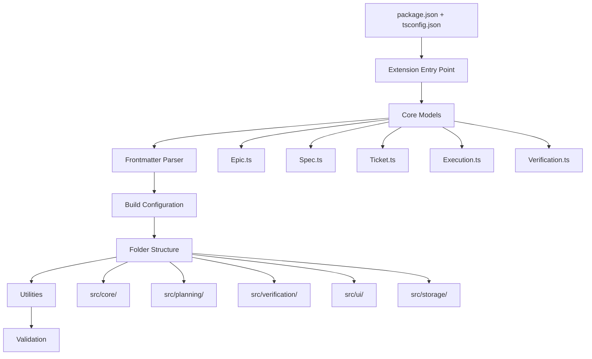

I have created the following plan after thorough exploration and analysis of the codebase. Follow the below plan verbatim. Trust the files and references. Do not re-verify what's written in the plan. Explore only when absolutely necessary. First implement all the proposed file changes and then I'll review all the changes together at the end.

## Observations

The workspace is currently empty except for documentation files, making this a greenfield VS Code extension project. The specs define a local-first artifact management system following model-app patterns with YAML frontmatter + Markdown content. The architecture separates concerns between specs (what/why), tickets (how), executions (tracking), and verifications (quality). Core models include Epic, Spec, Ticket, Execution, and Verification with structured TypeScript interfaces already defined in the specifications.

## Approach

The foundation phase establishes the VS Code extension scaffold and core data models without implementing business logic (storage, planning, verification). We'll use modern TypeScript with strict type checking, `gray-matter` for frontmatter parsing, and follow VS Code extension best practices. The folder structure mirrors the modular architecture defined in the specs, creating clear separation between core models, storage, planning, verification, and UI layers. This foundation enables subsequent phases to build upon well-defined interfaces and a clean project structure.

## Implementation Steps

### 1. Initialize Extension Project Structure

Create the root-level configuration files and folder structure:

**Create `file:package.json`** with VS Code extension manifest:
- Set `name` to `flowguard`, `publisher` to your identifier
- Define `engines.vscode` as `^1.80.0` for modern VS Code compatibility
- Set `main` to `./out/extension.js` (compiled output)
- Add `activationEvents`: `["onStartupFinished"]` for lazy activation
- Define `categories`: `["Other"]` or `["Project Management"]`
- Include `contributes` section (empty for now, will be populated in later phases)
- Add dependencies: `@types/vscode` (devDependency), `gray-matter` (dependency), `uuid` (dependency)
- Add devDependencies: `typescript`, `@types/node`, `esbuild` or `webpack`, `@vscode/test-electron`
- Define scripts: `compile`, `watch`, `test`, `package`

**Create `file:tsconfig.json`** with modern TypeScript configuration:
- Set `compilerOptions.target` to `ES2022`
- Set `compilerOptions.module` to `CommonJS` (VS Code extensions use CommonJS)
- Set `compilerOptions.moduleResolution` to `node`
- Enable strict mode: `strict: true`, `noUncheckedIndexedAccess: true`
- Set `rootDir` to `./src`, `outDir` to `./out`
- Enable `incremental: true`, `skipLibCheck: true`, `isolatedModules: true`
- Set `esModuleInterop: true`, `forceConsistentCasingInFileNames: true`
- Add `lib`: `["ES2022"]`
- Configure `include`: `["src/**/*"]`, `exclude`: `["node_modules", "out"]`

**Create `file:.vscodeignore`** to exclude files from extension package:
- Exclude: `src/`, `tsconfig.json`, `node_modules/`, `.git/`, `*.md` (except README)

**Create `file:README.md`** with basic extension description:
- Title: "FlowGuard - AI-Powered Development Workflow Manager"
- Brief description of epic/spec/ticket management
- Installation instructions (placeholder for Marketplace)
- Basic usage overview

**Create `file:.gitignore`**:
- Exclude: `node_modules/`, `out/`, `*.vsix`, `.vscode-test/`

**Create folder structure**:
```
src/
├── core/
│   └── models/
├── planning/
├── verification/
├── ui/
└── storage/
```

### 2. Implement Extension Entry Point

**Create `file:src/extension.ts`**:
- Import `vscode` module
- Export `activate(context: vscode.ExtensionContext): void` function
  - Log activation message: `console.log('FlowGuard extension activated')`
  - Store `context.extensionPath` for later use
  - Initialize extension state (placeholder for now)
  - Register disposables with `context.subscriptions.push()`
- Export `deactivate(): void` function
  - Log deactivation message
  - Cleanup resources (placeholder for now)
- Add JSDoc comments explaining the lifecycle

### 3. Define Core Data Models

**Create `file:src/core/models/Epic.ts`**:
- Define `Epic` interface matching spec lines 442-453:
  - `id: string` (UUID v4)
  - `title: string`
  - `overview: string` (Markdown content)
  - `phases: Phase[]`
  - `technicalPlan: TechnicalPlan`
  - `diagrams: Diagram[]`
  - `metadata: EpicMetadata`
  - `status: EpicStatus`
  - `createdAt: Date`
  - `updatedAt: Date`
- Define `EpicMetadata` interface (lines 496-502)
- Define `EpicStatus` type union (lines 504-511)
- Define `Phase` interface (lines 455-467)
- Define `PhaseStatus` type union (lines 513-517)
- Define `Deliverable` interface (referenced but not detailed in spec)
- Add JSDoc comments for each interface/type

**Create `file:src/core/models/TechnicalPlan.ts`**:
- Define `TechnicalPlan` interface (lines 469-477)
- Define `FileChange` interface (lines 479-486)
- Define `Dependency` interface (referenced but not detailed)
- Define `EdgeCase` interface (referenced but not detailed)
- Define `NonFunctionalRequirement` interface (referenced but not detailed)
- Define `TestingStrategy` interface (referenced but not detailed)

**Create `file:src/core/models/Diagram.ts`**:
- Define `Diagram` interface (lines 488-494)
- Define `DiagramType` type union: `'sequence' | 'architecture' | 'flow' | 'class' | 'state'`

**Create `file:src/core/models/Spec.ts`** based on refactoring spec (lines 136-148):
- Define `Spec` interface with frontmatter fields:
  - `id: string`
  - `epicId: string`
  - `title: string`
  - `status: SpecStatus`
  - `createdAt: Date`
  - `updatedAt: Date`
  - `author: string`
  - `tags: string[]`
  - `content: string` (Markdown body)
- Define `SpecStatus` type: `'draft' | 'in_review' | 'approved' | 'archived'`

**Create `file:src/core/models/Ticket.ts`** based on refactoring spec (lines 351-366):
- Define `Ticket` interface with frontmatter fields:
  - `id: string`
  - `epicId: string`
  - `specId: string`
  - `title: string`
  - `status: TicketStatus`
  - `priority: Priority`
  - `assignee?: string`
  - `estimatedEffort?: string`
  - `createdAt: Date`
  - `updatedAt: Date`
  - `tags: string[]`
  - `content: string` (Markdown body with acceptance criteria, steps, etc.)
- Define `TicketStatus` type: `'todo' | 'in_progress' | 'in_review' | 'done' | 'blocked'`
- Define `Priority` type: `'low' | 'medium' | 'high' | 'critical'`

**Create `file:src/core/models/Execution.ts`**:
- Define `Execution` interface (execution tracking for handoffs):
  - `id: string`
  - `epicId: string`
  - `specIds: string[]`
  - `ticketIds: string[]`
  - `agentType: AgentType`
  - `handoffPrompt: string`
  - `status: ExecutionStatus`
  - `startedAt: Date`
  - `completedAt?: Date`
  - `results?: ExecutionResults`
- Define `AgentType` type (lines 534-540): `'cursor' | 'claude' | 'windsurf' | 'cline' | 'aider' | 'custom'`
- Define `ExecutionStatus` type: `'pending' | 'in_progress' | 'completed' | 'failed'`
- Define `ExecutionResults` interface (placeholder for diff summaries, agent notes)

**Create `file:src/core/models/Verification.ts`**:
- Define `Verification` interface matching spec lines 591-599:
  - `id: string`
  - `epicId: string`
  - `diffSource: DiffSource`
  - `analysis: DiffAnalysis`
  - `issues: VerificationIssue[]`
  - `summary: VerificationSummary`
  - `createdAt: Date`
- Define `DiffSource` interface (lines 601-605)
- Define `DiffAnalysis` interface (lines 607-612)
- Define `ChangedFile` interface (lines 614-619)
- Define `Change` interface (lines 621-626)
- Define `VerificationIssue` interface (lines 628-639)
- Define `Severity` type (line 641)
- Define `IssueCategory` type (lines 643-650)
- Define `SuggestedFix` interface (lines 652-657)
- Define `VerificationSummary` interface (lines 659-667)

**Create `file:src/core/models/index.ts`**:
- Re-export all models from a single entry point
- Example: `export * from './Epic'`, `export * from './Spec'`, etc.

### 4. Implement Frontmatter Parser/Serializer

**Create `file:src/core/parsers/frontmatter.ts`**:
- Import `gray-matter` library
- Define `FrontmatterDocument<T>` generic interface:
  - `data: T` (typed frontmatter data)
  - `content: string` (Markdown body)
- Implement `parseFrontmatter<T>(markdown: string): FrontmatterDocument<T>` function:
  - Use `matter(markdown)` to parse
  - Return `{ data: result.data as T, content: result.content }`
  - Add error handling for invalid YAML
- Implement `serializeFrontmatter<T>(data: T, content: string): string` function:
  - Use `matter.stringify(content, data)` to serialize
  - Return formatted markdown string with YAML frontmatter
- Add unit test helpers for common artifact types (Spec, Ticket, Execution)

**Create `file:src/core/parsers/index.ts`**:
- Re-export frontmatter utilities

### 5. Set Up Build Configuration

**Create `file:webpack.config.js`** (or `esbuild.config.js` for faster builds):
- Configure entry point: `./src/extension.ts`
- Set output: `./out/extension.js`
- Set target: `node` (VS Code extensions run in Node.js)
- Configure externals: `{ vscode: 'commonjs vscode' }` (don't bundle VS Code API)
- Enable source maps for debugging
- Set mode based on environment: `production` or `development`

**Update `file:package.json` scripts**:
- `"compile": "webpack --mode production"` or `"esbuild src/extension.ts --bundle --outfile=out/extension.js --external:vscode --format=cjs --platform=node"`
- `"watch": "webpack --mode development --watch"` or equivalent for esbuild
- `"pretest": "npm run compile"`
- `"test": "node ./out/test/runTest.js"` (placeholder for testing phase)

### 6. Create Basic Folder Structure Placeholders

**Create placeholder files** to establish folder structure (will be implemented in later phases):

- `file:src/core/config/.gitkeep` (configuration management - Phase 10)
- `file:src/storage/.gitkeep` (artifact storage - Phase 2)
- `file:src/planning/.gitkeep` (planning engine - Phases 3-4)
- `file:src/verification/.gitkeep` (verification engine - Phase 5)
- `file:src/ui/.gitkeep` (UI components - Phases 6-8)
- `file:src/handoff/.gitkeep` (handoff system - Phase 6)
- `file:src/commands/.gitkeep` (VS Code commands - Phase 9)
- `file:src/utils/.gitkeep` (shared utilities)

**Create `file:src/utils/logger.ts`** (basic logging utility):
- Import `vscode.window` for output channel
- Create `OutputChannel` instance: `vscode.window.createOutputChannel('FlowGuard')`
- Export `log(message: string)`, `error(message: string)`, `warn(message: string)` functions
- Use `outputChannel.appendLine()` for logging

**Create `file:src/utils/uuid.ts`** (UUID generation helper):
- Import `uuid` library (`v4` function)
- Export `generateUUID(): string` function wrapping `v4()`

### 7. Validation and Testing Setup

**Create `file:.vscode/launch.json`** for debugging:
- Add "Extension" configuration with `type: "extensionHost"`
- Set `request: "launch"`
- Configure `args: ["--extensionDevelopmentPath=${workspaceFolder}"]`
- Set `outFiles: ["${workspaceFolder}/out/**/*.js"]`
- Enable source maps

**Create `file:.vscode/tasks.json`** for build tasks:
- Add "npm: watch" task for continuous compilation
- Set as default build task
- Configure problem matcher for TypeScript

**Verify compilation**:
- Run `npm install` to install dependencies
- Run `npm run compile` to verify TypeScript compilation succeeds
- Check `out/` directory contains compiled JavaScript
- Verify no TypeScript errors

**Test extension activation**:
- Press F5 in VS Code to launch Extension Development Host
- Verify "FlowGuard extension activated" appears in Debug Console
- Check no runtime errors occur

### 8. Documentation

**Create `file:src/core/models/README.md`**:
- Document the purpose of each model
- Explain the relationship between Epic, Spec, Ticket, Execution, Verification
- Provide examples of each interface usage
- Reference the model-app pattern for artifact structure

**Update `file:README.md`**:
- Add "Development" section with build instructions
- Add "Architecture" section referencing core models
- Add "Contributing" section (placeholder)

## Deliverables



### Key Files Created

| File | Purpose |
|------|---------|
| `file:package.json` | VS Code extension manifest with dependencies |
| `file:tsconfig.json` | TypeScript compiler configuration |
| `file:src/extension.ts` | Extension activation/deactivation entry point |
| `file:src/core/models/Epic.ts` | Epic data model with Phase, Metadata, Status types |
| `file:src/core/models/Spec.ts` | Spec artifact model with frontmatter structure |
| `file:src/core/models/Ticket.ts` | Ticket artifact model with acceptance criteria |
| `file:src/core/models/Execution.ts` | Execution tracking model for handoffs |
| `file:src/core/models/Verification.ts` | Verification result model with issues/severity |
| `file:src/core/models/TechnicalPlan.ts` | Technical plan with file changes, dependencies |
| `file:src/core/models/Diagram.ts` | Diagram model for Mermaid visualizations |
| `file:src/core/parsers/frontmatter.ts` | YAML frontmatter parser/serializer using gray-matter |
| `file:src/utils/logger.ts` | Logging utility using VS Code output channel |
| `file:src/utils/uuid.ts` | UUID generation helper |
| `file:webpack.config.js` | Build configuration for bundling |

### Folder Structure Established

```
flowguard/
├── src/
│   ├── extension.ts
│   ├── core/
│   │   ├── models/
│   │   │   ├── Epic.ts
│   │   │   ├── Spec.ts
│   │   │   ├── Ticket.ts
│   │   │   ├── Execution.ts
│   │   │   ├── Verification.ts
│   │   │   ├── TechnicalPlan.ts
│   │   │   ├── Diagram.ts
│   │   │   └── index.ts
│   │   └── parsers/
│   │       ├── frontmatter.ts
│   │       └── index.ts
│   ├── storage/
│   ├── planning/
│   ├── verification/
│   ├── ui/
│   ├── handoff/
│   ├── commands/
│   └── utils/
│       ├── logger.ts
│       └── uuid.ts
├── out/ (generated)
├── package.json
├── tsconfig.json
├── webpack.config.js
├── .gitignore
├── .vscodeignore
└── README.md
```

### Success Criteria

- ✅ Extension compiles without TypeScript errors
- ✅ Extension activates successfully in Extension Development Host
- ✅ All core models defined with proper TypeScript interfaces
- ✅ Frontmatter parser can parse/serialize YAML + Markdown
- ✅ Folder structure matches architectural design
- ✅ Build configuration produces bundled output
- ✅ No runtime errors during activation/deactivation