I have created the following plan after thorough exploration and analysis of the codebase. Follow the below plan verbatim. Trust the files and references. Do not re-verify what's written in the plan. Explore only when absolutely necessary. First implement all the proposed file changes and then I'll review all the changes together at the end.

## Observations

The codebase already has basic LLM configuration in `package.json` and a `file:src/llm/config.ts` that reads settings from VS Code workspace configuration and environment variables. There's rudimentary secret storage for API keys using VS Code's `SecretStorage` API. Custom handoff templates can be saved to `.flowguard/templates/`. The extension uses a centralized logger in `file:src/utils/logger.ts`. Configuration is currently accessed directly via `vscode.workspace.getConfiguration()` in multiple places without centralized management or validation.

## Approach

Create a comprehensive configuration system with a centralized `ConfigurationManager` that provides type-safe access to all settings, validates values, and notifies listeners of changes. Expand the configuration schema in `package.json` to include settings for templates, telemetry, performance tuning, and feature toggles. Enhance the existing secret storage implementation into a dedicated `SecureStorage` class that manages API keys for multiple LLM providers. Add configuration watchers to automatically update services when settings change, ensuring the extension reacts dynamically to user preferences without requiring restarts.

## Implementation Steps

### 1. Expand Configuration Schema in `package.json`

Add comprehensive configuration properties to the `contributes.configuration.properties` section:

**LLM Provider Settings** (expand existing):
- `flowguard.llm.maxTokens` - Number input (default: 4096, min: 100, max: 128000)
- `flowguard.llm.timeout` - Number input in milliseconds (default: 60000, min: 5000, max: 300000)
- `flowguard.llm.retryAttempts` - Number input (default: 3, min: 0, max: 10)
- `flowguard.llm.streamResponses` - Boolean (default: false)

**Template Settings**:
- `flowguard.templates.defaultAgent` - Enum: `['cursor', 'claude', 'windsurf', 'cline', 'aider', 'custom']` (default: 'cursor')
- `flowguard.templates.customPath` - String path to custom templates directory
- `flowguard.templates.includeCodebaseContext` - Boolean (default: true)
- `flowguard.templates.maxCodebaseFiles` - Number (default: 50, min: 10, max: 500)

**Editor Settings**:
- `flowguard.editor.autoSave` - Boolean (default: true)
- `flowguard.editor.autoSaveDelay` - Number in milliseconds (default: 30000, min: 1000, max: 300000)
- `flowguard.editor.enableDiagramPreview` - Boolean (default: true)

**Codebase Scanning Settings**:
- `flowguard.codebase.maxFilesToScan` - Number (default: 1000, min: 100, max: 10000)
- `flowguard.codebase.excludePatterns` - Array of strings (default: `['node_modules', 'dist', 'build', '.git']`)
- `flowguard.codebase.includePatterns` - Array of strings (default: `['**/*.ts', '**/*.js', '**/*.py']`)
- `flowguard.codebase.enableIncrementalScan` - Boolean (default: true)

**Verification Settings**:
- `flowguard.verification.autoVerifyOnSave` - Boolean (default: false)
- `flowguard.verification.minimumSeverity` - Enum: `['Critical', 'High', 'Medium', 'Low']` (default: 'Medium')
- `flowguard.verification.enableAutoFix` - Boolean (default: false)

**Telemetry Settings**:
- `flowguard.telemetry.enabled` - Boolean (default: false)
- `flowguard.telemetry.includeErrorReports` - Boolean (default: false)

**General Settings**:
- `flowguard.general.logLevel` - Enum: `['DEBUG', 'INFO', 'WARN', 'ERROR']` (default: 'INFO')
- `flowguard.general.showWelcomeOnStartup` - Boolean (default: true)

Add descriptions for each setting explaining its purpose and impact.

### 2. Create Configuration Types in `src/core/config/types.ts`

Define TypeScript interfaces for all configuration sections:

```typescript
export interface FlowGuardConfiguration {
  llm: LLMConfiguration;
  templates: TemplateConfiguration;
  editor: EditorConfiguration;
  codebase: CodebaseConfiguration;
  verification: VerificationConfiguration;
  telemetry: TelemetryConfiguration;
  general: GeneralConfiguration;
}
```

Create individual interfaces for each section matching the schema defined in `package.json`. Include validation constraints as JSDoc comments.

### 3. Implement `ConfigurationManager` in `src/core/config/ConfigurationManager.ts`

Create a singleton class that:

**Core Functionality**:
- Provides type-safe getters for all configuration sections (e.g., `getLLMConfig()`, `getTemplateConfig()`)
- Implements setters that update VS Code workspace configuration
- Caches configuration values to avoid repeated VS Code API calls
- Invalidates cache when configuration changes

**Configuration Access Methods**:
- `get<T>(section: string, key: string): T | undefined` - Generic getter
- `set<T>(section: string, key: string, value: T): Promise<void>` - Generic setter
- `getAll(): FlowGuardConfiguration` - Returns complete configuration object
- `reset(section?: string): Promise<void>` - Resets to defaults

**Validation**:
- `validate(config: Partial<FlowGuardConfiguration>): ValidationResult` - Validates configuration object
- `validateValue(section: string, key: string, value: any): boolean` - Validates individual values
- Implement validation rules (min/max for numbers, enum values, path existence, etc.)

**Change Notification**:
- `onDidChangeConfiguration(listener: (e: ConfigurationChangeEvent) => void): Disposable` - Register change listeners
- Emit events when configuration changes with details about what changed
- Support filtering listeners by configuration section

**Integration with Existing Config**:
- Migrate logic from `file:src/llm/config.ts` into this manager
- Maintain backward compatibility with environment variable fallbacks
- Integrate with `SecureStorage` for API keys

### 4. Implement `SecureStorage` in `src/core/config/SecureStorage.ts`

Enhance the existing secret storage implementation:

**API Key Management**:
- `storeApiKey(provider: LLMProviderType, apiKey: string): Promise<void>` - Store provider-specific API key
- `getApiKey(provider: LLMProviderType): Promise<string | undefined>` - Retrieve API key
- `deleteApiKey(provider: LLMProviderType): Promise<void>` - Remove API key
- `hasApiKey(provider: LLMProviderType): Promise<boolean>` - Check if key exists

**Key Naming Convention**:
- Use format: `flowguard.apiKey.{provider}` (e.g., `flowguard.apiKey.openai`)
- Support migration from old `flowguard.apiKey` format

**Security Features**:
- Never log or expose API keys in error messages
- Implement key rotation support
- Add optional key validation (check format, test with provider)

**Integration**:
- Use VS Code's `context.secrets` (SecretStorage API)
- Provide fallback to environment variables for CI/CD environments
- Integrate with `ConfigurationManager` for seamless access

### 5. Create Configuration Validators in `src/core/config/validators.ts`

Implement validation functions for each configuration type:

**Numeric Validators**:
- `validateNumberRange(value: number, min: number, max: number): boolean`
- `validatePositiveInteger(value: number): boolean`

**String Validators**:
- `validateEnum<T>(value: string, allowedValues: T[]): boolean`
- `validatePath(path: string, mustExist?: boolean): boolean`
- `validateUrl(url: string): boolean`

**Array Validators**:
- `validateStringArray(value: any): boolean`
- `validateGlobPatterns(patterns: string[]): boolean`

**Complex Validators**:
- `validateLLMConfig(config: LLMConfiguration): ValidationResult`
- `validateTemplateConfig(config: TemplateConfiguration): ValidationResult`

Return `ValidationResult` objects with `{ valid: boolean, errors: string[] }` structure.

### 6. Implement Configuration Watchers in `src/core/config/ConfigurationWatcher.ts`

Create a service that monitors configuration changes and updates dependent services:

**Watcher Registration**:
- `registerWatcher(section: string, handler: (newValue: any, oldValue: any) => void): Disposable`
- Support wildcard patterns (e.g., `flowguard.llm.*`)

**Built-in Watchers**:
- **LLM Configuration Watcher**: Recreate LLM provider when provider/model/apiKey changes
- **Template Configuration Watcher**: Reload custom templates when template path changes
- **Log Level Watcher**: Update logger level when `flowguard.general.logLevel` changes
- **Codebase Scan Watcher**: Update file scanner patterns when include/exclude patterns change

**Watcher Lifecycle**:
- Initialize watchers in `activate()` function
- Dispose watchers in `deactivate()` function
- Handle errors in watchers gracefully without crashing extension

**Implementation Pattern**:
- Subscribe to `vscode.workspace.onDidChangeConfiguration`
- Filter events by affected configuration sections
- Call registered handlers with old and new values
- Debounce rapid changes to avoid excessive updates

### 7. Update `src/extension.ts` to Use ConfigurationManager

**Initialization**:
- Create `ConfigurationManager` instance early in `activate()`
- Initialize `SecureStorage` with extension context
- Set up configuration watchers before creating services

**Service Creation**:
- Replace direct `vscode.workspace.getConfiguration()` calls with `ConfigurationManager` methods
- Pass configuration objects to service constructors instead of having them read config directly
- Update LLM provider creation to use `ConfigurationManager.getLLMConfig()`

**Configuration Change Handling**:
- Register watcher for LLM config changes to recreate provider
- Register watcher for log level changes to update logger
- Add notification to user when critical configuration changes require action

**Cleanup**:
- Dispose `ConfigurationManager` and watchers in `deactivate()`

### 8. Refactor `src/llm/config.ts` to Use ConfigurationManager

**Migration Strategy**:
- Keep existing functions as thin wrappers around `ConfigurationManager` for backward compatibility
- Mark old functions as deprecated with JSDoc comments
- Update all internal usage to use `ConfigurationManager` directly

**New Implementation**:
- `getLLMConfig()` should call `ConfigurationManager.getLLMConfig()`
- Remove direct `vscode.workspace.getConfiguration()` calls
- Delegate secret storage to `SecureStorage` class

**Environment Variable Support**:
- Maintain environment variable fallback logic in `ConfigurationManager`
- Document environment variables in configuration schema descriptions

### 9. Add Configuration UI Helpers in `src/core/config/ui.ts`

Create helper functions for configuration-related UI interactions:

**Quick Configuration**:
- `promptForApiKey(provider: LLMProviderType): Promise<string | undefined>` - Show input box for API key
- `promptForProvider(): Promise<LLMProviderType | undefined>` - Show quick pick for provider selection
- `promptForTemplate(): Promise<AgentType | undefined>` - Show quick pick for template selection

**Configuration Validation UI**:
- `showValidationErrors(errors: string[]): void` - Display validation errors in notification
- `confirmConfigurationChange(message: string): Promise<boolean>` - Show confirmation dialog

**Settings Navigation**:
- `openSettings(section?: string): void` - Open VS Code settings to FlowGuard section
- `openSecretsManagement(): void` - Guide user to manage API keys

### 10. Create Configuration Migration in `src/core/config/migration.ts`

Handle migration from old configuration formats:

**Migration Tasks**:
- Migrate old `flowguard.apiKey` to provider-specific keys in `SecureStorage`
- Migrate old template paths to new structure
- Handle renamed configuration keys

**Migration Detection**:
- Check for old configuration keys on extension activation
- Prompt user to migrate or auto-migrate with notification

**Migration Logging**:
- Log migration actions to FlowGuard output channel
- Provide rollback instructions if migration fails

### 11. Add Configuration Documentation in `src/core/config/README.md`

Document the configuration system:

**Configuration Reference**:
- List all configuration options with descriptions, types, and defaults
- Provide examples for common configuration scenarios
- Document environment variable overrides

**API Documentation**:
- Document `ConfigurationManager` public API
- Provide code examples for reading/writing configuration
- Document configuration change events

**Best Practices**:
- When to use workspace vs. user settings
- How to validate configuration before use
- How to handle configuration errors gracefully

### 12. Update Existing Services to Use ConfigurationManager

**Services to Update**:
- `file:src/planning/CodebaseExplorer.ts` - Use codebase scanning configuration
- `file:src/ui/editors/SpecEditorProvider.ts` - Use editor configuration for auto-save
- `file:src/ui/editors/TicketEditorProvider.ts` - Use editor configuration for auto-save
- `file:src/verification/VerificationEngine.ts` - Use verification configuration
- `file:src/handoff/MarkdownExporter.ts` - Use template configuration
- `file:src/utils/logger.ts` - Use general configuration for log level

**Update Pattern**:
- Accept configuration objects in constructors
- Remove direct configuration access from service methods
- Subscribe to configuration changes via watchers if needed

### 13. Add Configuration Tests

Create test file `src/core/config/__tests__/ConfigurationManager.test.ts`:

**Test Coverage**:
- Test getting/setting configuration values
- Test configuration validation (valid and invalid values)
- Test configuration change notifications
- Test default value fallbacks
- Test environment variable overrides
- Test SecureStorage API key management
- Test configuration migration

**Mock VS Code API**:
- Mock `vscode.workspace.getConfiguration()`
- Mock `vscode.workspace.onDidChangeConfiguration`
- Mock `context.secrets` for SecureStorage tests

## Configuration Schema Summary

```mermaid
graph TD
    A[FlowGuard Configuration] --> B[LLM Settings]
    A --> C[Template Settings]
    A --> D[Editor Settings]
    A --> E[Codebase Settings]
    A --> F[Verification Settings]
    A --> G[Telemetry Settings]
    A --> H[General Settings]
    
    B --> B1[Provider]
    B --> B2[Model]
    B --> B3[API Key via SecureStorage]
    B --> B4[Temperature]
    B --> B5[Max Tokens]
    B --> B6[Timeout]
    
    C --> C1[Default Agent]
    C --> C2[Custom Path]
    C --> C3[Include Context]
    
    D --> D1[Auto Save]
    D --> D2[Auto Save Delay]
    D --> D3[Diagram Preview]
    
    E --> E1[Max Files]
    E --> E2[Exclude Patterns]
    E --> E3[Include Patterns]
    
    F --> F1[Auto Verify]
    F --> F2[Min Severity]
    F --> F3[Enable Auto Fix]
    
    G --> G1[Enabled]
    G --> G2[Error Reports]
    
    H --> H1[Log Level]
    H --> H2[Show Welcome]
```



## File Structure

```
src/core/config/
├── types.ts                    # Configuration type definitions
├── ConfigurationManager.ts     # Main configuration manager
├── SecureStorage.ts           # API key secure storage
├── validators.ts              # Configuration validators
├── ConfigurationWatcher.ts    # Configuration change watchers
├── ui.ts                      # Configuration UI helpers
├── migration.ts               # Configuration migration
├── README.md                  # Configuration documentation
└── __tests__/
    ├── ConfigurationManager.test.ts
    ├── SecureStorage.test.ts
    └── validators.test.ts
```