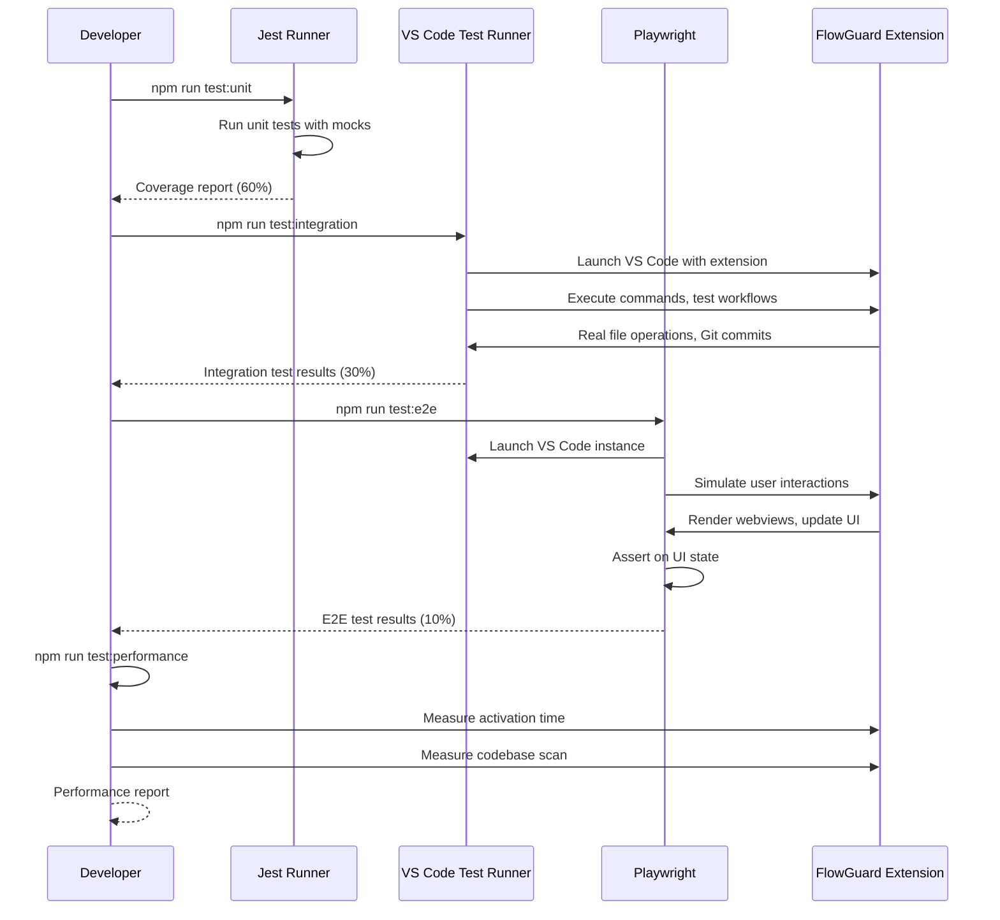

I have created the following plan after thorough exploration and analysis of the codebase. Follow the below plan verbatim. Trust the files and references. Do not re-verify what's written in the plan. Explore only when absolutely necessary. First implement all the proposed file changes and then I'll review all the changes together at the end.

## Observations

The FlowGuard extension has a solid unit testing foundation with Jest, achieving 60% coverage across core models, storage, planning, and verification modules. Existing integration tests in `src/planning/__tests__/integration/` and `src/verification/__tests__/integration/` use mocked dependencies rather than real VS Code APIs. The project lacks E2E testing infrastructure, performance benchmarking utilities, and a centralized integration test directory. Test utilities (`tests/utils/mocks.ts`, `tests/utils/fixtures.ts`) provide comprehensive mock factories for VS Code, LLM providers, storage, and Git operations.

## Approach

Establish a three-tier testing strategy: (1) enhance integration tests using VS Code Extension Test Runner (`@vscode/test-electron`) to test against real VS Code APIs in a headless environment, (2) implement E2E tests with Playwright to validate critical user journeys through the webview UI, and (3) add performance benchmarking to ensure extension activation and codebase scanning meet performance targets. Consolidate integration tests into `tests/integration/` and create `tests/e2e/` for end-to-end scenarios, leveraging existing mock utilities while adding real VS Code API testing capabilities.

## Implementation Steps

### 1. Install Testing Dependencies

Add VS Code Extension Test Runner and Playwright to `package.json`:

```json
{
  "devDependencies": {
    "@vscode/test-electron": "^2.3.8",
    "playwright": "^1.40.0",
    "@playwright/test": "^1.40.0"
  }
}
```

Run `npm install` to install the new dependencies.

### 2. Create Integration Test Infrastructure

**2.1 Create Integration Test Directory Structure**

Create `tests/integration/` with subdirectories:
- `tests/integration/workflows/` - Complete workflow tests (epic creation, handoff generation, verification)
- `tests/integration/storage/` - Real file system operations with `.flowguard/` artifacts
- `tests/integration/commands/` - VS Code command execution tests
- `tests/integration/ui/` - Webview provider tests with real VS Code APIs

**2.2 Create VS Code Test Runner Configuration**

Create `tests/integration/runTest.ts`:

```typescript
import * as path from 'path';
import { runTests } from '@vscode/test-electron';

async function main() {
  try {
    const extensionDevelopmentPath = path.resolve(__dirname, '../../');
    const extensionTestsPath = path.resolve(__dirname, './index');
    
    await runTests({
      extensionDevelopmentPath,
      extensionTestsPath,
      launchArgs: [
        '--disable-extensions',
        '--disable-gpu',
        path.resolve(__dirname, '../../test-workspace')
      ]
    });
  } catch (err) {
    console.error('Failed to run tests:', err);
    process.exit(1);
  }
}

main();
```

Create `tests/integration/index.ts` to configure Mocha test runner:

```typescript
import * as path from 'path';
import Mocha from 'mocha';
import { glob } from 'glob';

export function run(): Promise<void> {
  const mocha = new Mocha({
    ui: 'bdd',
    color: true,
    timeout: 20000
  });

  const testsRoot = path.resolve(__dirname);

  return new Promise((resolve, reject) => {
    glob('**/*.test.js', { cwd: testsRoot }, (err, files) => {
      if (err) {
        return reject(err);
      }

      files.forEach(f => mocha.addFile(path.resolve(testsRoot, f)));

      try {
        mocha.run(failures => {
          if (failures > 0) {
            reject(new Error(`${failures} tests failed.`));
          } else {
            resolve();
          }
        });
      } catch (err) {
        reject(err);
      }
    });
  });
}
```

**2.3 Create Test Workspace**

Create `test-workspace/` directory at project root with sample files:
- `test-workspace/.flowguard/epic.json` - Sample epic metadata
- `test-workspace/.flowguard/specs/spec-sample.md` - Sample spec
- `test-workspace/.flowguard/tickets/ticket-sample.md` - Sample ticket
- `test-workspace/src/sample.ts` - Sample source file for codebase scanning

### 3. Write Integration Tests

**3.1 Epic Creation Workflow Test**

Create `tests/integration/workflows/epicCreation.test.ts`:

Test the complete epic creation flow:
- Initialize `.flowguard/` directory structure
- Create `epic.json` metadata file
- Verify directory structure matches expected layout
- Test epic metadata persistence and retrieval
- Validate Git integration (staging `.flowguard/` artifacts)

Use real VS Code APIs:
- `vscode.workspace.fs` for file operations
- `vscode.Uri` for path resolution
- `vscode.commands.executeCommand` to trigger `flowguard.createEpic`

Assert:
- `.flowguard/` directory exists with correct subdirectories (`specs/`, `tickets/`, `executions/`)
- `epic.json` contains valid metadata (id, title, createdAt, status)
- Files are staged in Git (if repository exists)

**3.2 Handoff Generation Workflow Test**

Create `tests/integration/workflows/handoffGeneration.test.ts`:

Test handoff document generation:
- Create sample spec and tickets in test workspace
- Execute `flowguard.generateHandoff` command
- Verify handoff markdown is generated with correct structure
- Test template variable substitution (spec content, ticket list, codebase context)
- Validate execution record creation in `.flowguard/executions/`

Use `file:src/handoff/MarkdownExporter.ts` and `file:src/handoff/ExecutionTracker.ts` with real file system.

Assert:
- Handoff markdown contains spec overview, ticket breakdown, and implementation steps
- Execution record exists with correct metadata (agentType, specIds, ticketIds, startedAt)
- Clipboard contains handoff content (test `vscode.env.clipboard.writeText`)

**3.3 Verification Workflow Test**

Create `tests/integration/workflows/verification.test.ts`:

Test code change verification:
- Create sample spec with requirements
- Generate Git diff (add/modify test files)
- Execute `flowguard.verifyChanges` command
- Verify verification report is generated
- Test issue detection and severity rating

Use `file:src/verification/VerificationEngine.ts` with real Git operations via `file:src/core/git/GitHelper.ts`.

Assert:
- Verification record created in `.flowguard/verifications/`
- Issues are categorized by severity (Critical, High, Medium, Low)
- Summary includes pass/fail status and recommendation
- Verification view displays results correctly

**3.4 Storage Integration Tests**

Create `tests/integration/storage/artifactStorage.test.ts`:

Test real file system operations:
- Create, read, update, delete specs using `file:src/core/storage/ArtifactStorage.ts`
- Test ticket CRUD operations
- Test execution and verification persistence
- Verify frontmatter parsing and serialization
- Test concurrent file operations (race conditions)

Use real file system (not mocked) in test workspace.

Assert:
- Files are created with correct naming (`spec-{uuid}.md`, `ticket-{uuid}.md`)
- Frontmatter is correctly parsed and serialized
- File locks prevent concurrent write conflicts
- Deleted artifacts are removed from file system

**3.5 Command Execution Tests**

Create `tests/integration/commands/commands.test.ts`:

Test VS Code command registration and execution:
- Verify all commands are registered (`flowguard.createSpec`, `flowguard.createTicket`, `flowguard.generateHandoff`, `flowguard.verifyChanges`)
- Test command execution with various inputs
- Validate command context (when clauses, keybindings)
- Test error handling for invalid inputs

Use `vscode.commands.getCommands()` to verify registration and `vscode.commands.executeCommand()` to test execution.

Assert:
- All commands from `file:package.json` contributions are registered
- Commands execute without errors for valid inputs
- Error messages are displayed for invalid inputs
- Commands respect context conditions (e.g., `flowguard.approveSpec` only available for spec files)

**3.6 UI Integration Tests**

Create `tests/integration/ui/sidebar.test.ts`:

Test sidebar webview provider:
- Initialize `file:src/ui/sidebar/SidebarProvider.ts`
- Verify webview content is rendered
- Test message passing between extension and webview
- Validate artifact list updates when files change

Use `vscode.window.registerWebviewViewProvider()` and test webview HTML content.

Assert:
- Sidebar displays specs, tickets, and executions
- Status badges reflect correct artifact status
- Clicking artifacts opens them in editor
- Refresh command updates artifact list

### 4. Create E2E Test Infrastructure

**4.1 Configure Playwright**

Create `playwright.config.ts`:

```typescript
import { defineConfig, devices } from '@playwright/test';

export default defineConfig({
  testDir: './tests/e2e',
  fullyParallel: false,
  forbidOnly: !!process.env.CI,
  retries: process.env.CI ? 2 : 0,
  workers: 1,
  reporter: 'html',
  use: {
    trace: 'on-first-retry',
    screenshot: 'only-on-failure',
    video: 'retain-on-failure'
  },
  projects: [
    {
      name: 'vscode-e2e',
      use: { ...devices['Desktop Chrome'] }
    }
  ],
  timeout: 60000
});
```

**4.2 Create E2E Test Utilities**

Create `tests/e2e/utils/vscodeDriver.ts`:

Implement VS Code automation helpers:
- `launchVSCode()` - Start VS Code with extension loaded
- `openWorkspace(path)` - Open test workspace
- `executeCommand(commandId)` - Trigger commands via command palette
- `waitForWebview(viewId)` - Wait for webview to load
- `getWebviewContent(viewId)` - Extract webview HTML
- `clickWebviewElement(selector)` - Interact with webview elements

Use Playwright's `page.goto()` to navigate to `vscode://` URLs and `page.evaluate()` to interact with webviews.

**4.3 Create E2E Test Fixtures**

Create `tests/e2e/fixtures/workspace.ts`:

Setup and teardown utilities:
- `createTestWorkspace()` - Create temporary workspace with sample files
- `cleanupTestWorkspace()` - Remove temporary files after tests
- `seedWorkspaceWithArtifacts()` - Populate workspace with specs, tickets, executions

### 5. Write E2E Tests

**5.1 First-Time Onboarding Test**

Create `tests/e2e/onboarding.test.ts`:

Test new user experience:
- Launch VS Code with FlowGuard extension
- Verify welcome message is displayed (if `flowguard.general.showWelcomeOnStartup` is true)
- Click "Initialize Epic" button
- Fill in epic creation form (title, overview)
- Verify `.flowguard/` directory is created
- Verify sidebar shows empty state with "New Spec" and "New Ticket" buttons

Use Playwright to:
- Navigate to VS Code window
- Locate and click UI elements (buttons, inputs)
- Assert on visible text and element states

**5.2 Complete Development Cycle Test**

Create `tests/e2e/developmentCycle.test.ts`:

Test end-to-end workflow:
1. **Create Epic**: Initialize epic with title "E2E Test Epic"
2. **Create Spec**: Click "New Spec", enter spec details (title, overview, requirements), save
3. **Generate Tickets**: Select spec, click "Generate Tickets", verify tickets are created
4. **Generate Handoff**: Select tickets, click "Generate Handoff", verify handoff is copied to clipboard
5. **Make Code Changes**: Simulate file edits in workspace
6. **Verify Changes**: Click "Verify Changes", select spec, verify verification report shows issues/approval
7. **Approve Spec**: Click "Approve Spec", verify status changes to "Approved"

Use Playwright to:
- Interact with sidebar (click buttons, select items)
- Fill forms in webviews (spec editor, ticket editor)
- Verify UI state changes (status badges, artifact counts)
- Assert on verification results (issue counts, severity badges)

**5.3 Spec Editor E2E Test**

Create `tests/e2e/specEditor.test.ts`:

Test spec editing interface:
- Open existing spec file
- Verify custom editor loads (not default markdown editor)
- Edit metadata fields (title, tags, status)
- Insert Mermaid diagram using diagram inserter
- Preview diagram rendering
- Save changes and verify auto-save (wait 30s)
- Approve spec and verify status workflow

Use Playwright to:
- Locate webview iframe for `file:src/ui/editors/SpecEditorProvider.ts`
- Interact with Svelte components (`file:src/ui/editors/webview/SpecEditor.svelte`)
- Assert on diagram preview rendering
- Verify toolbar actions (Save, Preview, Approve)

**5.4 Verification View E2E Test**

Create `tests/e2e/verificationView.test.ts`:

Test verification results display:
- Run verification on sample diff
- Open verification view
- Verify summary cards show correct issue counts (Critical, High, Medium, Low)
- Expand issue details
- Click "Apply Auto-Fix" for fixable issue
- Click "Ignore" for low-severity issue
- Verify approval workflow UI (Approve with Conditions, Request Changes)

Use Playwright to:
- Navigate to verification view webview
- Interact with `file:src/ui/views/webview/VerificationView.svelte` components
- Assert on issue list rendering and severity badges
- Test action buttons (Apply Auto-Fix, Ignore)

### 6. Add Performance Benchmarking

**6.1 Create Performance Test Utilities**

Create `tests/performance/benchmark.ts`:

Implement benchmarking helpers:
- `measureActivationTime()` - Measure extension activation duration
- `measureCodebaseScan(fileCount)` - Measure codebase scanning performance
- `measureSpecGeneration()` - Measure spec generation latency
- `measureVerification()` - Measure verification analysis time

Use `performance.now()` for high-resolution timing.

**6.2 Create Performance Tests**

Create `tests/performance/activation.test.ts`:

Test extension activation performance:
- Launch VS Code with extension
- Measure time from activation event to `activate()` completion
- Assert activation time < 500ms

Create `tests/performance/codebaseScan.test.ts`:

Test codebase scanning performance:
- Create workspace with varying file counts (100, 500, 1000 files)
- Measure time for `file:src/planning/codebase/CodebaseExplorer.ts` to complete scan
- Assert scan time < 5s for 1000 files

Use `file:src/planning/codebase/FileScanner.ts` with real file system.

**6.3 Create Performance Benchmark Report**

Create `tests/performance/report.ts`:

Generate performance report:
- Aggregate benchmark results
- Calculate percentiles (p50, p95, p99)
- Compare against performance targets
- Output report to console and JSON file

### 7. Update Test Scripts

Add new test scripts to `package.json`:

```json
{
  "scripts": {
    "test:integration": "node ./out/tests/integration/runTest.js",
    "test:integration:watch": "npm run compile && npm run test:integration -- --watch",
    "test:e2e": "playwright test",
    "test:e2e:ui": "playwright test --ui",
    "test:e2e:debug": "playwright test --debug",
    "test:performance": "node ./out/tests/performance/runBenchmarks.js",
    "test:all": "npm run test:unit && npm run test:integration && npm run test:e2e",
    "test:ci": "npm run test:unit && npm run test:integration"
  }
}
```

### 8. Create Test Documentation

**8.1 Update `tests/README.md`**

Add sections for integration and E2E tests:
- **Integration Tests**: Explain VS Code Extension Test Runner setup, how to run integration tests, test workspace structure
- **E2E Tests**: Explain Playwright setup, how to run E2E tests, debugging with Playwright Inspector
- **Performance Tests**: Explain benchmarking approach, performance targets, how to run performance tests

**8.2 Create Integration Test Guide**

Create `tests/integration/README.md`:

Document:
- How to write integration tests using real VS Code APIs
- Test workspace setup and teardown
- Common patterns (command execution, file operations, webview testing)
- Debugging integration tests in VS Code

**8.3 Create E2E Test Guide**

Create `tests/e2e/README.md`:

Document:
- How to write E2E tests with Playwright
- VS Code automation patterns (launching, navigating, interacting with webviews)
- Test fixtures and utilities
- Debugging E2E tests with Playwright Inspector and trace viewer

### 9. Configure CI/CD for Integration and E2E Tests

**9.1 Update GitHub Actions Workflow**

Modify `.github/workflows/ci.yml` (if exists) or create it:

Add integration test job:
```yaml
integration-tests:
  runs-on: ubuntu-latest
  steps:
    - uses: actions/checkout@v3
    - uses: actions/setup-node@v3
    - run: npm ci
    - run: npm run compile
    - run: xvfb-run -a npm run test:integration
```

Add E2E test job (optional, can be skipped in CI due to complexity):
```yaml
e2e-tests:
  runs-on: ubuntu-latest
  steps:
    - uses: actions/checkout@v3
    - uses: actions/setup-node@v3
    - run: npm ci
    - run: npx playwright install --with-deps
    - run: npm run compile
    - run: xvfb-run -a npm run test:e2e
    - uses: actions/upload-artifact@v3
      if: failure()
      with:
        name: playwright-report
        path: playwright-report/
```

**9.2 Configure Test Coverage for Integration Tests**

Update `jest.config.js` to include integration test coverage:

```javascript
module.exports = {
  projects: [
    {
      displayName: 'unit',
      testMatch: ['**/tests/unit/**/*.test.ts'],
      coverageThreshold: {
        global: { branches: 60, functions: 60, lines: 60, statements: 60 }
      }
    },
    {
      displayName: 'integration',
      testMatch: ['**/tests/integration/**/*.test.ts'],
      coverageThreshold: {
        global: { branches: 30, functions: 30, lines: 30, statements: 30 }
      }
    }
  ]
};
```

### 10. Migrate Existing Integration Tests

**10.1 Move Integration Tests to Centralized Directory**

Move `src/planning/__tests__/integration/workflow.test.ts` to `tests/integration/workflows/planning.test.ts`.

Move `src/verification/__tests__/integration/verification.test.ts` to `tests/integration/workflows/verification.test.ts`.

**10.2 Refactor Tests to Use Real VS Code APIs**

Update migrated tests to:
- Replace mocked `ArtifactStorage` with real file system operations
- Replace mocked `GitHelper` with real Git operations (using `simple-git`)
- Use real VS Code workspace APIs (`vscode.workspace.fs`, `vscode.Uri`)
- Test against actual `.flowguard/` directory in test workspace

Maintain existing test structure (AAA pattern, describe/it blocks) but replace mocks with real implementations where appropriate.

### 11. Validate Test Coverage

**11.1 Run All Tests**

Execute:
```bash
npm run test:unit
npm run test:integration
npm run test:e2e
```

Verify:
- Unit tests: 60% coverage maintained
- Integration tests: 30% coverage achieved
- E2E tests: 10% coverage achieved (critical user journeys)

**11.2 Generate Coverage Reports**

Run:
```bash
npm run test:coverage
npm run test:integration -- --coverage
```

Review coverage reports in `coverage/` directory. Identify gaps and add tests for uncovered critical paths.

### 12. Performance Validation

**12.1 Run Performance Benchmarks**

Execute:
```bash
npm run test:performance
```

Verify:
- Extension activation < 500ms
- Codebase scan (1000 files) < 5s
- Spec generation < 10s
- Verification analysis < 15s

**12.2 Optimize Performance Bottlenecks**

If benchmarks fail:
- Profile slow operations using VS Code's built-in profiler
- Optimize file I/O (batch operations, use streams)
- Implement caching for codebase scanning (use `file:src/planning/codebase/FileScanner.ts` cache)
- Parallelize LLM requests where possible

## Test Coverage Targets

| Test Type | Coverage Target | Scope |
|-----------|----------------|-------|
| Unit Tests | 60% | Core models, storage, planning, verification |
| Integration Tests | 30% | Complete workflows, command execution, UI providers |
| E2E Tests | 10% | Critical user journeys (onboarding, development cycle) |

## Performance Targets

| Metric | Target | Measurement |
|--------|--------|-------------|
| Extension Activation | < 500ms | Time from activation event to `activate()` completion |
| Codebase Scan (1000 files) | < 5s | Time to scan and index 1000 source files |
| Spec Generation | < 10s | Time to generate spec from user goal (excluding LLM latency) |
| Verification Analysis | < 15s | Time to analyze diff and generate verification report |

## Test Execution Flow

