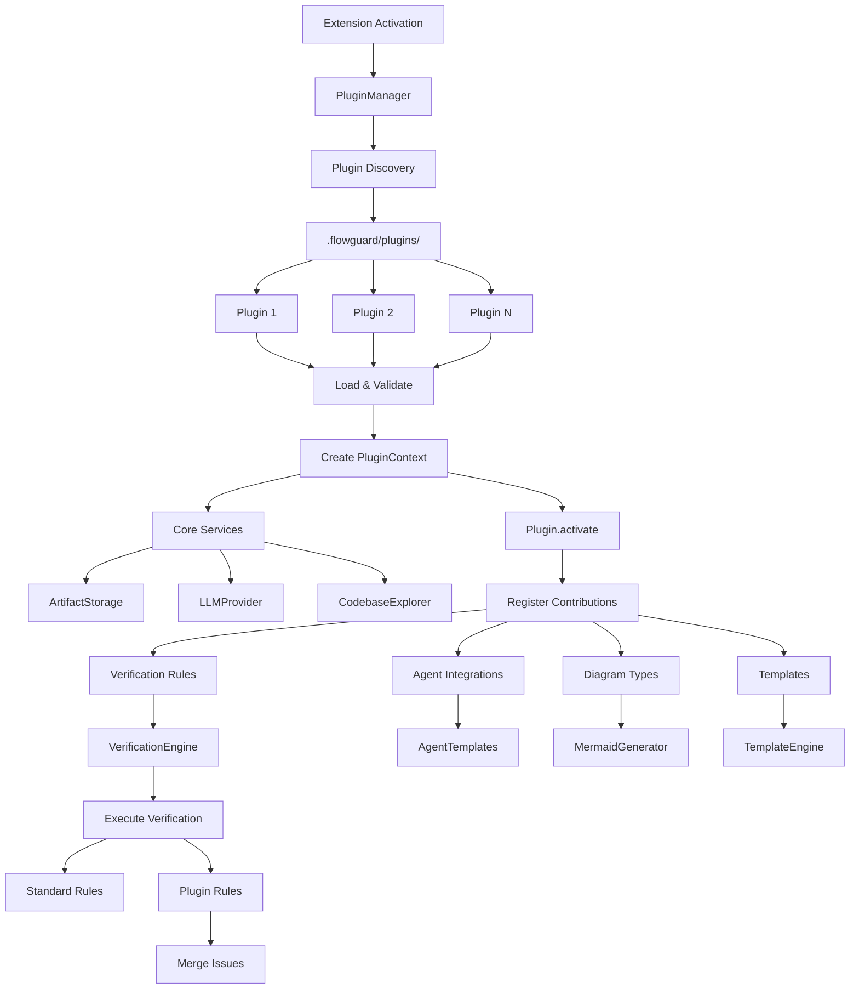
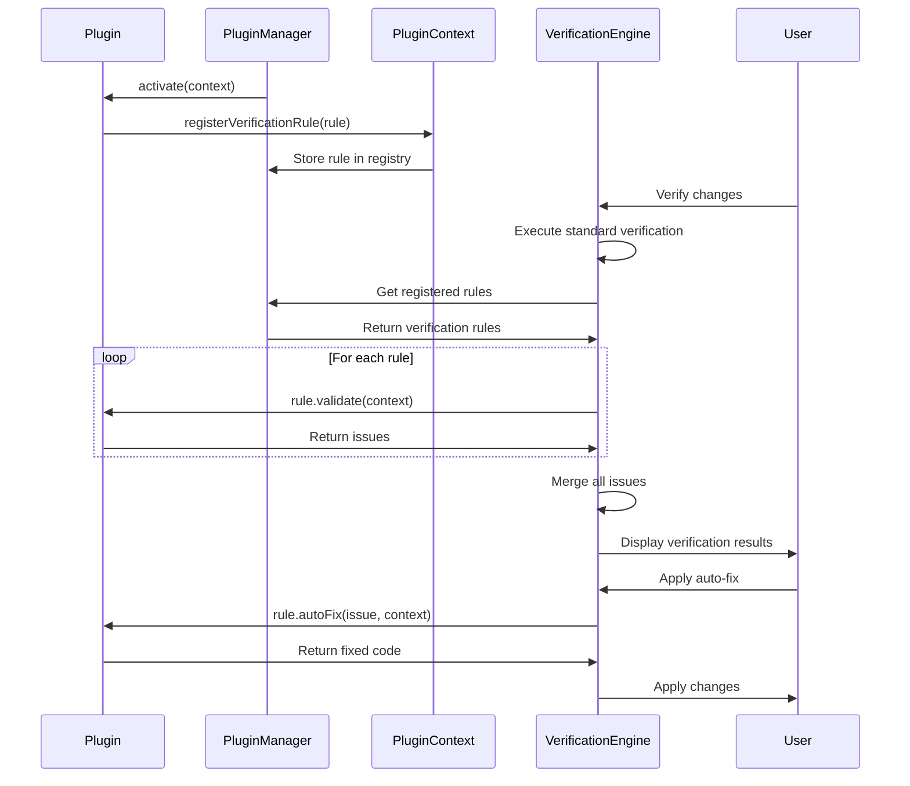

I have created the following plan after thorough exploration and analysis of the codebase. Follow the below plan verbatim. Trust the files and references. Do not re-verify what's written in the plan. Explore only when absolutely necessary. First implement all the proposed file changes and then I'll review all the changes together at the end.

## Observations

The codebase follows a clean architecture with well-defined abstractions: `BaseProvider` for LLM providers, `AgentTemplates` for handoff templates, and `VerificationEngine` with modular components. The `.flowguard/` directory structure already supports templates. The extension uses a factory pattern for provider creation and registration pattern for components. Configuration is managed through VS Code settings and `SecretStorage`. The verification system has embedded rules in `DiffAnalyzer`, `SpecMatcher`, `SeverityRater`, and `FeedbackGenerator` components.

## Approach

Build a plugin system following the existing LLM provider pattern with abstract base classes and factory creation. Create plugin interfaces for verification rules, agent integrations, templates, and diagram types. Implement a `PluginManager` for discovery from `.flowguard/plugins/` directory, lifecycle management, and contribution point registration. Provide a `PluginContext` for plugins to access core services (storage, LLM, codebase explorer). Build an example security verification plugin demonstrating hardcoded secret detection. Document the plugin API for third-party developers.

## Implementation Steps

### 1. Define Plugin Type System

Create `file:src/plugins/types.ts` with core plugin interfaces:

**Core Plugin Interface**
- Define `FlowGuardPlugin` interface with:
  - `id: string` - unique plugin identifier
  - `name: string` - display name
  - `version: string` - semantic version
  - `description: string` - plugin description
  - `author?: string` - plugin author
  - `activate(context: PluginContext): Promise<void>` - initialization hook
  - `deactivate(): Promise<void>` - cleanup hook

**Plugin Context Interface**
- Define `PluginContext` interface providing access to:
  - `storage: ArtifactStorage` - artifact storage operations
  - `llmProvider: LLMProvider` - LLM provider instance
  - `codebaseExplorer: CodebaseExplorer` - codebase analysis
  - `workspaceRoot: string` - workspace root path
  - `extensionPath: string` - extension installation path
  - `registerVerificationRule(rule: VerificationRule): void` - register custom verification rules
  - `registerAgentIntegration(integration: AgentIntegration): void` - register agent integrations
  - `registerDiagramType(type: DiagramType): void` - register diagram generators
  - `registerTemplate(template: TemplateContribution): void` - register custom templates
  - `logger: Logger` - logging interface

**Verification Rule Interface**
- Define `VerificationRule` interface:
  - `id: string` - unique rule identifier
  - `name: string` - rule display name
  - `category: IssueCategory` - issue category (security, performance, etc.)
  - `severity: Severity` - default severity level
  - `enabled: boolean` - whether rule is active
  - `validate(context: ValidationContext): Promise<VerificationIssue[]>` - validation logic
  - `autoFix?(issue: VerificationIssue, context: ValidationContext): Promise<string>` - optional auto-fix

**Validation Context Interface**
- Define `ValidationContext` interface:
  - `fileChanges: ChangedFile[]` - changed files from diff
  - `specContent: string` - relevant spec content
  - `fileContent: string` - full file content
  - `filePath: string` - file path
  - `workspaceRoot: string` - workspace root

**Agent Integration Interface**
- Define `AgentIntegration` interface:
  - `id: string` - unique integration identifier
  - `name: string` - agent name
  - `agentType: string` - agent type identifier
  - `template: string` - handoff template
  - `preprocessor?(data: TemplateVariables): Promise<TemplateVariables>` - optional data transformation
  - `postprocessor?(markdown: string): Promise<string>` - optional output transformation

**Diagram Type Interface**
- Define `DiagramType` interface:
  - `id: string` - unique diagram type identifier
  - `name: string` - diagram type name
  - `fileExtension: string` - file extension (e.g., 'mmd', 'puml')
  - `generate(context: DiagramContext): Promise<string>` - diagram generation logic
  - `validate?(diagram: string): Promise<boolean>` - optional validation

**Template Contribution Interface**
- Define `TemplateContribution` interface:
  - `id: string` - unique template identifier
  - `name: string` - template name
  - `type: 'spec' | 'ticket' | 'handoff' | 'verification'` - template type
  - `template: string` - template content
  - `variables: TemplateVariable[]` - available variables

**Plugin Manifest Interface**
- Define `PluginManifest` interface for `plugin.json`:
  - `id: string` - plugin identifier
  - `name: string` - plugin name
  - `version: string` - semantic version
  - `description: string` - description
  - `author?: string` - author
  - `main: string` - entry point file path (e.g., 'index.js')
  - `contributes?: PluginContributions` - contribution declarations
  - `dependencies?: Record<string, string>` - npm dependencies
  - `engines?: { flowguard: string }` - FlowGuard version compatibility

### 2. Implement Plugin Manager

Create `file:src/plugins/PluginManager.ts` for plugin lifecycle management:

**Plugin Discovery**
- Scan `.flowguard/plugins/` directory for plugin folders
- Each plugin folder must contain `plugin.json` manifest
- Read and validate manifest against `PluginManifest` schema
- Support both JavaScript (`index.js`) and TypeScript (`index.ts`) entry points
- Log discovered plugins with id, name, version

**Plugin Loading**
- Use Node.js `require()` to load plugin entry point
- Validate plugin exports `FlowGuardPlugin` interface
- Check version compatibility with `engines.flowguard` field
- Handle loading errors gracefully with detailed error messages
- Maintain plugin registry: `Map<string, LoadedPlugin>`

**Plugin Initialization**
- Create `PluginContext` instance with core services
- Call `plugin.activate(context)` for each loaded plugin
- Track initialization order for dependency resolution
- Handle activation errors without crashing extension
- Emit activation events for monitoring

**Plugin Lifecycle**
- Implement `loadPlugin(pluginPath: string): Promise<void>`
- Implement `unloadPlugin(pluginId: string): Promise<void>`
- Implement `reloadPlugin(pluginId: string): Promise<void>`
- Implement `getLoadedPlugins(): LoadedPlugin[]`
- Implement `getPluginById(id: string): LoadedPlugin | undefined`

**Contribution Registry**
- Maintain separate registries for each contribution type:
  - `verificationRules: Map<string, VerificationRule>`
  - `agentIntegrations: Map<string, AgentIntegration>`
  - `diagramTypes: Map<string, DiagramType>`
  - `templates: Map<string, TemplateContribution>`
- Implement registration methods called from `PluginContext`
- Validate no duplicate IDs across contributions
- Provide getter methods for accessing contributions

**Error Handling**
- Wrap plugin operations in try-catch blocks
- Log errors to FlowGuard output channel
- Show user-friendly error notifications
- Continue extension operation even if plugins fail
- Provide plugin health status API

### 3. Create Plugin Context Implementation

Create `file:src/plugins/PluginContext.ts`:

**Context Construction**
- Accept core services in constructor:
  - `storage: ArtifactStorage`
  - `llmProvider: LLMProvider`
  - `codebaseExplorer: CodebaseExplorer`
  - `workspaceRoot: string`
  - `extensionPath: string`
  - `pluginManager: PluginManager` (for registration)
- Store references for plugin access

**Registration Methods**
- Implement `registerVerificationRule(rule: VerificationRule)`:
  - Validate rule interface compliance
  - Check for duplicate rule IDs
  - Add to plugin manager's verification rule registry
  - Log registration success
- Implement `registerAgentIntegration(integration: AgentIntegration)`:
  - Validate integration interface
  - Register with `AgentTemplates` class
  - Add to plugin manager's agent integration registry
- Implement `registerDiagramType(type: DiagramType)`:
  - Validate diagram type interface
  - Add to `MermaidGenerator` or diagram registry
  - Support custom diagram rendering
- Implement `registerTemplate(template: TemplateContribution)`:
  - Validate template structure
  - Store in plugin manager's template registry
  - Make available to template engine

**Logger Interface**
- Implement `logger` property with methods:
  - `debug(message: string, ...args: any[]): void`
  - `info(message: string, ...args: any[]): void`
  - `warn(message: string, ...args: any[]): void`
  - `error(message: string, ...args: any[]): void`
- Prefix log messages with plugin ID
- Use existing `file:src/utils/logger.ts` utilities

### 4. Integrate Verification Rules into Engine

Modify `file:src/verification/VerificationEngine.ts`:

**Custom Rule Execution**
- After existing verification logic, retrieve registered verification rules from `PluginManager`
- For each enabled rule, create `ValidationContext` from current verification state
- Call `rule.validate(context)` and collect returned issues
- Merge plugin-generated issues with existing issues
- Respect `options.skipLowSeverity` and `options.maxIssues` settings

**Auto-Fix Support**
- When user triggers auto-fix action, check if issue has `fixSuggestion.automatedFix = true`
- Retrieve corresponding verification rule from plugin manager
- Call `rule.autoFix(issue, context)` if available
- Apply returned code changes to file
- Show success/failure notification

**Rule Configuration**
- Add configuration option `flowguard.plugins.verificationRules` to `file:package.json`:
  - Type: `object` with rule ID keys and boolean values
  - Default: `{}` (all rules enabled by default)
  - Description: "Enable/disable specific verification rules"
- Check configuration before executing each rule

### 5. Build Example Security Verification Plugin

Create `file:src/plugins/examples/security-plugin/` directory structure:

**Plugin Manifest** (`plugin.json`)
```json
{
  "id": "flowguard.security",
  "name": "Security Verification Plugin",
  "version": "1.0.0",
  "description": "Detects hardcoded secrets and security vulnerabilities",
  "author": "FlowGuard Team",
  "main": "index.js",
  "contributes": {
    "verificationRules": ["hardcoded-secrets", "sql-injection", "xss-vulnerability"]
  },
  "engines": {
    "flowguard": "^0.1.0"
  }
}
```

**Plugin Entry Point** (`index.ts`)
- Export class implementing `FlowGuardPlugin` interface
- In `activate(context)`:
  - Register `HardcodedSecretsRule`
  - Register `SqlInjectionRule`
  - Register `XssVulnerabilityRule`
  - Log activation message
- In `deactivate()`:
  - Clean up resources
  - Log deactivation message

**Hardcoded Secrets Rule** (`rules/HardcodedSecretsRule.ts`)
- Implement `VerificationRule` interface
- Define regex patterns for common secrets:
  - API keys: `/api[_-]?key[_-]?=\s*['"]([a-zA-Z0-9]{20,})['"]`
  - AWS keys: `/AKIA[0-9A-Z]{16}/`
  - Private keys: `/-----BEGIN (RSA |EC )?PRIVATE KEY-----/`
  - Passwords: `/password\s*=\s*['"](?!.*\$\{)([^'"]+)['"]/`
  - Tokens: `/token[_-]?=\s*['"]([a-zA-Z0-9]{20,})['"]`
- In `validate(context)`:
  - Iterate through `context.fileChanges`
  - For each addition, check content against patterns
  - Create `VerificationIssue` for matches:
    - `severity: 'Critical'`
    - `category: 'security'`
    - `message: 'Hardcoded secret detected'`
    - `suggestion: 'Use environment variables or secret management service'`
  - Return array of issues
- No auto-fix (manual review required)

**SQL Injection Rule** (`rules/SqlInjectionRule.ts`)
- Detect string concatenation in SQL queries
- Pattern: `/execute\(.*\+.*\)|query\(.*\+.*\)/`
- Severity: `'High'`
- Suggestion: "Use parameterized queries or prepared statements"

**XSS Vulnerability Rule** (`rules/XssVulnerabilityRule.ts`)
- Detect unescaped user input in HTML
- Pattern: `/innerHTML\s*=.*\$\{|dangerouslySetInnerHTML/`
- Severity: `'High'`
- Suggestion: "Sanitize user input or use safe rendering methods"

**Build Configuration**
- Add TypeScript compilation script
- Output to `dist/index.js`
- Include in extension package

### 6. Integrate Plugin Manager into Extension

Modify `file:src/extension.ts`:

**Plugin Manager Initialization**
- Import `PluginManager` and `PluginContext`
- After core services initialization, create `PluginManager` instance
- Create `PluginContext` with initialized services
- Call `pluginManager.loadPlugins(workspaceRoot)` to discover and load plugins
- Store plugin manager reference in extension context

**Plugin Lifecycle Hooks**
- In `activate()`:
  - Initialize plugin manager after all core services
  - Load plugins from `.flowguard/plugins/`
  - Log loaded plugin count
- In `deactivate()`:
  - Call `pluginManager.unloadAllPlugins()`
  - Ensure all plugins are properly cleaned up

**Error Handling**
- Wrap plugin loading in try-catch
- Show error notification if plugin loading fails
- Continue extension activation even if plugins fail
- Log detailed error information

**Context Storage**
- Add plugin manager to `CommandContext` interface in `file:src/commands/types.ts`
- Make available to commands for plugin management operations

### 7. Add Plugin Management Commands

Create `file:src/commands/pluginCommands.ts`:

**List Plugins Command**
- Command ID: `flowguard.listPlugins`
- Show quick pick with loaded plugins
- Display: plugin name, version, status (active/inactive/error)
- Allow selection to view plugin details

**Reload Plugin Command**
- Command ID: `flowguard.reloadPlugin`
- Show quick pick to select plugin
- Call `pluginManager.reloadPlugin(pluginId)`
- Show success/failure notification
- Refresh verification results if verification plugin reloaded

**Enable/Disable Plugin Command**
- Command ID: `flowguard.togglePlugin`
- Show quick pick to select plugin
- Toggle plugin enabled state
- Update configuration
- Reload plugin if necessary

**Install Plugin Command**
- Command ID: `flowguard.installPlugin`
- Show file picker to select plugin directory or archive
- Copy plugin to `.flowguard/plugins/`
- Load and activate plugin
- Show success notification

**Uninstall Plugin Command**
- Command ID: `flowguard.uninstallPlugin`
- Show quick pick to select plugin
- Confirm uninstallation
- Unload plugin
- Delete plugin directory
- Show success notification

**Register Commands**
- Add command registrations to `file:src/commands/index.ts`
- Add to `file:package.json` contributes.commands section
- Add keyboard shortcuts if appropriate

### 8. Update Configuration Schema

Modify `file:package.json` configuration section:

**Plugin Settings**
- Add `flowguard.plugins.enabled`:
  - Type: `boolean`
  - Default: `true`
  - Description: "Enable plugin system"
- Add `flowguard.plugins.autoLoad`:
  - Type: `boolean`
  - Default: `true`
  - Description: "Automatically load plugins on startup"
- Add `flowguard.plugins.verificationRules`:
  - Type: `object`
  - Default: `{}`
  - Description: "Enable/disable specific verification rules by ID"
- Add `flowguard.plugins.trustedPlugins`:
  - Type: `array` of strings
  - Default: `[]`
  - Description: "List of trusted plugin IDs that can execute without confirmation"

**Security Settings**
- Add `flowguard.plugins.requireSignature`:
  - Type: `boolean`
  - Default: `false`
  - Description: "Require plugins to be signed (future feature)"
- Add `flowguard.plugins.allowRemotePlugins`:
  - Type: `boolean`
  - Default: `false`
  - Description: "Allow loading plugins from remote URLs (future feature)"

### 9. Create Plugin Development Documentation

Create `file:src/plugins/README.md`:

**Plugin Development Guide**
- Overview of plugin system architecture
- Plugin structure and manifest format
- Available contribution points
- Plugin context API reference
- Step-by-step tutorial for creating a plugin
- Best practices and security considerations
- Testing and debugging plugins
- Publishing and distribution guidelines

**API Reference**
- Document all plugin interfaces with TypeScript signatures
- Provide examples for each contribution type
- Document plugin lifecycle hooks
- List available services in `PluginContext`
- Document error handling patterns

**Example Plugins**
- Link to security plugin example
- Provide minimal plugin template
- Show advanced plugin patterns
- Include testing examples

**Migration Guide**
- How to convert existing verification logic to plugins
- How to extend agent integrations
- How to add custom diagram types

### 10. Add Plugin UI in Sidebar

Modify `file:src/ui/sidebar/webview/App.svelte`:

**Plugins Section**
- Add new section "Plugins" after Executions
- Display loaded plugins with:
  - Plugin name and version
  - Status indicator (active/error/disabled)
  - Enable/disable toggle
  - Reload button
  - Settings button (if plugin has configuration)
- Show plugin count badge

**Plugin Details View**
- Click plugin to show details panel:
  - Full description
  - Author information
  - Contribution summary (rules, integrations, etc.)
  - Configuration options
  - Uninstall button
- Show plugin dependencies if any

**Plugin Actions**
- Add "Install Plugin" button in section header
- Add "Reload All Plugins" action
- Add "Plugin Marketplace" placeholder (future feature)

**Update Sidebar Provider**
- Modify `file:src/ui/sidebar/SidebarProvider.ts` to:
  - Fetch loaded plugins from plugin manager
  - Handle plugin action messages from webview
  - Refresh plugin list on changes
  - Show plugin error notifications

### 11. Implement Plugin Contribution Points

**Verification Rules Integration**
- Modify `file:src/verification/VerificationEngine.ts`:
  - Add `pluginManager` parameter to constructor
  - After standard verification, execute registered verification rules
  - Merge plugin issues with standard issues
  - Support auto-fix for plugin rules

**Agent Integration Support**
- Modify `file:src/handoff/AgentTemplates.ts`:
  - Add method `registerPluginTemplate(integration: AgentIntegration)`
  - Include plugin templates in `getAllTemplates()`
  - Support preprocessor/postprocessor hooks
  - Validate plugin templates before use

**Diagram Type Support**
- Modify `file:src/planning/diagrams/MermaidGenerator.ts`:
  - Add plugin diagram type registry
  - Support custom diagram generation
  - Validate diagram output
  - Include in diagram insertion UI

**Template Contributions**
- Modify `file:src/planning/templates/TicketTemplates.ts`:
  - Add plugin template registry
  - Merge plugin templates with built-in templates
  - Support custom template variables
  - Validate template syntax

### 12. Add Plugin Testing Support

Create `file:tests/unit/plugins/PluginManager.test.ts`:

**Plugin Loading Tests**
- Test plugin discovery from `.flowguard/plugins/`
- Test manifest validation
- Test plugin loading with valid/invalid entry points
- Test version compatibility checking
- Test error handling for malformed plugins

**Plugin Lifecycle Tests**
- Test plugin activation
- Test plugin deactivation
- Test plugin reload
- Test multiple plugins loading
- Test plugin dependency resolution

**Contribution Registry Tests**
- Test verification rule registration
- Test agent integration registration
- Test diagram type registration
- Test template registration
- Test duplicate ID detection

Create `file:tests/unit/plugins/PluginContext.test.ts`:

**Context API Tests**
- Test service access (storage, LLM, codebase explorer)
- Test registration methods
- Test logger functionality
- Test error handling

Create `file:tests/integration/plugins/SecurityPlugin.test.ts`:

**Security Plugin Integration Tests**
- Test hardcoded secret detection
- Test SQL injection detection
- Test XSS vulnerability detection
- Test issue generation
- Test integration with verification engine

### 13. Add Plugin Security Measures

Create `file:src/plugins/security/PluginValidator.ts`:

**Plugin Validation**
- Validate plugin manifest schema
- Check for required fields (id, name, version, main)
- Validate semantic versioning
- Check FlowGuard version compatibility
- Validate contribution declarations

**Sandboxing Considerations**
- Document plugin execution context
- Warn about plugin permissions
- Recommend code review before installation
- Future: implement VM-based sandboxing

**Trust System**
- Check plugin ID against `flowguard.plugins.trustedPlugins` configuration
- Show warning for untrusted plugins
- Require user confirmation before loading untrusted plugins
- Log plugin execution for audit trail

Create `file:src/plugins/security/PluginSignature.ts` (placeholder):

**Signature Verification** (future feature)
- Define signature format
- Implement signature verification
- Check against trusted certificate store
- Reject unsigned plugins if `requireSignature` enabled

### 14. Create Plugin Examples Directory

Create `file:src/plugins/examples/` structure:

**Minimal Plugin Example** (`minimal-plugin/`)
- Simple plugin with single verification rule
- Demonstrates basic plugin structure
- Includes comments explaining each part
- Ready to copy and modify

**Advanced Plugin Example** (`advanced-plugin/`)
- Multiple contribution types
- Custom configuration
- LLM integration
- Codebase analysis
- Demonstrates best practices

**Template Plugin Example** (`template-plugin/`)
- Custom handoff template
- Template preprocessor
- Template postprocessor
- Variable customization

**Diagram Plugin Example** (`diagram-plugin/`)
- Custom diagram type (e.g., PlantUML)
- Diagram generation logic
- Diagram validation
- Integration with editor

### 15. Update Storage Constants

Modify `file:src/core/storage/constants.ts`:

**Add Plugin Directory**
- Add `PLUGINS: 'plugins'` to `STORAGE_DIRS` constant
- Add `PLUGIN_MANIFEST: 'plugin.json'` to `FILE_PATTERNS`
- Add helper function `getPluginDir(pluginId: string): string`

Modify `file:src/core/storage/ArtifactStorage.ts`:

**Plugin Storage Methods**
- Add `getPluginsDir(): string` method
- Add `getPluginPath(pluginId: string): string` method
- Ensure plugins directory is created in `initialize()`

### 16. Add Plugin Marketplace Preparation

Create `file:src/plugins/marketplace/PluginRegistry.ts` (placeholder):

**Registry Interface** (future feature)
- Define plugin registry API
- Support plugin search
- Support plugin installation from registry
- Support plugin updates
- Version compatibility checking

**Marketplace UI** (future feature)
- Browse available plugins
- Search and filter
- View plugin details and ratings
- One-click installation
- Update notifications

## Visual Architecture



## Plugin Contribution Flow

