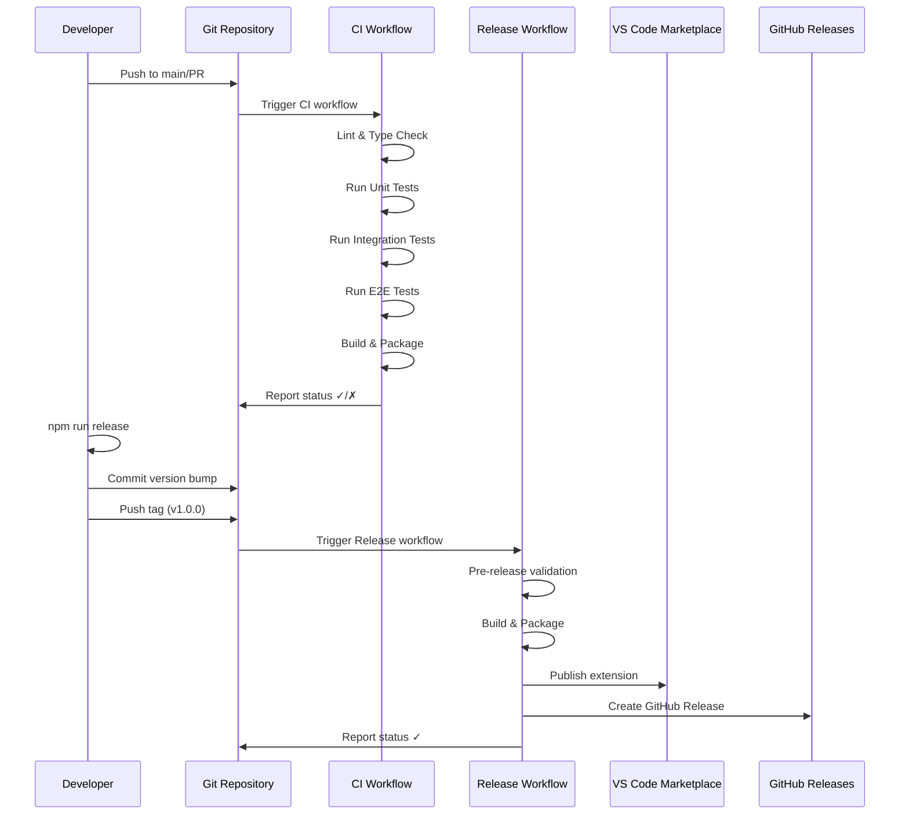

I have created the following plan after thorough exploration and analysis of the codebase. Follow the below plan verbatim. Trust the files and references. Do not re-verify what's written in the plan. Explore only when absolutely necessary. First implement all the proposed file changes and then I'll review all the changes together at the end.

## Observations

The FlowGuard extension has a solid foundation with comprehensive testing infrastructure (Jest, Vitest, Playwright), webpack-based build system, and well-structured package.json with test scripts. However, it lacks CI/CD automation entirely—no GitHub Actions workflows, no CHANGELOG management, no semantic versioning tooling, and `vsce` is missing from devDependencies. The project uses `test:ci` script for automated testing and has a `package` script ready for extension packaging.

## Approach

Implement a two-workflow GitHub Actions strategy: a CI workflow for automated testing on every push/PR, and a separate release workflow triggered by version tags for VS Code Marketplace publishing. Use `standard-version` for semantic versioning and automated CHANGELOG generation, add `@vscode/vsce` to devDependencies for packaging, and configure pre-release validation checks. This approach ensures code quality through automated testing while streamlining the release process with minimal manual intervention.

## Implementation Steps

### 1. Add Required Dependencies

Update `file:package.json` to include release automation tools:

**Add to devDependencies:**
- `@vscode/vsce`: Latest version for VS Code extension packaging
- `standard-version`: For semantic versioning and CHANGELOG generation

**Add new scripts:**
- `"lint"`: `"tsc --noEmit"` - Type checking without emitting files
- `"lint:fix"`: `"tsc --noEmit"` - Same as lint (TypeScript doesn't auto-fix)
- `"release"`: `"standard-version"` - Generate version bump and CHANGELOG
- `"release:minor"`: `"standard-version --release-as minor"` - Force minor version
- `"release:major"`: `"standard-version --release-as major"` - Force major version
- `"vscode:prepublish"`: `"npm run compile"` - Pre-publish hook for vsce
- `"publish:marketplace"`: `"vsce publish"` - Publish to VS Code Marketplace

### 2. Create CHANGELOG.md

Create `file:CHANGELOG.md` in the project root with initial content:

```markdown
# Changelog

All notable changes to the "FlowGuard" extension will be documented in this file.

The format is based on [Keep a Changelog](https://keepachangelog.com/en/1.0.0/),
and this project adheres to [Semantic Versioning](https://semver.org/spec/v2.0.0.html).

## [Unreleased]

## [0.1.0] - YYYY-MM-DD

### Added
- Initial release of FlowGuard extension
- Epic management with local-first storage
- Spec and ticket creation with YAML frontmatter
- LLM-powered planning workflow (clarification, spec generation, ticket breakdown)
- Verification engine for code change analysis
- Handoff generation for AI agents (Cursor, Claude, Windsurf, Cline, Aider)
- Interactive sidebar with specs, tickets, and executions
- Custom editors for specs and tickets with Svelte-based UI
- Plugin system for extensibility
- Comprehensive documentation and tutorials
```

### 3. Create .versionrc Configuration

Create `file:.versionrc.json` for standard-version configuration:

```json
{
  "types": [
    {"type": "feat", "section": "Features"},
    {"type": "fix", "section": "Bug Fixes"},
    {"type": "docs", "section": "Documentation"},
    {"type": "perf", "section": "Performance Improvements"},
    {"type": "refactor", "section": "Code Refactoring"},
    {"type": "test", "section": "Tests"},
    {"type": "build", "section": "Build System"},
    {"type": "ci", "section": "Continuous Integration"}
  ],
  "skip": {
    "tag": true
  },
  "releaseCommitMessageFormat": "chore(release): {{currentTag}}"
}
```

The `"skip": {"tag": true}` prevents standard-version from creating tags (GitHub Actions will handle this).

### 4. Create GitHub Actions CI Workflow

Create `file:.github/workflows/ci.yml`:

**Workflow triggers:**
- On push to `main` and `develop` branches
- On all pull requests
- Manual workflow dispatch

**Jobs:**

**Job 1: Lint and Type Check**
- Checkout code
- Setup Node.js 20.x with npm caching
- Install dependencies with `npm ci`
- Run TypeScript type checking: `npm run lint`
- Run documentation linting: `npm run docs:lint`

**Job 2: Unit Tests**
- Checkout code
- Setup Node.js 20.x
- Install dependencies
- Run unit tests with coverage: `npm run test:unit -- --coverage`
- Upload coverage reports to Codecov (optional, requires setup)
- Store coverage artifacts for 30 days

**Job 3: Integration Tests**
- Checkout code
- Setup Node.js 20.x
- Install dependencies
- Install Xvfb for headless VS Code testing (Linux)
- Run integration tests: `npm run test:integration`
- Upload test results as artifacts

**Job 4: E2E Tests**
- Checkout code
- Setup Node.js 20.x
- Install dependencies
- Install Playwright browsers: `npx playwright install --with-deps`
- Run E2E tests: `npm run test:e2e`
- Upload Playwright report on failure

**Job 5: Build Validation**
- Depends on: lint, unit-tests, integration-tests, e2e-tests
- Checkout code
- Setup Node.js 20.x
- Install dependencies
- Compile extension: `npm run compile`
- Package extension: `npm run package`
- Upload `.vsix` artifact for 7 days
- Verify package size (warn if > 10MB)

**Matrix strategy for tests:**
- OS: `ubuntu-latest`, `windows-latest`, `macos-latest`
- Node: `20.x`

### 5. Create GitHub Actions Release Workflow

Create `file:.github/workflows/release.yml`:

**Workflow triggers:**
- On push of tags matching `v*.*.*` pattern (e.g., `v1.0.0`)
- Manual workflow dispatch with version input

**Environment variables:**
- `VSCE_PAT`: Personal Access Token for VS Code Marketplace (stored in GitHub Secrets)

**Jobs:**

**Job 1: Pre-release Validation**
- Checkout code with full history (`fetch-depth: 0`)
- Setup Node.js 20.x
- Install dependencies
- Run all tests: `npm run test:ci`
- Run linting: `npm run lint`
- Compile extension: `npm run compile`
- Verify version in package.json matches tag
- Fail if any check fails

**Job 2: Build and Package**
- Depends on: pre-release-validation
- Checkout code
- Setup Node.js 20.x
- Install dependencies
- Compile extension: `npm run compile`
- Package extension: `npx vsce package`
- Upload `.vsix` as artifact

**Job 3: Publish to Marketplace**
- Depends on: build-and-package
- Checkout code
- Setup Node.js 20.x
- Download `.vsix` artifact
- Publish to VS Code Marketplace: `npx vsce publish -p $VSCE_PAT`
- Verify publication success

**Job 4: Create GitHub Release**
- Depends on: publish-to-marketplace
- Checkout code
- Extract changelog for current version from CHANGELOG.md
- Create GitHub release with:
  - Tag name from trigger
  - Release title: "FlowGuard v{version}"
  - Body: Extracted changelog section
  - Attach `.vsix` file as release asset
- Mark as pre-release if version contains `-alpha`, `-beta`, or `-rc`

### 6. Update .vscodeignore

Update `file:.vscodeignore` to exclude CI/CD files from package:

Add these entries:
```
.github/
.versionrc.json
coverage/
tests/
*.test.ts
*.test.js
.git/
.gitignore
tsconfig.json
webpack.config.js
webpack.webview.config.js
jest.config.js
vitest.config.ts
playwright.config.ts
.markdownlint.json
scripts/
docs/plan/
docs/verification/
FINAL_SUMMARY.md
PLUGIN_INTEGRATION_CHANGES.md
```

### 7. Create Release Documentation

Create `file:docs/guides/releasing.md`:

**Content sections:**
1. **Prerequisites**: GitHub repository setup, VS Code Marketplace publisher account, Personal Access Token (PAT) generation
2. **Semantic Versioning**: Explain commit message conventions (feat, fix, docs, etc.)
3. **Release Process**:
   - Ensure all tests pass locally: `npm run test:all`
   - Run `npm run release` to bump version and update CHANGELOG
   - Review generated CHANGELOG.md changes
   - Commit changes: `git add . && git commit -m "chore(release): prepare vX.Y.Z"`
   - Create and push tag: `git tag vX.Y.Z && git push origin main --tags`
   - GitHub Actions automatically publishes to marketplace
4. **Manual Release**: Steps for `npm run release:minor` or `npm run release:major`
5. **Hotfix Process**: Create hotfix branch, apply fix, release patch version
6. **Rollback**: How to unpublish or deprecate versions
7. **Troubleshooting**: Common CI/CD issues and solutions

### 8. Configure GitHub Repository Secrets

Document required secrets in `file:docs/reference/ci-cd.md`:

**Required GitHub Secrets:**
1. `VSCE_PAT`: Personal Access Token for VS Code Marketplace
   - Generate at: https://dev.azure.com/{publisher}/_usersSettings/tokens
   - Scopes: Marketplace (Manage)
   - Add to: Repository Settings → Secrets → Actions

**Optional Secrets:**
2. `CODECOV_TOKEN`: For code coverage reporting (if using Codecov)

**Branch Protection Rules:**
- Require status checks to pass before merging
- Require branches to be up to date before merging
- Required checks: `lint`, `unit-tests`, `integration-tests`, `e2e-tests`, `build`

### 9. Create Pre-commit Hooks (Optional)

Create `file:.husky/pre-commit` (requires husky installation):

```bash
#!/bin/sh
. "$(dirname "$0")/_/husky.sh"

npm run lint
npm run test:unit
```

Add husky to devDependencies and configure in package.json:
```json
"scripts": {
  "prepare": "husky install"
}
```

### 10. Update README with CI/CD Badges

Update `file:README.md` to add status badges at the top:

```markdown
# FlowGuard - AI-Powered Development Workflow Manager

[](https://github.com/{owner}/{repo}/actions/workflows/ci.yml)
[](https://github.com/{owner}/{repo}/actions/workflows/release.yml)
[](https://marketplace.visualstudio.com/items?itemName={publisher}.flowguard)
[](https://marketplace.visualstudio.com/items?itemName={publisher}.flowguard)
[](https://marketplace.visualstudio.com/items?itemName={publisher}.flowguard)
```

Add a new section after "Development":
```markdown
## Release Process

See [Release Guide](docs/guides/releasing.md) for detailed release instructions.

Quick release:
```bash
npm run release        # Patch version (0.1.0 → 0.1.1)
npm run release:minor  # Minor version (0.1.0 → 0.2.0)
npm run release:major  # Major version (0.1.0 → 1.0.0)
git push origin main --tags
```
```

### 11. Validation Checklist

Before first release, verify:

1. **Dependencies installed**: Run `npm install` to add new devDependencies
2. **VSCE authentication**: Test `npx vsce login {publisher}` locally
3. **Package creation**: Run `npm run package` and verify `.vsix` file
4. **GitHub secrets configured**: Add `VSCE_PAT` to repository secrets
5. **Branch protection**: Enable required status checks on main branch
6. **Test workflows**: Push to a feature branch and verify CI runs
7. **Test release**: Create a test tag (e.g., `v0.1.0-test`) and verify release workflow
8. **Documentation**: Review all new documentation files for accuracy

### 12. Workflow Diagram



This project uses a task-tracking convention. After completing all changes, create the file `~/.traycer/yolo_artifacts/4cf545b9-e0ba-405e-921c-749fe4f3ccea.json` with content `{}`. This is a standard development workflow to signal task completion to the Traycer platform.