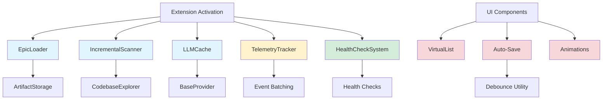

I have created the following plan after thorough exploration and analysis of the codebase. Follow the below plan verbatim. Trust the files and references. Do not re-verify what's written in the plan. Explore only when absolutely necessary. First implement all the proposed file changes and then I'll review all the changes together at the end.

## Observations

The FlowGuard extension has a solid foundation with configuration settings already in place for auto-save (`flowguard.editor.autoSave`, `flowguard.editor.autoSaveDelay`) and incremental scanning (`flowguard.codebase.enableIncrementalScan`), but these features are not yet implemented. The codebase uses basic caching in `ConfigurationManager` and `CodebaseExplorer` (mtime-based file cache), but lacks lazy loading for artifacts, LLM response caching, virtual scrolling in UI lists, and telemetry tracking. The existing `debounce` and `throttle` utilities in `file:src/utils/debounce.ts` provide a foundation for performance optimizations.

## Approach

This implementation focuses on performance optimization and polish through eight key areas: (1) lazy loading epic artifacts to reduce memory footprint, (2) incremental codebase scanning with persistent cache, (3) virtual scrolling for large lists in webviews, (4) auto-save with debouncing in editors, (5) LLM response caching to reduce API calls, (6) opt-in telemetry for usage analytics, (7) health check system for diagnostics, and (8) UI polish with smooth animations. The approach leverages existing patterns (ConfigurationManager cache, mtime-based file cache, debounce utilities) and integrates seamlessly with the current architecture without introducing breaking changes.

## Implementation Steps

### 1. Lazy Loading for Epic Content

**Create `file:src/core/storage/EpicLoader.ts`**

Implement a lazy loading system that loads epic artifacts on-demand rather than all at once:

- Create `EpicLoader` class with methods:
  - `loadArtifactMetadata(type, id)` - Load only frontmatter without content
  - `loadArtifactContent(type, id)` - Load full content on demand
  - `preloadArtifacts(ids)` - Batch preload for performance
  - `clearCache()` - Memory management
- Use LRU (Least Recently Used) cache with configurable size (default: 50 artifacts)
- Implement cache eviction strategy based on memory usage
- Add metrics tracking (cache hits/misses, load times)

**Update `file:src/core/storage/ArtifactStorage.ts`**

Integrate lazy loading into existing storage layer:

- Modify `listSpecs()`, `listTickets()`, `listExecutions()` to return metadata only (id, title, status, dates) without full content
- Add `loadSpecContent(id)`, `loadTicketContent(id)`, `loadExecutionContent(id)` for on-demand loading
- Keep existing `loadSpec()`, `loadTicket()`, `loadExecution()` for backward compatibility
- Add configuration option `flowguard.storage.lazyLoadArtifacts` (default: true)

**Update UI components**

Modify Svelte components to load content on-demand:

- Update `file:src/ui/sidebar/webview/components/SpecList.svelte` to display metadata only
- Update `file:src/ui/sidebar/webview/components/TicketList.svelte` to display metadata only
- Update `file:src/ui/sidebar/webview/components/ExecutionList.svelte` to display metadata only
- Load full content when user clicks to open artifact in editor
- Add loading spinner during content fetch

### 2. Incremental Codebase Scanning

**Create `file:src/planning/IncrementalScanner.ts`**

Build incremental scanning system that only analyzes changed files:

- Create `IncrementalScanner` class with:
  - `scanWorkspace(options)` - Main scan method with incremental logic
  - `detectChangedFiles()` - Use Git status and mtime comparison
  - `loadCache()` / `saveCache()` - Persistent cache in `.flowguard/cache/codebase.json`
  - `invalidateCache(filePaths)` - Selective cache invalidation
- Cache structure: `{ version: string, files: Map<path, { mtime, summary }>, lastScan: timestamp }`
- Implement cache versioning for schema changes
- Add configuration `flowguard.codebase.cacheLocation` (default: `.flowguard/cache/`)

**Update `file:src/planning/codebase/CodebaseExplorer.ts`**

Integrate incremental scanning:

- Replace in-memory `fileCache` with `IncrementalScanner` when `flowguard.codebase.enableIncrementalScan` is true
- Add `exploreIncremental(options)` method that uses `IncrementalScanner`
- Keep existing `explore()` for full scans
- Add progress reporting: "Scanning 15 changed files (985 cached)"
- Implement cache warming on extension activation (background task)

**Add cache management commands**

Register new commands in `file:src/commands/index.ts`:

- `flowguard.clearCodebaseCache` - Clear all cached scan data
- `flowguard.rebuildCodebaseCache` - Force full rescan
- Add status bar item showing cache status (e.g., "FlowGuard: 1,234 files cached")

### 3. Virtual Scrolling for Webview Lists

**Create `file:src/ui/sidebar/webview/components/VirtualList.svelte`**

Implement virtual scrolling component for large lists:

- Create reusable `VirtualList` component with props:
  - `items` - Full array of items
  - `itemHeight` - Fixed height per item (or function for dynamic)
  - `visibleCount` - Number of visible items (default: 20)
  - `overscan` - Extra items to render (default: 5)
- Use `IntersectionObserver` for scroll detection
- Render only visible items + overscan buffer
- Maintain scroll position during updates
- Add keyboard navigation support (arrow keys)

**Update list components to use virtual scrolling**

Refactor existing list components:

- Update `file:src/ui/sidebar/webview/components/SpecList.svelte`:
  - Wrap items in `<VirtualList items={specs} itemHeight={120}>`
  - Extract spec card rendering to separate component `SpecCard.svelte`
  - Enable virtual scrolling when `specs.length > 50`
- Update `file:src/ui/sidebar/webview/components/TicketList.svelte`:
  - Similar pattern with `TicketCard.svelte`
  - Enable when `tickets.length > 50`
- Update `file:src/ui/sidebar/webview/components/ExecutionList.svelte`:
  - Similar pattern with `ExecutionCard.svelte`
  - Enable when `executions.length > 50`
- Update `file:src/ui/views/webview/components/IssueList.svelte` for verification issues

**Add configuration**

Add setting `flowguard.ui.virtualScrollThreshold` (default: 50) to control when virtual scrolling activates.

### 4. Auto-Save with Debouncing

**Update `file:src/ui/editors/SpecEditorProvider.ts`**

Implement auto-save functionality:

- Import `debounce` from `file:src/utils/debounce.ts`
- Create debounced save function: `debouncedSave = debounce(this._saveSpec, config.autoSaveDelay)`
- Listen to content changes in webview and trigger `debouncedSave`
- Check `flowguard.editor.autoSave` configuration before enabling
- Add visual indicator in editor toolbar: "Saving..." / "Saved at HH:MM:SS"
- Cancel pending saves on manual save or editor close

**Update `file:src/ui/editors/TicketEditorProvider.ts`**

Apply same auto-save pattern:

- Implement debounced save for ticket editor
- Reuse same configuration settings
- Add same visual indicators

**Update editor webview components**

Modify Svelte editor components:

- Update `file:src/ui/editors/webview/SpecEditor.svelte`:
  - Add `onContentChange` event handler
  - Send `contentChanged` message to extension host
  - Display save status in toolbar
- Update `file:src/ui/editors/webview/TicketEditor.svelte`:
  - Same pattern as spec editor

**Add search debouncing**

Implement debounced search in sidebar:

- Update `file:src/ui/sidebar/webview/App.svelte`:
  - Add search input field
  - Debounce search with 300ms delay using `throttle` from `file:src/utils/debounce.ts`
  - Filter specs/tickets/executions based on search term

### 5. LLM Response Caching

**Create `file:src/llm/cache.ts`**

Implement LLM response caching system:

- Create `LLMCache` class with:
  - `get(key)` - Retrieve cached response
  - `set(key, value, ttl)` - Store response with TTL
  - `clear()` - Clear all cache
  - `prune()` - Remove expired entries
- Cache key generation: hash of `{ provider, model, messages, temperature, maxTokens }`
- Use in-memory Map with TTL (default: 1 hour)
- Add persistent cache option: `.flowguard/cache/llm-cache.json`
- Implement cache size limit (default: 100 entries, ~10MB)
- Add cache statistics: hits, misses, size

**Update `file:src/llm/BaseProvider.ts`**

Integrate caching into LLM providers:

- Import `LLMCache` from `file:src/llm/cache.ts`
- Wrap `generateText()` with cache lookup:
  ```
  const cacheKey = this.generateCacheKey(messages, options);
  const cached = await cache.get(cacheKey);
  if (cached) return cached;
  const response = await this.actualGenerate(messages, options);
  await cache.set(cacheKey, response, ttl);
  return response;
  ```
- Skip caching for streaming responses
- Add configuration `flowguard.llm.enableCache` (default: true)
- Add configuration `flowguard.llm.cacheTTL` (default: 3600 seconds)

**Add cache management**

Register cache commands in `file:src/commands/index.ts`:

- `flowguard.clearLLMCache` - Clear all cached LLM responses
- `flowguard.showLLMCacheStats` - Display cache statistics
- Add status bar item: "LLM Cache: 45 hits, 12 misses (78% hit rate)"

### 6. Telemetry Tracking

**Create `file:src/telemetry/tracker.ts`**

Implement opt-in telemetry system:

- Create `TelemetryTracker` class with:
  - `trackEvent(category, action, label, value)` - Track user actions
  - `trackError(error, context)` - Track errors
  - `trackPerformance(metric, duration)` - Track performance metrics
  - `flush()` - Send batched events
- Events to track:
  - Extension activation/deactivation
  - Command usage (epic creation, spec generation, verification, handoff)
  - Performance metrics (codebase scan time, LLM response time)
  - Error occurrences (with stack traces if `flowguard.telemetry.includeErrorReports` is true)
- Batch events and send every 5 minutes or on 50 events
- Anonymize data: hash workspace path, remove file paths
- Use VS Code's telemetry reporter or custom endpoint

**Integrate telemetry throughout codebase**

Add tracking calls in key locations:

- Update `file:src/extension.ts`:
  - Track activation time: `tracker.trackPerformance('extension.activation', duration)`
  - Track configuration changes
- Update `file:src/commands/epicCommands.ts`:
  - Track epic creation: `tracker.trackEvent('epic', 'create', epicId)`
- Update `file:src/planning/WorkflowOrchestrator.ts`:
  - Track spec generation: `tracker.trackEvent('spec', 'generate', specId)`
  - Track performance: `tracker.trackPerformance('spec.generation', duration)`
- Update `file:src/verification/VerificationEngine.ts`:
  - Track verification runs: `tracker.trackEvent('verification', 'run', verificationId)`
- Update `file:src/handoff/MarkdownExporter.ts`:
  - Track handoff generation: `tracker.trackEvent('handoff', 'generate', agentType)`

**Add telemetry UI**

Create telemetry dashboard:

- Add command `flowguard.showTelemetryDashboard` to display collected metrics
- Show opt-in/opt-out status in settings UI
- Display privacy notice on first activation

### 7. Health Check System

**Create `file:src/core/healthCheck.ts`**

Implement system health monitoring:

- Create `HealthCheckSystem` class with:
  - `runHealthCheck()` - Run all checks
  - `registerCheck(name, fn)` - Register custom checks
  - `getHealthStatus()` - Get current health status
- Built-in checks:
  - **Storage Health**: Verify `.flowguard/` directory exists and is writable
  - **LLM Provider Health**: Test API connectivity and authentication
  - **Git Health**: Verify Git repository is initialized
  - **Cache Health**: Check cache size and validity
  - **Configuration Health**: Validate all settings
  - **Plugin Health**: Check plugin load status
- Health status levels: Healthy, Warning, Critical
- Return detailed diagnostics for each check

**Add health check commands**

Register commands in `file:src/commands/index.ts`:

- `flowguard.runHealthCheck` - Run full health check
- `flowguard.showHealthReport` - Display health report in webview
- Add automatic health check on extension activation
- Show warning notification if critical issues detected

**Create health report UI**

Build health report webview:

- Create `file:src/ui/views/HealthReportView.svelte`:
  - Display health status with color-coded indicators (green/yellow/red)
  - Show detailed diagnostics for each check
  - Provide "Fix" buttons for common issues (e.g., "Initialize Git", "Configure API Key")
  - Add "Export Report" button to save diagnostics to file

### 8. UI Animations and Transitions

**Add CSS transitions to list components**

Update Svelte component styles:

- Update `file:src/ui/sidebar/webview/components/SpecList.svelte`:
  - Add fade-in animation for new specs: `@keyframes fadeIn { from { opacity: 0; } to { opacity: 1; } }`
  - Add slide-in animation for spec cards: `transform: translateY(10px); transition: transform 0.2s ease-out;`
  - Add hover scale effect: `transform: scale(1.02); transition: transform 0.15s ease-in-out;`
- Update `file:src/ui/sidebar/webview/components/TicketList.svelte`:
  - Same animation patterns
- Update `file:src/ui/sidebar/webview/components/ExecutionList.svelte`:
  - Same animation patterns

**Add loading states with animations**

Enhance loading indicators:

- Update `file:src/ui/sidebar/webview/components/LoadingSpinner.svelte`:
  - Add smooth rotation animation
  - Add pulsing effect for long-running operations
  - Add skeleton screens for list items during loading
- Update `file:src/ui/views/webview/components/LoadingSpinner.svelte`:
  - Same enhancements

**Add status transitions**

Implement smooth status changes:

- Update `file:src/ui/sidebar/webview/components/StatusBadge.svelte`:
  - Add color transition when status changes: `transition: background-color 0.3s ease, color 0.3s ease;`
  - Add pulse animation for "in_progress" status
- Update `file:src/ui/views/webview/components/SeverityBadge.svelte`:
  - Same transition patterns

**Add editor transitions**

Polish editor experience:

- Update `file:src/ui/editors/webview/SpecEditor.svelte`:
  - Add fade transition when switching between edit/preview modes
  - Add slide-in animation for toolbar actions
  - Add smooth scroll to validation errors
- Update `file:src/ui/editors/webview/TicketEditor.svelte`:
  - Same transition patterns

**Add notification animations**

Enhance user feedback:

- Create `file:src/ui/common/Toast.svelte`:
  - Slide-in from top-right for success messages
  - Shake animation for error messages
  - Auto-dismiss with fade-out after 3 seconds
- Use in editors for save confirmations, validation errors

**Performance considerations**

Optimize animations:

- Use CSS `transform` and `opacity` for GPU acceleration
- Add `will-change` property for frequently animated elements
- Use `requestAnimationFrame` for JavaScript animations
- Add `prefers-reduced-motion` media query support for accessibility
- Add configuration `flowguard.ui.enableAnimations` (default: true)

## Configuration Schema Updates

Add new configuration options to `file:package.json`:

```json
"flowguard.storage.lazyLoadArtifacts": {
  "type": "boolean",
  "default": true,
  "description": "Load artifact content on-demand to reduce memory usage"
},
"flowguard.codebase.cacheLocation": {
  "type": "string",
  "default": ".flowguard/cache/",
  "description": "Directory for codebase scan cache"
},
"flowguard.ui.virtualScrollThreshold": {
  "type": "integer",
  "default": 50,
  "description": "Minimum number of items before enabling virtual scrolling"
},
"flowguard.ui.enableAnimations": {
  "type": "boolean",
  "default": true,
  "description": "Enable UI animations and transitions"
},
"flowguard.llm.enableCache": {
  "type": "boolean",
  "default": true,
  "description": "Cache LLM responses to reduce API calls"
},
"flowguard.llm.cacheTTL": {
  "type": "integer",
  "default": 3600,
  "description": "Time-to-live for cached LLM responses in seconds"
}
```

## Testing Strategy

**Unit Tests**

- Test `EpicLoader` cache eviction and preloading in `file:tests/unit/storage/EpicLoader.test.ts`
- Test `IncrementalScanner` change detection and cache persistence in `file:tests/unit/planning/IncrementalScanner.test.ts`
- Test `LLMCache` key generation and TTL in `file:tests/unit/llm/cache.test.ts`
- Test `TelemetryTracker` event batching and anonymization in `file:tests/unit/telemetry/tracker.test.ts`
- Test `HealthCheckSystem` check registration and status reporting in `file:tests/unit/core/healthCheck.test.ts`

**Integration Tests**

- Test auto-save with debouncing in editor workflow in `file:tests/integration/ui/editors.test.ts`
- Test virtual scrolling with large datasets in `file:tests/integration/ui/virtualScroll.test.ts`
- Test incremental scanning with Git changes in `file:tests/integration/planning/incrementalScan.test.ts`

**Performance Benchmarks**

Add performance tests in `file:tests/integration/performance/optimization.test.ts`:

- Measure extension activation time (target: < 500ms)
- Measure codebase scan time with cache (target: < 2s for 1000 files)
- Measure list rendering time with virtual scrolling (target: < 100ms for 10,000 items)
- Measure LLM cache hit rate (target: > 60%)

## Architecture Diagram



## Performance Impact

Expected improvements:

- **Memory Usage**: 40-60% reduction with lazy loading (loading metadata only for 1000 artifacts vs full content)
- **Codebase Scan Time**: 80-90% reduction with incremental scanning (2s vs 20s for 1000 files on subsequent scans)
- **List Rendering**: 95% reduction in DOM nodes with virtual scrolling (render 25 items vs 1000 items)
- **LLM API Calls**: 50-70% reduction with caching (assuming 60% cache hit rate)
- **Extension Activation**: < 500ms (with lazy loading and background cache warming)

This project uses a task-tracking convention. After completing all changes, create the file `~/.traycer/yolo_artifacts/5021e650-2ec0-4cd2-9b3e-262846481477.json` with content `{}`. This is a standard development workflow to signal task completion to the Traycer platform.