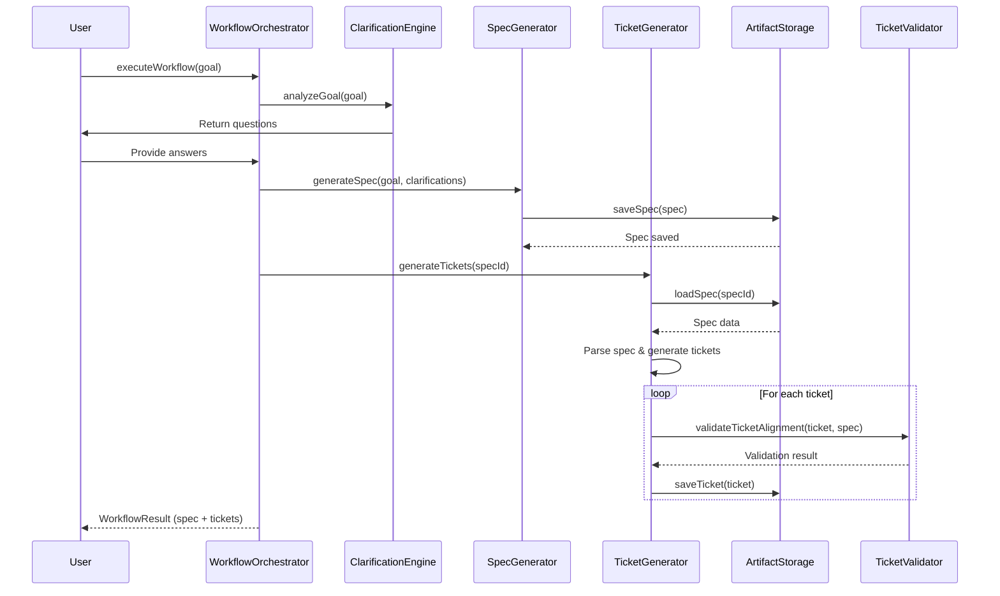

I have created the following plan after thorough exploration and analysis of the codebase. Follow the below plan verbatim. Trust the files and references. Do not re-verify what's written in the plan. Explore only when absolutely necessary. First implement all the proposed file changes and then I'll review all the changes together at the end.

## Observations

The codebase has established patterns for artifact management with frontmatter-based storage, LLM-powered generation using structured JSON schemas, and a reference system for linking artifacts. The planning module follows a clear workflow: `ClarificationEngine` → `SpecGenerator`, with both using `LLMProvider.generateStructured<T>()` for AI-powered content generation. Specs contain structured sections including technical plans with file changes, dependencies, and testing strategies that can be decomposed into granular tickets.

## Approach

Extend the planning workflow by adding `TicketGenerator` to decompose specs into actionable tickets and `WorkflowOrchestrator` to manage the complete flow. The ticket generator will analyze spec content (requirements, technical plan, file changes) and use LLM-powered decomposition to create granular tickets with acceptance criteria, implementation steps, and file references. The orchestrator will coordinate the entire planning pipeline while maintaining state and handling errors gracefully. Validation will ensure tickets properly reference their parent specs and align with requirements.

## Implementation Steps

### 1. Create TicketGenerator Class

**File**: `file:src/planning/TicketGenerator.ts`

Create a new class that follows the same pattern as `SpecGenerator`:

- **Constructor**: Accept `LLMProvider`, `ArtifactStorage`, and `ReferenceResolver`
- **Main Method**: `generateTickets(input: TicketGenerationInput): Promise<Ticket[]>`
  - Load the parent spec using `storage.loadSpec(specId)`
  - Parse spec content to extract functional requirements, technical plan sections, and file changes
  - Build LLM prompt with spec context, requirements, and technical details
  - Use `provider.generateStructured<TicketBreakdown>()` to get structured ticket data
  - Create ticket objects with proper frontmatter fields (id, epicId, specId, title, status, priority, estimatedEffort)
  - Format ticket content with sections: Description, Acceptance Criteria, Implementation Steps, Files to Change, Testing Checklist
  - Add spec reference using format `spec:{specId}` in ticket content
  - Save tickets using `storage.saveTicket()`
  - Return array of created tickets

**Interface Definitions**:
```typescript
interface TicketGenerationInput {
  epicId: string;
  specId: string;
  maxTickets?: number;
  priorityDistribution?: 'balanced' | 'critical-first';
}

interface TicketBreakdown {
  tickets: Array<{
    title: string;
    description: string;
    acceptanceCriteria: string[];
    implementationSteps: string[];
    filesToChange: string[];
    estimatedEffort: string;
    priority: Priority;
    tags: string[];
  }>;
}
```

**LLM Prompt Strategy**:
- System prompt: Define role as technical lead breaking down specs into implementable tickets
- User prompt: Include spec title, requirements, technical plan, file changes
- Schema: Define structured output with ticket array containing all required fields
- Constraints: 3-8 tickets per spec, each ticket should be completable in 2-8 hours

**Ticket Content Template**:
```markdown
## Description
{description}

Related Spec: [spec:{specId}]

## Acceptance Criteria
- [ ] {criterion 1}
- [ ] {criterion 2}

## Implementation Steps
1. {step 1}
2. {step 2}

## Files to Change
- `{file path}` - {change description}

## Testing Checklist
- [ ] Unit tests added/updated
- [ ] Integration tests pass
- [ ] Manual testing completed
```

### 2. Implement Ticket-to-Spec Validation

**File**: `file:src/planning/TicketValidator.ts`

Create validation utilities to ensure ticket alignment with specs:

- **Method**: `validateTicketAlignment(ticket: Ticket, spec: Spec): ValidationResult`
  - Check that ticket.specId matches spec.id
  - Verify ticket references exist in spec content
  - Ensure acceptance criteria map to spec requirements
  - Validate file references exist in spec's technical plan
  - Return validation result with issues array

- **Method**: `validateTicketCompleteness(ticket: Ticket): ValidationResult`
  - Ensure all required sections are present (description, acceptance criteria, implementation steps)
  - Check that acceptance criteria are actionable (start with verbs)
  - Validate estimated effort format (e.g., "2h", "4h", "1d")
  - Verify at least one file is referenced

**Interface**:
```typescript
interface ValidationResult {
  valid: boolean;
  issues: Array<{
    severity: 'error' | 'warning';
    message: string;
    field?: string;
  }>;
}
```

### 3. Create WorkflowOrchestrator

**File**: `file:src/planning/WorkflowOrchestrator.ts`

Build the main orchestration class to manage the complete planning workflow:

- **Constructor**: Accept `LLMProvider`, `CodebaseExplorer`, `ArtifactStorage`, `ReferenceResolver`
- **Initialize Components**: Create instances of `ClarificationEngine`, `SpecGenerator`, `TicketGenerator`

- **Method**: `executeWorkflow(input: WorkflowInput): Promise<WorkflowResult>`
  - **Phase 1 - Clarification**: 
    - Call `clarificationEngine.analyzeGoal(input.goal)`
    - Return questions to user (via callback or return value)
    - Wait for user responses
    - Parse responses into `ClarificationContext`
  
  - **Phase 2 - Spec Generation**:
    - Call `specGenerator.generateSpec()` with goal and clarifications
    - Validate spec using reference resolver
    - Save spec to storage
  
  - **Phase 3 - Ticket Generation**:
    - Call `ticketGenerator.generateTickets()` with spec ID
    - Validate each ticket against spec
    - Save tickets to storage
    - Link tickets to spec using references
  
  - **Error Handling**: Wrap each phase in try-catch, rollback on failure
  - **State Management**: Track workflow state (current phase, artifacts created)
  - **Progress Callbacks**: Emit progress events for UI updates

**Interfaces**:
```typescript
interface WorkflowInput {
  epicId: string;
  goal: string;
  tags?: string[];
  includeCodebaseContext?: boolean;
  onProgress?: (phase: WorkflowPhase, progress: number) => void;
  onQuestionsGenerated?: (questions: string[]) => Promise<string[]>;
}

interface WorkflowResult {
  spec: Spec;
  tickets: Ticket[];
  summary: {
    totalTickets: number;
    estimatedTotalEffort: string;
    criticalTickets: number;
  };
}

type WorkflowPhase = 'clarification' | 'spec_generation' | 'ticket_generation' | 'validation' | 'complete';
```

- **Method**: `resumeWorkflow(workflowId: string): Promise<WorkflowResult>`
  - Load workflow state from storage
  - Resume from last completed phase
  - Continue execution

- **Method**: `cancelWorkflow(workflowId: string): Promise<void>`
  - Clean up partial artifacts
  - Mark workflow as cancelled

### 4. Add Ticket Template System

**File**: `file:src/planning/templates/TicketTemplates.ts`

Create reusable ticket templates for different ticket types:

- **Templates**: Define templates for common ticket types
  - `feature`: New feature implementation
  - `bugfix`: Bug fix with reproduction steps
  - `refactor`: Code refactoring with before/after
  - `test`: Test coverage improvement
  - `documentation`: Documentation updates

- **Method**: `getTemplate(type: TicketType): TicketTemplate`
  - Return template with predefined sections
  - Include placeholder text for guidance

- **Method**: `applyTemplate(template: TicketTemplate, data: TicketData): string`
  - Replace placeholders with actual data
  - Format sections according to template

**Template Structure**:
```typescript
interface TicketTemplate {
  type: TicketType;
  sections: Array<{
    name: string;
    required: boolean;
    placeholder: string;
    format: 'markdown' | 'checklist' | 'code';
  }>;
}

type TicketType = 'feature' | 'bugfix' | 'refactor' | 'test' | 'documentation';
```

### 5. Enhance Reference System for Tickets

**File**: `file:src/core/references/ReferenceResolver.ts` (modify existing)

Extend the reference resolver to support ticket-specific operations:

- **Method**: `getTicketsBySpec(specId: string): Promise<Ticket[]>`
  - Query storage for all tickets with matching specId
  - Return sorted by priority and creation date

- **Method**: `validateTicketReferences(ticket: Ticket): Promise<ValidationResult>`
  - Extract all references from ticket content
  - Resolve each reference
  - Check that spec reference exists and is valid
  - Verify file references point to existing files or spec's technical plan

### 6. Update Planning Module Exports

**File**: `file:src/planning/index.ts` (modify existing)

Add new exports for ticket generation components:

```typescript
export { TicketGenerator } from './TicketGenerator';
export type { TicketGenerationInput, TicketBreakdown } from './TicketGenerator';
export { TicketValidator } from './TicketValidator';
export type { ValidationResult } from './TicketValidator';
export { WorkflowOrchestrator } from './WorkflowOrchestrator';
export type { WorkflowInput, WorkflowResult, WorkflowPhase } from './WorkflowOrchestrator';
export { TicketTemplates } from './templates/TicketTemplates';
export type { TicketTemplate, TicketType } from './templates/TicketTemplates';
```

### 7. Add Workflow State Persistence

**File**: `file:src/planning/WorkflowState.ts`

Create state management for long-running workflows:

- **Interface**: `WorkflowState`
  - Fields: id, epicId, currentPhase, createdArtifacts, userResponses, startedAt, lastUpdatedAt
  
- **Method**: `saveWorkflowState(state: WorkflowState): Promise<void>`
  - Serialize state to JSON
  - Save to `.flowguard/workflows/workflow-{id}.json`

- **Method**: `loadWorkflowState(id: string): Promise<WorkflowState>`
  - Load from storage
  - Deserialize and validate

- **Method**: `cleanupCompletedWorkflows(olderThan: Date): Promise<void>`
  - Remove completed workflow states older than specified date

### 8. Create Integration Tests Setup

**File**: `file:src/planning/__tests__/integration/workflow.test.ts`

Set up test structure for workflow integration testing:

- Test complete workflow execution (goal → spec → tickets)
- Test workflow resumption after interruption
- Test validation failures and error handling
- Test ticket-to-spec reference integrity
- Mock LLM provider responses for deterministic testing

### 9. Update Planning README

**File**: `file:src/planning/README.md` (modify existing)

Add documentation for new components:

- **Section**: "Ticket Generation"
  - Usage examples for `TicketGenerator`
  - Template customization guide
  - Validation best practices

- **Section**: "Workflow Orchestration"
  - Complete workflow example
  - State management and resumption
  - Error handling strategies

- **Section**: "API Reference"
  - Add `TicketGenerator`, `WorkflowOrchestrator`, `TicketValidator` documentation

## Workflow Diagram



## File Structure

```
src/planning/
├── ClarificationEngine.ts (existing)
├── SpecGenerator.ts (existing)
├── TicketGenerator.ts (new)
├── TicketValidator.ts (new)
├── WorkflowOrchestrator.ts (new)
├── WorkflowState.ts (new)
├── templates/
│   └── TicketTemplates.ts (new)
├── __tests__/
│   └── integration/
│       └── workflow.test.ts (new)
├── index.ts (modify)
└── README.md (modify)
```

## Key Considerations

1. **Ticket Granularity**: Use LLM to ensure tickets are appropriately sized (2-8 hours of work)
2. **Reference Integrity**: Always validate spec references exist before creating tickets
3. **Error Recovery**: Implement rollback mechanism if ticket generation fails mid-process
4. **Idempotency**: Support re-running ticket generation for the same spec (update existing vs create new)
5. **Priority Assignment**: Use spec requirements criticality to assign ticket priorities
6. **Effort Estimation**: Leverage codebase complexity analysis for realistic effort estimates
7. **Template Flexibility**: Allow custom ticket templates via configuration
8. **Progress Tracking**: Emit events during workflow execution for UI progress indicators