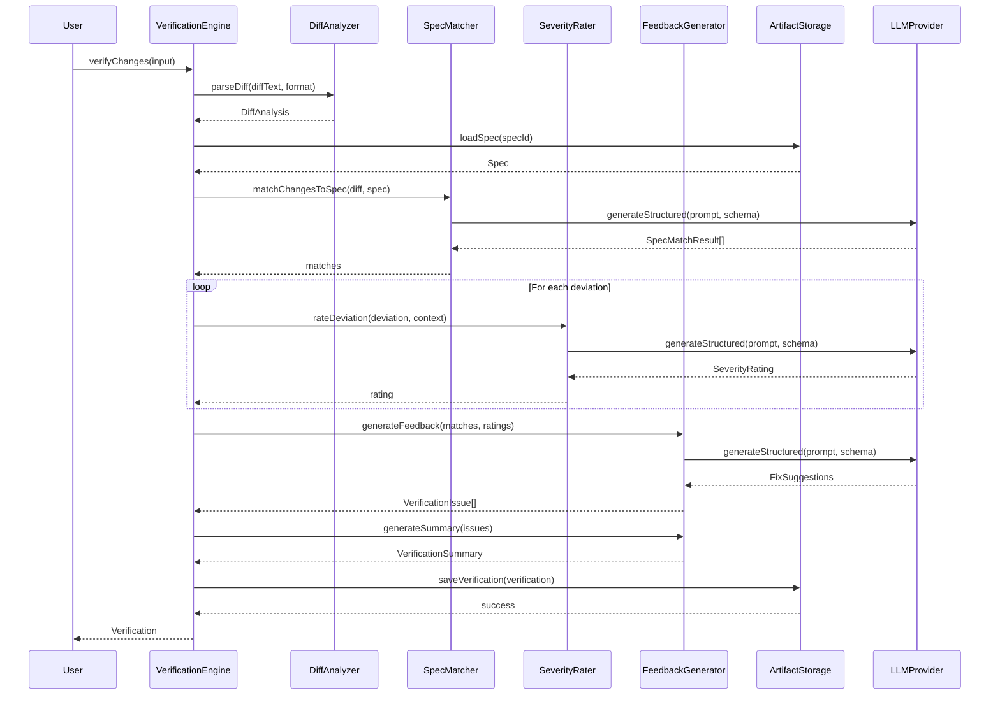

I have created the following plan after thorough exploration and analysis of the codebase. Follow the below plan verbatim. Trust the files and references. Do not re-verify what's written in the plan. Explore only when absolutely necessary. First implement all the proposed file changes and then I'll review all the changes together at the end.

## Observations

The codebase has a well-established pattern for artifact management with frontmatter-based storage, LLM integration using structured generation, and Git operations via `simple-git`. The `Verification` model exists in `file:src/core/models/Verification.ts` but uses severity levels ('error'|'warning'|'info') that differ from spec requirements ('Critical'|'High'|'Medium'|'Low'). The `file:src/verification/` directory is empty, requiring all verification components to be built from scratch. The existing `GitHelper` provides basic diff retrieval but lacks parsing capabilities. The LLM provider pattern uses `generateStructured()` with JSON schemas, similar to `SpecGenerator` and `TicketGenerator`.

## Approach

Build a verification system following established codebase patterns: create a `DiffAnalyzer` to parse Git diffs into structured change data, implement `SpecMatcher` using LLM-powered semantic analysis to map changes to spec requirements, develop `SeverityRater` for deviation classification, and create `FeedbackGenerator` for structured reports. Update the `Verification` model to align with spec requirements. Integrate with existing `ArtifactStorage` for persistence and `ReferenceResolver` for spec linking. Support multiple diff input formats (Git diff, GitHub PR, GitLab MR, manual paste) through a unified parsing interface.

## Implementation Steps

### 1. Update Verification Model

**File: `file:src/core/models/Verification.ts`**

Update the severity type and related interfaces:
- Change `Severity` type from `'error' | 'warning' | 'info'` to `'Critical' | 'High' | 'Medium' | 'Low'`
- Add `specRequirementId` field to `VerificationIssue` to link issues to specific spec requirements
- Add `fixSuggestion` field with structured fix information (description, code example, automated fix availability)
- Update `VerificationSummary` to include severity counts for all four levels
- Add `approvalStatus` field: `'approved' | 'approved_with_conditions' | 'changes_requested' | 'pending'`

**File: `file:src/core/parsers/frontmatter.ts`**

Update the `ENUM_VALIDATORS` object:
- Change `Severity` enum from `['error', 'warning', 'info']` to `['Critical', 'High', 'Medium', 'Low']`

**File: `file:src/core/models/validators.ts`**

Update `validateVerification()` function to handle new fields and validate severity levels against updated enum.

### 2. Create DiffAnalyzer Component

**File: `file:src/verification/DiffAnalyzer.ts`**

Create a class that parses Git diffs and extracts structured change information:
- Implement `parseDiff(diffText: string, format: DiffFormat): DiffAnalysis` method
- Support `DiffFormat` types: `'git' | 'github' | 'gitlab' | 'unified'`
- Parse diff headers to extract file paths, change types (added/modified/deleted)
- Extract line-level changes with line numbers, content, and change type (addition/deletion/modification)
- Calculate statistics: total files, total lines, additions, deletions
- Handle binary files, renamed files, and permission changes
- Use regex patterns for unified diff format: `^diff --git`, `^@@`, `^+`, `^-`
- For GitHub/GitLab formats, parse JSON API responses and convert to unified format

**File: `file:src/verification/types.ts`**

Define types for diff analysis:
- `DiffFormat`: `'git' | 'github' | 'gitlab' | 'unified'`
- `DiffInput`: `{ format: DiffFormat; content: string; metadata?: DiffMetadata }`
- `DiffMetadata`: `{ prUrl?: string; commitHash?: string; branch?: string; author?: string }`
- `ParsedDiff`: Extends `DiffAnalysis` with additional parsing metadata

### 3. Create SpecMatcher Component

**File: `file:src/verification/SpecMatcher.ts`**

Implement LLM-powered semantic matching between code changes and spec requirements:
- Constructor accepts `LLMProvider`, `ArtifactStorage`, `ReferenceResolver`
- Implement `matchChangesToSpec(diff: DiffAnalysis, specId: string): Promise<SpecMatchResult[]>` method
- Load spec content using `ArtifactStorage.loadSpec()`
- Parse spec content to extract requirements sections (functional, non-functional, technical plan)
- Build LLM prompt with system message: "You are a code reviewer analyzing changes against specifications"
- User prompt includes: diff summary, changed files, spec requirements, request to identify matches/deviations
- Use `provider.generateStructured()` with schema for `SpecMatchResult[]`
- Each result contains: `changeDescription`, `matchedRequirements[]`, `deviations[]`, `confidence: number`
- Handle cases where changes don't match any requirements (new functionality, refactoring)
- Cache spec parsing results to avoid re-parsing for multiple diffs

**File: `file:src/verification/types.ts`**

Add types:
- `SpecMatchResult`: `{ fileChanges: ChangedFile[]; matchedRequirements: RequirementMatch[]; deviations: Deviation[]; confidence: number }`
- `RequirementMatch`: `{ requirementId: string; requirementText: string; relevance: number; reasoning: string }`
- `Deviation`: `{ type: 'missing' | 'extra' | 'incorrect'; description: string; expectedBehavior: string; actualBehavior: string }`

### 4. Create SeverityRater Component

**File: `file:src/verification/SeverityRater.ts`**

Classify deviations by severity with LLM-powered reasoning:
- Constructor accepts `LLMProvider`
- Implement `rateDeviation(deviation: Deviation, context: RatingContext): Promise<SeverityRating>` method
- `RatingContext` includes: spec content, file path, change type, project context
- Build LLM prompt with severity criteria:
  - **Critical**: Security vulnerabilities, data loss risks, breaking changes to public APIs
  - **High**: Functional requirements not met, performance degradation, incorrect business logic
  - **Medium**: Non-functional requirements partially met, code quality issues, missing edge cases
  - **Low**: Style inconsistencies, documentation gaps, minor optimizations
- Use `provider.generateStructured()` with schema for `SeverityRating`
- Include reasoning field explaining severity classification
- Add confidence score (0-1) for the rating
- Support batch rating for multiple deviations to optimize LLM calls

**File: `file:src/verification/types.ts`**

Add types:
- `SeverityRating`: `{ severity: Severity; reasoning: string; confidence: number; impactAreas: string[] }`
- `RatingContext`: `{ specContent: string; filePath: string; changeType: string; projectType?: string }`

### 5. Create FeedbackGenerator Component

**File: `file:src/verification/FeedbackGenerator.ts`**

Generate structured verification reports with fix suggestions:
- Constructor accepts `LLMProvider`, `CodebaseExplorer`
- Implement `generateFeedback(matches: SpecMatchResult[], ratings: SeverityRating[]): Promise<VerificationIssue[]>` method
- For each deviation with severity rating, generate detailed issue:
  - Extract file path, line number from change data
  - Create descriptive message combining deviation description and reasoning
  - Generate fix suggestion using LLM with context: file content, surrounding code, spec requirement
  - Include code example in suggestion when applicable
  - Add category classification: security, performance, logic, style, documentation, testing, architecture
- Implement `generateSummary(issues: VerificationIssue[]): VerificationSummary` method
- Calculate issue counts by severity
- Determine overall pass/fail based on Critical/High issue count
- Generate recommendation text: "Approved", "Approved with conditions", "Changes requested"
- Format code examples with syntax highlighting markers for UI rendering

**File: `file:src/verification/types.ts`**

Add types:
- `FeedbackContext`: `{ fileContent: string; surroundingLines: string[]; specRequirement: string }`
- `FixSuggestion`: `{ description: string; codeExample?: string; automatedFix?: boolean; steps: string[] }`

### 6. Create VerificationEngine Orchestrator

**File: `file:src/verification/VerificationEngine.ts`**

Orchestrate the complete verification workflow:
- Constructor accepts `LLMProvider`, `ArtifactStorage`, `GitHelper`, `ReferenceResolver`, `CodebaseExplorer`
- Initialize components: `DiffAnalyzer`, `SpecMatcher`, `SeverityRater`, `FeedbackGenerator`
- Implement `verifyChanges(input: VerificationInput): Promise<Verification>` method
- `VerificationInput`: `{ epicId: string; specIds?: string[]; diffInput: DiffInput; options?: VerificationOptions }`
- Workflow steps:
  1. Parse diff using `DiffAnalyzer.parseDiff()`
  2. Extract diff source metadata (commit hash, branch, author, timestamp)
  3. For each spec ID, run `SpecMatcher.matchChangesToSpec()`
  4. For each deviation, run `SeverityRater.rateDeviation()`
  5. Generate issues using `FeedbackGenerator.generateFeedback()`
  6. Create summary using `FeedbackGenerator.generateSummary()`
  7. Build `Verification` object with all data
  8. Save using `ArtifactStorage.saveVerification()`
- Handle errors gracefully with partial results
- Support options: `skipLowSeverity`, `autoApprove`, `includeCodeExamples`

**File: `file:src/verification/types.ts`**

Add types:
- `VerificationInput`: As described above
- `VerificationOptions`: `{ skipLowSeverity?: boolean; autoApprove?: boolean; includeCodeExamples?: boolean; maxIssues?: number }`

### 7. Add Verification Storage Methods

**File: `file:src/core/storage/ArtifactStorage.ts`**

Add methods for verification artifact management:
- `async saveVerification(verification: Verification): Promise<void>`
  - Build frontmatter with: id, epicId, diffSource, analysis summary, issues count, summary, createdAt
  - Serialize issues and analysis as JSON in markdown content
  - Use `serializeFrontmatter()` and `writeFile()`
- `async loadVerification(id: string): Promise<Verification>`
  - Read file using `readFile()`
  - Parse frontmatter using `parseFrontmatter()` with validation
  - Parse JSON content for issues and analysis
  - Reconstruct `Verification` object
- `async listVerifications(epicId?: string): Promise<Verification[]>`
  - List files matching `verification-*.md` pattern
  - Load each verification, filter by epicId if provided
- `async deleteVerification(id: string): Promise<void>`
  - Check existence, throw `NotFoundError` if missing
  - Delete file using `deleteFile()`

### 8. Create Diff Input Adapters

**File: `file:src/verification/adapters/GitDiffAdapter.ts`**

Adapter for Git diff format:
- Implement `adapt(input: string): DiffInput` method
- Parse Git diff format directly
- Extract metadata from diff headers

**File: `file:src/verification/adapters/GitHubAdapter.ts`**

Adapter for GitHub PR format:
- Implement `adapt(prUrl: string, apiToken?: string): Promise<DiffInput>` method
- Fetch PR data using GitHub API
- Extract diff from PR files
- Parse PR metadata: author, branch, commit hash

**File: `file:src/verification/adapters/GitLabAdapter.ts`**

Adapter for GitLab MR format:
- Implement `adapt(mrUrl: string, apiToken?: string): Promise<DiffInput>` method
- Fetch MR data using GitLab API
- Extract diff from MR changes
- Parse MR metadata

**File: `file:src/verification/adapters/index.ts`**

Export adapter factory:
- `createAdapter(format: DiffFormat): DiffAdapter`
- Auto-detect format from input (URL pattern, diff headers)

### 9. Add Verification Index and Exports

**File: `file:src/verification/index.ts`**

Export all verification components:
- Export `VerificationEngine` as main entry point
- Export `DiffAnalyzer`, `SpecMatcher`, `SeverityRater`, `FeedbackGenerator`
- Export all types from `types.ts`
- Export adapters from `adapters/index.ts`

### 10. Integration Testing Setup

**File: `file:src/verification/__tests__/integration/verification.test.ts`**

Create integration tests:
- Test complete verification workflow with sample Git diff
- Test spec matching with mock spec content
- Test severity rating with various deviation types
- Test feedback generation with fix suggestions
- Test storage operations (save/load/list verification)
- Test error handling for invalid diffs, missing specs
- Mock LLM provider responses for deterministic testing

**File: `file:src/verification/__tests__/unit/DiffAnalyzer.test.ts`**

Unit tests for diff parsing:
- Test Git unified diff format parsing
- Test file change extraction (added/modified/deleted)
- Test line-level change parsing
- Test statistics calculation
- Test edge cases: binary files, renames, empty diffs

## Architecture Diagram



## Component Dependencies

| Component | Dependencies | Purpose |
|-----------|-------------|---------|
| `DiffAnalyzer` | None | Parse diffs into structured data |
| `SpecMatcher` | `LLMProvider`, `ArtifactStorage`, `ReferenceResolver` | Match changes to spec requirements |
| `SeverityRater` | `LLMProvider` | Classify deviation severity |
| `FeedbackGenerator` | `LLMProvider`, `CodebaseExplorer` | Generate fix suggestions |
| `VerificationEngine` | All above components | Orchestrate verification workflow |
| Adapters | None | Convert various diff formats |

## File Structure

```
src/verification/
├── index.ts                      # Main exports
├── types.ts                      # Type definitions
├── VerificationEngine.ts         # Main orchestrator
├── DiffAnalyzer.ts              # Diff parsing
├── SpecMatcher.ts               # Spec matching
├── SeverityRater.ts             # Severity classification
├── FeedbackGenerator.ts         # Feedback generation
├── adapters/
│   ├── index.ts                 # Adapter factory
│   ├── GitDiffAdapter.ts        # Git diff adapter
│   ├── GitHubAdapter.ts         # GitHub PR adapter
│   └── GitLabAdapter.ts         # GitLab MR adapter
└── __tests__/
    ├── unit/
    │   ├── DiffAnalyzer.test.ts
    │   ├── SpecMatcher.test.ts
    │   └── SeverityRater.test.ts
    └── integration/
        └── verification.test.ts
```