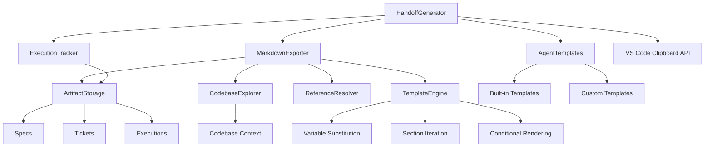
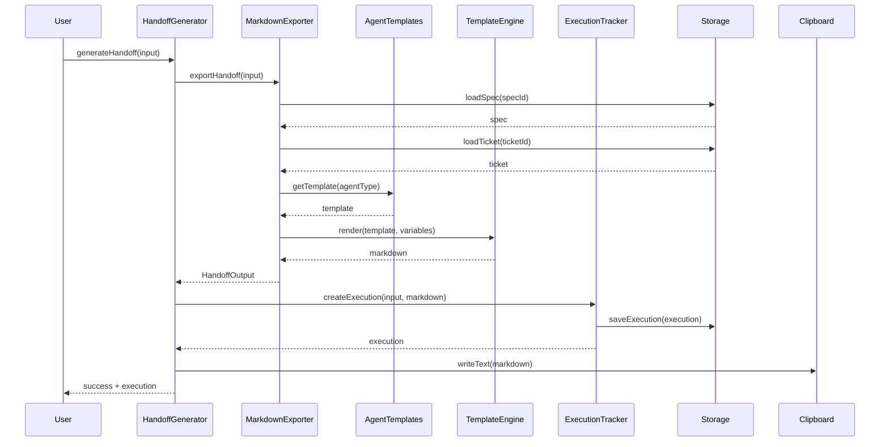

I have created the following plan after thorough exploration and analysis of the codebase. Follow the below plan verbatim. Trust the files and references. Do not re-verify what's written in the plan. Explore only when absolutely necessary. First implement all the proposed file changes and then I'll review all the changes together at the end.

## Observations

The codebase has a well-established pattern for artifact management using frontmatter + markdown format stored in `.flowguard/` directories. The `Execution` model already exists with support for tracking `agentType`, `handoffPrompt`, and related artifacts. The `ArtifactStorage` class provides CRUD operations for all artifact types. The `CodebaseExplorer` gathers comprehensive codebase context including files, symbols, and dependencies. Specs and tickets have structured markdown content with clear sections that can be bundled for handoff.

## Approach

Build a handoff generation system that bundles specs, tickets, and codebase context into agent-specific markdown prompts. Create `MarkdownExporter` to aggregate artifacts, `AgentTemplates` to provide customizable templates for different AI agents, and `ExecutionTracker` to create execution records when handoffs are generated. Use VS Code's built-in clipboard API for one-click copy functionality. Implement template variable substitution for dynamic content and add preview mode to review handoffs before copying.

## Implementation Steps

### 1. Create Handoff Directory Structure

Create the following directory structure:
```
src/handoff/
├── index.ts
├── MarkdownExporter.ts
├── AgentTemplates.ts
├── ExecutionTracker.ts
├── TemplateEngine.ts
└── types.ts
```

### 2. Define Core Types (`file:src/handoff/types.ts`)

Create interfaces for:
- `HandoffInput` - Contains `epicId`, `specIds`, `ticketIds`, `agentType`, `includeCodebaseContext`, `customTemplate`
- `HandoffOutput` - Contains `markdown`, `executionId`, `metadata` (word count, estimated reading time)
- `TemplateVariables` - Contains `specs`, `tickets`, `codebaseContext`, `epicMetadata`, `timestamp`, `author`
- `AgentTemplate` - Contains `name`, `agentType`, `template` (string with variable placeholders), `description`, `sections` (array of section configs)
- `TemplateSection` - Contains `name`, `required`, `content` (template string), `order`

### 3. Implement MarkdownExporter (`file:src/handoff/MarkdownExporter.ts`)

Create class with constructor accepting `ArtifactStorage`, `CodebaseExplorer`, `ReferenceResolver`, `EpicMetadataManager`.

**Key Methods:**

**`async exportHandoff(input: HandoffInput): Promise<HandoffOutput>`**
- Load specs using `storage.loadSpec()` for each `specId`
- Load tickets using `storage.loadTicket()` for each `ticketId`
- Optionally gather codebase context using `codebaseExplorer.explore()`
- Load epic metadata using `epicMetadataManager.loadMetadata()`
- Build `TemplateVariables` object with all gathered data
- Get agent template using `AgentTemplates.getTemplate(agentType)`
- Render template using `TemplateEngine.render()`
- Calculate metadata (word count, reading time)
- Return `HandoffOutput` with rendered markdown

**`private async loadArtifacts(specIds: string[], ticketIds: string[])`**
- Batch load all specs and tickets
- Handle missing artifacts gracefully with warnings
- Return structured artifact data

**`private formatCodebaseContext(context: CodebaseContext): string`**
- Format codebase statistics (total files, lines, languages)
- List key symbols and their types
- Include dependency graph summary
- Format as markdown sections

**`private resolveReferences(content: string): string`**
- Use `ReferenceResolver` to expand `spec:`, `ticket:`, `file:` references
- Replace references with readable links or inline content
- Preserve original reference format in comments

### 4. Implement AgentTemplates (`file:src/handoff/AgentTemplates.ts`)

Create class with static template definitions for each agent type.

**Agent-Specific Templates:**

**Cursor Template:**
```markdown
# Development Task - {{epicTitle}}

## Context
{{#specs}}
### Spec: {{title}}
{{content}}
{{/specs}}

## Tasks
{{#tickets}}
### {{title}} ({{priority}})
{{content}}
{{/tickets}}

## Codebase Context
{{codebaseContext}}

## Instructions
Implement the tasks above following the specifications. Focus on {{#tickets}}{{title}}{{/tickets}} in order of priority.
```

**Claude Projects Template:**
```markdown
# Project: {{epicTitle}}

<specifications>
{{#specs}}
## {{title}}
{{content}}
{{/specs}}
</specifications>

<tasks>
{{#tickets}}
### Task: {{title}}
Priority: {{priority}}
Estimated Effort: {{estimatedEffort}}

{{content}}
{{/tickets}}
</tasks>

<codebase_context>
{{codebaseContext}}
</codebase_context>

Please implement these tasks following the specifications provided.
```

**Windsurf Template:**
```markdown
# Epic: {{epicTitle}}

## Specifications
{{#specs}}
### {{title}}
{{content}}
{{/specs}}

## Implementation Tickets
{{#tickets}}
**[{{priority}}] {{title}}** ({{estimatedEffort}})
{{content}}
{{/tickets}}

## Codebase Overview
{{codebaseContext}}
```

**Cline Template:**
```markdown
# Task: {{epicTitle}}

## Specifications
{{#specs}}
{{content}}
{{/specs}}

## Tickets to Implement
{{#tickets}}
- **{{title}}** ({{priority}}, {{estimatedEffort}})
  {{content}}
{{/tickets}}

## Codebase Context
{{codebaseContext}}

Implement the tickets above in priority order.
```

**Aider Template:**
```markdown
# {{epicTitle}}

## Specs
{{#specs}}
{{content}}
{{/specs}}

## Tasks
{{#tickets}}
{{title}} ({{estimatedEffort}})
{{content}}
{{/tickets}}

## Files
{{#codebaseFiles}}
- {{path}} ({{language}}, {{loc}} lines)
{{/codebaseFiles}}
```

**Key Methods:**

**`static getTemplate(agentType: AgentType): AgentTemplate`**
- Return template configuration for specified agent
- Throw error if agent type not supported

**`static getAllTemplates(): AgentTemplate[]`**
- Return array of all available templates

**`static registerCustomTemplate(template: AgentTemplate): void`**
- Allow registration of custom templates
- Validate template structure
- Store in templates map

### 5. Implement TemplateEngine (`file:src/handoff/TemplateEngine.ts`)

Create class for template variable substitution using Mustache-like syntax.

**Key Methods:**

**`render(template: string, variables: TemplateVariables): string`**
- Parse template for variable placeholders `{{variableName}}`
- Support section iteration `{{#array}}...{{/array}}`
- Support conditionals `{{#if condition}}...{{/if}}`
- Replace variables with actual values
- Handle missing variables gracefully (empty string or placeholder)
- Return rendered markdown string

**`private parseTemplate(template: string): TemplateNode[]`**
- Tokenize template into nodes (text, variable, section, conditional)
- Build AST for template structure

**`private evaluateNode(node: TemplateNode, context: any): string`**
- Recursively evaluate template nodes
- Handle variable substitution, loops, conditionals

**`validateTemplate(template: string): { valid: boolean; errors: string[] }`**
- Check for unclosed tags
- Validate variable references
- Return validation result

### 6. Implement ExecutionTracker (`file:src/handoff/ExecutionTracker.ts`)

Create class with constructor accepting `ArtifactStorage`.

**Key Methods:**

**`async createExecution(input: HandoffInput, handoffPrompt: string): Promise<Execution>`**
- Generate new execution ID using `generateUUID()`
- Create `Execution` object with:
  - `id`, `epicId`, `specIds`, `ticketIds`
  - `agentType` from input
  - `handoffPrompt` (the generated markdown)
  - `status: 'pending'`
  - `startedAt: new Date()`
- Save execution using `storage.saveExecution()`
- Return created execution

**`async updateExecutionStatus(executionId: string, status: ExecutionStatus, results?: ExecutionResults): Promise<void>`**
- Load execution using `storage.loadExecution()`
- Update status and optionally results
- Set `completedAt` if status is 'completed' or 'failed'
- Save updated execution

**`async getExecutionsByEpic(epicId: string): Promise<Execution[]>`**
- Use `storage.listExecutions(epicId)`
- Return sorted by `startedAt` descending

**`async getExecutionById(executionId: string): Promise<Execution>`**
- Load and return execution
- Throw error if not found

### 7. Create Main Handoff Orchestrator (`file:src/handoff/index.ts`)

Export main class `HandoffGenerator` that orchestrates the entire handoff generation process.

**Constructor:** Accept `ArtifactStorage`, `CodebaseExplorer`, `ReferenceResolver`, `EpicMetadataManager`

**Key Methods:**

**`async generateHandoff(input: HandoffInput): Promise<{ markdown: string; execution: Execution; metadata: HandoffMetadata }>`**
- Validate input (check specs and tickets exist)
- Use `MarkdownExporter` to generate markdown
- Use `ExecutionTracker` to create execution record
- Return bundled result

**`async copyToClipboard(markdown: string): Promise<void>`**
- Use `vscode.env.clipboard.writeText(markdown)`
- Show success notification using `vscode.window.showInformationMessage()`

**`async generatePreview(input: HandoffInput): Promise<string>`**
- Generate handoff markdown without creating execution record
- Return markdown for preview purposes

**`getAvailableAgents(): AgentType[]`**
- Return list of supported agent types
- Include custom registered agents

### 8. Add Template Customization Support

**In `file:src/handoff/AgentTemplates.ts`:**

**`static saveCustomTemplate(agentType: AgentType, template: string, workspaceRoot: string): Promise<void>`**
- Save custom template to `.flowguard/templates/${agentType}.md`
- Create templates directory if not exists
- Write template file

**`static loadCustomTemplate(agentType: AgentType, workspaceRoot: string): Promise<string | null>`**
- Check if custom template exists at `.flowguard/templates/${agentType}.md`
- Read and return template content
- Return null if not found

**`static async getTemplate(agentType: AgentType, workspaceRoot?: string): Promise<AgentTemplate>`**
- First check for custom template in workspace
- Fall back to built-in template
- Merge custom sections with default template

### 9. Add Handoff Metadata Calculation

**In `file:src/handoff/MarkdownExporter.ts`:**

**`private calculateMetadata(markdown: string): HandoffMetadata`**
- Count words: `markdown.split(/\s+/).length`
- Estimate reading time: `Math.ceil(wordCount / 200)` minutes
- Count specs and tickets included
- Calculate total estimated effort from tickets
- Return metadata object

### 10. Integration with Existing Systems

**Update `file:src/core/storage/constants.ts`:**
- Add `TEMPLATES: 'templates'` to `STORAGE_DIRS`
- Add template file pattern constants

**Update `file:src/core/storage/ArtifactStorage.ts`:**
- Add `getTemplatesDir()` method
- Add `saveTemplate()` and `loadTemplate()` methods for custom templates

**Create `file:src/handoff/__tests__/unit/MarkdownExporter.test.ts`:**
- Test artifact loading and bundling
- Test codebase context formatting
- Test reference resolution
- Test metadata calculation

**Create `file:src/handoff/__tests__/unit/TemplateEngine.test.ts`:**
- Test variable substitution
- Test section iteration
- Test conditional rendering
- Test template validation

**Create `file:src/handoff/__tests__/integration/handoff.test.ts`:**
- Test complete handoff generation flow
- Test execution tracking
- Test different agent templates
- Test custom template loading

### 11. Export Public API

**In `file:src/handoff/index.ts`:**

Export:
- `HandoffGenerator` class
- `MarkdownExporter` class
- `AgentTemplates` class
- `ExecutionTracker` class
- `TemplateEngine` class
- All types from `types.ts`

## Architecture Diagram



## Handoff Generation Flow



## Template Variable Reference

| Variable | Type | Description |
|----------|------|-------------|
| `{{epicTitle}}` | string | Epic title from metadata |
| `{{epicId}}` | string | Epic UUID |
| `{{timestamp}}` | string | ISO timestamp of generation |
| `{{author}}` | string | User who generated handoff |
| `{{#specs}}` | array | Iteration over specs |
| `{{specs.title}}` | string | Spec title |
| `{{specs.content}}` | string | Spec markdown content |
| `{{#tickets}}` | array | Iteration over tickets |
| `{{tickets.title}}` | string | Ticket title |
| `{{tickets.priority}}` | string | Ticket priority |
| `{{tickets.estimatedEffort}}` | string | Estimated effort |
| `{{tickets.content}}` | string | Ticket markdown content |
| `{{codebaseContext}}` | string | Formatted codebase summary |
| `{{totalFiles}}` | number | Total files in codebase |
| `{{totalLines}}` | number | Total lines of code |
| `{{languages}}` | string | Comma-separated languages |