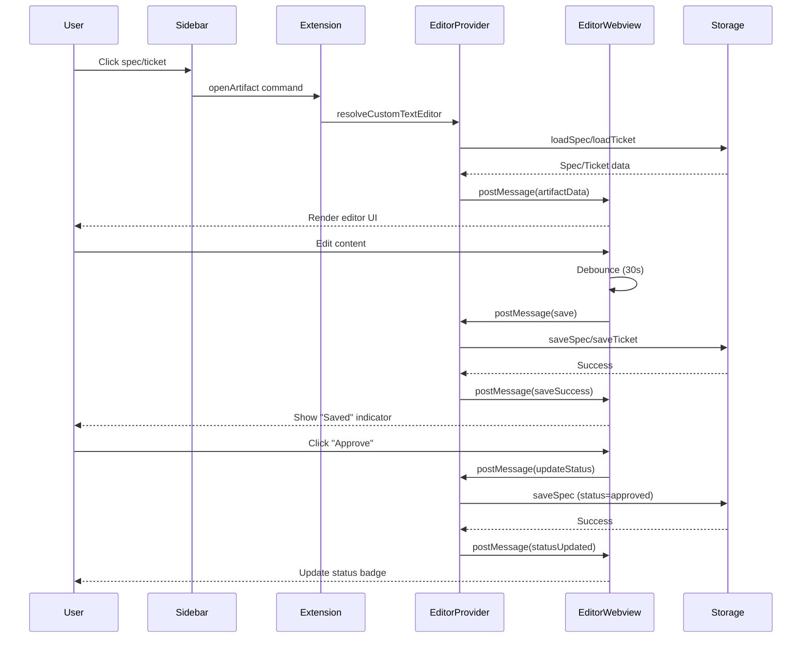
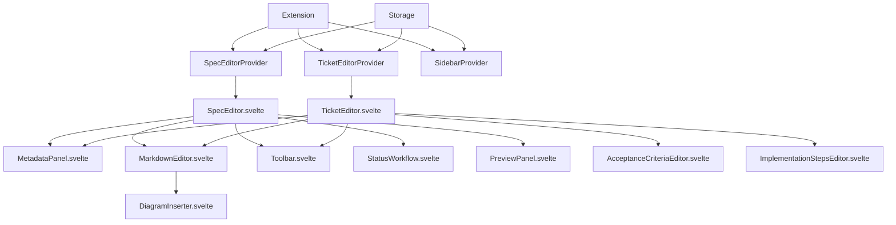

I have created the following plan after thorough exploration and analysis of the codebase. Follow the below plan verbatim. Trust the files and references. Do not re-verify what's written in the plan. Explore only when absolutely necessary. First implement all the proposed file changes and then I'll review all the changes together at the end.

## Observations

The codebase uses a Svelte-based webview architecture with message passing between extension and UI. The sidebar currently opens specs/tickets in VS Code's default text editor. Storage layer uses frontmatter (YAML) + markdown format with `ArtifactStorage` handling CRUD operations. A `MermaidGenerator` utility exists for diagram generation. No debounce utility or custom editor infrastructure exists yet.

## Approach

Implement custom webview editors using VS Code's `CustomTextEditorProvider` API for both specs and tickets. Create separate Svelte applications for each editor type with rich UI components (metadata panels, markdown editors, toolbars). Follow the existing message passing pattern from the sidebar. Add auto-save with debouncing, status workflow UI, and Mermaid diagram insertion with preview. Extend webpack configuration to bundle multiple webview entry points.

## Implementation Steps

### 1. Create Debounce Utility

**File:** `file:src/utils/debounce.ts`

Create a TypeScript debounce utility function:
- Export `debounce<T extends (...args: any[]) => any>(fn: T, delay: number): T` function
- Implement timer-based debouncing with cleanup
- Support immediate execution option
- Add TypeScript generics for type safety

### 2. Define Editor Message Types

**File:** `file:src/ui/editors/types.ts`

Define message interfaces for editor-webview communication:
- Request messages: `LoadArtifactRequest`, `SaveArtifactRequest`, `UpdateStatusRequest`, `InsertDiagramRequest`, `PreviewMarkdownRequest`, `ExportArtifactRequest`, `ApproveArtifactRequest`
- Response messages: `ArtifactDataResponse`, `SaveSuccessResponse`, `SaveErrorResponse`, `DiagramPreviewResponse`, `MarkdownPreviewResponse`
- Data interfaces: `SpecEditorData` (extends `Spec` with validation state), `TicketEditorData` (extends `Ticket` with validation state)
- Add union types `EditorRequestMessage` and `EditorResponseMessage`

### 3. Build Spec Editor Provider

**File:** `file:src/ui/editors/SpecEditorProvider.ts`

Implement `vscode.CustomTextEditorProvider` for spec editing:
- Constructor accepts `extensionUri: vscode.Uri`, `storage: ArtifactStorage`
- Implement `resolveCustomTextEditor(document: vscode.TextDocument, webviewPanel: vscode.WebviewPanel, token: vscode.CancellationToken)`
- Load spec from document URI using `storage.loadSpec()`
- Set up webview HTML with CSP and script URI pointing to `out/webview/specEditor.js`
- Handle incoming messages: `save` (parse frontmatter, update document), `updateStatus`, `insertDiagram`, `preview`, `export`, `approve`
- Implement `updateWebview()` to send spec data to webview
- Listen to document changes and sync with webview
- Handle disposal and cleanup

### 4. Build Ticket Editor Provider

**File:** `file:src/ui/editors/TicketEditorProvider.ts`

Implement `vscode.CustomTextEditorProvider` for ticket editing:
- Similar structure to `SpecEditorProvider`
- Constructor accepts `extensionUri: vscode.Uri`, `storage: ArtifactStorage`
- Implement `resolveCustomTextEditor()` with ticket-specific logic
- Load ticket from document URI using `storage.loadTicket()`
- Set up webview HTML pointing to `out/webview/ticketEditor.js`
- Handle messages: `save`, `updateStatus`, `updatePriority`, `updateAssignee`, `insertDiagram`, `preview`, `export`
- Implement acceptance criteria and implementation steps editing
- Add testing checklist management
- Handle document sync and disposal

### 5. Create Shared Editor Components

**Directory:** `file:src/ui/editors/webview/components/`

Build reusable Svelte components:

**`MetadataPanel.svelte`:**
- Props: `metadata: Record<string, any>`, `schema: FieldSchema[]`, `onChange: (field: string, value: any) => void`
- Render form fields based on schema (text inputs, selects, date pickers, tag inputs)
- Support field validation with error display
- Use VS Code styling variables

**`MarkdownEditor.svelte`:**
- Props: `content: string`, `onChange: (content: string) => void`, `placeholder: string`
- Implement textarea with syntax highlighting hints
- Add toolbar for common markdown formatting (bold, italic, code, lists, links)
- Support tab indentation and keyboard shortcuts
- Auto-resize based on content

**`Toolbar.svelte`:**
- Props: `actions: ToolbarAction[]`, `disabled: boolean`
- Render action buttons with icons (Save, Preview, Export, Approve)
- Show loading states and success/error indicators
- Support keyboard shortcuts (Cmd+S for save)
- Display last saved timestamp

**`StatusWorkflow.svelte`:**
- Props: `currentStatus: string`, `allowedTransitions: string[]`, `onStatusChange: (status: string) => void`
- Render status badges with transition buttons
- Show workflow visualization (Draft → In Review → Approved)
- Disable invalid transitions
- Add confirmation for critical transitions

**`DiagramInserter.svelte`:**
- Props: `onInsert: (diagram: string) => void`
- Provide diagram type selector (architecture, sequence, flow, class)
- Show diagram template picker
- Render Mermaid preview using `MermaidGenerator`
- Allow manual diagram code editing
- Insert diagram markdown into content

**`PreviewPanel.svelte`:**
- Props: `markdown: string`, `diagrams: string[]`
- Render markdown preview with Mermaid diagram rendering
- Support split view (editor | preview)
- Auto-scroll sync between editor and preview
- Handle diagram rendering errors gracefully

### 6. Build Spec Editor Webview

**File:** `file:src/ui/editors/webview/SpecEditor.svelte`

Create main Svelte component for spec editing:
- State: `spec: SpecEditorData`, `isDirty: boolean`, `isSaving: boolean`, `errors: ValidationError[]`, `showPreview: boolean`
- Layout: Two-column layout (metadata panel | markdown editor)
- Metadata fields: title, status, author, tags, createdAt, updatedAt (read-only)
- Content editor: Full markdown editor with diagram insertion
- Toolbar: Save, Preview, Export, Approve buttons
- Auto-save: Debounced save (30s delay) on content/metadata changes
- Status workflow: Visual status transition UI (Draft → In Review → Approved)
- Validation: Real-time validation with error display
- Message handling: Send/receive messages to/from provider

**File:** `file:src/ui/editors/webview/specEditorMain.ts`

Entry point for spec editor webview:
- Import `SpecEditor.svelte`
- Set up VS Code API bridge
- Initialize message listener
- Mount Svelte app to `document.body`
- Request initial spec data on load
- Handle cleanup on unload

### 7. Build Ticket Editor Webview

**File:** `file:src/ui/editors/webview/TicketEditor.svelte`

Create main Svelte component for ticket editing:
- State: `ticket: TicketEditorData`, `isDirty: boolean`, `isSaving: boolean`, `errors: ValidationError[]`
- Layout: Three-section layout (metadata | content | checklist)
- Metadata fields: title, status, priority, assignee, estimatedEffort, specId (read-only), tags
- Content sections: Description, Acceptance Criteria, Implementation Steps
- Testing checklist: Dynamic checklist with add/remove/check items
- Toolbar: Save, Preview, Export buttons
- Auto-save: Debounced save (30s delay)
- Priority selector: Visual priority picker (Low → Medium → High → Critical)
- Assignee autocomplete: Suggest assignees from workspace
- Validation: Ensure required fields are filled

**File:** `file:src/ui/editors/webview/ticketEditorMain.ts`

Entry point for ticket editor webview:
- Similar structure to `specEditorMain.ts`
- Import `TicketEditor.svelte`
- Set up message passing
- Mount app and request initial data

### 8. Create Editor Utilities

**File:** `file:src/ui/editors/utils/markdown.ts`

Markdown helper functions:
- `insertAtCursor(content: string, insertion: string, cursorPos: number): { content: string, newCursorPos: number }`
- `wrapSelection(content: string, start: number, end: number, wrapper: string): string`
- `insertDiagram(content: string, diagram: string, cursorPos: number): string`
- `extractDiagrams(content: string): { type: string, code: string, position: number }[]`
- `formatMarkdown(content: string): string` (basic formatting cleanup)

**File:** `file:src/ui/editors/utils/validation.ts`

Validation utilities:
- `validateSpec(spec: Partial<Spec>): ValidationError[]`
- `validateTicket(ticket: Partial<Ticket>): ValidationError[]`
- `validateRequired(value: any, fieldName: string): ValidationError | null`
- `validateStatus(status: string, allowedStatuses: string[]): ValidationError | null`
- Interface `ValidationError` with `field: string`, `message: string`, `severity: 'error' | 'warning'`

### 9. Update Webpack Configuration

**File:** `file:webpack.webview.config.js`

Modify to support multiple webview entry points:
- Change `entry` from single string to object: `{ sidebar: './src/ui/sidebar/webview/main.ts', specEditor: './src/ui/editors/webview/specEditorMain.ts', ticketEditor: './src/ui/editors/webview/ticketEditorMain.ts' }`
- Update `output.filename` to `'[name].js'` for dynamic naming
- Keep existing loaders and plugins
- Add separate `HtmlWebpackPlugin` instances for each entry (optional, or generate HTML in providers)

### 10. Register Editors in Extension

**File:** `file:src/extension.ts`

Register custom editor providers:
- Import `SpecEditorProvider` and `TicketEditorProvider`
- In `activate()`, instantiate providers: `const specEditorProvider = new SpecEditorProvider(context.extensionUri, storage)` and `const ticketEditorProvider = new TicketEditorProvider(context.extensionUri, storage)`
- Register providers: `vscode.window.registerCustomEditorProvider('flowguard.specEditor', specEditorProvider, { webviewOptions: { retainContextWhenHidden: true } })` and `vscode.window.registerCustomEditorProvider('flowguard.ticketEditor', ticketEditorProvider, { webviewOptions: { retainContextWhenHidden: true } })`
- Add to `context.subscriptions`

**File:** `file:package.json`

Add custom editor contributions:
- In `contributes.customEditors`, add:
  ```json
  {
    "viewType": "flowguard.specEditor",
    "displayName": "FlowGuard Spec Editor",
    "selector": [{ "filenamePattern": "**/specs/spec-*.md" }],
    "priority": "default"
  }
  ```
- Add ticket editor:
  ```json
  {
    "viewType": "flowguard.ticketEditor",
    "displayName": "FlowGuard Ticket Editor",
    "selector": [{ "filenamePattern": "**/tickets/ticket-*.md" }],
    "priority": "default"
  }
  ```

### 11. Update Sidebar to Use Custom Editors

**File:** `file:src/ui/sidebar/SidebarProvider.ts`

Modify `_openArtifact()` method:
- Instead of `vscode.workspace.openTextDocument()`, use `vscode.commands.executeCommand('vscode.openWith', uri, 'flowguard.specEditor')` for specs
- Use `vscode.commands.executeCommand('vscode.openWith', uri, 'flowguard.ticketEditor')` for tickets
- Keep existing behavior for executions

### 12. Add Editor Styling

**File:** `file:src/ui/editors/webview/styles/editor.css`

Create shared editor styles:
- Layout styles for two/three-column layouts
- Metadata panel styling (form fields, labels, validation errors)
- Markdown editor styling (textarea, toolbar, formatting buttons)
- Toolbar styling (action buttons, status indicators)
- Preview panel styling (markdown rendering, diagram containers)
- Responsive design for different panel sizes
- Use VS Code CSS variables for theming

### 13. Implement Auto-Save Logic

**In `SpecEditor.svelte` and `TicketEditor.svelte`:**
- Import debounce utility
- Create debounced save function: `const debouncedSave = debounce(() => { saveToProvider(); }, 30000);`
- Call `debouncedSave()` on every content or metadata change
- Track `isDirty` state (set to true on change, false on successful save)
- Show "Saving..." indicator during save
- Display "Saved at [timestamp]" on success
- Handle save errors with retry option
- Prevent navigation if unsaved changes exist (show confirmation dialog)

### 14. Implement Status Workflow UI

**In `StatusWorkflow.svelte`:**
- Define status transitions: `{ draft: ['in_review'], in_review: ['draft', 'approved'], approved: ['archived'], archived: [] }`
- Render current status badge with color coding
- Show available transition buttons
- Add confirmation dialog for "Approve" action
- Emit status change event to parent component
- Update metadata and trigger save

**In `SpecEditor.svelte`:**
- Integrate `StatusWorkflow` component
- Handle status change events
- Update spec status in state
- Trigger auto-save

### 15. Implement Diagram Insertion

**In `DiagramInserter.svelte`:**
- Import `MermaidGenerator` from `file:src/planning/diagrams/MermaidGenerator`
- Provide diagram type selector (Architecture, Sequence, Flow, Class)
- Show template picker for each type
- Render live preview using Mermaid
- Allow manual code editing in textarea
- On insert, format as markdown code block: ` ```mermaid\n[code]\n``` `
- Emit insert event with diagram markdown

**In `MarkdownEditor.svelte`:**
- Add "Insert Diagram" button in toolbar
- Show `DiagramInserter` modal on click
- Insert diagram at cursor position using `insertDiagram()` utility
- Update content state and trigger auto-save

### 16. Implement Preview Mode

**In `PreviewPanel.svelte`:**
- Accept markdown content as prop
- Parse markdown and extract Mermaid diagrams using `extractDiagrams()`
- Render markdown using a lightweight markdown parser (or VS Code's markdown preview API)
- Render Mermaid diagrams using Mermaid library (include via CDN or bundle)
- Handle diagram rendering errors with fallback display
- Support split view toggle (editor only | split | preview only)

**In `SpecEditor.svelte`:**
- Add "Preview" toggle button in toolbar
- Show/hide `PreviewPanel` based on toggle state
- Pass current content to preview panel
- Implement split view layout (50/50 or adjustable)

### 17. Implement Export Functionality

**In `SpecEditor.svelte` and `TicketEditor.svelte`:**
- Add "Export" button in toolbar
- On click, send `export` message to provider
- Provider generates export (markdown file, PDF, or handoff format)
- Show success notification with "Open" action
- Support export to clipboard option

### 18. Add Keyboard Shortcuts

**In `SpecEditor.svelte` and `TicketEditor.svelte`:**
- Listen for keyboard events: `Cmd+S` / `Ctrl+S` for save
- `Cmd+P` / `Ctrl+P` for preview toggle
- `Cmd+Shift+E` / `Ctrl+Shift+E` for export
- `Cmd+Shift+A` / `Ctrl+Shift+A` for approve (specs only)
- Prevent default browser behavior
- Show keyboard shortcuts in toolbar tooltips

### 19. Add Acceptance Criteria Editor (Ticket Only)

**File:** `file:src/ui/editors/webview/components/AcceptanceCriteriaEditor.svelte`

Create component for editing acceptance criteria:
- Props: `criteria: string[]`, `onChange: (criteria: string[]) => void`
- Render list of criteria with checkboxes (for completion tracking)
- Add/remove criteria items
- Reorder criteria with drag-and-drop
- Support markdown formatting in criteria text
- Validate non-empty criteria

**In `TicketEditor.svelte`:**
- Integrate `AcceptanceCriteriaEditor` component
- Parse acceptance criteria from ticket content
- Update ticket content on criteria changes
- Trigger auto-save

### 20. Add Implementation Steps Editor (Ticket Only)

**File:** `file:src/ui/editors/webview/components/ImplementationStepsEditor.svelte`

Create component for editing implementation steps:
- Props: `steps: string[]`, `onChange: (steps: string[]) => void`
- Render numbered list of steps
- Add/remove/reorder steps
- Support markdown formatting
- Show step completion checkboxes
- Validate non-empty steps

**In `TicketEditor.svelte`:**
- Integrate `ImplementationStepsEditor` component
- Parse steps from ticket content
- Update content on changes
- Trigger auto-save

### 21. Testing and Error Handling

**In all editor components:**
- Add try-catch blocks around save operations
- Display user-friendly error messages for save failures
- Implement retry logic for transient errors
- Log errors to VS Code output channel
- Show validation errors inline with fields
- Prevent saving invalid data
- Handle webview disposal gracefully
- Test with large markdown files (performance)
- Test auto-save with rapid changes
- Test concurrent editing scenarios

### 22. Documentation

**File:** `file:src/ui/editors/README.md`

Document editor architecture:
- Overview of custom editor providers
- Message passing protocol
- Component hierarchy
- Auto-save behavior
- Status workflow
- Diagram insertion
- Extension points for customization

## Visual Architecture



## Component Structure

