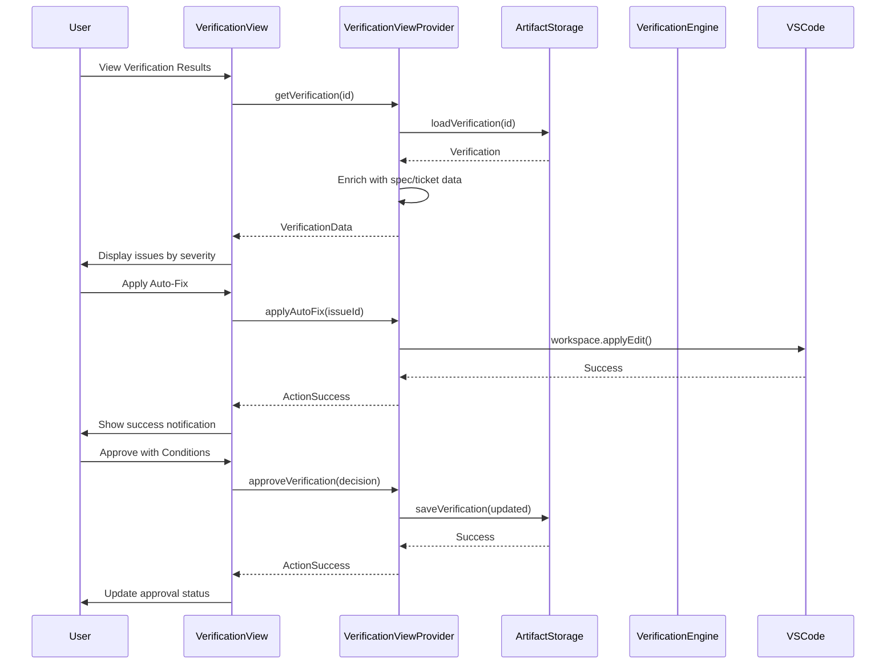
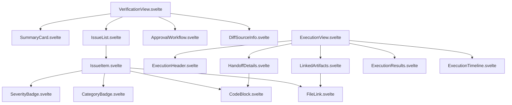

I have created the following plan after thorough exploration and analysis of the codebase. Follow the below plan verbatim. Trust the files and references. Do not re-verify what's written in the plan. Explore only when absolutely necessary. First implement all the proposed file changes and then I'll review all the changes together at the end.

## Observations

The codebase has a well-established UI architecture using **Svelte** for webviews with **WebviewViewProvider** for sidebar views and **CustomTextEditorProvider** for editors. The verification engine (`VerificationEngine`, `FeedbackGenerator`) generates structured `Verification` objects with issues categorized by severity (Critical/High/Medium/Low) and approval status. The `ArtifactStorage` layer provides methods for persisting and retrieving verifications and executions. The existing UI components follow VS Code theming conventions and use a message-passing pattern between extension and webview.

## Approach

Create two new **WebviewViewProvider** implementations (`VerificationViewProvider` and `ExecutionViewProvider`) in `src/ui/views/` following the established sidebar pattern. Build Svelte-based webview UIs with reusable components for displaying verification reports (severity-categorized issues with file references, descriptions, fix suggestions) and execution tracking (handoff details, agent info, duration, results). Implement message handlers for user actions (Apply Auto-Fix, Ignore, Approve with Conditions, Request Changes) and integrate with the existing storage layer for data persistence. Register views in `package.json` and expose them through VS Code's view system.

## Implementation Steps

### 1. Create View Provider Infrastructure

**File: `src/ui/views/types.ts`**
- Define `VerificationData` interface extending `Verification` with UI-specific fields (`isExpanded`, `selectedIssueId`, `filterSeverity`)
- Define `ExecutionData` interface extending `Execution` with computed fields (`duration`, `formattedDates`)
- Create request message types: `GetVerificationRequest`, `GetExecutionRequest`, `ApplyAutoFixRequest`, `IgnoreIssueRequest`, `ApproveVerificationRequest`, `RequestChangesRequest`
- Create response message types: `VerificationDataResponse`, `ExecutionDataResponse`, `ActionSuccessResponse`, `ActionErrorResponse`
- Define `IssueAction` type for auto-fix and ignore operations
- Define `ApprovalDecision` interface with status, comment, and conditions

**File: `src/ui/views/VerificationViewProvider.ts`**
- Implement `WebviewViewProvider` interface similar to `SidebarProvider`
- Constructor accepts `extensionUri`, `storage: ArtifactStorage`, `epicMetadataManager: EpicMetadataManager`
- Implement `resolveWebviewView()` to set up webview with script URI pointing to `out/webview/verificationView.js`
- Implement `_handleMessage()` to process: `getVerification`, `applyAutoFix`, `ignoreIssue`, `approveVerification`, `requestChanges`, `refresh`
- Implement `_sendVerificationData()` to load verification by ID, enrich with spec/ticket references, and post to webview
- Implement `_applyAutoFix()` to apply automated fix suggestion to file (use VS Code workspace edit API)
- Implement `_ignoreIssue()` to mark issue as ignored (update verification metadata)
- Implement `_approveVerification()` to update approval status to `approved` or `approved_with_conditions`
- Implement `_requestChanges()` to update approval status to `changes_requested` with comment
- Add `showVerification(verificationId: string)` public method to display specific verification
- Use CSP with nonce for security

**File: `src/ui/views/ExecutionViewProvider.ts`**
- Implement `WebviewViewProvider` interface
- Constructor accepts `extensionUri`, `storage: ArtifactStorage`, `epicMetadataManager: EpicMetadataManager`
- Implement `resolveWebviewView()` with script URI pointing to `out/webview/executionView.js`
- Implement `_handleMessage()` to process: `getExecution`, `openSpec`, `openTicket`, `viewVerification`, `refresh`
- Implement `_sendExecutionData()` to load execution, resolve spec/ticket titles, calculate duration, format dates
- Implement `_openSpec()` and `_openTicket()` to navigate to artifacts using `vscode.commands.executeCommand`
- Implement `_viewVerification()` to open associated verification view
- Add `showExecution(executionId: string)` public method
- Calculate execution duration from `startedAt` and `completedAt` timestamps

### 2. Build Verification View Webview UI

**File: `src/ui/views/webview/VerificationView.svelte`**
- Main component with sections: Summary Card, Issue List (grouped by severity), Approval Workflow
- Props: `verification: VerificationData`, `loading: boolean`, `error: string | null`
- Import components: `SummaryCard`, `IssueList`, `ApprovalWorkflow`, `LoadingSpinner`, `ErrorMessage`
- Implement severity filter dropdown (All, Critical, High, Medium, Low)
- Implement search/filter for issues by file path or description
- Display diff source metadata (commit hash, branch, author, timestamp, message)
- Show diff analysis statistics (total files, additions, deletions)
- Use VS Code CSS variables for theming

**File: `src/ui/views/webview/components/SummaryCard.svelte`**
- Display verification summary with pass/fail status badge
- Show issue counts by severity with color-coded badges (Critical: red, High: orange, Medium: yellow, Low: gray)
- Display total issues count and recommendation text
- Show approval status badge (Approved: green, Approved with Conditions: yellow, Changes Requested: red, Pending: gray)
- Use grid layout for issue count breakdown
- Add visual indicator (icon) for pass/fail status

**File: `src/ui/views/webview/components/IssueList.svelte`**
- Props: `issues: VerificationIssue[]`, `groupBySeverity: boolean`
- Group issues by severity level with collapsible sections
- Each issue displays: severity badge, category badge, file path (clickable), line number, message, suggestion
- Expandable issue details showing: full description, expected vs actual behavior, fix suggestion with code example
- Action buttons per issue: "Apply Auto-Fix" (if `automatedFix` is true), "Ignore", "View in Editor"
- Use accordion pattern for expandable issue details
- Syntax highlighting for code examples using VS Code's built-in highlighting

**File: `src/ui/views/webview/components/IssueItem.svelte`**
- Props: `issue: VerificationIssue`, `expanded: boolean`
- Display issue header with severity, category, file, line
- Show message and suggestion in collapsed view
- Expanded view shows: full details, fix suggestion steps, code example
- Action buttons: "Apply Auto-Fix", "Ignore", "Open File"
- Emit events: `applyFix`, `ignore`, `openFile`, `toggleExpand`
- Use VS Code Codicons for action buttons

**File: `src/ui/views/webview/components/ApprovalWorkflow.svelte`**
- Props: `summary: VerificationSummary`, `onApprove: Function`, `onRequestChanges: Function`
- Display current approval status with badge
- Show approval decision buttons: "Approve", "Approve with Conditions", "Request Changes"
- Conditional rendering based on issue severity (disable "Approve" if Critical/High issues exist)
- Comment textarea for approval/rejection notes
- Confirmation dialog for approval actions
- Emit events: `approve`, `approveWithConditions`, `requestChanges`

**File: `src/ui/views/webview/components/DiffSourceInfo.svelte`**
- Props: `diffSource: DiffSource`, `analysis: DiffAnalysis`
- Display commit hash, branch, author, timestamp, message
- Show diff statistics: files changed, additions, deletions
- Format timestamp as relative time (e.g., "2 hours ago")
- Use monospace font for commit hash and branch name

**File: `src/ui/views/webview/verificationViewMain.ts`**
- Initialize Svelte app with `VerificationView` component
- Set up VS Code API message listener for responses from extension
- Implement message handlers: `verificationDataResponse`, `actionSuccess`, `actionError`, `refresh`
- Implement helper functions: `applyAutoFix(issueId)`, `ignoreIssue(issueId)`, `approveVerification(decision)`, `requestChanges(comment)`
- Post messages to extension using `vscode.postMessage()`
- Handle loading states and error display

**File: `src/ui/views/webview/styles/verificationView.css`**
- Define styles for summary card, issue list, approval workflow
- Use CSS Grid for layout (summary card, issue list, approval section)
- Define severity color scheme (Critical: `#f85149`, High: `#ff8c00`, Medium: `#cca700`, Low: `#808080`)
- Style code blocks with syntax highlighting support
- Add hover effects for interactive elements
- Responsive layout for different panel widths

### 3. Build Execution View Webview UI

**File: `src/ui/views/webview/ExecutionView.svelte`**
- Main component with sections: Execution Header, Handoff Details, Linked Artifacts, Results, Timeline
- Props: `execution: ExecutionData`, `specs: SpecData[]`, `tickets: TicketData[]`, `loading: boolean`, `error: string | null`
- Import components: `ExecutionHeader`, `HandoffDetails`, `LinkedArtifacts`, `ExecutionResults`, `ExecutionTimeline`
- Display agent type badge with icon (Cursor, Claude, Windsurf, Cline, Aider)
- Show execution status with progress indicator for in-progress executions

**File: `src/ui/views/webview/components/ExecutionHeader.svelte`**
- Props: `execution: Execution`
- Display execution ID, agent type badge, status badge
- Show start time, completion time (if completed), duration
- Display status icon (pending: clock, in_progress: spinner, completed: checkmark, failed: error)
- Format duration as human-readable (e.g., "2h 15m")

**File: `src/ui/views/webview/components/HandoffDetails.svelte`**
- Props: `handoffPrompt: string`, `agentType: AgentType`
- Display handoff prompt in expandable code block
- Show agent-specific template information
- Copy-to-clipboard button for handoff prompt
- Syntax highlighting for markdown content

**File: `src/ui/views/webview/components/LinkedArtifacts.svelte`**
- Props: `specIds: string[]`, `specTitles: string[]`, `ticketIds: string[]`, `ticketTitles: string[]`
- Display linked specs with clickable links to open in editor
- Display linked tickets with status badges
- Show artifact counts (e.g., "3 Specs, 5 Tickets")
- Emit events: `openSpec(specId)`, `openTicket(ticketId)`

**File: `src/ui/views/webview/components/ExecutionResults.svelte`**
- Props: `results: ExecutionResults | undefined`, `status: ExecutionStatus`
- Display diff summary if available
- Show agent notes in formatted text area
- List files changed with status indicators (added, modified, deleted)
- Show "No results yet" message for pending/in-progress executions
- Link to verification view if verification exists

**File: `src/ui/views/webview/components/ExecutionTimeline.svelte`**
- Props: `startedAt: Date`, `completedAt: Date | undefined`, `status: ExecutionStatus`
- Display timeline visualization with start/end markers
- Show duration bar with progress indicator
- Display timestamps in local timezone
- Add milestone markers for key events (started, completed, failed)

**File: `src/ui/views/webview/executionViewMain.ts`**
- Initialize Svelte app with `ExecutionView` component
- Set up message listener for extension responses
- Implement message handlers: `executionDataResponse`, `error`, `refresh`
- Implement helper functions: `openSpec(specId)`, `openTicket(ticketId)`, `viewVerification(verificationId)`
- Post messages to extension using `vscode.postMessage()`

**File: `src/ui/views/webview/styles/executionView.css`**
- Define styles for execution header, handoff details, linked artifacts, results
- Use flexbox for header layout
- Style timeline with CSS animations for in-progress status
- Define agent type color scheme (Cursor: blue, Claude: purple, Windsurf: teal, Cline: green, Aider: orange)
- Add transitions for expandable sections

### 4. Register Views in Extension

**File: `src/extension.ts`**
- Import `VerificationViewProvider` and `ExecutionViewProvider`
- Register `VerificationViewProvider` with `window.registerWebviewViewProvider('flowguard.verificationView', verificationViewProvider)`
- Register `ExecutionViewProvider` with `window.registerWebviewViewProvider('flowguard.executionView', executionViewProvider)`
- Add commands: `flowguard.showVerification`, `flowguard.showExecution`
- Store provider instances for access from other commands
- Dispose providers on deactivation

**File: `package.json`**
- Add views to `flowguard-sidebar` view container:
  - `flowguard.verificationView` with name "Verification Results"
  - `flowguard.executionView` with name "Execution Tracking"
- Add commands:
  - `flowguard.showVerification` - "Show Verification Results"
  - `flowguard.showExecution` - "Show Execution Details"
  - `flowguard.applyAutoFix` - "Apply Auto-Fix"
  - `flowguard.ignoreIssue` - "Ignore Issue"
- Add keyboard shortcuts:
  - `Cmd+Shift+V` for `flowguard.showVerification`
  - `Cmd+Shift+E` for `flowguard.showExecution`

### 5. Integrate with Verification Engine

**File: `src/verification/VerificationEngine.ts`**
- After saving verification, trigger view update by posting message to `VerificationViewProvider`
- Add method `showVerificationInView(verificationId: string)` to open verification view
- Emit event when verification completes for UI refresh

**File: `src/handoff/ExecutionTracker.ts`**
- After creating execution record, trigger view update by posting message to `ExecutionViewProvider`
- Add method `showExecutionInView(executionId: string)` to open execution view
- Update execution status when handoff completes

### 6. Add Shared UI Components

**File: `src/ui/views/webview/components/SeverityBadge.svelte`**
- Props: `severity: Severity`
- Display severity badge with color coding (Critical: red, High: orange, Medium: yellow, Low: gray)
- Use VS Code Codicons for severity icons (Critical: alert, High: warning, Medium: info, Low: note)
- Format severity text (uppercase)

**File: `src/ui/views/webview/components/CategoryBadge.svelte`**
- Props: `category: IssueCategory`
- Display category badge with icon (security: shield, performance: zap, logic: bug, etc.)
- Use subtle background colors for categories
- Format category text (capitalize)

**File: `src/ui/views/webview/components/CodeBlock.svelte`**
- Props: `code: string`, `language: string`, `showLineNumbers: boolean`
- Display code with syntax highlighting
- Add copy-to-clipboard button
- Show line numbers if enabled
- Use VS Code's theme colors for syntax highlighting

**File: `src/ui/views/webview/components/FileLink.svelte`**
- Props: `filePath: string`, `lineNumber: number | undefined`
- Display clickable file path that opens file in editor
- Show line number if provided
- Emit `openFile` event with file path and line number
- Use monospace font for file path

### 7. Webpack Configuration

**File: `webpack.webview.config.js`**
- Add entry points for `verificationView` and `executionView`:
  - `verificationView: './src/ui/views/webview/verificationViewMain.ts'`
  - `executionView: './src/ui/views/webview/executionViewMain.ts'`
- Configure output to `out/webview/verificationView.js` and `out/webview/executionView.js`
- Ensure Svelte loader processes `.svelte` files in `src/ui/views/webview/`
- Add CSS loader for view-specific styles

### 8. Testing and Integration

**File: `src/ui/views/__tests__/VerificationViewProvider.test.ts`**
- Test message handling for `getVerification`, `applyAutoFix`, `ignoreIssue`, `approveVerification`
- Mock `ArtifactStorage` to return test verification data
- Verify webview HTML generation with correct script URI and CSP
- Test error handling for invalid verification IDs

**File: `src/ui/views/__tests__/ExecutionViewProvider.test.ts`**
- Test message handling for `getExecution`, `openSpec`, `openTicket`
- Mock `ArtifactStorage` to return test execution data
- Verify duration calculation and date formatting
- Test navigation to linked artifacts

## Architecture Diagram

## Component Hierarchy

