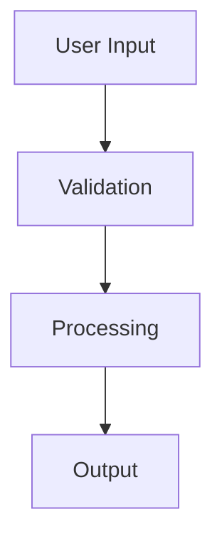

# Sample Integration Spec

## Overview

This is a sample spec for integration testing purposes.

## Requirements

1. Implement feature X
2. Add comprehensive tests
3. Update documentation

## Technical Plan

### Files to Change

- `src/sample.ts` - Main implementation file
- `src/sample.test.ts` - Unit tests

### Dependencies

- No new dependencies required

### Edge Cases

- Handle empty input gracefully
- Handle large file processing

## Testing Strategy

- **Unit Tests**: Cover all new functions
- **Integration Tests**: Test end-to-end workflow
- **E2E Tests**: Validate user journey

## Architecture

